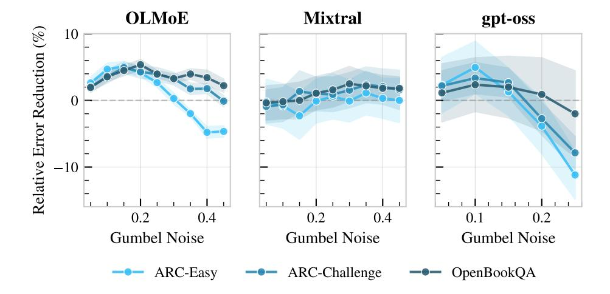

# B IMPACT OF ROUTING TEMPERATURE

The routing temperature is a key hyperparameter in RoE, governing the diversity of sampled expert paths. To understand its effect, we conduct a sensitivity analysis where we apply a uniform temperature across all MoE layers and sweep its value in increments of 0.05.

As shown in Figure [6,](#page-13-1) performance consistently follows a concave trend: accuracy improves as the temperature increases from zero, peaks at an optimal value, and then declines. This decline occurs because excessively high temperatures introduce too much noise into the routing decisions, leading to the selection of less relevant experts and degrading the final prediction quality. Crucially, we observe that the optimal temperature is task-specific, which underscores the importance of tuning this hyperparameter for each downstream application to maximize performance gains.

Figure 6: Impact of routing temperature on task performance. We apply a uniform temperature across all MoE layers and observe a concave relationship where performance peaks at a task-specific optimal value. Excessively high temperatures degrade performance by introducing noise into the expert selection process.

