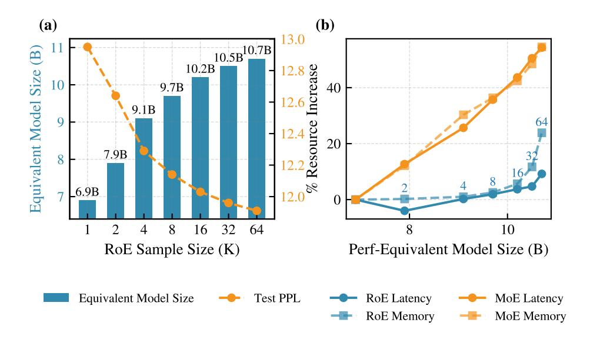

# 3 EXPERIMENTS

### 3.1 EXPERIMENTAL SETUP

Models and Benchmarks. We evaluate RoE on three instruction-tuned MoE models: OLMoE-1B-7B-Instruct [\(Muennighoff et al., 2024\)](#page-10-2), Mixtral-8x7B-Instruct-v0.1 [\(Jiang et al., 2024\)](#page-9-4), and GPT-OSS-20B [\(OpenAI et al., 2025\)](#page-10-3). Our evaluation spans three domains: mathematical reasoning (GSM8K [\(Cobbe et al., 2021\)](#page-9-5), SVAMP [\(Patel et al., 2021\)](#page-10-4), AddSub [\(Hosseini et al., 2014\)](#page-9-6), SingleEQ [\(Koncel-Kedziorski et al., 2015\)](#page-9-7), MultiArith [\(Imani et al., 2023\)](#page-9-8)), commonsense reasoning (ARC-Easy, ARC-Challenge [\(Clark et al., 2018\)](#page-9-9), OpenBookQA [\(Mihaylov et al., 2018\)](#page-10-5), Social-I-QA [\(Sap et al., 2019\)](#page-10-6), Hellaswag [\(Zellers et al., 2019\)](#page-11-3)), and code generation (HumanEval [\(Chen](#page-8-1) [et al., 2021\)](#page-8-1), HumanEvalPlus [\(Liu et al., 2023\)](#page-10-7)).

Baseline and Evaluation Strategy. Our primary goal is to isolate the performance gains directly attributable to RoE's modification of the model's internal computational pathways. Unlike test-time methods that treat the model as a black box and ensemble outputs from multiple generation runs (e.g., self-consistency), RoE enhances the model's backbone directly. These two classes of methods are orthogonal and can be used in conjunction. Therefore, to ensure a clean and direct measurement of RoE's impact, we use the standard, unmodified MoE inference as our sole baseline. We employ greedy decoding for all experiments, ensuring that any observed improvements stem from RoE itself, not from interactions with complex decoding strategies.

RoE Configuration and Tuning. We tune the per-layer noise temperatures for RoE on each task's validation set using the Tree-structured Parzen Estimator (TPE) [\(Watanabe, 2023\)](#page-11-2) implemented in Optuna [\(Akiba et al., 2019\)](#page-8-0). All reported results are evaluated on the test sets after tuning, ensuring no data contamination from the validation sets. For computational efficiency, we optimize validation perplexity for math tasks and validation accuracy for commonsense and code tasks. We employ our 'clean-cache' implementation (Section [2\)](#page-2-1) for OLMoE and the standard cache for other models. The tuning budget and key RoE hyperparameters are summarized in the appendix (Table [1,](#page-12-0) while the complete per-layer temperature profiles are visualized in the appendix (Figure [10\)](#page-17-0).

Implementation Details. Experiments use NVIDIA A100 80GB GPUs. RoE predictions are aggregated by probability averaging. For commonsense tasks, we follow [Hu et al.](#page-9-10) [\(2023\)](#page-9-10) and select the answer with the highest log-probability. Results are averaged over 5 seeds. Inference latency is measured as the wall-clock time for generating 128 tokens. We report exact-match accuracy for all tasks and pass@1 additionally for code tasks.

Figure 3: Performance comparison of base MoE models and RoE on five mathematical, five commonsense, and two code benchmarks. Accuracy is measured by exact match (except for HE and HE+, which use pass@1). Results are averaged over five random seeds. Axes are normalized to  $(\min -1, \max +1)$  for visualization.

#### 3.2 Main Results

Figure 3 presents the performance of RoE applied to the three MoE models across our suite of benchmarks. As is evident, RoE consistently improves performance across nearly all tasks and model scales, demonstrating its broad effectiveness as a post-hoc enhancement strategy.

The performance gains are most pronounced for OLMoE, the smallest and weakest base model, where RoE substantially lifts accuracy across all benchmark categories. We hypothesize that by diversifying computational paths, RoE unlocks latent capabilities inaccessible to a single, static routing configuration. This suggests the diversification is most impactful for models with more initial headroom for improvement.

However, the improvements are not uniform. For math benchmarks, we optimized RoE's hyperparameters for validation set perplexity. While RoE consistently lowered perplexity (see Figure 8 in the appendix), this did not always translate to higher generative accuracy. For instance, on Multi-Arith, RoE did not improve the accuracy of Mixtral or GPT-OSS. This result underscores the known disconnect between perplexity and generative reasoning performance, suggesting that tuning RoE directly on task-specific metrics could yield further gains where computationally feasible.

Finally, we observe a ceiling effect: as a model's baseline performance on a benchmark approaches saturation, the potential for improvement diminishes. For instance, the GPT-OSS model already achieves 95.7% on MultiArith, leaving minimal room for any method to provide substantial gains.

A key advantage of RoE is its applicability to open-ended generation, where parallel scaling methods, like majority voting over complete outputs, are infeasible. By aggregating logits at each tokengeneration step, RoE enhances the performance of open-ended tasks such as code generation, as evident in Figure 3.

Figure 4: Impact of caching on RoE performance. (a) Resource usage with caching enabled. Peak memory (blue, left axis) and power per token (orange, right axis) show a modest increase as the sample count grows. (b) Latency comparison with and without caching. Without caching, latency per token rises exponentially, highlighting the necessity of caching for scalable RoE inference.

### 3.3 COMPUTATIONAL OVERHEAD

We evaluate the computational overhead of RoE in terms of GPU memory footprint, power usage, and throughput (tokens/second). Our benchmark uses the OLMoE model to generate solutions for the first 100 problems from the GSM8k benchmark [\(Cobbe et al., 2021\)](#page-9-5) on a single NVIDIA A100 GPU. To isolate the overhead of our method and ensure a fair comparison, we set the generation temperature and τ to 0, which produces identical output sequences across all runs.

Figure [4\(](#page-6-1)a) illustrates the relative increase in inference cost for RoE with our caching mechanism. The resource requirements grow modestly with the number of samples. For instance, using 64 samples increases the memory footprint by only 12% and power consumption by 20%. These results show that the additional computational cost is manageable and not prohibitive.

Figure [4\(](#page-6-1)b) underscores the necessity of our caching scheme. By comparing RoE with and without caching, we observe that our approach drastically mitigates the increase in power consumption and latency. Without caching, the cost of sampling multiple paths would be impractical. These findings confirm that RoE offers a practical trade-off, enhancing model quality for a moderate and controllable increase in computational demand.

### 3.4 EFFICIENCY ANALYSIS: ROE VS. MODEL SCALING

RoE enhances a model's performance, making it comparable to a larger version of the base model. To quantify this improvement, we measure the *equivalent model size* that a standard MoE would need to match the performance of RoE for a given number of samples K. This allows us to directly compare the efficiency of RoE against the cost of simply using a larger MoE. We estimate this equivalent size by applying the scaling laws from [Kaplan et al.](#page-9-11) [\(2020\)](#page-9-11), using test perplexity on the WikiText-103 dataset [\(Merity et al., 2016\)](#page-10-8) as the performance metric. For each sample size K, we tune the RoE routing temperatures across all layers by optimizing perplexity on the WikiText-103 validation set over 50 trials with a TPE optimizer. We then measure the test perplexity of the bestperforming temperature setting on the validation set. As shown in Figure [5\(](#page-7-0)a), the effective model size grows monotonically with K, although the gains diminish as the sample size increases.

Figure [5\(](#page-7-0)b) compares the computational cost of RoE (blue curve) with the cost of using a larger, equivalently performing standard MoE model (orange curve). The results show that RoE is substantially more efficient in terms of both latency and memory. For instance, applying RoE with K = 32 to the OLMoE-7B model yields performance comparable to that of a 10.5B OLMoE model. Notably, this configuration reduces memory overhead by 25% and per-token latency by 30% relative to the larger model, underscoring the efficiency of RoE as an alternative to conventional model scaling.

Figure 5: Performance and efficiency analysis of RoE. (a) The performance of RoE applied to OLMoE-7B, measured in terms of an equivalent standard MoE model size. Performance is evaluated using perplexity on the WikiText-103 test set. (b) Comparison of the relative increase in latency and memory for RoE (blue) versus scaling up to an equivalently performing MoE model (orange). The numbers on the blue curve indicate the RoE sample size K.

### 4 RELATED WORK

Our work, Roster of Experts (RoE), introduces a method for trading additional inference-time compute for improved model performance. Several strategies improve model performance by increasing computation at inference time. Inspired by [Mirtaheri et al.](#page-10-9) [\(2025\)](#page-10-9) we categorize them into three paradigms, as illustrated in Figure [1.](#page-1-0)

Sequential Scaling: Sequential scaling methods improve reasoning quality by prompting the model to generate longer, more structured intermediate steps. The seminal work in this area is Chain-of-Thought (CoT) prompting [\(Wei et al., 2022;](#page-11-0) [Nye et al., 2021\)](#page-10-10), which elicits step-by-step reasoning. In this category, we ask the model to think, question it self and do a step by step analysis [\(OpenAI,](#page-10-11) [2025;](#page-10-11) [Kojima et al., 2022\)](#page-9-12). This approach has been extended by a large body of subsequent work that explores more complex reasoning structures, such as Tree-of-Thoughts [\(Yao et al., 2023\)](#page-11-4), at the cost of increased sequential generation steps. The language model needs to be trained with CoT prompts to be able to utilize this capability during inference.

Parallel Scaling: Parallel scaling generates multiple independent outputs for the same prompt and aggregates them to produce a final, more robust answer [\(Brown et al., 2024\)](#page-8-2). The simplest technique to mention for this category is beam search [Freitag & Al-Onaizan](#page-9-13) [\(2017\)](#page-9-13), where multiple sequences of tokens are evolved at the inference time and the best sequence is chosen as the response. Another prominent example is Self-Consistency (SC) [\(Wang et al., 2022\)](#page-11-1), which samples diverse reasoning paths using stochastic decoding (e.g., non-zero temperature) and selects the most frequent answer via majority vote. While highly effective, the standard voting mechanism limits SC to tasks with easily verifiable answers, such as math or multiple-choice questions. Recent work aims to extend this paradigm to open-ended generation tasks by developing more sophisticated aggregation strategies that do not rely on a single, extractable answer and instead aggregate on a sequence level [\(Chen](#page-9-14) [et al., 2023;](#page-9-14) [Taubenfeld et al., 2025;](#page-11-5) [Wang et al., 2024\)](#page-11-6).

Hyper-Parallel Scaling: We introduce *hyper-parallel scaling* as a distinct, third paradigm. Unlike sequential and parallel methods that scale the *output generation process*, hyper-parallel scaling diversifies the *internal computation paths* within the model for a single token prediction. RoE actualizes this concept by treating a single MoE model as an ensemble of subnetworks. By sampling different sets of active experts for each forward pass, RoE aggregates multiple internal predictions to produce a single, higher-quality output distribution for the next token. This approach is orthogonal to and can be combined with both sequential and parallel scaling.

A related direction was explored by [Geiping et al.](#page-9-15) [\(2025\)](#page-9-15), who designed a special recurrent architecture allowing for variable-depth inference. However, their method requires a model to be specifically pretrained for this capability. In contrast, RoE is a training-free strategy that can be applied posthoc to any pretrained MoE model, offering a practical way to unlock enhanced performance from existing artifacts dynamically, and on demand.

