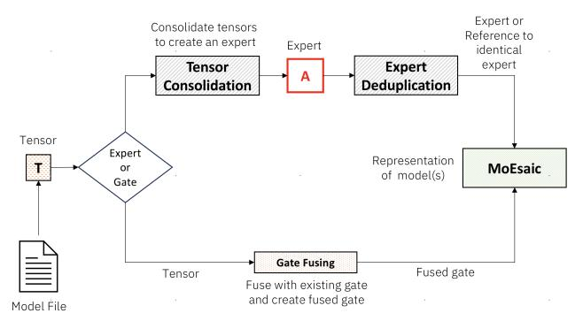
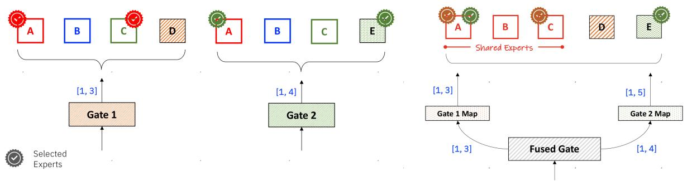

# 3 Design and Implementation

In this section, we discuss the design principles of MoEsaic. Next, we describe model initialization and memory allocation in MoEsaic. Finally, we discuss how we leverage expert sharing for efficient execution of inference requests.

#### 3.1 Design Principles

Handle Limited GPU Memory: MoEsaic should be able to serve models on GPU(s) which has only enough memory to accommodate the models with already deduplicated experts. Thus, it should avoid any pre-allocation of memory.

Non-disruptive Addition and Removal of Models: A new model instance can be added, or an existing instance can be removed from MoEsaic without requiring a system restart.

Independent Client Experience: Even with a combined representation of models in MoEsaic, a client should be able to independently submit requests to their model instance. For this, we wanted to provide LoRA-like user interface, where MoEsaic, we should be able to add model instances (i.e., experts and gates) to the base MoE model, which can be invoked independently through separate calls but executed simultaneously whenever possible.

Figure 2: High level overview of model initialization in MoEsaic.

Limited Performance Impact: All model instances in MoEsaic should provide almost equivalent latency and throughput as with the separately deployed individual models.

#### 3.2 Model Initialization

Figure [2](#page-2-1) provides a high-level overview of model initialization. MoE models consist of MoE and non-MoE layers. In MoEsaic, only the experts in MoE layers are shared across model instances, whereas the non-MoE layers, e.g., attention, can be unique. Each MoE layer also includes a gate, which determines the selection of suitable experts for a given input. MoEsaic fuses the newly added gates with the existing gates for efficient routing. Section [3.3.1](#page-4-0) describes the process in detail.

3.2.1 Memory Allocation of Experts. MoEsaic performs tensorlevel deduplication of identical experts when loading the model from storage. MoEsaic calculates 128-bit hash digest for each tensor comprising an expert and stores it in an inmemory dictionary for later reference. This dictionary is

Figure 3: Routing of requests through separate and fused gates for two model instances. Each model consists of 4 experts (3 shared) and top two experts are selected by the gates. Fusing of gates avoids repeated invocation of the CUDA kernel.

referred to by the subsequent experts to check if an identical expert was previously loaded. If no identical expert was loaded before, GPU memory is allocated to the new expert. Otherwise, the new expert refers to the tensors of the previously loaded identical expert.

vLLM's memory management poses several challenges in enabling expert sharing. To accomplish sharing, MoEsaic reorganizes vLLM's expert representation in the model structure and its memory management. Below, we describe the challenges and solutions. While we have selected vLLM for its popularity and its MoE specific optimizations, the discussion below also applies to other inference platforms, such as Transformers [\[33\]](#page-8-16).

Lazy Allocation of Memory. vLLM pre-allocates experts in GPU memory at model initialization. This means that the memory required to accommodate an entire model needs to be available prior to loading its parameters from the model file. Often, GPUs may not have enough memory to accommodate several MoE model instances, even if the memory is later released back to the system after deduplication. To reduce the memory requirement at the model initialization time, we initialize the model with tiny pseudo experts. The experts are are later resized and populated by parameters when loading the model from a file. As a result, at maximum, MoEsaic only uses the amount of GPU memory with deduplicated experts. (Ignoring the minor increase in memory consumption from the current expert, which remains in memory until its deduplication.)

Independent Representation of Experts. In vLLM, all experts within a layer are represented with a single object in the model structure and they are co-located in a tensor. Since MoEsaic uses tensor-level sharing, co-location of experts prevents the sharing of individual experts across model instances. E.g., when one of the constituent experts is identical to a previously loaded expert. To address this, we represent each expert individually in the model structure, so its memory can be managed independently from other experts.

Independent representation also means that the identical experts are also represented by separate nn.Parameter objects, even if they share the underlying tensor. This precludes batching of operations from being performed by multiple identical experts. In Section [3.3,](#page-4-1) we discuss this problem and our solution.

Expert Population Tracking. In vLLM, the in-memory representation of experts differ from their in-file representation. Specifically, multiple in-file tensors correspond to a single in-memory tensor composing an expert. Such placement requires that the hash digest is calculated only after all segments of an expert have been populated. MoEsaic cannot wait until after the population of the entire model to perform deduplication, which would violate the first design principle. To address this, we keep track of tensor allocation for an expert instance; made possible through its independent representation. Once an expert has been populated, MoEsaic marks it as a candidate for deduplication.

3.2.2 Tensor Parallel Loading of Experts. The popular MoE models consist of large experts, where each expert consumes several gigabytes of GPU memory. As a reference point, in Mixtral-8x7B each expert requires 14GB of GPU memory. Such large models rarely fit on a single GPU. Therefore, tensor-parallel support is essential to enable sharing of experts in commonly used models. Moreover, in tensor-parallel deployment, the experts are sharded across the available GPUs, which evenly distributes the request load and avoids imbalance. vLLM natively support tensor-parallel loading, however, this support does not automatically extend to the new experts and gates that are added to an already hosted model. As a result, the sharded experts from the initially loaded model cannot be compared (and deduplicated) with the newly added non-sharded experts.

To address this problem, we add tensor-parallel support to load new experts to an already hosted model. Upon loading the initial MoE parameters, the new experts mimic the sharding from the initial model. For instance, if the initial MoE's

experts were sharded 4-ways across 4 GPUs, the subsequent experts are also sharded 4-ways. To accomplish this, MoEsaic spawns Ray workers, where each worker is responsible for loading model shards on a specific GPU. Therefore, an expert in tensor-parallel mode only represents a model shard. Upon loading the expert shards, MoEsaic deduplicates them in the same fashion as the entire experts.

3.2.3 Non-disruptive Addition and Removal of Models. It is crucial to avoid the restart of MoEsaic for a couple of reasons. First, MoEsaic performs hash based deduplication of experts during loading, which prolongs the initialization. No such computation is required for the baseline. Second, MoEsaic service hosts 10s of model instances. Loading all the models could take tens of minutes. Inference service providers find it particularly important to ensure a smooth experience. The platform should handle client churn without substantial disruption.

To enable dynamic addition of a model instance into a running MoEsaic, we have implemented a seamless integration mechanism, where a new model instance can add its experts and gates into the existing MoEsaic and perform deduplication of the new experts. Similarly, any existing model instance can be removed non-disruptively. Note that a model instances cannot be added (or removed) while the model is actively serving inference requests. This is because of the temporarily undefined structure of MoEsaic during integration.

