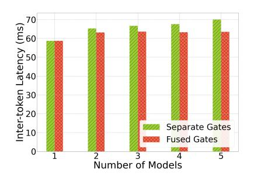
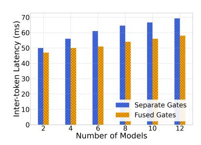
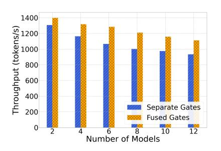
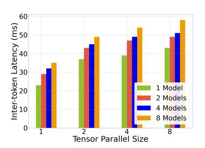

# 4 Evaluation

We evaluate MoEsaic by creating variations of Mixtral model. Each experiment mentions the specific variation used. To create multiple model instances, we use copies of experts

| Model        | Count | GPU Memory (GBs) | GPUs (40GB) |
|--------------|-------|---------------------|----------------|
| Mixtral 4x1B | 4     | 32                  | 1              |
| MoEsaic      | 8     | 36                  | 1              |
| Mixtral 8x7B | 2     | 224                 | 8              |
| MoEsaic      | 14    | 294                 | 8              |

Table 2: Comparison of model count and GPU memory when the baseline and MoEsaic use same number of GPUs. The first model has 2 shared experts, whereas the second model has 7 shared experts.

and gates from the main Mixtral model. However, for evaluation, we control the subset of experts that are shared across different model instances. For each model variation, a subset of experts are selected for execution. We indicated this configuration with TopK.

Our test node has 8 NVIDIA A100 GPUs and 64 AMD EPYC 7742 processors. We generate inference traffic from a custom dataset of variety of chat messages to generate 512 content has no bearing on the measured metrics. We measure the performance of inference with inter-token latency and throughput. The inter-token latency indicates an average time required to generate subsequent tokens, whereas the throughput indicates the rate of token generation expressed as tokens/second.

#### 4.1 Memory Saving with MoEsaic

Table [1](#page-4-2) shows the memory consumption with MoEsaic compared to the baseline for model parameters. Additional GPU memory is required to accommodate models' runtime state (e.g., KV cache). This means that by reducing memory consumption MoEsaic can serve longer sequences and larger batch sizes. Note that since tensor-parallel mode only supports number of GPUs that are power of 2, minor increase in GPU memory requirement may result in doubling the number of required GPUs. Table [2](#page-5-0) compares the GPU memory consumption of the baseline and MoEsaic with same number of GPUs. With the popular Mixtral-8x7B model, MoEsaic can serve 7X more minor variants (with 7 of 8 experts shared) of the model on 8 GPUs.

#### 4.2 Scalability of MoEsaic

Here we demonstrate the scalability of MoEsaic by comparing its inference performance with that of a single MoE model (baseline) with increasing number of model instances.

Mixtral 4x7B. In Figure [5,](#page-6-0) we evaluate the inter-token latency of Mixtral-4x7b model by comparing separate and fused gates. When compared to a single MoE model, MoEsaic with fused gates has about 8% higher latency irrespective of

Figure 4: Computational efficiency from better batching at the deduplicate experts. The experiment uses 4 Mixtral-3x1B model instances with TopK=1. TopK indicates the number of experts selected by a gate for execution.

the number of model instance. Whereas with separate gates, this overhead increases by 4% with each additional model instance. The progressively increasing latency is because of the repeated invocation of per-model gates at each layer. With large size of experts in 4x7B model, the additional routing overhead is negligible compared to the experts' execution latency. Figure [6](#page-6-0) shows the corresponding token generation throughput.

Mixtral 4x1B. Figure [7](#page-6-0) shows the inter-token latency with a smaller model (4x1B). The smaller model demonstrates the routing overhead clearly compared to the previous model with larger experts where the majority of time is spent in the processing of the experts. With this model, even with fused gates, we can also observe slight increase in latency w.r.t. the increasing number of models. With fused gates the latency increases by 4% on average with each additional model, whereas with separate gates it increase by 8%. Figure [8](#page-6-1) shows the corresponding token throughput.

#### 4.3 Effect of Sharing on GPU Utilization

In Figure [4,](#page-5-1) we demonstrate the computational efficiency from batching requests at the deduplicated experts. We use 4 instances of Mixtral-3x1B model and increase the number of shared experts from none to all. Doing so decreases the number of experts from 12 (4x3), 9 (4x2 + 1 shared), 6 (4x1 + 2 shared) to 3 (all shared). We measure the corresponding GPU utilization using the NVIDIA Nsight profiling tool [\[2\]](#page-7-17). The utilization represents the average percentage of Streaming Multi-processors (SMs) in use whenever Nsight Systems determines that at least one SM is busy.

From the Figure [4,](#page-5-1) we observe that with fewer experts, better batching improves efficiency and reduces GPU utilization, whereas with more experts for each expert, the batching effect is smaller. E.g., for batch size of 128, with all unique experts, each expert on-average processes 10 requests, whereas with all shared experts, each expert on-average processes 42 requests. With larger batch size (e.g., 512), this

Figure 5: Fused gate efficiently routes requests with increasing number of models (Mixtral 4x7B).

Figure 6: Token throughput w.r.t. increasing number of Mixtral 4x7B models

Figure 7: Fused gate better handles the higher routing overhead of small expert models (Mixtral 4x1B).

Figure 8: Token throughput w.r.t. increasing number of Mixtral 4x1B models

Figure 9: Effect of various batch sizes on inter-token latency (Mixtral 4x7B)

Figure 10: MoEsaic has constant overhead across tensor-parallel sizes (Mixtral 4x1B, Shared Experts=3)

All above figures use TopK=2, Batch Size=64, Shared Experts=2 unless specified otherwise.

effect is less noticeable. Possibly, from having large enough per-expert batches even with more experts. We also observed some (around 2%) benefit of batching in terms of latency and throughput with moderate batch sizes (128, 256). The benefit diminishes with large batch size (512).

#### 4.4 Effect of Batch Sizes

In Figure [9,](#page-6-1) we evaluate the effect of increasing batch sizes on the latency of increasing number of model instances. Compared to the baseline (1 Model), across all batch sizes, MoEsaic experiences higher latency from increasing number of gates. Up to 64 batch size, 2 model MoEsaic performs slightly better than 3 models, and 3 better than 4. This is consistent with what was observed in the Section [4.2.](#page-5-2) However, with batch sizes greater than 128, 3 models outperform 2 models. This could result from overloaded experts. 3 models can spread the high request load with large batch sizes across more experts, thus it outperforms MoEsaic with fewer models. Even though excessively large batch sizes could be uncommon for a single MoE model, MoEsaic may expect

higher batch sizes from the combined load of requests received for several models.

#### 4.5 Tensor Parallel Inference

Here we show the effect of tensor parallel inference on intertoken latency. From Figure [10,](#page-6-1) we can observe that as we expect, increasing the tensor parallelism increases the latency. This is because of the increasing communication overhead across more GPUs. However, because of constant routing overhead, the percentage overhead (compared to the baseline) with increasing models in MoEsaic becomes lower with higher parallelism. This is particularly relevant because popular MoE-based LLMs tend to be of 100s of GBs in size and require several GPUs.

#### 4.6 Model Loading Overhead

Table [3](#page-7-18) shows the loading time of models with the baseline and MoEsaic in seconds. The slower loading with MoEsaic compared to MoE is from 128-bit hash computation required for expert deduplication. The table also shows that loading the first model requires longer than loading additional

| Models                   | MoE 1 Model | MoEsaic 1 Model | MoEsaic 2 Mod els | MoEsaic 4 Mod els |
|--------------------------|----------------|--------------------|----------------------------|----------------------------|
| Mixtral 4x1B (1 GPU)  | 11             | 33                 | 60                         | 110                        |
| Mixtral 4x7B (4 GPUs) | 31             | 53                 | 80                         | 135                        |

Table 3: Loading time of models in seconds. With more than 1 model, only relevant experts and gates are loaded.

models. This is likely from the first model also having to initialize and populate the even non-MoE layers, such as attention. Finally, we observe lower model loading time for tensor-parallel configuration compared to a single GPU. This is because of the parallelism of multiple to Ray workers.

While MoEsaic performs online hash calculation when loading the tensors belonging to experts, such hashes can be calculated offline and the hash-tensor mapping can be stored along with the model. This will significantly reduce the model loading overhead.

