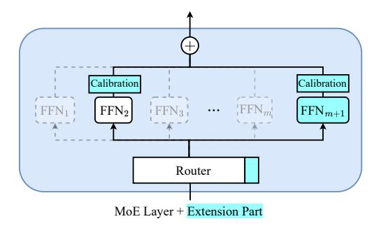

# 2 Methodology

In this section, we introduce MoExtend as an example of extending the visual modality for MoE models, which were originally designed for text modality only. As shown in Fig. 1, MoExtend consists of three stages: alignment, extension with extender, and fine-tuning for the extension part. The purpose of the alignment stage is to initially align the MoE LLM with the newly added visual modality using a pre-trained vision encoder. The extension stage determines which MoE layers should be extended to accommodate the new modality information. The fine-tuning stage is then employed to tune the newly added parameters, achieving the final expansion of multimodal information.

## 2.1 Alignment Stage

As illustrated in Fig. 1 (a), we train the newly added MLP using image-caption pairs from the LLaVA 1.5-558k dataset. This training aligns the modal information of images through the vision encoder (i.e., CLIP encoder) with textual modalities. Specifically, the caption c from the textual modality is projected via word embedding to  $T = [t_i]_{i=1}^N \in \mathbb{R}^{N \times D}$ , where D is the hidden size of LLM. Additionally, the image I is mapped through the vision encoder to  $V = [v_i]_{i=1}^P \in \mathbb{R}^{P \times D}$ , where P is the sequence length of visual tokens. Subsequently, the information from both modalities, T and V, is concatenated into the vector  $\mathbf{x}_0 \in \mathbb{R}^{(N+P) \times D}$ . For an L-layer MoE LLM, the forward process can be

Figure 1: MoExtend consists of three stages: (a) Alignment Stage: we add a trainable MLP for pretrain vision encoder and tune the added MLP using image-caption data to achieve modal alignment; (b) Extension Stage: Determining which MoE layers need extension using an Extender; (c) Fine-tuning Stage: Fine-tuning the added extension part using a given Instruction dataset while keeping other parameters frozen. The "Other layer" represents other neural network components besides the MoE layer, including normalisation, self-attention layer, etc.

formulated as follows:

$$\mathbf{x}'_{\ell} = \text{MSA}\left(\text{LN}\left(\mathbf{x}_{\ell-1}\right)\right) + \mathbf{x}_{\ell-1}, \ell = 1 \dots L,$$
  
$$\mathbf{x}_{\ell} = \text{MoE}\left(\text{LN}\left(\mathbf{x}'_{\ell}\right)\right) + \mathbf{x}'_{\ell}, \ell = 1 \dots L,$$
  
(1)

where MSA represents the multi-head self-attention module and LN represents layer normalization. The final input to the model is  $\mathrm{LN}(\mathbf{x}_L)$ . During this stage, the structure of the MoE layer with m experts remains unchanged, as depicted in Fig. 2 (Left). The router predicts the probability of each token being assigned to each expert, and each token is computed by the top-k experts with the highest probabilities. The output of the MoE layer is a weighted sum as follows:

$$MoE(\mathbf{x}) = \sum_{j=1}^{k} s(\mathbf{x})_j \cdot FFN(\mathbf{x})_j,$$
 (2)

where  $k \leq m$ . Note that the weighted summation in Eq. (2) is related to the outputs of experts with top-k probability. The parameter k has a significant impact on MoE LLMs. However, to consider the trade-off between training efficiency and model performance, it's common to set k=2. In this

paper, we also follow this setting. The  $[\mathrm{FFN}_i]_{i=1}^m$  represents m experts, and

$$s(\mathbf{x})_j = e^{f(\mathbf{x})_j} / \sum_{h=1}^m e^{f(\mathbf{x})_h}, \qquad (3)$$

where  $f(\mathbf{x}) = \mathbf{W}\mathbf{x}$  and  $\mathbf{W} \in \mathbb{R}^{D \times m}$  are the parameters of the router.

## 2.2 Extension Stage

To address the incorporation of additional modality information via extending the MoE layer, the most straightforward approach is to add a new expert to each MoE layer. However, this approach not only increases the parameter count significantly, leading to greater computational costs during training but also poses a potential risk of overfitting due to blindly adding a large number of parameters.

Therefore, in the extension stage, inspired by the concept of neural network pruning (Li et al., 2016; Gao et al., 2020), we construct an Extender to adaptively determine whether each MoE layer needs extension. Specifically, we randomly sample 10,000 instruction data related to the vision modality from the LLaVA 1.5-mix-665k dataset (Liu et al., 2023b)

Figure 2: (Left) Original MoE layer; (Right) The extension part includes an additional expert  $FFN_{m+1}$  and a corresponding column of trainable matrix parameters in the Router. Each expert is equipped with a learnable lightweight calibration module to correct gate weights altered due to the increased number of experts.

as the validation set  $S_e$ , with the remaining data forming the sub-training set  $S_t$ .

Next, for the model  $\kappa$  obtained from the alignment stage training, we make all routers of the MoE layers trainable while freezing all other parameters. Utilizing  $S_t$ , we tune  $\kappa$  for 1,000 steps to obtain  $\kappa'$ . Furthermore, we input  $S_e$  into both  $\kappa$  and  $\kappa'$ , and count the occurrences of each expert being selected in every MoE layer, resulting in

$$R_{\kappa} = \{r_{ij}^{\kappa}\}_{m \times L}, \quad R_{\kappa'} = \{r_{ij}^{\kappa'}\}_{m \times L}. \quad (4)$$

After normalization as follows, we can estimate the probability distributions of each expert being selected in every MoE layer:

$$\bar{R}_{\kappa} = R_{\kappa} / (r_{11}^{\kappa} + r_{21}^{\kappa} + \dots + r_{m1}^{\kappa}), \bar{R}_{\kappa'} = R_{\kappa'} / (r_{11}^{\kappa'} + r_{21}^{\kappa'} + \dots + r_{m1}^{\kappa'}).$$
 (5)

It is worth noting that for  $1 \le i \le L$ ,  $\sum_{i=1}^m r_{i1}^\kappa = \sum_{i=1}^m r_{ij}^\kappa$  and  $\sum_{i=1}^m r_{i1}^{\kappa'} = \sum_{i=1}^m r_{ij}^{\kappa'}$ . Then, we can estimate the distribution differences of expert selections in each MoE layer between the two models  $\kappa$  and  $\kappa'$  by calculating  $d_j$  as follows:

$$d_j = \operatorname{Std}_{i=1}^m (\bar{r}_{ij}^{\kappa} - \bar{r}_{ij}^{\kappa'}), 1 \le j \le L, \quad (6)$$

where Std denotes standard deviation. If  $d_j$  is small, it implies that the MoE layer j exhibits minimal response variation to the current data of the image-text modality, hence, there's no necessity to add new experts to this layer. Conversely, for MoE layers with larger  $d_j$ , adding new experts can effectively address the learning of new modality information. We rank the MoE layers based on  $d_j$  and introduce a new expert FFN $_{m+1}$  to the top  $\lfloor pL \rfloor$  layers for original MoE LLM  $\kappa$ , with p set to 0.5 in this paper. In fact, the adaptive extension stage proposed in this section not only reduces computational costs during training and mitigates the

risk of overfitting but also accelerates the training of MoE LLM. For detailed analysis, please refer to Section 4.

#### 2.3 Fine-tuning Stage

In addition to introducing an additional expert in certain MoE layers for the original  $\kappa$ , as mentioned in Section 2.2, and illustrated in Fig. 2, we also need to augment the parameters of the corresponding routers for these experts, i.e.,

$$\mathbf{W}_{\text{new}} = [\mathbf{W}; \mathbf{v}_{\text{new}}] \in \mathbb{R}^{D \times (m+1)}, \quad (7)$$

where  $\mathbf{v}_{\text{new}} \in \mathbb{R}^{D \times 1}$ , Furthermore, we add some Calibration modules to all experts in the MoE layers to mitigate changes in gate weights due to the addition of modalities. These newly introduced trainable parameters constitute the extension part. In this section, we fine-tune the extension part using the LLaVA 1.5-mix-665k dataset to enhance the final performance of LLM.

Specifically, we first consider the initialization of the newly added m+1-th expert and its corresponding router parameters  $\mathbf{v}_{\text{new}}$ . In this work, for the j-th MoE layer, we consider directly copying the expert and router parameters corresponding to

$$\max(r_{1j}^{\kappa}, r_{2j}^{\kappa}, \cdots, r_{mj}^{\kappa}), \tag{8}$$

as initialization for the new parameters. This is because intuitively, the newly added expert is primarily intended to address the new modalities, and it is appropriate to initialize it with the existing expert that has the highest response to the new modalities. In Section 4, we will demonstrate that the initialization of the new parameters significantly affects the probability of an expert being selected by the MoE mechanism, thereby affecting the final performance of the MoE LLM.

Furthermore, since some MoE layers have added experts, s(x)j will change according to Eq. [\(3\)](#page-2-3). For example, for a fixed input x, the new probability s(x) ′ j satisfies

$$s(\mathbf{x})_{j}' = e^{f(\mathbf{x})_{j}} / (\sum_{h=1}^{m} e^{f(\mathbf{x})_{h}} + e^{f(\mathbf{x})_{m+1}})$$

$$\leq e^{f(\mathbf{x})_{j}} / \sum_{h=1}^{m} e^{f(\mathbf{x})_{h}} = s(\mathbf{x})_{j},$$
(9)

This causes the feature distribution of the original MoE κ regarding previously learned knowledge to change during forward propagation, resulting in some degree of forgetting of existing knowledge by the model, thereby affecting performance. To address this issue, we add a Calibration module sc(·) for each expert such that

$$MoE(\mathbf{x}) = \sum_{j=1}^{k} s(\mathbf{x})_{j} \cdot [1 + s_{c}(\mathbf{x})] \cdot FFN(\mathbf{x})_{j},$$
(10)

and sc(·) is a two-layer GELU neural network W1(GELU(W2(·))). Here, the weights of W1 are initialized to 0, and W2 uses normal initialization. This initialization ensures that the calibration term sc(x) = 0, maintaining consistency with the model's output features when sc(·) is not added, thus preventing significant interference with model output features due to the addition of sc(·), which could lead to abnormal loss and affect model training. For a fair comparison, all training hyperparameters, training methodologies, and loss functions with LLaVA 1.5-558k and LLaVA 1.5-mix-665k in all stages remain consistent with LLAVA.

