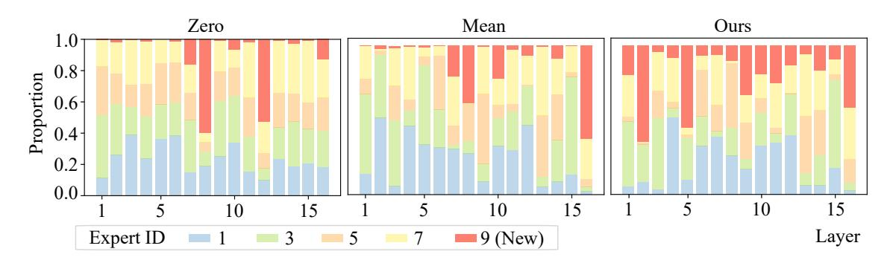
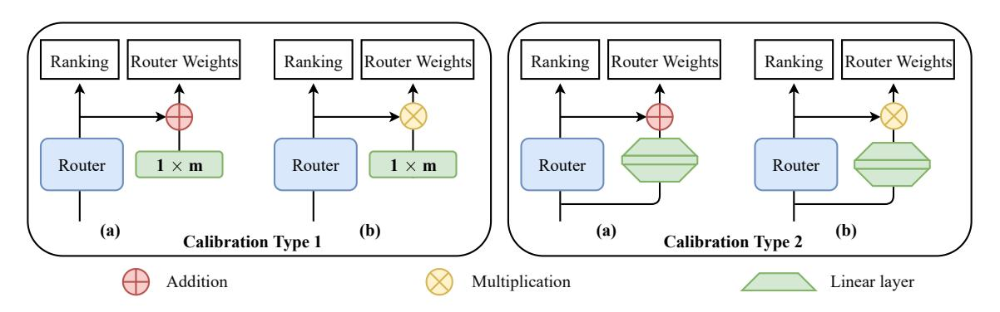

# 4 Ablation Study and Analysis

Effect of Model Architectures. We investigate the impact of different architectures on the performance of MoExtend. While the intuitive approach of adding new experts to all layers might seem optimal, our experiments, detailed in Table 3, reveal comparable performance between models with ex-

Table 3: Comparison of MoExtend with different architectures at 1k iterations. #Layer represents the number of layers added expert. First-half indicates that new experts are only added to the first half layers of model, Second-half represents that only the second half layers of model have new experts, Interval means that we add new experts to every alternate layer of the model, First-quarter indicates only first quarter layers are added new expert, and First-interval means that we add new experts to first half layers alternately.

| Architecture   | #Layer | POPE | MM-Vet | MMB  | $VQA^T$ | Avg. |
|----------------|--------|------|--------|------|---------|------|
| All layer      | 32     | 84.0 | 34.7   | 63.7 | 56.1    | 59.6 |
| First-half     | 16     | 84.5 | 35.3   | 63.1 | 55.6    | 59.6 |
| Second-half    | 16     | 81.3 | 36.1   | 59.5 | 52.4    | 57.3 |
| Interval       | 16     | 83.5 | 36.1   | 63.7 | 55.6    | 59.7 |
| First-quarter  | 8      | 85.4 | 35.4   | 61.3 | 54.6    | 59.2 |
| First-interval | 8      | 83.6 | 34.8   | 62.7 | 54.3    | 58.9 |
| Ours           | 16     | 84.3 | 36.4   | 63.1 | 55.7    | 59.9 |

perts added to every layer (All layer), the first half (First-half), or every alternate layer (Interval). Additionally, results from models with experts added only to the first quarter (First-quarter) or every alternate layer starting from the first layer (First-interval) indicate performance degradation when too few layers receive additional experts. This finding informs our extension stage design, where experts are appropriately added to half of the layers.

As depicted in Fig. 3 (Left), our extension stage identifies layers requiring new experts. MoExtend based on our proposed strategy, as demonstrated in Table 3, performs on par with the current optimal insertion strategy (First-half, Interval). Furthermore, Fig. 3 (Right) shows that our extension strategy converges at a rate comparable to the op-

Figure 3: **Left**: std.  $d_i$  of per layer caculated by Eq. (6). Layers in orange color (layer id: 3, 4, 6, 7, 9, 10, 11, 13, 14, 15, 17, 18, 20, 21, 26, 28) are added new experts while layers in blue color are not with additional experts. **Right**: loss of MoExtend with by placing new expert layers in different positions. Employing our position selection scheme, we achieve faster convergence speeds compared to other manually designed schemes.

Table 4: Comparison of MoExtend with different initial methods at 1k iterations. Copy(i) means initializing new experts by copying the weight of original i-th expert.

| Method |         | POPE | MM-Vet | SQA  | VQA T |
|--------|---------|------|--------|------|------------------|
|        | Copy(2) | 83.6 | 34.5   | 73.3 | 51.3             |
|        | Copy(4) | 83.7 | 35.1   | 71.7 | 54.6             |
| Expert | Copy(6) | 83.5 | 34.7   | 73.2 | 54.4             |
|        | Copy(8) | 83.7 | 34.7   | 74.1 | 54.8             |
|        | Zero    | 83.6 | 34.8   | 74.4 | 54.8             |
| Router | Mean    | 83.2 | 34.4   | 73.1 | 54.3             |
| Ours   |         | 84.3 | 36.4   | 73.4 | 55.7             |

timal insertion strategy during training, validating its effectiveness on accurately determining the appropriate layers for adding new experts without extensive experimentation.

**Effect of Initialization.** As depicted in Table 4, we analyze the impact of expert and router initialization on the performance of MoExtend. If the parameters of the new experts and router dimensions are directly copied from fixed positions i of experts and corresponding dimensions of routers at each layer (Copy(i)), the performance of copying experts from different positions is relatively close and lower than that of MoExtend.

Additionally, we explore the performance when the router parameters are not directly copied from the corresponding router parameters of the *i*-th expert, but initialize directly with zeros or with the mean of the initial parameters of the eight experts (Mean). Experimental results indicate that initializing the router with zeros generally results in poorer performance compared to direct copying (Ours). Mean initialization implies that the new experts are a few selected in the initial state, and later in the instruction tuning stage the new experts are selected through gradient updates. In fact, this performance difference is mainly due to the fact that such an ini-

Table 5: Comparison of MoExtend with different calibration modules at 1000 iterations. The type of modules corresponds to Fig. 5. The reason why Type2 (b) has no evaluation result is gradient explosion. "Zero" and "One" respectively denote filling all learnable parameters of the Calibration module with 0 or 1. "Zero+Normal" refers to initializing the two linear layers of the Calibration module in Type2 with 0 and standard normal values, respectively.

| Modules   | Initialization  | POPE | MME    | SQA  | $VQA^T$ | Avg.  |
|-----------|-----------------|------|--------|------|---------|-------|
| Type1 (a) | Zero            | 84.8 | 1495.2 | 72.4 | 53.2    | 426.4 |
| Type1 (b) | One             | 83.5 | 1567.1 | 72.5 | 56.2    | 444.8 |
| Type2 (a) | Zero + Normal   | 84.3 | 1571.0 | 73.4 | 55.7    | 446.1 |
| Type2 (b) | Normal + Normal | N/A  | N/A    | N/A  | N/A     | N/A   |

tialisation will lead to the newly added experts not being easily selected during the training process, so that the newly added experts are not fully trained or not used for new modality. Specifically, take the "Mean" initialisation as an example. Since the MoE layer generally selects the top-2 probability of experts for feature integration, the initialisation of "Mean" makes it difficult for the new experts to be selected with a large probability. Since the new router parameters and experts are rarely updated, it is difficult to improve this situation during the training process.

However, experimental results show that this initialization method leads to inferior performance. Furthermore, to investigate the impact of initialization methods on performance, we calculate the ratio of expert selection for different initializations as shown in Fig. 4, and find that models initialized with Zero and Mean are both unbalanced in expert selection, while MoExtend is more balanced. This finding indicates that the balance of expert selection is closely related to model performance.

The Design of Calibration Modules. As shown

Figure 4: Distribution of expert selection per layer with different router initial methods. We randomly select 10,000 multimodal samples from LLaVA 1.5-mix-665k as inputs and count the number of times each expert at each layer is selected. To streamline the visualization of results, we calculate and visualize the proportion of five experts.

Figure 5: Structure of different types of calibration modules. The green modules represent calibration modules, and m is the number of experts. The output of the calibration module acts on the softmax output of the router to correct the probability distribution effect caused by changes in the number of experts, ensuring proper gate weight adjustments for each expert.

in Fig. 5, we design two concise calibration modules (Type1, Type2) to investigate the impact of these modules on MoExtend performance under two integration modes (Liang et al., 2020; Huang et al., 2020; Zhong et al., 2023d,c): addition (a) and multiplication (b). Type1 consists of a simple learnable parameter 1×m, while Type2 consists of two simple linear layers connected by the GELU activation function. To minimize the disruption of router performance by calibration modules in the initial state, we mitigate the initial impact of calibration modules on routers through special initialization as shown in Table 5. In the additive mode of Type1, we use Zero initialization for calibration modules, while in the multiplicative mode, we use One initialization.

In the additive mode of Type2, we initialize the first linear layer normally and zero-initialize the second linear layer. In the multiplicative mode, it is hard to reduce the impact of calibration modules through appropriate initialization, so we opt for simple normal initialization for both linear layers. Type2 (b) does not exhibit any evaluation result in Table 5 because of gradient explosion, and the

experimental results indicate that Type2 (a) calibration module structure performs better than others.

## 5 Conclusion

In this work, we introduce MoExtend, an effective framework tailored to streamline the modality adaptation and extension of Mixture-of-Experts (MoE) models. MoExtend introduces new experts into MoE models by putting them at the parallel positions of the experts in MoE. Then MoExtend designs a method to select previous experts in MoE for initilizing the new experts. Finally, it only tunes the new experts on the corresponding modal data and tasks. This endows MoE with novel knowledge without necessitating the tuning of pretrained models such as MoE and vision encoders, thus avoiding the catastrophic forgetting issue. Furthermore, MoExtend facilitates rapid adaptation and extension to new modal data or tasks, thereby effectively addressing the challenge of accommodating new modalities within LLMs. Empirical results show the efficacy and efficiency of MoExtend in augmenting the multimodal capabilities of LLMs.

#### 6 Limitation

In this work, due to limited GPU resource, we take the visual task as one example to validate the effectiveness our proposed MoExtend. So one limitation of MoExtend is that its performance is not investigated on the other modal data, such as speech, and other tasks, e.g., continue learning and streaming tasks. However, as aforementioned, MoExtend is a general approach to extend the MoE model to other modal data or tasks, because our design principle is to endows MoE with novel knowledge via tuning the new integrated experts, and does not involve any specific tasks or modality. Accordingly, we believe that by replacing the vision encoder in MoExtend with other modal encoder and inserting new experts like MoExtend, one can easily extend MoExtend to other modal data and tasks, which is also left as our future work to thoroughly test.

#### 7 Related Work

## 7.1 Mixture of Experts

Mixture of Experts (MoE) (Masoudnia and Ebrahimpour, 2014; Riquelme et al., 2021; Zhou et al., 2022; Lin et al., 2024; Jiang et al., 2024) is a technique that leverages multiple sub-networks, also referred to as experts, to integrate features generated by different experts through adaptive strategies, thereby enhancing the overall performance of neural networks. The MoE layer, when processing each token, employs a router module to assign tokens to different experts, thereby reducing interference between different types of samples and keep low inference cost. In specific computational frameworks, MoE can achieve performance comparable to LLMs with a large amount of computational cost (Masoudnia and Ebrahimpour, 2014). Consequently, with the rapid advancement and application of LLMs, MoE is emerging as a promising and noteworthy paradigm for further enhancing LLM performance (Masoudnia and Ebrahimpour, 2014; Team et al., 2023).

## 7.2 Multimodal Model

Multimodal Learning involves leveraging various types of data, such as text, images, speech, and video, to train machine learning models for a more comprehensive understanding and inference capability (Bayoudh et al., 2022; Xu et al., 2023; Zhong et al., 2023b,a). By integrating and jointly modeling different modalities of data, multimodal learning enhances machines' ability to comprehend and

express rich real-world information, thereby improving performance in tasks like image description, sentiment analysis, speech recognition, and video understanding.

Recently, with the advancement of LLM technologies, multimodal learning methods have been rapidly integrated into LLM to expand its understanding and analysis of different modalities, especially visual modality (Liu et al., 2023b; Bai et al., 2023). Recent efforts have focused on enhancing performance through methods such as adjusting datasets (Liu et al., 2023b), optimizing training strategies (Zhang et al., 2023b; Zhong et al., 2022), improving image resolution (Bai et al., 2023), enhancing image encoders (Fan et al., 2024; Gao et al., 2024), aligning inputs (Radford et al., 2021), and projecting layers (Wu et al., 2023; Liu et al., 2023b). These approaches, by fine-tuning datasets and model scales through expanded visual instructions, have endowed LLM with robust visual comprehension capabilities. However, most current methods for expanding modalities generally involve fine-tuning a significant portion of or all parameters on multimodal data, leading to substantial computational costs and risking performance degradation due to forgetting. Facing this dilemma, in this paper, we consider leveraging the strong base performance of MoE LLM to explore cost-effective methods for expanding LLM modalities by introducing new experts.

