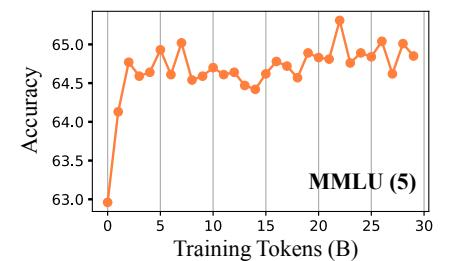
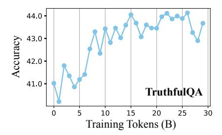
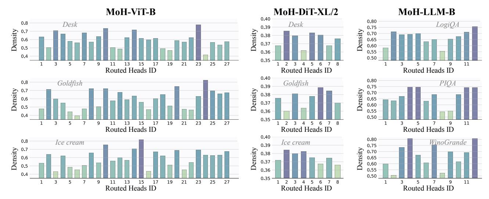

# 4. Experiments

#### 4.1. ViT for Image Classification

Model Settings. For Vision Transformers (ViT) [\(Doso](#page-9-0)[vitskiy et al.,](#page-9-0) [2021\)](#page-9-0), our MoH-ViT models are implemented based on the TransNeXt [\(Shi,](#page-11-9) [2024\)](#page-11-9) framework and trained from scratch on the ImageNet-1K dataset [\(Deng et al.,](#page-9-3) [2009\)](#page-9-3), which contains over 1.2 million images in 1,000 categories. To ensure a fair comparison, we only replace the standard multi-head attention with the proposed MoH, while keeping all other training parameters identical to TransNeXt.

Training Details. Our MoH-ViT models are trained for 300 epochs using automatic mixed precision across 8 GPUs. We follow the training strategy of TransNeXt, which includes various data augmentation techniques, including Random Augmentation [\(Cubuk et al.,](#page-9-14) [2020\)](#page-9-14), Mixup [\(Zhang,](#page-12-14) [2017\)](#page-12-14), CutMix [\(Yun et al.,](#page-12-15) [2019\)](#page-12-15), and Random Erasing [\(Zhong et al.,](#page-12-16) [2020\)](#page-12-16). We also apply Label Smoothing [\(Szegedy et al.,](#page-12-17) [2016\)](#page-12-17) and DropPath [\(Huang et al.,](#page-10-9) [2016\)](#page-10-9) to regularize our models. We optimize our models using AdamW optimizer [\(Loshchilov & Hutter,](#page-11-12) [2017\)](#page-11-12) with a gradient clipping norm of 1.0 and a weight decay of 0.05. The initial learning rate is set to 1e-3, with a 5-epoch warm-up starting at 1e-6. A cosine learning rate scheduler [\(Loshchilov & Hutter,](#page-11-13) [2016\)](#page-11-13) is employed to decay the learning rate. During training, images are randomly cropped to a size of 224×224. It is worth noting that we do not use Exponential Moving Average (EMA) weights.

Results. As shown in Tab. [1,](#page-3-0) despite activating only a subset of attention heads, MoH-ViT achieves highly competitive performance compared to current state-of-the-art methods. For example, MoH-ViT-B achieves 84.9% Top-1 accuracy on the ImageNet-1K classification benchmark with just 75% of the attention head. In contrast, the wellestablished ViT baseline, TransNeXt, attains a slightly lower accuracy of 84.8% while requiring 100% of the heads to be activated. These results suggest that MoH is a promising alternative to multi-head attention for vision model design.

#### 4.2. DiT for Class-Conditional Image Generation

Model Settings. For Diffusion models with Transformers (DiT) [\(Peebles & Xie,](#page-11-1) [2023\)](#page-11-1), we only replace the standard multi-head attention with our MoH in MoH-DiT models, while keeping all other training parameters identical to DiT. We use the ImageNet-1K dataset for class-conditional image generation at a resolution of 256×256. To evaluate generation performance, we use Frechet Inception Distance (FID) [\(Heusel et al.,](#page-10-10) [2017\)](#page-10-10) to assess overall sample quality, Precision and Recall [\(Kynkäänniemi et al.,](#page-10-11) [2019\)](#page-10-11) to measure fidelity and diversity separately, and sFID [\(Nash](#page-11-14)

[Table 3.](#page-11-14) [C](#page-11-14)omparisons between MoH-LLMs and vanilla LLMs. "100B" denotes a training budget of 100 billion tokens, while "200B" denotes a budget of 200 billion tokens. We observe that larger models, e.g., MoH-LLM-B, generally perform worse than smaller models, e.g., MoH-LLM-S, on TruthfulQA, consistent with the findings reported by [Lin et al.](#page-10-12) [\(2022\)](#page-10-12).

| Methods        | #Activated Heads (%) | SciQ | PIQA | WinoGrande | OpenbookQA | LogiQA | TruthfulQA | Average |
|----------------|----------------------|------|------|------------|------------|--------|------------|---------|
| LLM-S 100B     | 100                  | 63.0 | 63.1 | 51.1       | 27.4       | 26.9   | 31.6       | 43.9    |
| MoH-LLM-S 100B | 75                   | 64.7 | 62.0 | 50.6       | 28.8       | 26.4   | 35.2       | 44.6    |
| MoH-LLM-S 100B | 50                   | 67.0 | 62.2 | 51.5       | 29.2       | 26.7   | 35.6       | 45.4    |
| LLM-B 100B     | 100                  | 73.1 | 69.7 | 52.0       | 31.8       | 28.4   | 29.5       | 47.4    |
| MoH-LLM-B 100B | 75                   | 74.7 | 69.2 | 52.8       | 30.0       | 28.1   | 32.2       | 47.8    |
| MoH-LLM-B 100B | 50                   | 75.2 | 67.0 | 52.0       | 29.0       | 26.9   | 32.8       | 47.2    |
| LLM-B 200B     | 100                  | 73.1 | 70.3 | 53.3       | 32.4       | 29.0   | 29.5       | 47.9    |
| MoH-LLM-B 200B | 75                   | 76.0 | 69.2 | 52.7       | 30.4       | 29.8   | 32.6       | 48.5    |
| MoH-LLM-B 200B | 50                   | 75.6 | 66.9 | 53.5       | 29.4       | 26.7   | 32.7       | 47.5    |

[Table 4.](#page-11-14) [C](#page-11-14)omparisons between MoH-LLaMA3-8B and LLaMA3-8B. Please refer to Tab. [G](#page-7-0) in the Appendix for the performance of the model at the end of the first stage of training.

| Methods                        | #Activated Heads (%) | MMLU (5)       | CEVAL (5)  | CMMLU (5)  | GSM8K(8)   | TruthfulQA |
|--------------------------------|----------------------|----------------|------------|------------|------------|------------|
| LLaMA3-8B (Dubey et al., 2024) | 100                  | 65.2           | 52.3       | 50.7       | 49.5       | 35.4       |
| MoH-LLaMA3-8B                  | 75                   | 65.8           | 61.5       | 64.4       | 56.9       | 44.0       |
| Methods                        | #Activated Heads (%) | HellaSwag (10) | LogiQA     | BoolQ (32) | LAMBADA    | SciQ       |
| LLaMA3-8B (Dubey et al., 2024) | 100                  | 81.9           | 30.0       | 83.9       | 75.5       | 94.0       |
| MoH-LLaMA3-8B                  | 75                   | 80.1           | 30.3       | 84.0       | 76.4       | 92.2       |
| Methods                        | #Activated Heads (%) | PIQA           | WinoGrande | NQ (32)    | ARC-C (25) | Average    |
| LLaMA3-8B (Dubey et al., 2024) | 100                  | 81.0           | 72.5       | 31.5       | 59.0       | 61.6       |
| MoH-LLaMA3-8B                  | 75                   | 78.8           | 72.9       | 28.3       | 60.1       | 64.0       |

[et al.,](#page-11-14) [2021\)](#page-11-14) as a metric that better captures spatial relationships than FID. Moreover, we use Inception Score (IS) [\(Sal](#page-11-15)[imans et al.,](#page-11-15) [2016\)](#page-11-15) as another metric for fidelity.

Training Details. Following DiT, the final linear layer is initialized with zeros, and all other layers follow standard ViT weight initialization. We train all models using the AdamW optimizer [\(Loshchilov & Hutter,](#page-11-12) [2017\)](#page-11-12) with a constant learning rate of 1e-4, no weight decay, and a batch size of 256, applying horizontal flips for data augmentation. Following DiT, we employ the Exponential Moving Average (EMA) of MoH-DiT weights during training with a decay rate of 0.9999, generating all images using the EMA model. We use an off-the-shelf pre-trained variational autoencoder [\(Kingma,](#page-10-13) [2013\)](#page-10-13) model from Stable Diffusion [\(Rombach et al.,](#page-11-16) [2022\)](#page-11-16). Following TransNeXt, our attention-head activation budget is unevenly distributed across layers, with fewer attention heads activated in the shallow layers and more in the deeper layers.

Results. As shown in Tab. [2,](#page-4-0) MoH-DiT models consistently outperform DiT models with 90% of heads activated. However, when only 75% of the heads are activated, MoH-DiT models perform worse than DiT models. This may be because image generation tasks are dense prediction tasks that require attention mechanisms to capture pixellevel fine-grained relationships, leaving less redundancy in the attention heads compared to image classification tasks. These results suggest that MoH is a promising alternative to multi-head attention for diffusion models.

#### 4.3. Training LLMs from Scratch

Model Settings. For training LLMs from scratch, we use Megatron [\(Shoeybi et al.,](#page-11-17) [2019\)](#page-11-17), an open-source training code, as the training framework. Please refer to the Appendix for detailed hyper-parameter settings (Tab. [C\)](#page-5-0) of various MoH-LLMs. The evaluation is performed on multiple benchmarks using the Eleuther AI Language Model Evaluation Harness [\(Gao et al.,](#page-10-14) [2024\)](#page-10-14), a unified framework for testing generative language models. Since the parameters are only about 0.2B for the smallest model, we select 6 simple benchmarks as the metric. Specifically, we report 0-shot accuracy on SciQ [\(Welbl et al.,](#page-12-18) [2017\)](#page-12-18), PIQA [\(Bisk](#page-9-15) [et al.,](#page-9-15) [2020\)](#page-9-15), WinoGrande [\(Sakaguchi et al.,](#page-11-18) [2021\)](#page-11-18), OpenbookQA [\(Mihaylov et al.,](#page-11-19) [2018\)](#page-11-19), LogiQA [\(Liu et al.,](#page-11-20) [2020\)](#page-11-20), and TruthfulQA [\(Lin et al.,](#page-10-12) [2022\)](#page-10-12).

Training Details. We only use public datasets for training, ensuring accessibility for academic research. Specifically, we sample from the RedPajama [\(Computer,](#page-9-16) [2023\)](#page-9-16),

Figure 2. **Performance evolution during continue-tuning.** The MoH model quickly recovers to over 95% of the performance of the original model within a training budget of 10B tokens. Then, the performance gradually improves with the increase of the training tokens.

*Table 5.* **Ablation study on the impact of each component of the proposed MoH.** The image classification results are from MoH-ViT-S, by utilizing 75% of the attention heads with a training budget of 100 epochs. The class-conditional image generation results come from MoH-DiT-S/2-400K, also by using 75% of the attention heads, with a training budget of 400K training steps.

| Shared       | Two-Stage    | Image Classification |       | Class-Co | nditional In | nage Generation    |         |
|--------------|--------------|----------------------|-------|----------|--------------|--------------------|---------|
| Heads        | Routing      | <b>Acc</b> (%)↑      | FID↓  | sFID↓    | IS↑          | <b>Precision</b> ↑ | Recall↑ |
|              |              | 75.6                 | 71.97 | 13.58    | 19.06        | 0.35               | 0.55    |
| $\checkmark$ |              | 78.3                 | 69.54 | 12.80    | 19.67        | 0.36               | 0.55    |
| $\checkmark$ | $\checkmark$ | 78.6                 | 69.42 | 12.85    | 19.96        | 0.36               | 0.55    |

**Dolma** (Soldaini et al., 2024), and **Pile** (Gao et al., 2020) datasets according to different sampling probabilities. Please refer to the Appendix for detailed sample ratios. Following previous works (Jin et al., 2025), we utilize the tokenizer from LLaMA2 (Touvron et al., 2023), which contains 65,536 vocabulary tokens.

Results. As shown in Tab. 3, despite activating only a subset of attention heads, MoH-LLMs achieve highly competitive performance compared to our baseline models. For example, MoH-LLM-S achieves an average accuracy of 45.4% with just 50% of the attention heads activated. In contrast, the baseline model reaches a slightly lower accuracy of 43.9% with 100% of the attention heads activated. These results suggest that MoH is a promising alternative to vanilla multi-head attention for training LLMs from scratch. Surprisingly, we find that for MoH-LLM-S, activating only 50% of the attention heads outperforms activating 75%. We consider it may be because when both the model and dataset are small, activating fewer heads effectively regularizes the model. However, as the amount of data increases, activating more heads offers a higher potential for performance.

### 4.4. Continue-Tuning LLaMA3-8B

Model Settings. To significantly enhance the applicability of the proposed MoH method, we also attempt to further continue-tune pre-trained multi-head attention models, such as LLaMA3-8B, into MoH models. However, this presents three challenges. (i) Determining the shared attention heads: We simply select the first 16 attention heads of each layer as shared heads. (ii) Adding head routers: Integrating a randomly initialized router into the

pre-trained model without compromising its original performance requires careful training techniques. To address this, we propose a parameter-free router that determines routing scores using the  $\ell_2$  norm of the query of each attention head. (iii) Weighting attention heads: We observe that weighting the attention head outputs significantly alters the distribution of the output of the attention layer, which necessitates a large amount of training data to restore the original performance. To tackle this, we quantize the routing score and use the straight-through estimator (Bengio et al., 2013; Liu et al., 2022) to back-propagate the gradients through the sparsity function. Specifically, given the input token x, we employ a quantizer for activation routing scores, with its forward pass formulated as:

$$g_i^q = 1$$
 (Token  $x$  selects Head  $i$ ), (9)

where  $\mathbb{1}(*)$  denotes the indicator function.  $g_i^q$  represents the quantized routing score. We then adopt a straight-through estimator, which assigns the incoming gradients to a threshold operation to be the outgoing gradients:

$$\frac{\partial \mathcal{L}}{\partial q_i^q} = \frac{\partial \mathcal{L}}{\partial q_i},\tag{10}$$

where  $g_i$  denotes the real-valued routing score. This approximation function significantly mitigates the issue of gradient vanishing (Wang et al., 2024). Similar to training LLMs from scratch, we also use Megatron (Shoeybi et al., 2019), an open-source training code, as the training framework.

**Training Details.** We find that if there is a discrepancy between the continue-training data and the original training data distribution of the model, the performance of the

Table 6. Ablation study on the impact of the shared heads ratio among activated heads. All results are from MoH-ViT-S, by using 75% of the heads with a training budget of 100 epochs.

| Ratio of Shared Heads | 13.9% | 27.6% | 31.3% | 35.9% | 37.5% | 40.5% | 46.8% | 60.4% | 74.0% |
|-----------------------|-------|-------|-------|-------|-------|-------|-------|-------|-------|
| Accuracy (%)          | 78.6  | 78.5  | 78.4  | 78.4  | 78.5  | 78.6  | 78.4  | 78.6  | 78.4  |

Table 7. Comparisons about inference time. We convert the Q, K, and V features into sparse matrices using the mask generated by the router and replace the dense matrix multiplication in the attention mechanism with sparse matrix multiplication. To eliminate the impact of underlying operator optimizations, we replaced all matrix multiplications with sparse matrix multiplication when testing for speed.

| Methods              | #Head Num | #Head Dim | #Sequence Length | #Activated Heads (%) | Time (ms) |
|----------------------|-----------|-----------|------------------|----------------------|-----------|
| Multi-Head Attention | 32        | 64        | 256              | 100                  | 0.360     |
| MoH (Ours)           | 32        | 64        | 256              | 90                   | 0.352     |
| MoH (Ours)           | 32        | 64        | 256              | 75                   | 0.321     |
| MoH (Ours)           | 32        | 64        | 256              | 50                   | 0.225     |
| Multi-Head Attention | 32        | 64        | 512              | 100                  | 1.376     |
| MoH (Ours)           | 32        | 64        | 512              | 90                   | 1.351     |
| MoH (Ours)           | 32        | 64        | 512              | 75                   | 1.180     |
| MoH (Ours)           | 32        | 64        | 512              | 50                   | 0.863     |

model may fluctuate wildly at the beginning of the training process. Since we are unable to have access to the raw training data of LLaMA3, we address these potential performance fluctuations by dividing the training process into two stages. In the first stage, we continue-tune the original LLaMA3-8B model using 300B tokens to adapt the model to our dataset. In the second stage, we continuetune this adapted model into our proposed MoH model with 100B tokens. We utilize the lm-evaluation-harness package to assess performance on a comprehensive suite of downstream tasks: (i) Following Pythia [\(Biderman et al.,](#page-9-18) [2023\)](#page-9-18), we report 0-shot accuracy on LAMBADA [\(Paperno et al.,](#page-11-23) [2016\)](#page-11-23), LogiQA [\(Liu et al.,](#page-11-20) [2020\)](#page-11-20), PIQA [\(Bisk et al.,](#page-9-15) [2020\)](#page-9-15), SciQ [\(Welbl et al.,](#page-12-18) [2017\)](#page-12-18), and WinoGrande [\(Sakaguchi](#page-11-18) [et al.,](#page-11-18) [2021\)](#page-11-18). (ii) We report the accuracy of Chinese tasks, including 5-shot CEVAL [\(Huang et al.,](#page-10-16) [2023\)](#page-10-16) and 5-shot CMMLU [\(Li et al.,](#page-10-17) [2023a\)](#page-10-17). (iii) We report the accuracy of tasks from the Open LLM Leaderboard [\(Beeching et al.,](#page-9-19) [2023\)](#page-9-19), including 10-shot HellaSwag [\(Zellers et al.,](#page-12-21) [2019\)](#page-12-21), 25-shot ARC Challenge (ARC-C) [\(Clark et al.,](#page-9-20) [2018\)](#page-9-20), and 5-shot MMLU [\(Hendrycks et al.,](#page-10-18) [2021\)](#page-10-18). (iv) We report the exact match score for 32-shot Natural Questions (NQ) [\(Kwiatkowski et al.,](#page-10-19) [2019\)](#page-10-19) and the accuracy for 32 shot BoolQ [\(Clark et al.,](#page-9-21) [2019\)](#page-9-21). (v) We report the exact match score for 8-shot GSM8K [\(Cobbe et al.,](#page-9-22) [2021\)](#page-9-22) to evaluate the math ability. (vi) Moreover, we report 0-shot accuracy on TruthfulQA [\(Lin et al.,](#page-10-12) [2022\)](#page-10-12) to assess the ability to generate truthful answers.

Results. As shown in Fig. [2,](#page-6-0) MoH-LLaMA3-8B quickly recovers to over 95% of the performance of the original model within a training budget of 10B tokens. After continue-tuning with 100B tokens, as shown in Tab. [4,](#page-5-1) MoH-LLaMA3-8B achieves an average accuracy of 64.0% across

14 benchmarks, outperforming LLaMA3-8B by 2.4% by utilizing only 75% of the attention heads. These results demonstrate that pre-trained multi-head attention models can be further continue-tuned into our MoH models, significantly enhancing the applicability of the MoH method.

### 4.5. Ablative Analysis

Effect of Each Component of the Proposed MoH. To explore the impact of each component of our MoH method, we provide the ablation results in Tab. [5.](#page-6-1) "Shared Heads" refers to a subset of attention heads that are always activated. "Two-Stage Routing" represents the dynamic coefficient that balances the weights between shared and routed heads over the routing score, as described in Eq. [5](#page-3-1) and Eq. [6.](#page-3-2) As shown in Tab. [5,](#page-6-1) shared heads significantly improve model performance by effectively capturing common knowledge, allowing the routed heads to focus more on domain-specific information. Moreover, two-stage routing further enhances model performance by dynamically balancing the weights between shared and routed heads. Our full model achieves the best performance, demonstrating that both components significantly benefit the attention mechanism.

Effect of the Shared Heads Ratio among Activated Heads. In Tab. [6,](#page-7-1) we provide the ablation study on the shared heads ratio among activated heads. We find that model performance remains relatively consistent across a wide range of shared heads ratios (from 13.9% to 74.0%). These results indicate that the performance of the model is stable as long as the shared heads ratio is not extreme. From another perspective, shared heads can be viewed as a form of Soft MoE [\(Puigcerver et al.,](#page-11-24) [2024\)](#page-11-24). Based on the findings from the Soft MoE paper [\(Puigcerver et al.,](#page-11-24) [2024\)](#page-11-24), we recommend using a higher ratio of shared heads among

Figure 3. Visualization of the head load distribution in the final MoH layer. For ViT and DiT, we present the head load distributions for the categories "Desk", "Goldfish", and "Ice cream". For LLM, we display the head distributions for the tasks "LogiQA", "PIQA", and "WinoGrande". MoH-ViT-B, MoH-DiT-XL/2, and MoH-LLM-B activate 75%, 90%, and 75% of the attention heads, respectively. "Density" denotes the ratio of the number of head activations to the total number of tokens.

the activated heads (greater than 40%).

