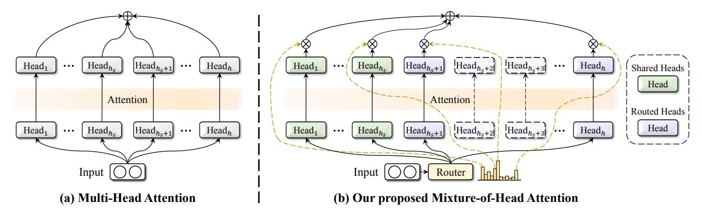

# MoH: Multi-Head Attention as Mixture-of-Head Attention

Peng Jin 123 Bo Zhu 4 Li Yuan 1235 Shuicheng Yan 64

### **Abstract**

In this work, we upgrade the multi-head attention mechanism, the core of the Transformer model, to reduce computational costs while maintaining or surpassing the previous accuracy level. We show that multi-head attention can be expressed in the summation form. Drawing on the insight that not all attention heads hold equal significance, we propose Mixture-of-Head attention (MoH), a new architecture that treats attention heads as experts in the Mixture-of-Experts (MoE) mechanism. MoH has two significant advantages: First, MoH enables each token to select the appropriate attention heads, enhancing inference efficiency without compromising accuracy or increasing the number of parameters. Second, MoH replaces the standard summation in multi-head attention with a weighted summation, introducing flexibility to the attention mechanism and unlocking extra performance potential. Extensive experiments on ViT, DiT, and LLMs demonstrate that MoH outperforms multi-head attention by using only  $50\% \sim 90\%$  of the attention heads. Moreover, we demonstrate that pre-trained multi-head attention models, such as LLaMA3-8B, can be further continue-tuned into our MoH models. Notably, MoH-LLaMA3-8B achieves an average accuracy of 64.0% across 14 benchmarks, outperforming LLaMA3-8B by 2.4% by utilizing only 75% of the attention heads. We believe the proposed MoH is a promising alternative to multi-head attention and provides a strong foundation for developing advanced and efficient attention-based models. The code is available at

1School of Electronic and Computer Engineering, Shenzhen Graduate School, Peking University, Shenzhen, China 2Pengcheng Laboratory, Shenzhen, China 3School of AI for Science, Shenzhen Graduate School, Peking University, Shenzhen, China 4Skywork AI, Singapore 5Rabbitpre Intelligence, Shenzhen, China 6National University of Singapore, Singapore. Correspondence to: Li Yuan <yuanli-ece@pku.edu.cn>, Shuicheng Yan <shuicheng.yan@gmail.com>.

Proceedings of the 42nd International Conference on Machine Learning, Vancouver, Canada. PMLR 267, 2025. Copyright 2025 by the author(s).

https://github.com/SkyworkAI/MoH.

#### 1. Introduction

Since attention is introduced and becomes a fundamental component of Transformers (Vaswani et al., 2017), multihead attention has been the standard architecture for natural language processing (Kenton & Toutanova, 2019) and computer vision tasks (Dosovitskiy et al., 2021). It is well known that using multiple heads can improve model accuracy. However, not all attention heads hold equal significance. Some works have shown that many attention heads can be pruned without affecting accuracy. For example, Voita et al. (2019) introduces a method to quantify the usefulness of each attention head and prune those that are redundant. Similarly, Michel et al. (2019) challenges the necessity of multiple heads by examining the impact of extensive pruning across various settings. In computer vision, some works also identify attention head redundancy. Bhattacharyya et al. (2023) reduces redundancy to boost performance, while Yun & Ro (2024) develop single-head attention for efficiency. These findings demonstrate that vanilla multi-head attention contains redundant attention heads.

Besides, in multi-head attention, each head operates in parallel, and the final output is the sum of all heads (please refer to Section 3.1). Given that these attention heads operate independently and some may be redundant, we argue that it is possible to build a dynamic attention-head routing mechanism. Such a mechanism would enable each token to adaptively select the appropriate attention heads, enhancing inference efficiency without compromising accuracy.

To this end, we introduce Mixture-of-Head attention (MoH), a new architecture that integrates multi-head attention with the Mixture-of-Experts (MoE) mechanism (Jacobs et al., 1991). Specifically, we propose to treat attention heads as experts within the MoE framework. Similar to MoE, MoH consists of multiple attention heads and a router that activates the Top-K heads for each token. Moreover, we replace the standard summation in multi-head attention with a weighted summation. This design offers two significant advantages: First, MoH allows each token to select the most relevant attention heads, improving inference efficiency without sacrificing accuracy or increasing the parameters. Second, by replacing the standard summation in multi-head attention

Figure 1. A high-level comparison between the multi-head attention and our proposed mixture-of-head attention. Subfigure (a) illustrates a standard multi-head attention layer with h attention heads, while subfigure (b) demonstrates our proposed Mixture-of-Head attention (MoH) architecture. It is important to note that MoH does not increase the number of attention heads, ensuring that the total parameter for MoH is comparable to that of the multi-head attention.

with a weighted summation, MoH enhances the flexibility of the attention mechanism and increases the performance potential. Moreover, to efficiently capture common knowledge across different contexts, we designate a subset of attention heads as shared heads that remain always activated.

We evaluate our proposed MoH across various popular model frameworks, including Vision Transformers (ViT) [\(Dosovitskiy et al.,](#page-9-0) [2021\)](#page-9-0) for image classification, Diffusion models with Transformers (DiT) [\(Peebles & Xie,](#page-11-1) [2023\)](#page-11-1) for class-conditional image generation, and Large Language Models (LLMs) [\(Brown et al.,](#page-9-2) [2020;](#page-9-2) [OpenAI,](#page-11-2) [2022;](#page-11-2) [Ouyang et al.,](#page-11-3) [2022\)](#page-11-3). We show that MoH achieves competitive performance, or even outperforms multi-head attention with only 50%∼90% of the attention heads. For example, MoH-ViT-B achieves 84.9%/84.7% Top-1 accuracy on the ImageNet-1K [\(Deng et al.,](#page-9-3) [2009\)](#page-9-3) classification benchmark, surpassing well-tuned multi-head attention baselines with only 75%/50% of the attention heads.

Furthermore, we demonstrate that pre-trained multi-head attention models, such as LLaMA3-8B [\(Dubey et al.,](#page-9-4) [2024\)](#page-9-4), can be further continue-tuned into our MoH models. Specifically, using only about 3% (400B tokens) of the original LLaMA3 pre-training data for continue-tuning, MoH-LLaMA3-8B achieves an average accuracy of 64.0% across 14 benchmarks, outperforming LLaMA3-8B by 2.4% by utilizing only 75% of the attention heads. These results show that MoH is a promising alternative to vanilla multihead attention, laying a solid foundation for developing advanced and efficient attention-based models. The main contributions are summarized as follows:

• We propose a dynamic attention-head routing mechanism that allows each token to adaptively select the appropriate attention heads, enhancing model performance and inference efficiency without increasing the number of parameters.

- • In addition to training from scratch, we demonstrate that pre-trained multi-head attention models, such as LLaMA3-8B, can be further continue-tuned into our MoH models, greatly enhancing the applicability of the proposed MoH method.
- Extensive experiments across various popular model frameworks, including ViT, DiT, and LLMs, confirm that MoH is a promising alternative to vanilla multihead attention, laying a solid foundation for developing advanced and efficient attention-based models.

