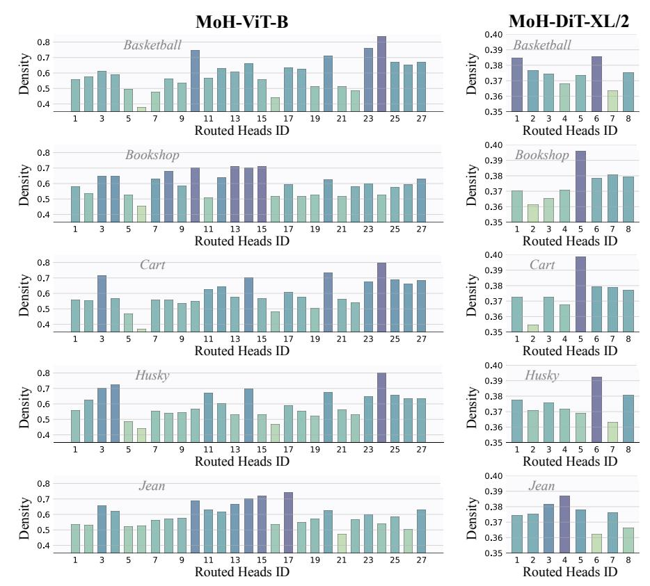

# C. Additional Experiments

Comparison between MoH-LLaMA3-8B and LLaMA3-8B-stage1. We divide the training process into two stages. Tab. [G](#page-7-0) shows the comparison between MoH-LLaMA3-8B and the model at the end of the first training stage (LLaMA3- 8B-stage1). As shown in Tab. [G,](#page-7-0) MoH-LLaMA3-8B quickly recovers the performance of LLaMA3-8B-stage1 within a training budget of 100B tokens. Notably, in English language tasks, MoH-LLaMA3-8B surpasses LLaMA3-8B-stage1 while using only 75% of the attention heads. However, for Chinese language and math tasks, the recovery performance of the MoH model is not as strong as for English. For example, MoH-LLaMA3-8B achieves an accuracy of 64.4% on CMMLU, compared to 66.0% for LLaMA3-8B-stage1. We attribute this to the fact that the model's Chinese and mathematical capabilities are primarily established during the first training stage. Since the first training stage uses only 300B tokens, significantly less than the 15T tokens in LLaMA3-8B's pre-training, the model's abilities in these areas are not fully stable. In the second training stage, after switching to the MoH model, the model experiences more significant forgetting in Chinese and math tasks. Overall, as shown in Tab. [G,](#page-7-0) MoH-LLaMA3-8B achieves an average accuracy of 64.8% across 14 benchmarks, outperforming LLaMA3-8B-stage1 by utilizing only 75% of the attention heads.

Effect of the Activated Head Ratio. As shown in Tab. [H,](#page-17-1) activating more attention heads generally leads to improved

Figure A. Additional visualization of the head load distribution in the final MoH layer. MoH-ViT-B activates 75% of the attention heads. MoH-DiT-XL/2 activates 90% of the attention heads.

model performance. These results are intuitive, as activating more attention heads equates to utilizing more parameters and performing additional computations on the input.

Table H. Ablation study on the impact of the activated head ratio. All results are from MoH-ViT-S, by using a training budget of 100 epochs.

| Activated Heads | 50%   | 55%   | 60%   | 65%   | 70%   | 75%   | 80%   |
|-----------------|-------|-------|-------|-------|-------|-------|-------|
| Accuracy (%)    | 78.32 | 78.38 | 78.44 | 78.50 | 78.42 | 78.58 | 78.78 |

