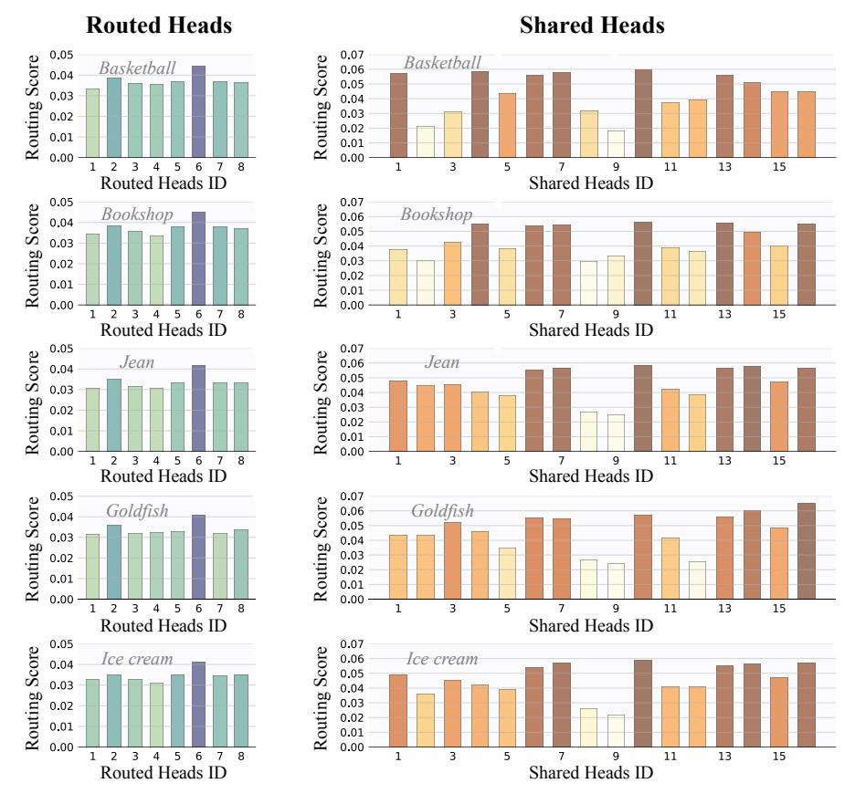
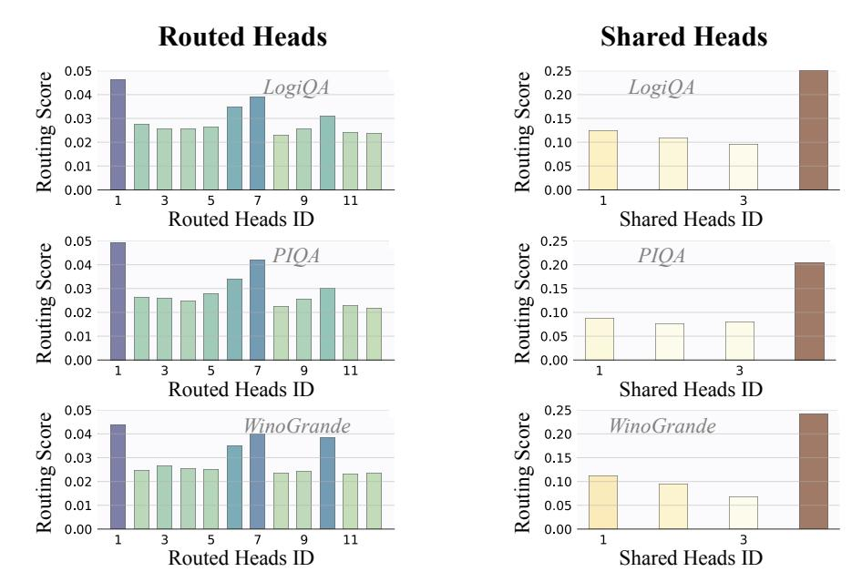
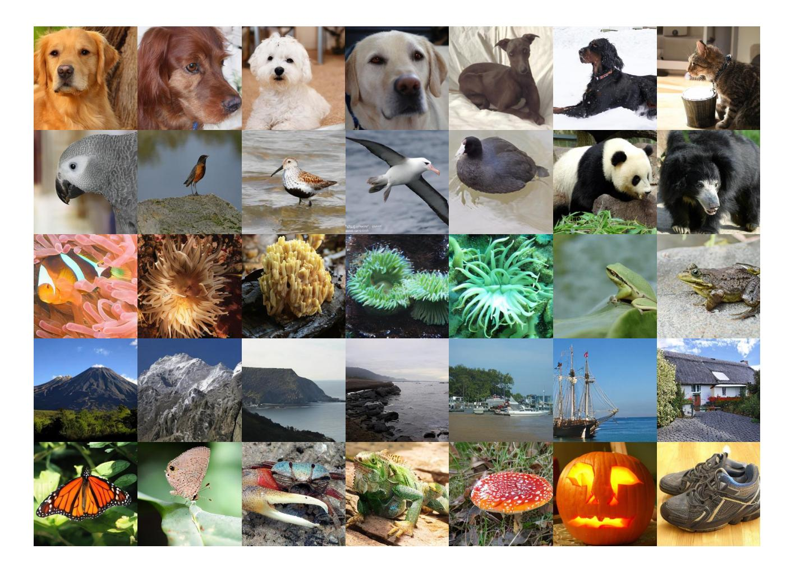

# E. Details of Quantitative Evaluations for LLMs

We conduct comparative comparisons of MoH-LLM (MoH-LLaMA3-8B) against vanilla LLMs (LLaMA3-8B). The evaluation is performed on multiple key benchmarks using the Eleuther AI Language Model Evaluation Harness§ [\(Gao](#page-10-14) [et al.,](#page-10-14) [2024\)](#page-10-14), a unified framework for testing generative language models across a wide range of tasks. The benchmarks used for evaluation include:

ARC [\(Clark et al.,](#page-9-20) [2018\)](#page-9-20) is a multiple-choice question-answering resource featuring questions from science exams for grades 3 to 9. It is divided into two partitions: Easy and Challenge, with the latter containing more difficult questions that necessitate reasoning. Most questions offer four answer choices, while less than 1% feature either three or five choices. Additionally, ARC includes a supporting knowledge base with 14.3 million unstructured text passages. We report 0-shot accuracy on ARC Easy and 25-shot accuracy on ARC Challenge.

LAMBADA [\(Paperno et al.,](#page-11-23) [2016\)](#page-11-23) is an open-ended cloze task consisting of approximately 10,000 passages from BooksCorpus, where the objective is to predict a missing target word in the last sentence of each passage. The missing word is always the last word of the final sentence, with no options provided. We report 0-shot accuracy on LAMBADA.

§ <https://github.com/EleutherAI/lm-evaluation-harness>

Figure C. Additional visualization of the head routing score distribution in MoH-ViT-B. MoH-ViT-B activates 75% of the attention heads.

LogiQA [\(Liu et al.,](#page-11-20) [2020\)](#page-11-20) comprises 8,678 question-and-answer instances that encompass various types of deductive reasoning. The dataset serves as a benchmark for reexamining logical AI within the context of deep learning in NLP. We report 0-shot accuracy on LogiQA.

PIQA [\(Bisk et al.,](#page-9-15) [2020\)](#page-9-15) is a dataset designed for commonsense reasoning, aimed at evaluating the physical knowledge of current models. We report 0-shot accuracy on PIQA.

SciQ [\(Welbl et al.,](#page-12-18) [2017\)](#page-12-18) includes 13,679 crowdsourced science exam questions covering subjects such as Physics, Chemistry, and Biology. Each question is presented in a multiple-choice format with four answer options, and for most questions, an additional paragraph provides supporting evidence for the correct answer. We report 0-shot accuracy on SciQ.

WinoGrande [\(Sakaguchi et al.,](#page-11-18) [2021\)](#page-11-18) is a large-scale dataset comprising 44,000 problems, inspired by the original WSC design but enhanced to increase both its scale and difficulty. We report 0-shot accuracy on WinoGrande.

HellaSwag [\(Zellers et al.,](#page-12-21) [2019\)](#page-12-21) is a challenging dataset designed to evaluate commonsense natural language inference, which proves difficult for state-of-the-art models but poses no significant challenge for humans. We report the accuracy for the 10-shot HellaSwag.

MMLU [\(Hendrycks et al.,](#page-10-18) [2021\)](#page-10-18) is a benchmark designed to assess models' knowledge acquired during pretraining, making it more challenging and human-like in evaluation. It covers 57 subjects across STEM, humanities, social sciences, and more, ranging from elementary to advanced professional levels. The benchmark tests both world knowledge and problem-solving skills, with subjects spanning traditional areas like math and history to specialized fields such as law and ethics, offering a comprehensive tool for identifying model blind spots. We report the accuracy for the 5-shot MMLU.

Natural Questions (NQ) [\(Kwiatkowski et al.,](#page-10-19) [2019\)](#page-10-19) is a question-answering dataset based on real, anonymized Google queries. Annotators label long and short answers (or null if no answer is found) from Wikipedia pages in the top 5 search results. The dataset includes 307,373 training examples, 7,830 development examples, and 7,842 test examples with 5-way annotations. We report the exact match score for 32-shot Natural Questions to measure the factual knowledge in the model.

BoolQ [\(Clark et al.,](#page-9-21) [2019\)](#page-9-21) is a question-answering dataset consisting of 15,942 yes/no questions. These questions are naturally occurring, and generated in unprompted and unconstrained contexts. Each example is provided as a triplet of

Figure D. Additional visualization of the head routing score distribution in MoH-DiT-XL/2. MoH-DiT-XL/2 activates 90% of the attention heads.

(question, passage, and answer), with the page title optionally included as additional context. We report the accuracy for the 32-shot BoolQ.

OpenbookQA [\(Mihaylov et al.,](#page-11-19) [2018\)](#page-11-19) is a question-answering dataset designed to assess understanding of elementary-level science, similar to open-book exams. It contains 5,957 multiple-choice questions based on a "book" of 1,326 core science facts. The dataset requires not only knowledge of these facts but also the application of broad common knowledge. It includes mappings from each question to the core fact it targets and additional common knowledge facts. The dataset also provides scores of human accuracy and clarity, as well as crowd-sourced data for further analysis. We report 0-shot accuracy on OpenbookQA.

TruthfulQA [\(Lin et al.,](#page-10-12) [2022\)](#page-10-12) is a benchmark designed to evaluate the truthfulness of a language model's responses. It consists of 817 questions across 38 categories, such as health, law, finance, and politics. The questions are crafted to reflect common false beliefs or misconceptions that might lead humans to answer inaccurately. We report 0-shot accuracy on TruthfulQA.

GSM8K [\(Cobbe et al.,](#page-9-22) [2021\)](#page-9-22) is a dataset containing 8.5K high-quality, linguistically diverse grade school math word problems. It is divided into 7.5K training problems and 1K test problems. Each problem requires 2 to 8 steps to solve, typically involving a sequence of elementary calculations using basic arithmetic operations. A capable middle school student should be able to solve all the problems, making the dataset suitable for evaluating multi-step mathematical reasoning. We report the exact match score for 8-shot GSM8K.

CEVAL [\(Huang et al.,](#page-10-16) [2023\)](#page-10-16) is a comprehensive Chinese evaluation suite designed to assess the advanced knowledge and reasoning abilities of LLMs in a Chinese context. It includes multiple-choice questions across four difficulty levels (middle school, high school, college, and professional) and spans 52 diverse disciplines. We report the accuracy for the 5-shot CEVAL.

CMMLU [\(Li et al.,](#page-10-17) [2023a\)](#page-10-17) is a comprehensive Chinese benchmark designed to evaluate the knowledge and reasoning abilities of LLMs across various subjects, including natural sciences, social sciences, engineering, and humanities. We

Figure E. Additional visualization of the head routing score distribution in MoH-LLM-B. MoH-LLM-B activate 75% of the attention heads.

report the accuracy for the 5-shot CMMLU.

Figure F. Images generated from the proposed MoH-DiT-XL/2 model. We show samples generated from our class-conditional MoH-DiT-XL/2 model trained on ImageNet at 256×256 resolution. MoH-DiT-XL/2 activates 90% of the attention heads.