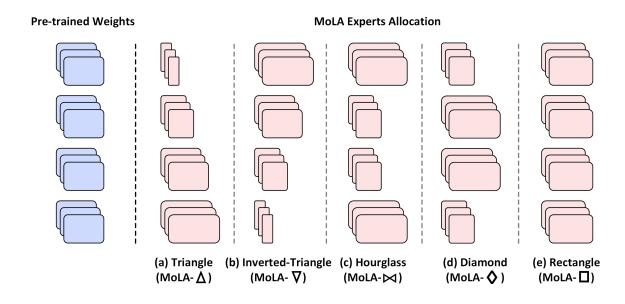

## MoLA: MoE LoRA with Layer-wise Expert Allocation

Chongyang Gao1 , Kezhen Chen2[\\*](#page-0-0), Jinmeng Rao3 , Ruibo Liu3 , Baochen Sun3 , Yawen Zhang4 , Daiyi Peng3 , Xiaoyuan Guo5 , VS Subrahmanian1

1 Northwestern University 2 Meta 3 Google DeepMind 4 Allen Institute for AI 5 Google cygao@u.northwestern.edu, {kzchen0204,yawenz1129,xiaoyuanguo.ucas}@gmail.com, {jinmengrao,ruiboliu,baochens,daiyip}@google.com, vss@northwestern.edu

## Abstract

Recent efforts to integrate low-rank adaptation (LoRA) with the Mixture-of-Experts (MoE) have managed to achieve performance comparable to full-parameter fine-tuning by tuning much fewer parameters. Despite promising results, research on improving the efficiency and expert analysis of LoRA with MoE is still in its early stages. Recent studies have shown that experts in the MoE architecture have different strengths and also exhibit some redundancy. Does this statement also apply to parameter-efficient MoE? In this paper, we introduce a novel parameter-efficient MoE method, *MoE-LoRA with Layer-wise Expert Allocation (MoLA)* for Transformer-based models, where each model layer uses a varying number of LoRA experts. We investigate several architectures with varying layerwise expert configurations. Experiments on six well-known NLP and commonsense QA benchmarks demonstrate that MoLA achieves equal or superior performance compared to all baselines on top of both LLAMA-2, Mistral, and Gemma. We find that allocating more LoRA experts to middle layers further enhances the effectiveness of models with a certain number of experts in total. The redundancy of the experts is more obvious in the lower layers. With much fewer parameters, this allocation strategy outperforms the setting with the same number of experts in every layer. This work can be widely used as a plug-and-play parameterefficient tuning approach for various applications. The code has been made available at <https://github.com/GCYZSL/MoLA>.

## 1 Introduction

Large Language Models (LLMs) have shown impressive proficiency and transfer learning capabilities across a variety of tasks and domains [\(Chowd](#page-9-0)[hery et al.,](#page-9-0) [2022;](#page-9-0) [Zhang et al.,](#page-10-0) [2023b;](#page-10-0) [Anil et al.,](#page-9-1) [2023;](#page-9-1) [Jiang et al.,](#page-9-2) [2024;](#page-9-2) [Singhal et al.,](#page-10-1) [2022\)](#page-10-1). However, fine-tuning modern LLMs demands huge computational resources due to the vast number of parameters. To mitigate this issue, the research community is increasingly focusing on parameterefficient fine-tuning (PEFT) methods to dramatically reduce training costs, such as p-tuning [\(Liu](#page-9-3) [et al.,](#page-9-3) [2022b\)](#page-9-3) and low-rank adaption (LoRA) [\(Hu](#page-9-4) [et al.,](#page-9-4) [2022\)](#page-9-4). Despite its training efficiency, PEFT methods' performance in fine-tuning LLMs is still limited.

Recent studies show that combining PEFT with the Mixture of Experts (MoE) holds promise for leveraging MoE in a parameter-efficient fashion [\(Zadouri et al.,](#page-10-2) [2023;](#page-10-2) [Liu et al.,](#page-9-5) [2023;](#page-9-5) [Dou et al.,](#page-9-6) [2023\)](#page-9-6). Most of these methods apply MoE on LoRA, called LoRA-MoE. For Transformer models [\(Vaswani et al.,](#page-10-3) [2017\)](#page-10-3), LoRA learns a pair of low-rank matrices as an adapter for a given dense linear layer, effectively modifying the layer's behavior without substantial change to the original model parameters. Instead of learning one pair of low-rank matrices, LoRA-MoE learns multiple pairs of low-rank matrices, called *LoRA experts*, and a router to compute the weights of each expert for inputs. During the LLM fine-tuning phase, pretrained weights of dense layers remain fixed, while LoRA experts and the router are trained to adapt the pre-trained weights. While the initial results are promising, research into achieving more efficient and effective integration is still in its infancy.

Moreover, recent MoE analyses indicate that many experts may be redundant due to representational collapse or learned routing policy overfitting [\(Chen et al.,](#page-9-7) [2023;](#page-9-7) [Zoph et al.,](#page-10-4) [2022\)](#page-10-4). More experts in a layer may cause the representation to overfit the training data, as the data is processed in a more fine-grained manner. This insight leads us to think about the number of experts to use in different layers in the Transformer model, motivating us to explore two questions.

\*Work done as external collaboration.

*(i) Are there any redundant experts in parameterefficient MoE? (ii) What strategy should be used to allocate the number of LoRA experts in each layer?*

To address these questions, we introduce a *new* parameter-efficient MoE approach, *MoE-LoRA with Layer-wise Expert Allocation (MoLA)*, combining LoRA and MoE with layer-wise expert allocation. Users can flexibly assign a different number of LoRA experts to each Transformer layer. We study several typical architectures with different layer-wise expert configurations. Using a fixed number of experts in total, we allocate them differently, with either lower layers or higher layers having more experts. We evaluate our MoLA approach on six benchmarks, including NLP and commonsense question-answering tasks, on three wellknown language models, LLAMA-2, Mistral, and Gemma, to demonstrate the effectiveness of our MoLA approach.

*Key Findings:* Our extensive experiments reveal that experts in lower layers are more similar to each other and thus exhibit more redundancy. With a fixed number of experts, more LoRA experts should be allocated to the middle layers of the Transformer model to enhance its effectiveness. Our key contributions are:

- We present a new parameter-efficient MoE method, MoLA, with flexible layer-wise expert allocation on the Transformer model. MoLA integrates LoRA and MoE and introduces flexibility in assigning different numbers of experts to different transformer layers, reducing expert redundancy and diversifying information granularity. MoLA is a plug-andplay approach and can be applied to diverse models and tasks.
- We study several MoLA variants on LLAMA-2, Mistral, and Gemma each with different layer-wise expert configurations. Experiments on six benchmarks show that all MoLA configurations significantly outperform other PEFT baselines, showing the efficacy of our approach.
- We further compare different layer-wise configurations of expert allocation. *Overall, the configuration that has more LoRA experts in the middle layers and fewer in the lower layer outperforms all other configurations.* Such specialized expert allocation configuration enables models to achieve enhanced per-

- formance vis-a-vis other configurations, even with much fewer parameters, demonstrating improved scalability.
- Our comprehensive analysis shows that experts in lower layers are more similar than those in middle and higher layers and thus have higher redundancy, providing insights into our observations.

## 2 Related Work

### 2.1 Parameter-Efficient Tuning

Parameter-efficient tuning of LLMs has garnered considerable attention because it is cost-effective for fine-tuning LLMs. [Li and Liang](#page-9-8) [\(2021\)](#page-9-8) and [Liu](#page-9-3) [et al.](#page-9-3) [\(2022b\)](#page-9-3) propose soft prompting concatenated to either the embedding layer or intermediate layers of the Transformer model. However, these approaches involve adding extra embedding tokens to the sequence, potentially compromising efficiency during inference, especially in the case of long input contexts. [Hu et al.](#page-9-4) [\(2022\)](#page-9-4) introduces the LoRA parameter-efficient adaptation technique, which uses low-rank decomposition matrices of dense weight matrices of Transformers. LoRA achieves decent performance for fine-tuning LLMs without additional inference costs. Similarly, [Liu et al.](#page-9-9) [\(2022a\)](#page-9-9) uses task-specific vectors to modify attention activation, also avoiding extra inference costs. Inspired by these approaches, our approach combines the MoE technique with parameter-efficient tuning approaches and leverages the layer-wise expert allocation to push the limit of performance further.

## 2.2 Parameter-Efficient MoE

Some recent efforts have studied integrating MoE and parameter-efficient tuning methods to improve the effectiveness of instruction tuning. [Liu et al.](#page-9-5) [\(2023\)](#page-9-5) applies MoE with LoRA matrices for finetuning language models on various medical domain tasks. This method takes the task type as an additional input for training the router, which requires additional prior knowledge during inference. Our approach does not require additional prior knowledge since our MoLA experts are learned without supervision. [Dou et al.](#page-9-6) [\(2023\)](#page-9-6) introduced LoRA-MoE, a novel adapter architecture that combines MoE and LoRA within the feed-forward layer of each Transformer block. This effort also studies

Figure 1: The overview of MoLA architecture. MoLA applies LoRA-MoE on any pre-trained Transformer model with layer-wise expert allocation. Each layer employs a different number of experts. During training, the pre-trained weights are freeze and only LoRA experts are tuned as the adapters on the weights.

how to mitigate knowledge forgetting in LLMs during traditional supervised fine-tuning. However, this paper only applies LoRA-MoE on the feedforward layer in each Transformer block. MoLA, on the other hand, applies LoRA experts across each dense weight matrix in the Transformer, further improving both the performance and scalability of parameter-efficient fine-tuning. Zadouri et al. (2023) introduces a framework that combines MoE with various parameter-efficient architectures, including LoRA and IA3 (Liu et al., 2022a), called MoLORA and MoV. Their experiments show that their framework leverages instruction tuning more effectively than prior parameterefficient architectures, improving the zero-shot capabilities of LLMs. Buehler and Buehler (2024), use a set of trained LoRA adapters and dynamically mix them. However, the previously mentioned methods do not consider the layer-wise allocation of experts. Our MoLA approach introduces a novel design that allows for a varying number of experts in each layer, therefore further improving the effectiveness of LoRA-MoE approaches. Oing et al. (2024) explores allocating different numbers of PEFT parameters to various model layers via layer training quality.

### 3 Preliminaries

Mixture of Experts The MoE architecture (Shazeer et al., 2017) applies sparse sub-modules, called experts, to various inputs via a router module. The router module intelligently employs different experts for different types of inputs, thus scaling up model parameters with a constant computational

cost. MoE has shown promising effectiveness on the Transformer model (Shazeer et al., 2017). The  ${\it MoE}$  layer consists of N identical and independent feed-forward neural networks  $\{E\}_{i=1}^{N}$  as experts. The router is a gating function with a trainable weight matrix  $W_r$ . Given an input x, the router maps x to an N-dimensional vector, which corresponds to the number of experts. The router uses a softmax function to compute a probability distribution of the weights of outputs from the expert networks. Following standard MoE architectures, only the top K experts, determined by the router, are chosen for the computation. Additionally, an auxiliary loss, called load balancing loss, is used on each MoE layer to promote a balanced top-k selection by pushing the router to have equitable workload distribution among experts. Equation 1 mathematically represents the MoE layer where yis the output embedding from the MoE layer. With fine-tuning, different experts focus on processing different types of information or tasks and thus provide finer granularity.

$$y = \sum_{i=1}^{K} \frac{\text{TopK}(\text{Softmax}(W_r x), K)_i}{\sum_{i=1}^{K} \text{TopK}(\text{Softmax}(W_r x), K)_i} E_i(x)$$
(1)

LoRA LoRA is a popular parameter-efficient tuning approach that is widely used in LLM finetuning (Hu et al., 2022; Zhang et al., 2023a; Dettmers et al., 2023). LoRA reparameterizes the fine-tuning update for each parameter matrix as a low-rank matrix to reduce the number of training parameters significantly. Given a pre-trained

linear layer with a weight matrix  $W_0 \in \mathbb{R}^{d_q \times d_p}$ , LoRA creates two low-rank trainable matrices A and B, where  $A \in \mathbb{R}^{d_q \times r}$ ,  $B \in \mathbb{R}^{r \times d_p}$ , and  $r \ll min(d_q, d_p)$ . Thus, the dimension of ABx equals the dimension of  $W_0x$ . Equation 2 mathematically describes this process, and the output of LoRA is h. During training,  $W_0$  is frozen and does not receive gradient updates, while A and B are updated.

$$h = W_0 x + \triangle W x = W_0 x + ABx \qquad (2)$$

The matrix A is initialized with a random Gaussian distribution, and matrix B is initialized to zero. The initialization results in the same outputs as the original pre-trained model. When fine-tuning LLMs, the LoRA approach can be applied to all the linear layers in the Transformer model or its variants. Compared with tuning the original weight matrix, LoRA dramatically reduces the number of training parameters while keeping reasonable performance.

### 4 MoE-LoRA with Layer-wise Allocation

Combining MoE and LoRA has shown promising results (Zadouri et al., 2023; Liu et al., 2023; Dou et al., 2023). However, most such efforts only replace experts with LoRA adapters under the MoE framework, and each layer has a fixed number of experts. Some shortcomings of MoE may persist in these methods. For instance, experts in MoE may be redundant due to representational collapse or learned routing policy overfitting (Chen et al., 2023; Zoph et al., 2022). Inspired by this insight, we argue that the number of LoRA experts need *not* be the same across all layers.

We thus introduce a novel parameter-efficient tuning approach, called MoE-LoRA with Layer-wise Allocation (MoLA), which combines LoRA and MoE techniques with flexible layer-wise expert allocation. Since most LLMs use Transformer-based architectures, we mainly study how to apply MoLA to Transformers. Instead of allocating the same number of experts to all layers of the Transformer, MoLA uses different numbers of experts on different layers. In this section, we first describe the details of our architecture and then propose several layer-wise expert allocations based on different assumptions.

#### 4.1 The MoLA Architecture

MoLA integrates LoRA adapters into the MoE framework and each layer may have a different

number of experts. When training a pre-trained LLM with LoRA, instead of decomposing each weight matrix of a dense linear layer into a pair of low-rank matrices, we create *multiple* pairs of lowrank matrices — each pair is called a LoRA expert. A router module is learned to route each input token to different LoRA experts. Given a Transformer model with m layers, we allocate  $N_i$  experts for layer j and have  $\sum_{j=1}^{m} N_j$  experts in total. Specifically, given a pre-trained weight matrix  $W_0^{jt} \in$  $\mathbb{R}^{d_q \times d_p}$  from the module t in layer j, we create  $N_j$  pairs of low-rank matrices  $\{A^{jt}\}_{i=1}^{N_j}, \{B^{jt}\}_{i=1}^{N_j}$ . As in the case of LoRA, each matrix  $A_i^{jt}$  is initialized from a random Gaussian distribution. We set  $B_i^{jt}$ to zero, where  $A_i^{jt} \in \mathbb{R}^{d_q \times r}, B_i^{jt} \in \mathbb{R}^{r \times d_p}$ , and  $r \ll min(d_q, d_p)$ . Then, a router  $S_i^{jt}$  with a trainable weight matrix  $W_r^{jt} \in \mathbb{R}^{d_q \times N_j}$  is used to specify different LoRA experts for the input x. As in the original MoE, MoLA selects the top K experts for computation and applies the load balancing loss on each layer. Figure 1 shows an overview of the architecture. The mathematical representation is:

$$S_{i}^{jt}(x) = \frac{\operatorname{TopK}(\operatorname{Softmax}(W_{r}^{jt}x), K)_{i}}{\sum_{i=1}^{K} \operatorname{TopK}(\operatorname{Softmax}(W_{r}^{jt}x), K)_{i}}$$
(3)

$$h^{jt} = W_0^{jt} x + \sum_{i=1}^K S_i^{jt}(x) A_i^{jt} B_i^{jt} x$$
 (4)

Eq. 3 represents the router with the input x, and Eq. 4 mathematically shows the LoRA experts in MoLA, where  $h^{jt}$  is the output embedding. This MoLA architecture provides flexibility in modifying the number of experts for each Transformer layer. The next section addresses the question of how experts should be allocated in each layer.

## 4.2 Configurations of Layer-wise Expert Allocation

MoE works like an ensemble method, with multiple experts learning fine-grained information. Layers with more experts have stronger fitting capabilities, but the architecture is more complicated. One intuition is that we should allocate more experts to layers that are required to process diverse edge cases and fine-grained information. To study how LoRA experts should be allocated in each Transformer layer, we propose five types of layer-wise expert configurations based on different assumptions. Figure 2 visualizes the overview of these

Figure 2: Five types of layer-wise expert allocations of MoLA. A longer rectangle indicates a greater number of LoRA experts.

five configurations indicated in red color. Section [5](#page-4-1) describes detailed experiments to compare these configurations.

MoLA Triangle (MoLA-△) Many studies have analyzed layer-wise representations of Transformer models. Generally, lower layers learn more tokenlevel features, such as word meaning, syntax, or grammar, while higher layers capture more abstract, high-level information. As token-level information is subtle and diverse, one assumption is that token-level information needs more experts for finegrained understanding, while high-level information requires fewer experts for generalization. Our MoLA Triangle (MoLA-△) architecture is based on this assumption and allocates experts in a "triangle" shape: lower layers have more experts than higher layers.

MoLA Inverted-Triangle (MoLA-▽) Unlike MoLA-△, another assumption is that using more experts for token-level information may create redundancy in processing. As higher layers learn more abstract and high-level information, and these features are used for downstream tasks, they may require more experts. More experts may enhance the architecture to process complicated problems by leveraging experts to learn fine-grained and taskspecific patterns. Based on this intuition, we design the MoLA Inverted-Triangle (MoLA-▽) configuration where lower layers are allocated fewer experts while higher layers have more experts.

MoLA Hourglass (MoLA-▷◁) A third model assumes that both lower and higher layers require more experts as they focus on processing basic features and abstract features. The middle layers play a role in aggregating the basic features and mapping them to a high-dimensional space for abstract reasoning, requiring fewer fine-grained features. Our MoLA Hourglass (MoLA-▷◁) architecture uses this

assumption to allocate experts in an "hourglass" shape, where lower and higher layers have more experts than the middle layers.

MoLA Diamond (MoLA-✸) Unlike MoLA-▷◁, research in representation learning suggests that acquiring low-level features and using extracted abstract representation for downstream tasks is relatively more sensitive than learning an effective and expressive representation in middle layers [\(Long et al.,](#page-9-12) [2018;](#page-9-12) [Bengio et al.,](#page-9-13) [2013\)](#page-9-13). Moreover, a superior representation is crucial for enhancing the model's abstract ability, *e.g.*, reasoning. Consequently, the newly designed MoLA Diamond (MoLA-✸) architecture features a 'Diamond' shape, where the middle layers are equipped with more experts.

MoLA Rectangle (MoLA-□) The last configuration is the original design of MoE, where each Transformer layer has the same number of experts. Most of the recent studies adopt this expert allocation design. We call this MoLA Rectangle (MoLA- □) and use it as a baseline.

### 5 Experiments

## 5.1 Experimental Settings

We examined the performance of our MoLA approach via direct fine-tuning on downstream tasks. Furthermore, We show the transferrability of MoLA by performing instruction tuning first and then fine-tuning for downstream tasks in Appendix [B.](#page-11-0) The abilities of MoLA in continuous learning settings are demonstrated in Appendix [C.](#page-11-1) To make the comparisons straightforward and clear, we designed five allocation configurations of MoLA for the large language model as described in Section [4.2.](#page-3-3) We take LLaMA-2-7B [\(Touvron](#page-10-8) [et al.,](#page-10-8) [2023\)](#page-10-8) and Mistral-7B [\(Jiang et al.,](#page-9-14) [2023\)](#page-9-14), which contain 32 layers, as our base models. Additionally, experiments with Gemma [\(Team et al.,](#page-10-9) [2024\)](#page-10-9) are shown in Appendix [E.](#page-12-0) For MoLA-△, we allocate 8 experts to each layer for the first 8 layers, 6 experts to each layer for the next 8 layers, 4 experts to each layer for 17-24 layers, and 2 experts to each layer for the last 8 layers, which is denoted as 8642. Following the same notation, we allocate MoLA Inverted Triangle as 2468. The allocations for Hourglass, MoLA Diamond, and MoLA Rectangle are 8228, 2882, and 5555 separately. Notably, to make the comparison fair, we make the total number of experts the same for all the variants,

resulting in the same number of trainable parameters. The trainable parameter number of LLaMA-2 is 105,635,840, which is a 1.5% trainable parameter number of the pre-trained base model. We also adopt auxiliary loss for balancing the top-k selection of routing following Switch Transformers [\(Fedus et al.,](#page-9-15) [2022\)](#page-9-15).

### 5.2 Task and Data

MoLA can be used to fine-tune LLMs on downstream tasks and/or fine-tune instructions. To show its effectiveness, we study both natural language processing (NLP) tasks and commonsense reasoning (CR) tasks. For NLP tasks, we evaluate three popular datasets, including Microsoft's Research Paraphrase Corpus [\(Dolan and Brock](#page-9-16)[ett,](#page-9-16) [2005\)](#page-9-16), Recognizing Textual Entailment (RTE) dataset [\(Wang et al.,](#page-10-10) [2019\)](#page-10-10), and Corpus of Linguistic Acceptability (COLA) [\(Wang et al.,](#page-10-10) [2019\)](#page-10-10). For commonsense reasoning tasks, we evaluate three recent question-answering benchmarks, including ScienceQA [\(Lu et al.,](#page-9-17) [2022\)](#page-9-17), CommonsenseQA [\(Talmor et al.,](#page-10-11) [2019\)](#page-10-11), and OpenbookQA [\(Mihaylov et al.,](#page-9-18) [2018\)](#page-9-18). We follow the task-specific fine-tuning framework to evaluate their effectiveness. The details of the datasets are introduced in Appendix [A.](#page-10-12)

### 5.3 Recent Competitive Baselines

We compare MoLA with three parameter-efficient tuning approaches, prompt tuning [\(Lester et al.,](#page-9-19) [2021\)](#page-9-19), LLaMA-Adapter [\(Zhang et al.,](#page-10-0) [2023b\)](#page-10-0), and LoRA[\(Hu et al.,](#page-9-4) [2022\)](#page-9-4). We also compare against full-parameter fine-tuning. Prompt tuning presents soft prompting concatenated to the embedding layer of the Transformer model. Soft prompts are a set of virtual tokens pre-appended to the textual prompt and passed to the LLM. During fine-tuning, the LLM is frozen and only the virtual tokens are optimized, providing a lightweight tuning approach. LLaMA-Adapter is an adaption method for LLaMA instruction tuning and has a set of learnable adaption prompts that are pre-appended to the word tokens at higher transformer layers. A zeroinitialized attention mechanism with zero gating is used to inject new instructional cues into LLaMA. LoRA was briefly described in Section [4.](#page-3-4) The rank of LoRA is set to 64. In our evaluation, LLMs are fine-tuned on the downstream training dataset via different parameter-efficient tuning approaches. Based on the availability of test set labels, we evaluated COLA, RTE, and CommonsenseQA on their

validation set and others on the test set.

### 5.4 Implementation

We use LLAMA2-7B [\(Touvron et al.,](#page-10-8) [2023\)](#page-10-8) and Mistral-7B [\(Jiang et al.,](#page-9-14) [2023\)](#page-9-14) as our base language models across all the experiments. We do a grid search on the number of training epochs, including 10, 15, and 20 epochs for downstream task finetuning. We use AdamW [\(Loshchilov and Hutter,](#page-9-20) [2017\)](#page-9-20) as the optimizer with a learning rate of 3e-4. The cutoff length is set to 256 following Sanh *et al.*[\(Sanh et al.,](#page-10-13) [2022\)](#page-10-13), and the batch size is 128. The random seed is set to 10. The rank of each LoRA expert is 8 and we adopt top-2 for the router. LoRA alpha is set to 16 and LoRA dropout is 0.05, following the default LoRA settings. We applied LoRA to four weight matrices in the self-attention module (Wq , Wk, Wv , Wo) and three weight matrices in the MLP module (Wgate, Wdown, Wup). All experiments were conducted on the servers with eight A100-40G GPUs and three A6000 GPUs. It takes around 4 hours to train on the COLA dataset.

### 5.5 Results

Comparison with Baselines Table [1](#page-6-0) shows the results for the direct fine-tuning setting using LLAMA-2 where each number is the accuracy (%) for each dataset. From the table, LoRA-based approaches (LoRA and MoLA) significantly outperform prompt-tuning-based baselines (Prompt Tuning and LLaMA-Adapter). For LoRA-based methods, the original LoRA with rank 64 is used as our baseline. We first evaluate the MoLA-□ with eight experts at each layer, annotated as MoLA- □(8888), where the number of parameters is the same as the LoRA baseline. We then reduce the sum of the configuration number from 32 (8 × 4) to 20 in total, with only 62.5% of the parameters, and evaluate the five different configurations as described in Section [5.1.](#page-4-2) MoLA variants outperform the LoRA baseline on all the benchmarks. Specifically, MoLA-▽ beats LoRA on all six datasets — the performance improvements of MoLA-▽ are larger on the commonsense QA tasks compared to the NLP tasks. It even outperforms the MoLA- □(8888) on three benchmarks with nearly 40% fewer parameters. The results demonstrate the effectiveness and scalability of MoLA.

Tables [1](#page-6-0) and [4](#page-12-1) show that MoLA-△ and -▷◁ perform worse than MoLA-□ and MoLA-▽, especially in the QA task. Of all MoLA variants, MoLA-▽ generally achieves the best performance,

Table 1: Comparison with different methods using LLaMA-2. MoLA- $\nabla$  outperforms other variants or baselines and even achieves competitive or superior performance with MoLA- $\square$  (8888), with nearly 40% fewer parameters. The ratio of trainable parameters

| Models (# of Experts) | MRPC   | COLA   | RTE    | ScienceQA | CommonsenseQA          | OpenbookQA | Trainable Parameters |
|-----------------------|--------|--------|--------|-----------|------------------------|------------|----------------------|
| Full-Parameter        | 87.13% | 86.29% | 87.73% | 93.12%    | 77.48%                 | 80.4%      | 6,738,415,616        |
| Prompt Tuning         | 49.91% | 59.25% | 54.17% | 36.78%    | 37.76%                 | 46.2%      | 163,840              |
| LLaMA-Adapter         | 71.94% | 47.56% | 72.93% | 73.33%    | 73.55%                 | 71.8%      | 5,242,912            |
| LoRA                  | 83.13% | 86.29% | 85.92% | 91.01%    | 75.51%                 | 77.0%      | 159,907,840          |
| MoLA-□ (8888)         | 84.70% | 85.81% | 88.45% | 91.91%    | 77.89%                 | 82.8%      | 169,017,344          |
| MoLA-□ (5555)         | 84.23% | 86.28% | 85.20% | 92.04%    | 78.13%                 | 80.0%      | 105,635,840          |
| MoLA-△ (8642)         | 84.64% | 85.43% | 84.84% | 91.90%    | 77.23%                 | 77.6%      | 105,635,840          |
| MoLA-⋈ (8228)         | 83.48% | 86.00% | 86.28% | 91.41%    | 76.25%                 | 78.8%      | 105,635,840          |
| MoLA-∇ (2468)         | 83.48% | 86.87% | 86.28% | 92.36%    | 78.95%                 | 79.6%      | 105,635,840          |
| MoLA-♦ (2882)         | 83.01% | 86.19% | 89.17% | 92.00%    | 77.81%                 | 82.6%      | 105,635,840          |
| MoLA-□ (4444)         | 82.90% | 85.62% | 86.28% | 91.73%    | 77.40%                 | 80.8%      | 84,508,672           |
| MoLA-△ (6532)         | 83.54% | 85.43% | 85.20% | 92.00%    | 77.64%                 | 80.2%      | 84,508,672           |
| MoLA-⋈ (6226)         | 83.42% | 85.71% | 84.48% | 92.00%    | 76.58%                 | 80.0%      | 84,508,672           |
| MoLA-∇ (2356)         | 81.97% | 85.91% | 87.37% | 92.18%    | <i>77.</i> 97 <i>%</i> | 81.2%      | 84,508,672           |
| MoLA-♦ (2662)         | 82.96% | 85.62% | 87.37% | 92.27%    | 77.48%                 | 79.8%      | 84,508,672           |

outperforming all other variants on five benchmarks. The confidence intervals are demonstrated in Appendix. F. We conducted a Friedman test to reject the null hypothesis that all algorithms perform equally. Following this, we applied the Wilcoxon signed-rank test to perform pairwise comparisons between the algorithms (Prompt Tuning, LLaMA-Adapter, LoRA, and MoLA-∇) across six benchmarks, identifying significant differences in their performance. We applied an FDR correction to adjust the p-values to address multiple comparisons. The results confirm that the superior performance of MoLA-∇ over the other baselines is statistically significant, with all adjusted p-values below the standard threshold of 0.05.

#### 6 Model Analysis and Ablation Studies

## 6.1 Analysis of Layer-wise Experts Importance

To investigate which configuration is better further, we analyze the layer-wise expert's importance by showing the performance with different base models, including Mistral in Table. 2 and Gemma in the Appendix. E. We also compare the results with different total configuration numbers (20 and 16) in both Table. 1 and Table. 2.

From Table. 1 and Table. 2, we find that MoLA
¬ and MoLA- perform better than other configurations with different base models and configuration numbers. These experiments show that allocating more experts to the middle layers is more effective than other strategies. Notably, we want to point out that with a relatively smaller total configuration numbers (16), the MoLA's potential may

not be fully released, making the superiority of MoLA- $\triangledown$  and MoLA- $\diamondsuit$  less stable. Furthermore, the choice between MoLA- $\triangledown$  and MoLA- $\diamondsuit$  is related to the base model, which will be discussed in the next section and Appendix. H.

