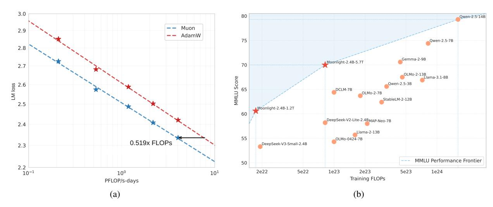

# **ABSTRACT**

Recently, the Muon optimizer (K. Jordan et al. 2024) based on matrix orthogonalization has demonstrated strong results in training small-scale language models, but the scalability to larger models has not been proven. We identify two crucial techniques for scaling up Muon: (1) adding weight decay and (2) carefully adjusting the per-parameter update scale. These techniques allow Muon to work out-of-the-box on large-scale training without the need of hyper-parameter tuning. Scaling law experiments indicate that Muon achieves  $\sim 2\times$  computational efficiency compared to AdamW with compute optimal training. Based on these improvements, we introduce Moonlight, a 3B/16B-parameter Mixture-of-Expert (MoE) model trained with 5.7T tokens using Muon. Our model improves the current Pareto frontier, achieving better performance with much fewer training FLOPs compared to prior models. We open-source our distributed Muon implementation that is memory optimal and communication efficient. We also release the pretrained, instruction-tuned, and intermediate checkpoints to support future research.

Figure 1: Scaling up with Muon. (a) Scaling law experiments comparing Muon and Adam. Muon is  $\sim 2 \times$  more computational efficient than Adam with compute optimal training. (b) The MMLU performance of our Moonlight model optimized with Muon and other comparable models. Moonlight advances the Pareto frontier of performance vs training FLOPs.

\*Corresponding author: zhouxinyu@moonshot.cn

