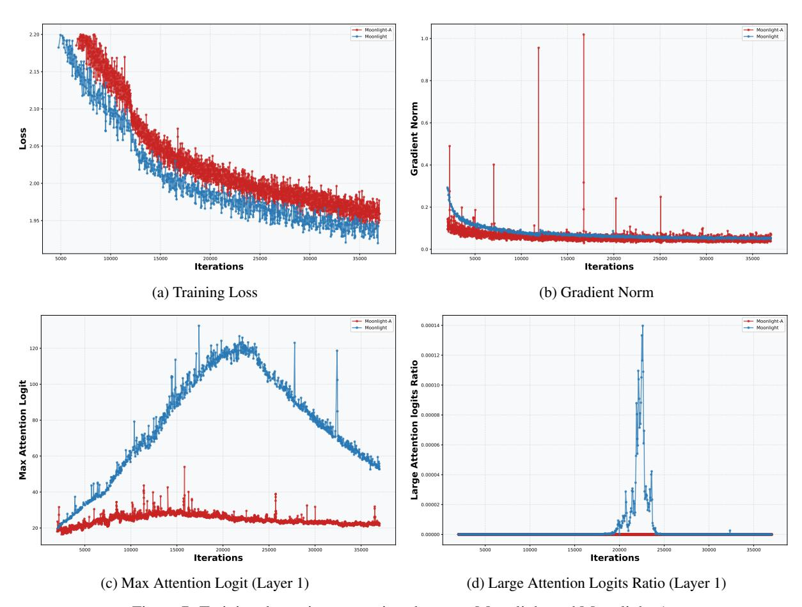
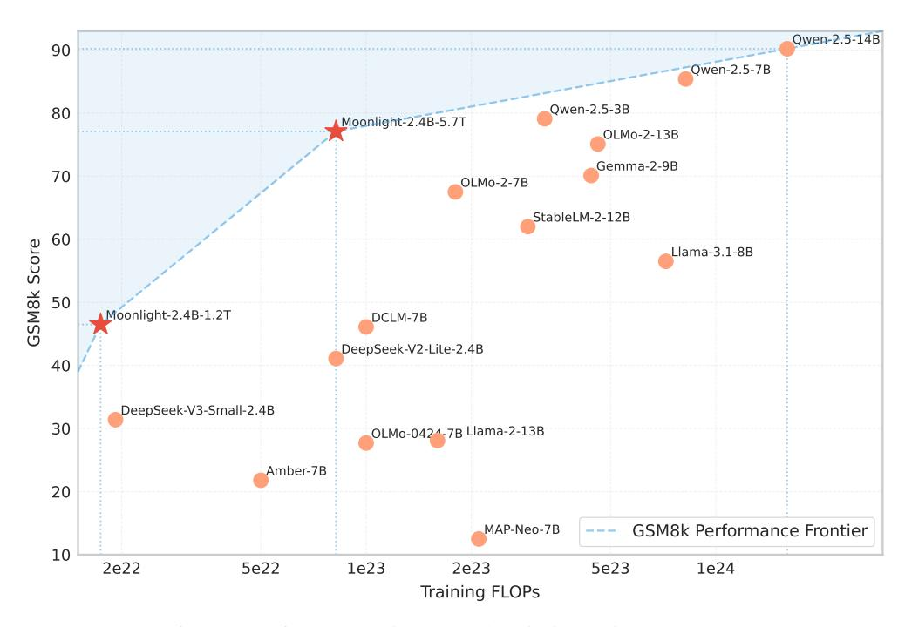
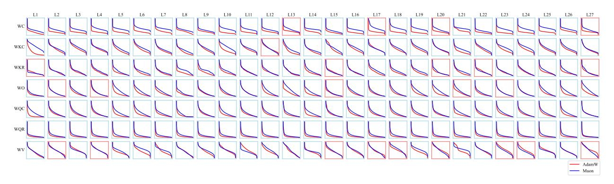
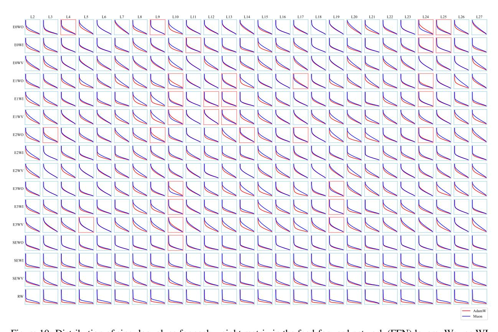

# F Singular Value Distributions of Weight Matrices

We visualize the singular value distributions of weight matrices by plotting a line graph of its singular values in descending order for each matrix, normalized by the largest one. As shown in Figures [9](#page-17-1) and [10,](#page-18-0) we find that, for most of the weight matrices, the singular value distributions of them optimized by Muon are more flattened than that of AdamW, which further confirms the hypothesis that Muon can provide a more diverse spectrum of updates.

Figure 7: Training dynamics comparison between Moonlight and Moonlight-A

Table 10: Comparison of different models on various benchmarks.

|         | Benchmark (Metric)                                                               | Moonlight                       | Larger Training Compute Model  |                                 |                                  |  |
|---------|----------------------------------------------------------------------------------|---------------------------------|--------------------------------|---------------------------------|----------------------------------|--|
|         | Activated Param † Total Params † Training Tokens Optimizer | 2.24B 15.29B 5.7T Muon | 7.38B 7.38B 15T AdamW | 8.32B 8.32B 8T Unknown | 6.83B 6.83B 18T Unknown |  |
| English | MMLU MMLU-pro BBH TriviaQA ‡                                 | 70.0 42.4 65.2 66.3    | 66.7 37.1 57.7 70.3   | 71.3 44.7 68.2            | 74.2 45.0 70.4 60.0     |  |
| Code    | HumanEval MBPP                                                                | 48.1 63.8                    | 37.2 47.6                   | 37.8 62.2                    | 57.9 74.9                     |  |
| Math    | GSM8K MATH                                                                    | 77.4 45.3                    | 57.2 20.3                   | 70.7 37.7                    | 85.4 49.8                     |  |

&lt;sup>† The reported parameter counts exclude the embedding parameters. ‡ We test all listed models with the full set of TriviaQA.

Figure 8: The GSM8k performance of our Moonlight model optimized with Muon and other comparable models.

Figure 9: Distribution of singular values for each weight matrix in the attention layers. We use WC to denote the weight matrices at each layer that compress the hidden states to the shared latent spaces for keys and values, WV to denote the weight matrices up-projecting the values from the latent space, WO to denote the output projection matrices, and WKR, WKC, WQR and WQC to denote the projection matrices for the part of keys and queries with and without RoPE respectively. We set the spines of each line graph red if the corresponding weight matrix optimized by Muon has a lower singular entropy than AdamW.

Figure 10: Distribution of singular values for each weight matrix in the feed-forward network (FFN) layers. We use WI, WV and WO to denote the weight matrices involved in the FFN layer with SwiGLU activation function, where WI represents the input projection to the Swish1 function, WV represents the extra input projection interacting with Swish1 activations, and WO represents the output projection. We use E0, E2, E3 to denote three arbitrarily selected expert models and SE to denote the weights in the shared expert model. We use RW to denote the weights in the router. We set the spines of each line graph red if the corresponding weight matrix optimized by Muon has a lower singular entropy than AdamW.