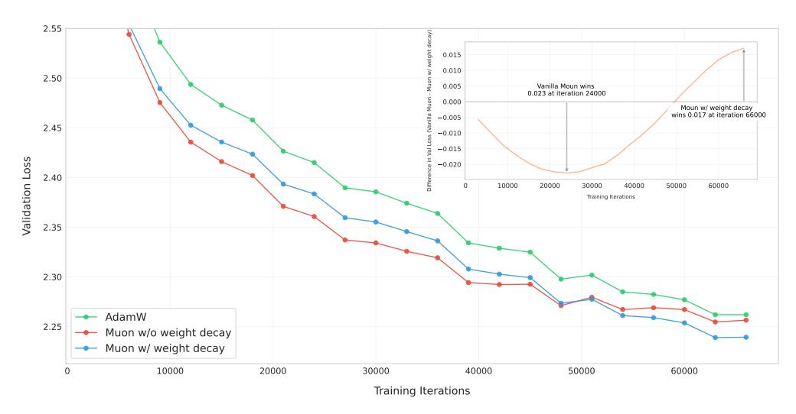

# <span id="page-2-5"></span>2.2 Scaling Up Muon

Weight Decay While Muon performs significantly better than AdamW on a small scale as shown by K. Jordan et al. [2024,](#page-11-0) we found the performance gains diminish when we scale up to train a larger model with more tokens. We observed that both the weight and the layer output's RMS keep growing to a large scale, exceeding the high-precision range of bf16, which might hurt the model's performance. To resolve this issue, we introduced the standard AdamW (Loshchilov et al. [2019\)](#page-11-6) weight decay mechanism into Muon[2](#page-2-1) .

<span id="page-2-2"></span>
$$\mathbf{W}_t = \mathbf{W}_{t-1} - \eta_t (\mathbf{O}_t + \lambda \mathbf{W}_{t-1}) \tag{3}$$

We experimented on Muon both with and without weight decay to understand its impact on the training dynamics of LLMs. Based on our scaling law research in Sec [3.2,](#page-5-0) we trained an 800M parameters model with 100B tokens (∼ 5× optimal training tokens). Figure [2](#page-3-0) shows validation loss curves of the model trained with AdamW, vanilla Muon (without weight decay), and Muon with weight decay. While vanilla Muon initially converges faster, we observed that some model weights grew too large over time, potentially limiting the model's long-term performances. Adding weight decay addressed this issue - the results demonstrate that Muon with weight decay outperforms both vanilla Muon and AdamW, achieving lower validation loss in the over-train regime. Therefore, we adjusted our update rule to equation [3,](#page-2-2) where λ is the weight decay ratio.

Consistent update RMS An important property of Adam and AdamW (Kingma et al. [2015,](#page-11-5) Loshchilov et al. [2019\)](#page-11-6) is that they maintain a theoretical update RMS around 1[3](#page-2-3) . However, we show that Muon's update RMS varies depending on the shape of the parameters, according to the following lemma:

<span id="page-2-4"></span>*Lemma* 1*. For a full-rank matrix parameter of shape* [A, B]*, its theoretical Muon update RMS is* p 1/ max(A, B) *.*

The proof can be found in the Appendix [A.](#page-13-0) We monitored Muon's update RMS during training and found it typically close to the theoretical value given above. We note that such inconsistency can be problematic when scaling up the model size:

- When max(A, B) is too large, e.g. the dense MLP matrix, the updates become too small, thus limiting the model's representational capacity and leading to suboptimal performances;
- When max(A, B) is too small, e.g. treating each KV head in GQA (Shazeer [2019\)](#page-12-7) or MLA (DeepSeek-AI et al. [2024\)](#page-11-1) as a separate parameter, the updates become too large, thus causing training instabilities and leading to suboptimal performances as well.

<span id="page-2-1"></span><sup>2</sup>The original implementation of Muon omits weight decay. A recent concurrent work in Muon incorporates weight decay and demonstrates improved performance. See [this commit](https://github.com/KellerJordan/Muon/commit/e0ffefd4f7ea88f2db724caa2c7cfe859155995d) and [this discussion.](https://x.com/kellerjordan0/status/1888320690543284449)

<span id="page-2-3"></span><sup>3</sup>Due to Adam's β<sup>1</sup> < β<sup>2</sup> and ϵ > 0, the actual update RMS is usually less than 1.

<span id="page-3-0"></span>

Figure 2: Validation loss curves for AdamW (green), Muon without weight decay (red), and Muon with weight decay (blue).

In order to maintain consistent update RMS among matrices of different shapes, we propose to scale the Muon update for each matrix by its  $\sqrt{\max(A,B)}$  to cancel the effect of Lemma 1  $^4$ . Experiments in Sec 3.1 show that this strategy is beneficial for optimization.

**Matching update RMS of AdamW** Muon is designed to update matrix-based parameters. In practice, AdamW is used in couple with Muon to handle non-matrix based parameters, like RMSNorm, LM head, and embedding parameters. We would like the optimizer hyper-parameters (learning rate  $\eta$ , weight decay  $\lambda$ ) to be shared among matrix and non-matrix parameters.

We propose to match Muon's update RMS to be similar to that of AdamW. From empirical observations, AdamW's update RMS is usually around 0.2 to 0.4. Therefore, we scale Muon's update RMS to this range by the following adjustment:

$$\mathbf{W}_{t} = \mathbf{W}_{t-1} - \eta_{t} (0.2 \cdot \mathbf{O}_{t} \cdot \sqrt{\max(A, B)} + \lambda \mathbf{W}_{t-1})$$

$$\tag{4}$$

We validated this choice with empirical results (see Appendix A for details). Moreover, we highlighted that with this adjustment, Muon can directly **reuse** the learning rate and weight decay tuned for AdamW.

Other Hyper-parameters Muon contains two other tunnable hyper-parameters: Newton-Schulz iteration steps and momentum  $\mu$ . We empirically observe that when setting N to 10, the iterative process will yield a more accurate orthogonalization result than N=5, but it won't lead to better performances. Hence we set N=5 in this work for the sake of efficiency. We do not see a consistent performance gain in tuning momentum, so we chose 0.95, same as K. Jordan et al. 2024.

#### 2.3 Distributed Muon

**ZeRO-1** and Megatron-LM Rajbhandari et al. 2020 introduced the ZeRO-1 technique that partitions the expensive optimizer states (e.g. master weights, momentum) all over the cluster. Megatron-LM (Shoeybi et al. 2020) integrated ZeRO-1 into its native parallel designs. Based on Megatron-LM's sophisticated parallel strategies, e.g. Tensor-Parallel (TP), Pipeline Parallel (PP), Expert Parallel (EP) and Data Parallel (DP), the communication workload of ZeRO-1 can be reduced from gathering all over the distributed world to only gathering over the data parallel group.

**Method** ZeRO-1 is efficient for AdamW because it calculates updates in an element-wise fashion. However, Muon requires the full gradient matrix to calculate the updates. Therefore, vanilla ZeRO-1 is not directly applicable to Muon.

<span id="page-3-1"></span> $<sup>^4</sup>$ K. Jordan et al. 2024's original implementation scales the updates by  $\sqrt{\max(1,A/B)}$ , which is equivalent to our proposal (up to a global scale) if all matrices have the same second dimension; Pethick et al. 2025 and You 2025 discussed a similar issue on update scaling factors concurrently to our work.

## <span id="page-4-0"></span>Algorithm 1 Distributed Muon

```
Require: Full Gradients G, DP partitioned Momentum m, DP partitioned parameters p, momentum μ.

1: // Reduce-scatter G on DP for correct gradients

2: g = reduce_scatter(G, dp_group)

3: // Apply momentum to g using local partitioned momentum m

4: g' = update_with_momentum(g, m, μ)

5: // DP Gather: gathering g' across DP into a full matrix G

6: G = gather(g', dp_group)

7: // Calculate Muon update

8: U = Newton-Schulz(G)

9: // Discard the rest of U and only keep the local partition u, then apply the update rule

10: p' = apply_update(p, u)

11: // All-gather updated p' into P

12: P = all_gather(p', dp_group)

13: // Return the update RMS for logging

14: return √u².mean()
```

We propose a new distributed solution based on ZeRO-1 for Muon, referred to as Distributed Muon. Distributed Muon follows ZeRO-1 to partition the optimizer states on DP, and introduces two additional operations compared to a vanilla Zero-1 AdamW optimizer:

- 1. DP Gather. For a local DP partitioned master weight (1/DP) the size of the model weight), this operation is to gather the corresponding partitioned gradients into a full gradient matrix.
- 2. Calculate Full Update. After the above gathering, perform Newton-Schulz iteration steps on the full gradient matrix as described in Sec 2.1. Note that we will then discard part of the full update matrix, as we only need the partition corresponding to the local parameters to perform update.

The implementation of Distributed Muon is described in Algorithm 1. The additional operations introduced by Distributed Muon are colored in blue.

**Analysis** We compared Distributed Muon to a classic ZeRO-1 based distributed AdamW (referred as Distributed AdamW for simplicity) in several aspects:

- Memory Usage. Muon uses only one momentum buffer, while AdamW uses two momentum buffers. Therefore, the additional memory used by the Muon optimizer is half of Distributed AdamW.
- Communication Overhead. For each device, the additional DP gathering is only required by the local DP partitioned parameters **p**. Therefore, the communication cost is less than the reduce-scatter of **G** or the all-gather of **P**. Besides, Muon only requires the Newton-Schulz iteration steps in bf16, thus further reducing the communication overhead to 50% comparing to fp32. Overall, the communication workload of Distributed Muon is (1, 1.25] of that of Distributed AdamW. The upper-bound is calculated as that the communication of Distributed Muon is 4 (fp32 **G** reduce-scatter) + 2 (bf16 Muon gather) + 4 (fp32 **P** all-gather), while Distributed AdamW is 4 + 4. In practice, as we usually train with multiple DP, the empirical additional cost usually is closer to the lower-bound 1.5.
- Latency. Distributed Muon has larger end-to-end latencies than Distributed AdamW because it introduces additional communication and requires running Newton-Schulz iteration steps. However, this is not a significant issue because (a) only about 5 Newton-Schultz iteration steps are needed for a good result (discussed in Sec 2.2), and (b) the end-to-end latency caused by the optimizer is negligible compared to the model's forward-backward pass time (e.g. usually 1% to 3%). Moreover, several engineering techniques, such as overlapping gather and computation, and overlapping optimizer reduce-scatter with parameter gather, can further reduce latency.

When training large-scale models in our distributed cluster, Distributed Muon has no noticeable latency overhead compared to its AdamW counterparts. We will soon release a pull request that implements Distributed Muon for the open-source Megatron-LM (Shoeybi et al. 2020) project.

<span id="page-4-1"></span><sup>&</sup>lt;sup>5</sup>If TP is enabled, Distributed Muon needs an extra bf16 TP gather on TP group.

<span id="page-5-2"></span>Methods Training loss Validation loss query weight RMS MLP weight RMS Baseline 2.734 2.812 3.586e-2 2.52e-2 Update Norm 2.72 2.789 4.918e-2 5.01e-2 Adjusted LR 2.721 2.789 3.496e-2 4.89e-2

Table 1: Controlling Muon's Update RMS Across Different Model Params

