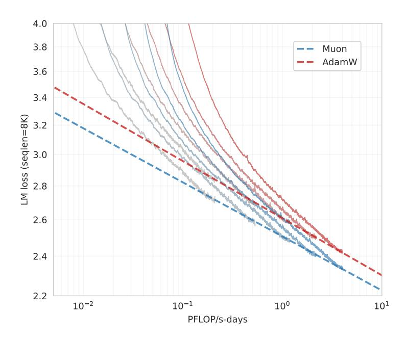

# 3.2 Scaling Law of Muon

For a fair comparison with AdamW, we performed scaling law experiments on a series of dense models in Llama (Grattafiori et al. [2024\)](#page-11-2) architecture. Building a strong baseline is of crucial importance in optimizer research. Hence, we perform a grid search for hyper-parameters of AdamW, following the compute-optimal training setup (Kaplan et al. [2020\)](#page-11-3) (the grid search experiments can be found in Appendix [B\)](#page-13-1). Details of the model architecture and hyper-parameters can be found in Table [2.](#page-6-0) For Muon, as discussed in Sec [2.2,](#page-2-5) since we matched Muon's update RMS to AdamW, we directly reused the hyper-parameters that are optimal for the AdamW baseline.

The fitted scaling law curve can be found in figure [3,](#page-6-1) and the fitted equations are detailed in table [3.](#page-6-2) As shown in Figure [1a,](#page-0-0) Muon only requires about 52% training FLOPs to match the performance of AdamW under compute-optimal setting.

# Params. w/o Embedding Head Layer Hidden Tokens Batch Size\* 399M 12 12 8.92B 9.503e-4 96 1536 545M 14 14 1792 14.04B 9.143e-4 128 822M 16 16 2048 20.76B 8.825e-4 160 1.1B 18 18 2304 28.54B 8.561e-4 192 2560 1.5B 20 20 38.91B 8.305e-4 256

Table 2: Scaling Law Models and Hyper-Parameters

\*In terms of number of examples in 8K context length.

Figure 3: Fitted scaling law curves for Muon and AdamW optimizers.

### 3.3 Pretraining with Muon

**Model Architecture** To evaluate Muon against contemporary model architectures, we pretrained from scratch using the deepseek-v3-small architecture (DeepSeek-AI et al. 2024) as it demonstrates strong performance and the original results serve as a reference for comparison. Our pretrained model has 2.24B activated and 15.29B total parameters (3B activated and 16B total when including embedding). Minor modifications to the architecture are detailed in Appendix C.

**Pretraining Data** Our pretraining data details can be found in K. Team 2025. The maximum context length during pretraining is 8K.

**Pretraining** The model is trained in several stages. We use a 1e-3 auxfree bias update rate in stage 1 and 2, and 0.0 auxfree bias update rate in stage 3. The weight decay is set to 0.1 for all stages. More details and discussions of model training can be found in the Appendix D.

1. 0 to 33B tokens: In this stage, the learning rate linearly increases to 4.2e-4 in 2k steps. The batch size is kept at 2048 examples;

Table 3: Fitted parameters of the scaling law curves

|                     | Muon                      | AdamW                     |
|---------------------|---------------------------|---------------------------|
| LM loss (seqlen=8K) | $2.506 \times C^{-0.052}$ | $2.608 \times C^{-0.054}$ |

- 2. 33B to 5.2T tokens: In this stage, the learning rate decays from 4.2e-4 to 4.2e-5 in a cosine style. We keep the batch size at 2048 until 200B tokens, and then doubled to 4096 for the remaining;
- 3. 5.2T to 5.7T tokens: In this stage (also referred as the cooldown stage), the learning rate increases to 1e-4 in in 100 steps, and then linearly decays to 0 in 500B tokens, and we keep a constant 4096 batch size. In this stage, we use the highest quality data, focusing on math, code, and reasoning.

Evaluation Benchmarks Our evaluation encompasses four primary categories of benchmarks, each designed to assess distinct capabilities of the model:

- English Language Understanding and Reasoning: MMLU(5-shot)(Hendrycks, Burns, Basart, et al. [2021\)](#page-11-15), MMLU-pro(5-shot) (Wang et al. [2024\)](#page-12-11), BBH(3-shot) (Suzgun et al. [2022\)](#page-12-12), TriviaQA(5-shot) (Joshi et al. [2017\)](#page-11-16)
- Code Generation: HumanEval(pass@1) (M. Chen et al. [2021\)](#page-11-17), MBPP(pass@1)(Austin et al. [2021\)](#page-11-18)
- Mathematical Reasoning: GSM8K(4-shot) (Cobbe et al. [2021\)](#page-11-19) MATH (Hendrycks, Burns, Kadavath, et al. [2021\)](#page-11-20), CMATH (Wei et al. [2023\)](#page-12-13)
- Chinese Language Understanding and Reasoning: C-Eval(5-shot) (Y. Huang et al. [2023\)](#page-11-21), CMMLU(5-shot)(H. Li et al. [2024\)](#page-11-22)

Performance We named our model trained with Muon "Moonlight". We compared Moonlight with different public models on a similar scale. We first evaluated Moonlight at 1.2T tokens and compared it with the following models that have the same architecture and trained with comparable number of tokens:

- Deepseek-v3-Small (DeepSeek-AI et al. [2024\)](#page-11-1) is a 2.4B/16B-parameter MoE model trained with 1.33T tokens;
- Moonlight-A follows the same training settings as Moonlight, except that it uses the AdamW optimizer.

For Moonlight and Moonlight-A, we used the intermediate 1.2T token checkpoint of the total 5.7T pretraining, where the learning rate is not decayed to minimal and the model has not gone through the cooldown stage yet.

|         | Benchmark (Metric) DSV3-Small Moonlight-A@1.2T Moonlight@1.2T |        |        |        |
|---------|------------------------------------------------------------------------|--------|--------|--------|
|         | Activated Params†                                                      | 2.24B  | 2.24B  | 2.24B  |
|         | Total Params†                                                          | 15.29B | 15.29B | 15.29B |
|         | Training Tokens                                                        | 1.33T  | 1.2T   | 1.2T   |
|         | Optimizer                                                              | AdamW  | AdamW  | Muon   |
|         | MMLU                                                                   | 53.3   | 60.2   | 60.4   |
|         | MMLU-pro                                                               | -      | 26.8   | 28.1   |
| English | BBH                                                                    | 41.4   | 45.3   | 43.2   |
|         | TriviaQA                                                               | -      | 57.4   | 58.1   |
|         | HumanEval                                                              | 26.8   | 29.3   | 37.2   |
| Code    | MBPP                                                                   | 36.8   | 49.2   | 52.9   |
|         | GSM8K                                                                  | 31.4   | 43.8   | 45.0   |
| Math    | MATH                                                                   | 10.7   | 16.1   | 19.8   |
|         | CMath                                                                  | -      | 57.8   | 60.2   |
|         | C-Eval                                                                 | -      | 57.2   | 59.9   |
| Chinese | CMMLU                                                                  | -      | 58.2   | 58.8   |

Table 4: Comparison of different models at around 1.2T tokens.

As shown in Table [4,](#page-7-0) Moonlight-A, our AdamW-trained baseline model, demonstrates strong performance compared to similar public models. Moonlight performs significantly better than Moonlight-A, proving the scaling effectiveness of Muon. We observed that Muon especially excels on Math and Code related tasks, and we encourage the research community to further investigate this phenomena. After Moonlight is fully trained to 5.7T tokens, we compared it with public models at similar scale and showed the results in Table [5:](#page-8-0)

- LLAMA3-3B from Grattafiori et al. [2024](#page-11-2) is a 3B-parameter dense model trained with 9T tokens.
- Qwen2.5-3B from Yang et al. [2024](#page-12-14) is a 3B-parameter dense model trained with 18T tokens.

† The reported parameter counts exclude the embedding parameters.

|         | Benchmark (Metric)           | Llama3.2-3B | Qwen2.5-3B | DSV2-Lite | Moonlight |
|---------|------------------------------|-------------|------------|-----------|-----------|
|         | Activated Param † | 2.81B       | 2.77B      | 2.24B     | 2.24B     |
|         | Total Params †    | 2.81B       | 2.77B      | 15.29B    | 15.29B    |
|         | Training Tokens              | 9T          | 18T        | 5.7T      | 5.7T      |
|         | Optimizer                    | AdamW       | Unknown    | AdamW     | Muon      |
|         | MMLU                         | 54.7        | 65.6       | 58.3      | 70.0      |
| Enalish | MMLU-pro                     | 25.0        | 34.6       | 25.5      | 42.4      |
| English | BBH                          | 46.8        | 56.3       | 44.1      | 65.2      |
|         | TriviaQA ‡        | 59.6        | 51.1       | 65.1      | 66.3      |
| Code    | HumanEval                    | 28.0        | 42.1       | 29.9      | 48.1      |
| Code    | MBPP                         | 48.7        | 57.1       | 43.2      | 63.8      |
|         | GSM8K                        | 34.0        | 79.1       | 41.1      | 77.4      |
| Math    | MATH                         | 8.5         | 42.6       | 17.1      | 45.3      |
|         | CMath                        | -           | 80.0       | 58.4      | 81.1      |
| CI .    | C-Eval                       | -           | 75.0       | 60.3      | 77.2      |
| Chinese | CMMLU                        | -           | 75.0       | 64.3      | 78.2      |

Table 5: Comparison of different models on various benchmarks.

• Deepseek-v2-Lite from DeepSeek-AI 2024 is a 2.4B/16B-parameter MOE model trained with 5.7T tokens.

As shown in Table 5, Moonlight outperforms models with similar architectures trained with an equivalent number of tokens. Even when compared to dense models trained on substantially larger datasets, Moonlight maintains competitive performance. Detailed comparisons can be found in Appendix E. The performance of Moonlight is further compared with other well-known language models on MMLU and GSM8k, as illustrated in Figure 1b and Appendix E Figure 8.6. Notably, Moonlight lies on the Pareto frontier of model performance versus training budget, outperforming many other models across various sizes.

#### 3.4 Dynamics of Singular Spectrum

In order to validate the intuition that Muon can optimize the weight matrices in more diverse directions, we conducted a spectral analysis of the weight matrices trained with Muon and AdamW. For a weight matrix with singular values  $\sigma = (\sigma_1, \sigma_2, \cdots, \sigma_n)$ , we calculate the SVD entropy (Alter et al. 2000; Roy et al. 2007) of this matrix as follows:

$$H(\sigma) = -\frac{1}{\log n} \sum_{i=1}^{n} \frac{\sigma_i^2}{\sum_{j=1}^{n} \sigma_j^2} \log \frac{\sigma_i^2}{\sum_{j=1}^{n} \sigma_j^2}$$

As shown in Figure 4, we visualized the average SVD entropy of the weight matrices across different training checkpoints during pretraining with 1.2T tokens. We can see that across all training checkpoints and all groups of weight matrices, the SVD entropy of Muon is higher than that of AdamW, which verifies the intuition that Muon can provide a more diverse spectrum of updates for the weight matrices. This discrepancy is more significant in the router weights for expert selection, which indicates that mixture-of-expert models can benefit more from Muon.

Moreover, we visualized the singular value distributions of each weight matrix at the checkpoint trained with 1.2T tokens as demonstrated in Appendix F. We find that, for over 90% of the weight matrices, the SVD entropy when optimized by Muon is higher than that of AdamW, providing strong empirical evidence for Muon's superior capability in exploring diverse optimization directions.

#### 3.5 Supervised Finetuning (SFT) with Muon

In this section, we present ablation studies on the Muon optimizer within the standard SFT stage of LLM training. Our findings demonstrate that the benefits introduced by Muon persist during the SFT stage. Specifically, a model that is both Muon-pretrained and Muon-finetuned outperforms others in the ablation studies. However, we also observe that when the SFT optimizer differs from the pretraining optimizer, SFT with Muon does not show a significant advantage over AdamW. This suggests that there is still considerable room for further exploration, which we leave for future work.

† The reported parameter counts exclude the embedding parameters. ‡ We tested all listed models with the full set of TriviaQA.

&lt;sup>6Performance metrics and computational requirements (FLOPs) for baseline models are sourced from (OLMo et al. 2024)

Figure 4: SVD entropy of weight matrices across different training iterations. We categorize the weight matrices into 6 different groups: 1) AttnQO denotes the weight matrices related to the query and output projection in the attention layer; 2) AttnKV denotes the weight matrices related to the key and value projection in the attention layer; 3) Experts denotes the weight matrices in expert models; 4) SharedExperts denotes the weight matrices in shared expert models; 5) Router denotes the weight matrices in the router; 6) Dense denotes the weight matrices in the first dense layer. The SVD entropy is calculated as the macro-average of the weight matrices in each group across all layers. For weights in expert models, we only calculate 3 out of 64 experts in different layers for efficiency.

### 3.5.1 Ablation Studies on the Interchangeability of Pretrain and SFT Optimizers

To further investigate Muon's potential, we finetuned Moonlight@1.2T and Moonlight-A@1.2T using both the Muon and AdamW optimizers. These models were finetuned for two epochs on the open-source tulu-3-sft-mixture dataset (Lambert et al. 2024), which contains 4k sequence length data. The learning rate followed a linear decay schedule, starting at  $5 \times 10^{-5}$  and gradually reducing to 0. The results, shown in Table 6, highlight the superior performance of Moonlight@1.2T compared to Moonlight-A@1.2T.

| Table 6: Examining the im | ipact of optimizer i | nterchangeability betwe | een pretraining and S | SFT phases. |
|---------------------------|----------------------|-------------------------|-----------------------|-------------|
|---------------------------|----------------------|-------------------------|-----------------------|-------------|

| Benchmark (Metric)    | # Shots      | Moonlight-1.2T |       |       |       |
|-----------------------|--------------|----------------|-------|-------|-------|
| Pretraining Optimizer | -            | Muon           | AdamW | Muon  | AdamW |
| SFT Optimzier         |              | Muon           | Muon  | AdamW | AdamW |
| MMLU (EM)             | 0-shot (CoT) | 55.7           | 55.3  | 50.2  | 52.0  |
| HumanEval (Pass@1)    | 0-shot       | 57.3           | 53.7  | 52.4  | 53.1  |
| MBPP (Pass@1)         | 0-shot       | 55.6           | 55.5  | 55.2  | 55.2  |
| GSM8K (EM)            | 5-shot       | 68.0           | 62.1  | 64.9  | 64.6  |

### 3.5.2 SFT with Muon on public pretrained models

We further applied Muon to the supervised fine-tuning (SFT) of a public pretrained model, specifically the Qwen2.5-7B base model (Yang et al. 2024), using the open-source tulu-3-sft-mixture dataset (Lambert et al. 2024). The dataset was packed with an 8k sequence length, and we employed a cosine decay learning rate schedule, starting at  $2 \times 10^{-5}$  and gradually decreasing to  $2 \times 10^{-6}$ . The results are presented in Table 7. For comparison, we show that the Muon-finetuned model achieves performance on par with the Adam-finetuned model. These results indicate that for optimal performance, it is more effective to apply Muon during the pretraining phase rather than during supervised fine-tuning.

Table 7: Comparison of Adam and Muon optimizers applied to the SFT of the Qwen2.5-7B pretrained model.

| Benchmark (Metric) | # Shots      | Adam-SFT | Muon-SFT |
|--------------------|--------------|----------|----------|
| Pretrained Model   | -            | Qwenz    | 2.5-7B   |
| MMLU (EM)          | 0-shot (CoT) | 71.4     | 70.8     |
| HumanEval (Pass@1) | 0-shot       | 79.3     | 77.4     |
| MBPP (Pass@1)      | 0-shot       | 71.9     | 71.6     |
| GSM8K (EM)         | 5-shot       | 89.8     | 85.8     |

