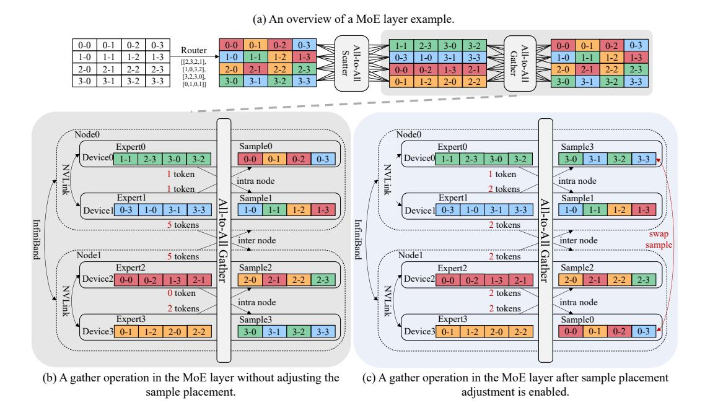

# 1 INTRODUCTION

In recent years, large language models (LLMs) have shown impressive performance in language understanding and generation [\(OpenAI,](#page-12-0) [2023;](#page-12-0) [Touvron et al., 2023;](#page-13-0) [Zhou et al., 2024;](#page-14-0) [Dubey et al., 2024;](#page-10-0) [Shao et al., 2024;](#page-13-1) [Zhang](#page-14-1) [et al., 2024a\)](#page-14-1) due to the increasing model size. However, larger models often come with greater computational costs. To address this, Mixture of Experts (MoE) models have been introduced to expand the model size greatly without increasing the computational cost. Combining MoE with Transformer-based models can yield outstanding performance across various tasks, including natural language processing [\(Lepikhin et al., 2021;](#page-11-0) [Fedus et al., 2022\)](#page-11-1),

Figure 1: An example of expert parallelism applied to an MoE model with J devices and E = 2J experts (each device has two different experts).

computer vision [\(Riquelme et al., 2021;](#page-12-1) [Liang et al., 2022\)](#page-12-2), recommendation systems [\(Tang et al.,](#page-13-2) [2020;](#page-13-2) [Zou et al., 2022\)](#page-14-2), and speech recognition [\(You et al., 2022;](#page-13-3) [Kwon & Chung, 2023\)](#page-11-2).

MoE models often replace the feed-forward network (FFN) layer with the MoE layer, which consists of a gating network and several small FFNs, representing different experts. In the MoE layer, each token is routed by the gating network to only a few selected experts, and the final output is

Figure 2: An example of sample exchange. The figure illustrates the All-to-All gather operation in a MoE layer with two nodes, each containing two devices, and each device having one expert. Different colors represent tokens sent to different experts, and i-j denotes the j-th token in the i-th sample. Fig. 2(a) illustrates the complete process of a MoE layer during forward propagation. Fig. 2(b) shows the All-to-All gather operation in the MoE layer without adjusting the sample placement, where the inter-node communication volume of each node is 5 tokens. Fig. 2(c) displays the All-to-All gather operation after sample placement adjustment is enabled — the positions of samples on the devices change (samples 0 and 3 are exchanged), reducing the inter-node communication volume to 2 tokens per node.

obtained by a weighted sum of the computations from the selected experts. By such means, we can increase the number of experts to expand the model size for better performance, while keeping the computation complexity constant.

Despite the above benefit, given the potentially large number of experts, the memory capacity of a single device is often insufficient. As a result, expert parallelism (Lepikhin et al., 2021; Fedus et al., 2022) is a common technique to facilitate the distributed training of MoE models. As shown in Fig. 1, each device holds only a subset of the experts to reduce memory consumption. Meanwhile, other model parameters are replicated and stored on all devices, and the training data assigned to each device are different. In each MoE layer, based on the routing result of the gating network, each token is sent to the device where the selected expert is located. The output from the expert is then sent back to the original device of the corresponding token. This involves two communication operations, namely the All-to-All scatter and All-to-All gather (He et al., 2021), respectively.

Due to the dynamic nature of routing, training MoE models efficiently faces several challenges, with the All-to-All communication, being the most significant one. Particularly, the All-to-All communication time can account for up to 80% of the total training time (Hwang et al., 2023; Liu et al., 2023; He et al., 2022; Li et al., 2023; Yu et al., 2024). One reason is because all tokens need to participate in the All-to-All operation, leading to a high communication volume. Another reason is the communication frequency. Considering both the forward and backward propagation, each MoE layer requires four All-to-All communications per training iteration. Such frequent and extensive communication incurs significant time costs. Therefore, accelerating All-to-All communication is essential to improve training efficiency.

**Motivation:** Recent studies have demonstrated that expert routing exhibits a certain degree of <u>data locality</u>. To be specific, input tokens may have distinct preferences for experts, and the corresponding distribution is often skewed (He et al., 2022; Nie et al., 2023; Xue et al., 2024; Jiang et al., 2024). In other words, the All-to-All operation in MoE models can be highly unbalanced across different devices, thus bounded by the device pair with the highest communication volume. Mean-

while, it is well known that *network locality* is an inherent characteristic of modern clusters for deep learning training. In particular, there are various communication channels in modern clusters, e.g. intra-node devices usually communicate via PCIe or NVLINK, while inter-node devices use Ethernet or InfiniBand, with intra-node communication usually faster than inter-node ones. To achieve load balancing, existing methods propose techniques from the model perspective [\(Nie et al., 2023;](#page-12-5) [Lewis et al., 2021\)](#page-11-7). Typically, they either dynamically adjust the model placement but introduce a lot of additional communication, or modify the model definition but sacrifice the model performance (see [§2.2](#page-3-0) for more discussion). Yet optimization from the data perspective is under explored. Inspired by this, we propose NetMoE, which accelerates the All-to-All communication by combining the data locality in expert routing with the network locality among training devices. The essential idea of NetMoE is to dynamically adjust the placement of data samples during training based on expert routing results so that more tokens will be transmitted through high-speed channels rather than low-speed ones. As illustrated in Fig. [2,](#page-1-0) sample0 shows a preference for expert2 that resides on node1, while sample3 favors expert0 that resides on node0. Using the vanilla All-to-All communication method would result in significant inter-node communication overhead, as shown in Fig. [2\(](#page-1-0)b). However, by swapping the positions of sample0 and sample3 as depicted in Fig. [2\(](#page-1-0)c), part of the inter-node communication can be converted into intra-node communication or even intradevice memory copying, significantly reducing the time cost (detailed in [§3.1\)](#page-4-0). In this way, we can accelerate the All-to-All communication without affecting the computing results.

However, it is non-trivial to achieve dynamic sample placement. For one thing, how to adjust the placement to maximize efficiency is a complex and unexplored question. For another, since the adjustment should be done for every layer in every iteration, it is vital to devise an efficient algorithm to deduce the placement on the fly. To address these problems, we first revisit the cost modeling for All-to-All communication and formulate the dynamic sample placement problem into a combinatorial optimization problem. Subsequently, we split it into two stages to ease the solving and design a corresponding polynomial-time algorithm to ensure a timely solution.

In short, the technical contributions of this work are summarized as follows:

- We propose NetMoE, the first effort that leverages both the data locality and network locality to accelerate the All-to-All communication through dynamic sample placement.
- We formulate the dynamic sample placement problem as a combinatorial optimization problem, which aims to find the best sample placement that maximizes efficiency given the expert routing.
- We dissect the problem into two stages and develop a polynomial-time solution to efficiently derive the sample placement during training.
- We conduct experiments with various models on 32 NVIDIA A800 GPUs. Results show that NetMoE outperforms current MoE training systems by up to 1.67× in terms of training efficiency.

