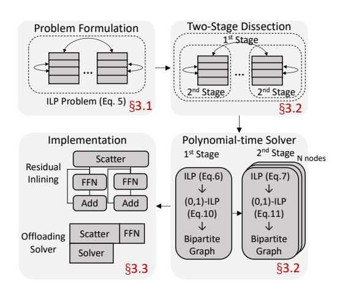
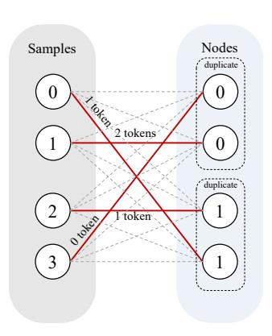

# 2.1 PARALLELISM IN DISTRIBUTED TRAINING

Data and Model Parallelism: In data parallelism [\(Li et al., 2020;](#page-12-6) [Sergeev & Balso, 2018;](#page-13-6) [Wang](#page-13-7) [et al., 2023;](#page-13-7) [Zhang et al., 2024b\)](#page-14-3), each device maintains a complete copy of the model parameters, while different training samples are assigned to each device. After the backward computation is completed, the model gradients from all devices are aggregated before updating the model parameters. In model parallelism [\(Narayanan et al., 2021b;](#page-12-7) [Huang et al., 2019;](#page-11-8) [Narayanan et al., 2021a;](#page-12-8) [Guan et al., 2024\)](#page-11-9), model parameters are distributed across multiple devices, with each device responsible for only a portion of the model. Communication operations are necessary to transmit the intermediate results (a.k.a. forward activations and their backward gradients) to accomplish the forward and backward propagation.

Expert Parallelism: As shown in Fig. [1,](#page-0-0) expert parallelism [\(Lepikhin et al., 2021;](#page-11-0) [Fedus et al.,](#page-11-1) [2022\)](#page-11-1) can be regarded as combining model parallelism and data parallelism. It distributes expert parameters across different devices like model parallelism, while replicating other parameters on all devices like data parallelism. In each MoE layer, each token will be routed by the gating network to top K different experts for processing, where K is a hyperparameter, typically a small value, such as 1 or 2, which helps to reduce the computational complexity. After the MoE layer obtains the gating routes, tokens are sent to the devices where the corresponding experts are located based on the routing. The results from the expert computations are then sent back to the original devices where the tokens are located. Since the experts are distributed across different devices, communication during this process involves all devices sending and receiving messages with one another, leading to what is known as All-to-All communication.

### 2.2 DISTRIBUTED TRAINING ACCELERATION TECHNIQUES FOR MOE MODELS

**Dynamic Expert Placement:** The efficiency of MoE models is constrained by the extensive and frequent All-to-All communication required during training. In response to this issue, some studies have observed that data tends to show a preference for certain experts during training. Then, based on this observation, they further propose to dynamically adjust the placement of experts to reduce communication volume (He et al., 2022; Nie et al., 2023; Zhai et al., 2023). For instance, popular experts can be placed on more devices in the data parallel manner, so that the communication volume related to them would decrease. However, due to the growing size of experts, these approaches incur substantial overhead of transmitting expert parameters among the devices, so they cannot adjust the expert placement for every iteration, leading to sub-optimality. In contrast, our work tries to reduce the communication volume from a different perspective: we dynamically adjust the placement of samples in every iteration to accelerate the All-to-All communication. To be specific, we formulate an optimization problem to deduce the best sample placement that minimizes the time cost of All-to-All communication. As we will evaluate in §4, our work outperforms existing works based on dynamic expert placement when training MoE models.

Modification in Model Definition: To achieve better workload balance in MoE training, there are many existing works developed to modify the model definition (e.g., routing mechanisms, model architectures). Some approaches modify the routing mechanism to balance the load across experts, which helps reduce synchronization time between devices (Lewis et al., 2021). Recognizing the network locality in distributed training, several works introduce a routing topology loss to prioritize routing tokens within the same node, thereby reducing inter-node communication (Li et al., 2024; Chen et al., 2022). Other approaches (Zeng & Xiong, 2023) map tokens to smaller hidden layer dimension before inter-node communication, further decreasing the communication load. SC-MoE (Cai et al., 2024) proposes feeding the output of the current attention layer directly into the next MoE layer, enabling parallel forward propagation with the current MLP layer in order to fully overlap All-to-All communication with computation. Although these methods improve training efficiency, they inevitably impact model convergence.

When applying these methods, we usually need to run numerous trials to tune the hyperparameters, such as adjusting the weight of the topology-aware routing loss (Chen et al., 2022) or tuning the hyper-parameters for different communication channels (Zeng & Xiong, 2023). Given that each trial of LLM training can take days or even months, their utility is inevitably hampered. In contrast, our work focuses on how to accelerate All-to-All communication without affecting model convergence.

#### 3 NETMOE

In this section, we introduce NetMoE, a novel framework designed to optimize distributed

Figure 3: The overview of the method of NetMoE.

training for MoE models by considering both data and network locality. Given a target MoE model and the hardware environment, NetMoE aims to minimize the All-to-All communication cost. Its core innovation lies in optimizing the placement of samples within each MoE layer to maximize the utilization of faster intra-node bandwidth, thereby reducing the communication volume over slower inter-node connections. Specifically, NetMoE swaps the samples across devices during each MoE layer, enabling more tokens to communicate within the node during All-to-All communication.

Table 1: Notations used throughout this work. We assume I is divisible by J, and J is divisible by N, which are common in distributed training.

| The number of samples per iteration (a.k.a. global batch size). |
|-----------------------------------------------------------------|
|                                                                 |
|                                                                 |
|                                                                 |
|                                                                 |

JnK The set of natural numbers less than n, i.e., {0, 1, · · · , n − 1}.

Table 2: Bandwidth of each channel of the NVIDIA A800 GPU cluster used in our experiments.

| Channel      | Bandwidth |
|--------------|-----------|
| Intra-device | ∼2TB/s    |
| Intra-node   | 400GB/s   |
| Inter-node   | 100GB/s   |

Fig. [3](#page-3-1) illustrates the overview of this section. We begin by introducing the modeling of All-to-All communication in MoE training and formulate our optimization problem in [§3.1.](#page-4-0) We then illustrate how to solve the problem in [§3.2,](#page-5-0) with the detailed algorithm shown in Alg. [1.](#page-7-0) We also present our implementation details in [§3.3.](#page-7-1) For clarity, the frequently used notations are listed in Table [1.](#page-4-1)

#### 3.1 PROBLEM FORMULATION

Communication Modeling: We first discuss the mathematical modeling of All-to-All communication, which is the optimization target of NetMoE. We use the α-β model [\(Sarvotham et al., 2001\)](#page-13-8) to analyze All-to-All communication, where α represents the latency cost and β represents the bandwidth cost. Specifically, we classify communication into three categories: intra-device, intra-node, and inter-node communication, each using different channels. Table [2](#page-4-1) lists the bandwidth of each channel used in our experiments. Since intra-device communication is typically achieved via memory copying, it is significantly faster than the other two categories and thus not considered in our modeling. Therefore, the communication time is determined by the maximum time required for data transfer across the intra-node and inter-node channels. The bandwidths of these channels are represented by vintra, and vinter, respectively. Thus, for each All-to-All communication, its time cost can be expressed by the following formula, where s· represents the communication volume for the corresponding channel.

$$t = \max(t_{intra}, t_{inter}), \quad \text{where} \quad t_{intra} = \alpha_{intra} + \beta_{intra} s_{intra}, \beta_{intra} = 1/v_{intra},$$

$$t_{inter} = \alpha_{inter} + \beta_{inter} s_{inter}, \beta_{inter} = 1/v_{inter}$$
(1)

The bandwidth (v·) and latency (α·) can be obtained by profiling the hardware environment before training, while the communication volume (s·) needs to be dynamically determined based on the routing results within the MoE layer. We then analyze how to calculate the communication volume.

Let route ∈ N I×L×K be the token routing results of the gating network, which represents the K experts that each token will be sent to. Then, the number of tokens that the i-th sample needs to send to the e-th expert can be counted as

$$num_{i,e} = \sum_{l,k} \mathbb{I}[route_{i,l,k} = e] \text{ for } i \in \llbracket I \rrbracket, e \in \llbracket E \rrbracket$$
 (2)

Next, num ∈ N I×E can be used to model the communication volume across different channels. Let ExpDev(e) be the device index of the e-th expert, SmpDev(i) the device index where the i-th sample should be routed to, and Node(j) the node index of the j-th device. By considering the communication volume as the number of tokens that need to be transmitted, we have

$$s_{intra} = \sum_{(i,e)\in S_{intra}} num_{i,e}, \quad s_{inter} = \sum_{(i,e)\in S_{inter}} num_{i,e}$$
(3)

where Sintra and Sinter can be calculated via the device indices of experts and samples:

$$S_{intra} = \{(i, e) | \text{Node}(\text{SmpDev}(i)) = \text{Node}(\text{ExpDev}(e)) \land \text{SmpDev}(i) \neq \text{ExpDev}(e) \}$$

$$S_{inter} = \{(i, e) | \text{Node}(\text{SmpDev}(i)) \neq \text{Node}(\text{ExpDev}(e)) \}$$

$$(4)$$

Rationality of Dynamic Sample Placement: Given the aforementioned modeling, there is no doubt that the time cost of All-to-All communication is highly related to the placement of experts and samples. In practice, dynamically adjusting the placement does not affect the training results as the All-to-All communication is still correctly performed. Combining with the common fact of network locality that  $v_{intra} > v_{inter}$ , we can adjust the placement of samples and/or experts to reduce the inter-node communication volume, even if the intra-node communication volume becomes slightly higher. In fact, with a similar goal, several existing works have proposed to dynamically adjust the placement of experts based on their popularities (He et al., 2022; Nie et al., 2023; Zhai et al., 2023), as introduced in §2. However, all these works overlook the data locality — tokens of the same sample are usually routed to the same expert (Xue et al., 2024; Jiang et al., 2024), thereby missing the optimization opportunity of dynamic sample placement. More importantly, the size of the parameters of experts is usually much larger than the size of the samples. This prevents previous works from adjusting the expert placement in every iteration. In contrast, the adjustment of sample placement can be fused with the All-to-All communication by nature (detailed below), requiring zero extra communication. Consequently, this work focuses on the unexplored aspect, aiming to accelerate MoE training by dynamically adjusting the sample placement.  $^{1}$ 

To help readers better understand the strength of dynamic sample placement, we take Fig. 2 as an example, where I=4, L=4, E=4, K=1, and both the experts and samples are placed sequentially, i.e., ExpDev = [0,1,2,3], SmpDev = [0,1,2,3]. Fig. 2(b) shows the communication without changing the placement of samples. According to Eq. 3 and Eq. 4, if we only consider the sending volume of node 0, then  $S_{inter} = \{(0,2),(0,3),(1,2),(1,3)\}$ , indicating that  $s_{inter} = 5$ . However, after optimizing the placement of samples as in Fig. 2(c), i.e., SmpDev = [3,1,2,0], the corresponding inter-node communication volume changes into  $S_{inter} = \{(3,2),(3,3),(1,2),(1,3)\}$ , which gives  $s_{inter} = 2$ . Furthermore, it is worth noting that the sample placement adjustment can be combined with the All-to-All gather operation. To be specific, instead of restoring tokens to their original positions, they are directly placed in their new positions according to the altered sample placement. This method directly optimizes the current communication operation without introducing any extra communication.

**Problem Formulation:** After the sample placement adjustment is determined, it can be seen that altering SmpDev affects two All-to-All operations: the gather operation of the current MoE layer and the scatter operation of the next MoE layer. Thus, our optimization targets these two operations. For the *l*-th layer, the optimization problem can be written as follows.

$$\underset{\text{SmpDev}(i) \in \llbracket J \rrbracket}{\arg \min} t^{(l,gather)} + t^{(l+1,scatter)}$$

$$= \max \left( t_{intra}^{(l,gather)}, t_{inter}^{(l,gather)} \right) + \max \left( t_{intra}^{(l+1,scatter)}, t_{inter}^{(l+1,scatter)} \right)$$

$$\text{s.t.} \quad \sum_{i \in \llbracket I \rrbracket} \mathbb{I}[\text{SmpDev}(i) = j] = I/J \text{ for } j \in \llbracket J \rrbracket$$

$$(5)$$

Since a single change in sample placement affects two All-to-All operations, both communication times are included in the optimization objective. Additionally, to ensure computational and memory balance across devices, each device should retain the same number of samples before and after the sample placement adjustment. This forms the basis for the constraints in our optimization.

#### 3.2 PROBLEM SOLVING

Eq. 5 is a complex combinatorial optimization problem, which cannot be solved optimally in polynomial time. As the cluster size increases, even finding an approximate solution may take a significant amount of time. Since this problem needs to be solved before each gather operation, solving it directly would result in unbearable additional time costs. To address this, we design an efficient method to obtain approximate solutions. In particular, we first dissect the optimization problem into two stages and develop a polynomial-time algorithm to achieve the solution, as introduced below.

**Two-Stage Dissection:** Although Eq. 1 takes the maximum value of the two kinds of communication cost, in practice, due to the significant bandwidth difference between the inter- and intra-node

&lt;sup>1Our work is fully compatible with the dynamic expert placement technique. Specifically, in the problem formulation and solving of NetMoE, we do not make any assumption on the expert placement. Instead, it is treated as an input. Thus, we can dynamically adjust the expert placement like previous works, and NetMoE can still deduce the optimal sample placement. We would like to leave the combination as our future work.

- (a) Sample placement after the first stage.
- (b) Sample placement after the second stage.

Figure 4: An example of the second stage optimization. Fig. 4(a) shows the MoE layer in  $Node_1$  after the first stage optimization in Fig. 2(c). By applying the second stage optimization within the node, the intra-node communication can be reduced by 1 token (by swapping  $sample_0$  and  $sample_2$ ), as shown in Fig. 4(b).

connections, the most time-consuming term is usually the inter-node one. Therefore, we propose a two-stage solving strategy: the first stage optimizes  $t_{inter}$  at the global scale, while the second stage minimizes  $t_{intra}$  within each node, without affecting  $t_{inter}$ . Formally, suppose there are N nodes and each node consists of J/N devices, then the optimization formula of the first stage can be written as the following integer linear programming (ILP) problem:

$$\underset{\text{Node}(\text{SmpDev}(i)) \in [\![N]\!]}{\text{arg min}} t_{inter}^{(l,gather)} + t_{inter}^{(l+1,scatter)}$$

$$\text{s.t.} \quad \sum_{i \in [\![I]\!]} \mathbb{I}[\text{Node}(\text{SmpDev}(i)) = n] = I/N \text{ for } n \in [\![N]\!]$$

$$(6)$$

The constraint of balance across devices in Eq. 5 is turned into the balance across nodes since we focus on inter-node communication in the first stage. After obtaining the optimal solution of the first stage, the second stage considers rearranging the samples within each node individually. For the n-th node, denote  $[I]_n^* \subseteq [I]$  as the set of samples appointed to it after solving Eq. 6. And let  $[J]_n = \{j | j \in [I] \land \text{Node}(j) = n\}$  be the set of experts reside on it  $([I]_n]_n$  is determined by the device placement rather than obtained by Eq. 6). Then, to optimize for the n-th node, we should solve the following ILP problem:

$$\underset{\text{SmpDev}(i) \in \llbracket I \rrbracket_n^*}{\arg \min} t_{intra}^{(l,gather)} + t_{intra}^{(l+1,scatter)} \quad \text{s.t. } \sum_{i \in \llbracket I \rrbracket_n^*} \mathbb{I}[\text{SmpDev}(i) = j] = I/J \text{ for } j \in \llbracket J \rrbracket_n \quad (7)$$

Specifically, Fig. 2 can be regarded as the optimization of the first stage, while Fig. 4 demonstrates the second stage of optimization built upon it. Although the second stage consists of N ILP problems, each for one node, they are independent and can be solved concurrently.

**Polynomial-time Solver:** By dissecting the original combinatorial optimization problem, we obtain N+1 ILP problems, which can be solved via existing libraries like PuLP (Mitchell et al., 2011). However, recall that we need to solve these problems for each layer in each training iteration, the efficiency of problem-solving is vital. Unfortunately, since ILP problems are NP-hard, when we try to solve them via PuLP, the time cost of solving exceeds the time cost of scatter communication and experts' computation (as evaluated in §4.4), making it impractical. Given the fact that each sample must be assigned to one device, we reconsider the ILP problems as assignment problems by transforming them into weighted bipartite matching problems, and subsequently develop a polynomial-time solver based on the widely used Kuhn-Munkres (KM) algorithm.

We first introduce how to transform the ILP problems into weighted bipartite matching problems. Let  $c_{i,n}$  and  $c'_{i,j}$  represent the inter- and intra-node communication volume when placing the *i*-th sample on the *j*-th device in the *n*-th node, They can be calculated using the following formulas:

$$c_{i,n} = \sum_{e \in S} num_{i,e}, \quad c'_{i,j} = \sum_{e \in S'} num_{i,e}, \quad \text{where}$$

$$S = \{e | \text{Node}(\text{ExpDev}(e)) \neq n\}, S' = \{e | \text{Node}(\text{ExpDev}(e)) = \text{Node}(j) \land \text{ExpDev}(e) \neq j\}.$$
(8)

To make the expression clearer, let  $p_{i,n}, p'_{i,j} \in \{0,1\}$  indicate whether the i-th sample is placed on the n-th node and the j-th device, respectively. Then, the optimization objective can be expressed as

$$t_{inter} = \alpha_{inter} + \beta_{inter} \sum_{i \in \llbracket I \rrbracket, n \in \llbracket N \rrbracket} c_{i,n} p_{i,n}, \quad t_{intra} = \alpha_{intra} + \beta_{intra} \sum_{i \in \llbracket I \rrbracket, j \in \llbracket J \rrbracket} c'_{i,j} p'_{i,j}, \quad \text{where}$$

$$p_{i,n} = \mathbb{I}[\operatorname{Node}(\operatorname{SmpDev}(i)) = n], \quad p'_{i,j} = \mathbb{I}[\operatorname{SmpDev}(i) = j] \quad \text{for } i \in \llbracket I \rrbracket, n \in \llbracket N \rrbracket, j \in \llbracket J \rrbracket$$

#### Algorithm 1 NetMoE Optimization

- 1: **function** Solve(num)
- 2: Get c, c' via Eq. 8 and build bipartite graphs
- 3: Get the optimal solution  $p^*$  via the Kuhn-Munkres (KM) algorithm
- 4: **return** the optimal sample placement according to  $p^*$
- 5: The Main Training Process:
- 6: for submodule in model do
- 7: **if** submodule **is** a MoE layer **then**
- 8: Get *route* from the gating network and calculate *num* via Eq. 2
- 9: Invoke Solve(num) in a background thread
- ▷ Offloading solving process

- 10: Get *input* from All-to-All scatter
- 11: Get *output* from expert computation
- 2: output = input + output

- Expert residual inlining
- 13: Get the optimal sample placement from the background thread
- 14: Perform All-to-All gather with the optimal sample placement
- 15: **else**
- 16: submodule.forward()

After modifying the corresponding constraints, we transform the ILP problems into (0,1)-ILP problems. For instance, below presents the transformed problem for the first stage2 (i.e., Eq. 6):

$$\underset{p_{i,n} \text{ for } i \in \llbracket I \rrbracket, n \in \llbracket N \rrbracket}{\operatorname{arg \, min}} \quad \alpha_{inter} + \beta_{inter} \sum_{i \in \llbracket I \rrbracket, n \in \llbracket N \rrbracket} \left( c_{i,n}^{(l,gather)} + c_{i,n}^{(l+1,scatter)} \right) p_{i,n}$$
s.t. 
$$\sum_{i \in \llbracket I \rrbracket, n \in \llbracket N \rrbracket} p_{i,n} = I/N \text{ for } n \in \llbracket N \rrbracket, \quad \sum_{n \in \llbracket N \rrbracket} p_{i,n} = 1 \text{ for } i \in \llbracket I \rrbracket$$
(10)

This (0,1)-ILP problem can be modeled as a weighted bipartite matching problem. In particular, consider a bipartite graph with two sets of graph nodes, P and Q. The set P represents all training samples, and |P|=I. The set Q represents all training nodes (machines), where each training node can handle B:=I/N training samples. To model this, each graph node in Q is duplicated B times, resulting in |Q|=I. A weighted edge exists between every pair of graph nodes from P and Q. Let  $P_i$  represent the i-th training sample and  $Q_n$  the  $\lfloor n/B \rfloor$ -th training node. The weight of the edge between  $P_i$  and  $Q_n$  is denoted as  $W_{i,n}=c_{i,\lfloor n/B\rfloor}^{(l,gather)}+c_{i,\lfloor n/B\rfloor}^{(l+1,scatter)}$ . This transformation reduces the problem of finding a minimum weight perfect matching in this bipartite graph, which can be efficiently solved to optimality in polynomial time using the Kuhn-Munkres (KM) algorithm. Fig. 5 illustrates an example of constructing a bipartite graph during the first stage in Fig. 2. The graph nodes on the left represent set P, and the graph nodes on the right

Figure 5: An example of a bipartite graph.

represent set Q. Each pair of graph nodes is connected by a weighted edge, depicted by a dotted line. The red edges indicate the final matching scheme, where the total weight of all matched edges is minimized.

#### 3.3 Implementation

NetMoE is implemented on top of PyTorch (Paszke et al., 2019), with custom operations (e.g., the calculation of num, c, c', and the KM algorithm) implemented in C++ and CUDA. The complete workflow of NetMoE is presented in Alg. 1. In addition to the problem-solving introduced in §3.2, NetMoE has been optimized in the following ways.

**Expert Residual Inlining:** In classic MoE models, residual connections are independent of the MoE layers. However, in NetMoE, the position of the training data changes after the All-to-All

&lt;sup>2The problems of the second stage (Eq. 7) can also be transformed into (0,1)-ILP problems and solved in polynomial time similarly. We omit them here due to the space constraint and only discuss the first stage.

Table 3: Configurations of the evaluated models.

| Model Name  | Base  | I J | S    | H    | E J | K |
|-------------|-------|--------|------|------|--------|---|
| MoE-GPT-S   | GPT-2 | 4      | 1024 | 768  | 2      | 2 |
| MoE-GPT-M   | GPT-2 | 4      | 1024 | 1024 | 2      | 2 |
| MoE-GPT-L   | GPT-2 | 4      | 1024 | 1280 | 2      | 2 |
| MoE-GPT-XL  | GPT-2 | 4      | 1024 | 1600 | 2      | 2 |
| MoE-GPT-XXL | GPT-3 | 4      | 1024 | 4096 | 2      | 2 |

Table 4: Time cost of different solvers vs. the summed time cost of All-to-All scatter and expert computation in milliseconds (MoE-GPT-S, J = 16).

| I J | KM    | PuLP  | Scatter + Computation |
|--------|-------|-------|-----------------------|
| 2      | 0.08  | 42.8  | 3.69 (2.63 + 1.06)    |
| 4      | 0.48  | 50.1  | 7.13 (5.34 + 1.79)    |
| 8      | 1.48  | 72.9  | 13.50 (10.31 + 3.19)  |
| 16     | 10.82 | 143.7 | 27.31 (21.49 + 5.82)  |
| 24     | 31.09 | 266.5 | 41.65 (33.82 + 7.83)  |

gather operation, while the samples in the residual connections remain in their original positions. To ensure the correctness of the model, we inline the residual connections into the expert computation, as shown in line 12 of Alg. [1.](#page-7-0) This optimization ensures consistency in model accuracy before and after applying the algorithm. More details about inlining is elaborated in Appendix [A.1.](#page-15-0)

Offloading Solving Process: The KM algorithm is hard to parallelize, making it unsuitable for highly parallelized accelerators like GPUs, so we perform the solving process on the CPU. As shown in line 9 of Alg. [1,](#page-7-0) after obtaining the routing results for the current layer, each device calculates and transfers num to the CPU memory. The routing results for the next layer, required by the optimization algorithm, can be predicted by directly passing the current layer's input to the router of the next layer [\(Eliseev & Mazur, 2023;](#page-11-10) [Tang et al., 2024\)](#page-13-9). The solving process only needs to provide the new sample positions before the All-to-All gather operation. In this way, the solving process can be overlapped with the All-to-All scatter and expert computation. As we will show in [§4.4,](#page-9-0) the solving time is fully hidden and thus introduces zero overhead. More discussion of algorithm selection and overlap potential is described in Appendix [A.2.](#page-15-1)

