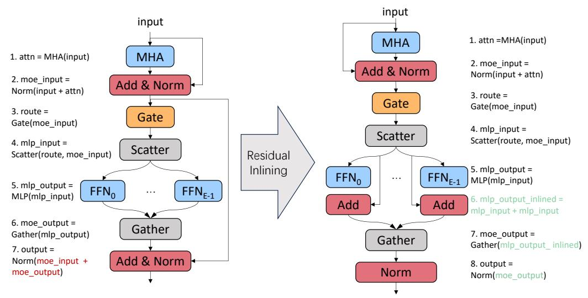

# A MORE DETAILS OF IMPLEMENTATION

#### A.1 DETAIL OF EXPERT RESIDUAL INLINING

As shown in Fig. [8,](#page-15-2) the original residual addition method adds the attention output to the result obtained from the gather operation. In NetMoE, however, it is added after the scatter operation but before the gather operation. Such an inlining facilitates the adjustment of sample placement, and meanwhile ensures the correctness of computation.

Figure 8: Illustration of the Transformer layer with and without the expert residual inlining.

#### A.2 DISCUSSION OF ALGORITHM SELECTION AND OVERLAP POTENTIAL

Our design adopts the KM algorithm based on two practical factors: (1) Although the time complexity of the KM algorithm is O(I 3 ), the current training process commonly employs gradient accumulation [\(Tensorflow, 2019;](#page-13-10) [Pytorch, 2019\)](#page-12-13) due to the limited GPU memory. Thus, the value of I is typically confined to an acceptable size, ensuring that the solving time can be effectively overlapped; (2) The algorithm's runtime is fully overlapped with communication phases, rendering further acceleration unnecessary for hiding the overhead of solver. While faster approximate solvers exist [\(Orlin & Ahuja, 1992;](#page-12-14) [Duan & Pettie, 2014\)](#page-10-4), their benefits would be marginal in current training configurations where computation-communication overlap already masks the optimization time.

