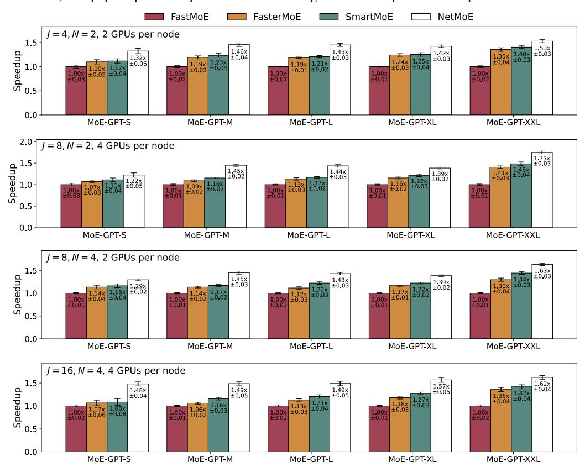

# B END TO END PERFORMANCE WITH FEWER GPUS PER NODE

Fig. [9](#page-16-1) illustrates the end-to-end speedup for configurations with 2 GPUs or 4 GPUs per node. The results demonstrate that NetMoE achieves the best performance across various experimental settings, which are consistent with the results obtained when there are 8 GPUs per node (as demonstrated in Fig. [6\)](#page-9-1).

It is worth noting that standard server configurations typically accommodate up to 8 NVIDIA GPUs per node. Thus, 8 GPUs per node represent a standard setup for distributed training of large language models [Dubey et al.](#page-10-0) [\(2024\)](#page-10-0); [Adler et al.](#page-10-5) [\(2024\)](#page-10-5); [Dai et al.](#page-10-6) [\(2024\)](#page-10-6); [Scao et al.](#page-13-11) [\(2022\)](#page-13-11). Although superpods like the NVIDIA GB200 NVL72 support high-speed connections (e.g., NVLink) among more than 8 GPUs, they rely on custom hardware and are prohibitively expensive. Training scenarios on superpods are rare and significantly differ from the typical scenarios in GPU clusters or clouds. Therefore, this paper opts for experiments with configurations of up to 8 GPUs per node.

Figure 9: End-to-end speedup (mean and standard deviation) of different numbers of total devices (denoted as J) and numbers of nodes (denoted as N).

#### C DETAILED ANALYSIS OF ALL-TO-ALL COMMUNICATION OPTIMIZATION

To gain deeper insight into the source of NetMoE's optimization, we assess two kinds of statistics:

- The proportions of training samples that are exchanged across nodes or across devices by NetMoE, respectively. A higher proportion indicates more samples are adjusted across nodes/devices.
- The intra-node and inter-node communication volumes before and after applying NetMoE.

Firstly, Table 5 summarizes the mean and standard deviation across all iterations. After applying NetMoE, a great proportion of training samples are exchanged across nodes, leading to the reduction in the inter-node communication volume. It is noteworthy that although the intra-node communication volume accounts for a large proportion (i.e.,  $s_{intra}$  or  $\frac{s_{intra}}{s_{intra}+s_{inter}}$  increases) after applying NetMoE, it will not become the performance bottleneck since the inter-node communication bandwidth is much lower. As a result, the All-to-All communication can be accelerated due to the reduction in inter-node communication volume brought by sample placement adjustment.

Secondly, since the routing result dynamically changes during the training of MoE models, to discover the impact of routing distribution, in Fig. 10 we plot (1) the reduction in inter-node communication, and (2) the proportion of samples exchanged across nodes, across different iterations. Meanwhile, we follow prior works He et al. (2022); Nie et al. (2023) to record the distribution of expert selection across different iterations in order to describe the routing distribution. It can be observed that the routing distribution changes during the model training process. However, NetMoE consistently reduces the inter-node communication by adjusting the sample placement given the dynamic distributions. Consequently, the effectiveness of NetMoE is robust to the routing distribution. Table 5: Summary of communication volume and proportion of sequence adjustment. For communication volume, we provide the intra-node and inter-node communication volumes before and after applying NetMoE, with the increase or reduction given in parentheses. For the proportion of sequence adjustment, "Across Nodes" indicates the proportion of sequences that are exchanged across nodes, and "All" indicates the proportion of all sequences that are adjusted.

(a) 2 nodes, 16 GPUs

|             | Communication Volume (MB) |                      |                                        |                                         | Proportion of Sequence Adjustment ( |                    |
|-------------|---------------------------|----------------------|----------------------------------------|-----------------------------------------|-------------------------------------|--------------------|
|             | w/o NetMoE                |                      | w/ NetMoE                              |                                         | Across Nodes                        | All                |
|             | $s_{\rm intra}$           | $s_{\mathrm{inter}}$ | $s_{\rm intra}$                        | $s_{\rm inter}$                         |                                     |                    |
| MoE-GPT-S   | $168.45 \pm 5.43$         | $191.07 \pm 5.43$    | $162.24 \pm 11.69 (\downarrow 3.69\%)$ | $116.37 \pm 11.69 (\downarrow 39.10\%)$ | $43.663 \pm 3.560$                  | $91.394 \pm 1.319$ |
| MoE-GPT-M   | $222.89 \pm 5.72$         | $258.20 \pm 5.72$    | $214.31 \pm 7.42 (\downarrow 3.85\%)$  | $147.33 \pm 7.42 (\downarrow 42.94\%)$  | $44.455 \pm 2.122$                  | $91.929 \pm 1.163$ |
| MoE-GPT-L   | $281.81 \pm 5.18$         | $318.56 \pm 5.18$    | $236.53 \pm 8.81 (\downarrow 16.07\%)$ | $208.69 \pm 8.81 (\downarrow 34.49\%)$  | $42.801 \pm 2.232$                  | $91.799 \pm 1.080$ |
| MoE-GPT-XL  | $347.44 \pm 5.68$         | $402.06 \pm 5.68$    | $313.00 \pm 8.30 (\downarrow 9.91\%)$  | $256.94 \pm 8.30 (\downarrow 36.10\%)$  | $43.619 \pm 2.267$                  | $91.681 \pm 1.369$ |
| MoE-GPT-XXL | $922.40 \pm 4.16$         | $989.60 \pm 4.16$    | $872.00 \pm 8.29 (\downarrow 5.46\%)$  | $570.40 \pm 8.29 (\downarrow 42.36\%)$  | $45.688 \pm 3.006$                  | $92.469 \pm 1.294$ |

(b) 4 nodes, 32 GPUs

|                                     | Communication Volume (MB)                                   |                                                                     |                                                                                                                         |                                                                                                                               | Proportion of Sequ                                                  | ence Adjustment (%)                                            |
|-------------------------------------|-------------------------------------------------------------|---------------------------------------------------------------------|-------------------------------------------------------------------------------------------------------------------------|-------------------------------------------------------------------------------------------------------------------------------|---------------------------------------------------------------------|----------------------------------------------------------------|
|                                     | w/o NetMoE                                                  |                                                                     | w/ NetMoE                                                                                                               |                                                                                                                               | Across Nodes                                                        | All                                                            |
|                                     | $s_{\rm intra}$                                             | $s_{\rm inter}$                                                     | $s_{\rm intra}$                                                                                                         | $s_{\rm inter}$                                                                                                               |                                                                     |                                                                |
| MoE-GPT-S MoE-GPT-M MoE-GPT-L | $167.07 \pm 7.52$ $224.24 \pm 6.82$ $280.56 \pm 6.74$ | $575.88 \pm 7.52$ $766.87 \pm 6.82$ $958.44 \pm 6.74$         | $219.21 \pm 10.30 (\uparrow 31.21\%)$ $288.58 \pm 13.00 (\uparrow 28.70\%)$ $376.66 \pm 10.47 (\uparrow 34.25\%)$ | $351.15 \pm 10.30 (\downarrow 39.02\%)$ $492.44 \pm 13.00 (\downarrow 35.79\%)$ $591.72 \pm 10.47 (\downarrow 38.26\%)$ | $72.427 \pm 1.361$ $72.340 \pm 1.094$ $72.693 \pm 1.249$      | $96.427 \pm 0.544$ $96.122 \pm 0.461$ $96.292 \pm 0.590$ |
| MoE-GPT-XL MoE-GPT-XXL           | $350.62 \pm 7.10$ $884.80 \pm 6.13$                      | $\begin{array}{c} 1199.12 \pm 7.10 \\ 3080.00 \pm 6.13 \end{array}$ | $423.37 \pm 11.69 (\uparrow 20.75\%)$ $1201.60 \pm 8.85 (\uparrow 35.81\%)$                                          | $791.19 \pm 11.69 (\downarrow 34.02\%) 1884.00 \pm 8.85 (\downarrow 38.83\%)$                                                 | $\begin{array}{c} 72.217 \pm 1.499 \\ 72.305 \pm 1.886 \end{array}$ | $96.159 \pm 0.569$ $96.391 \pm 0.661$                       |

Figure 10: Left: The reduction in inter-node communication volume. Middle: The proportion of samples exchanged across nodes. Right: The distribution of expert selection (layer 0).