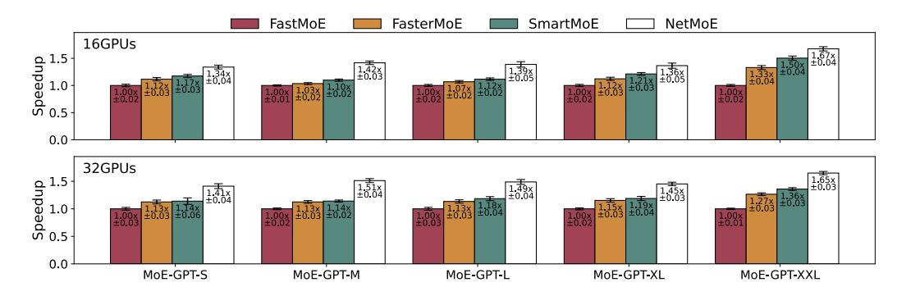

# 4 EXPERIMENTS

#### 4.1 EXPERIMENTAL SETUPS

We compare NetMoE with state-of-the-art methods based on dynamic expert placement, including FasterMoE [\(He et al., 2022\)](#page-11-5) and SmartMoE [\(Zhai et al., 2023\)](#page-14-4). We also included FastMoE [\(He](#page-11-3) [et al., 2021\)](#page-11-3) to represent a baseline without adjusting the placement of experts or samples. All experiments are conducted on a cluster consisting of 4 nodes, each equipped with 8 NVIDIA A800- SXM4-40GB GPUs. As listed in Table [2,](#page-4-1) the GPUs within each node are connected via NVLink with a 400 GB/s bandwidth, while the nodes are interconnected via InfiniBand with a 100 GB/s bandwidth. The configurations of the evaluated models are listed in Table [3.](#page-8-1) We select the GPT model architecture [\(Radford et al., 2019;](#page-12-12) [Brown et al., 2020\)](#page-10-3) as the backbone and replace all FFN layers in each model with MoE layers. In particular, since SmartMoE requires at least 2 experts on each device, we set the number of experts as E = 2 × J, where J is the number of GPUs in the corresponding experiment, and we fix the number of selected experts for each token as K = 2. By default, we utilize 8 GPUs per node to carry out the experiments, and we present the results for scenarios with fewer GPUs per node in Appendix [B.](#page-16-0) All results are averaged over 50 iterations.

#### 4.2 END TO END PERFORMANCE

As shown in Fig. [6,](#page-9-1) NetMoE demonstrates up to a 1.67× speedup over FastMoE, a 1.37× speedup over FasterMoE, and a 1.33× speedup over SmartMoE. FasterMoE achieves significant optimization by overlapping expert computation and supporting dynamic expert placement. However, as the model's hidden dimension increases, the cost of communicating with experts rises, making it difficult for it to maintain the same level of acceleration. This leads to a performance gap between FasterMoE and NetMoE. On the other hand, SmartMoE outperforms FasterMoE, which is expected since SmartMoE adjusts expert placement to ensure load balancing on top of FasterMoE's optimizations. However, SmartMoE primarily focuses on balancing the computational load, without emphasizing communication efficiency. When communication becomes the primary bottleneck, the benefits of load balancing are less pronounced. Consequently, by dynamically adjusting the sample placement, NetMoE consistently outperforms the state-of-the-art systems. Last but not least,

Figure 6: End-to-end speedup (mean and standard deviation) of different methods.

Figure 7: The actual and theoretic speedup in terms of All-to-All communication cost.

it is noteworthy that our method is compatible with dynamic expert placement. By adjusting the ExpDev(·) that is fed to our solver, NetMoE can be combined with dynamic expert placement to achieve even higher efficiency. We plan to explore this integration in our future work.

