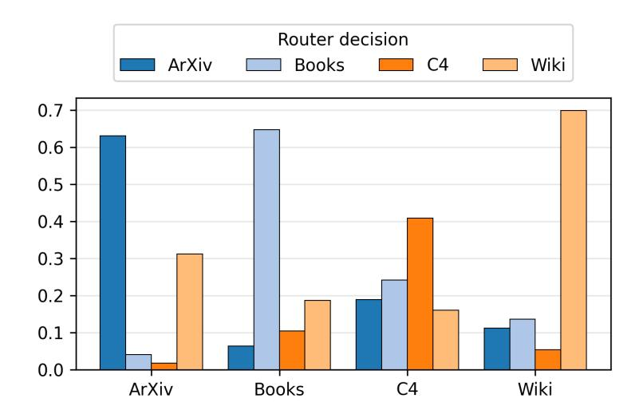
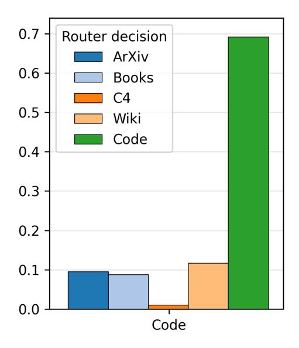
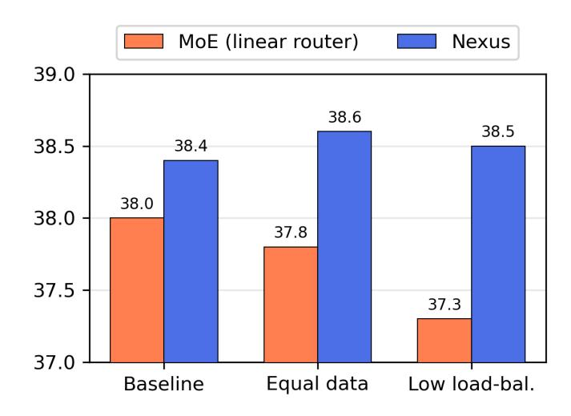

# 5 Results and Discussion

#### 5.1 Main Results for Upcycled Models

We first compare Nexus to the upcycled baselines MoE with linear router and dense merging. Here, we ask "How does our MoE upcycling recipe with adaptive routing compare against baseline upcycling approaches? "

3We did not include ARC-Challenge and Natural Questions in 470M experiments as some model variants were unable to achieve non-random performance.

|                              | Know.               | Science                                     | Reason.             | MMLU                | Avg.                |
|------------------------------|---------------------|---------------------------------------------|---------------------|---------------------|---------------------|
| SEED MODEL (470M)            | 14.0                | 51.4                                        | 50.5                | 29.8                | 36.4                |
| Upcycled Models              |                     |                                             |                     |                     |                     |
| Dense Merging                | 10.9                | 52.0                                        | 50.3                | 27.8                | 35.5                |
| MoE (Linear router) Nexus | 13.4 <b>16.7</b> | $\begin{array}{c} 55.0 \\ 55.0 \end{array}$ | 51.3 <b>52.3</b> | 29.6 <b>29.8</b> | 37.3 <b>38.5</b> |

Table 2: Downstream task results for Nexus with a 470M parameter seed model: Our approach outperforms baselines in all downstream benchmarks. Dense merging corresponds a dense model with 470M parameters, while both Nexus and MoE (linear router) consist of 605M active and 1.3B total parameters.

|                     | Know. | Science | Reason. | MMLU | Code (excl. in upcyc.) | Avg. (w/o Code) |
|---------------------|-------|---------|---------|------|------------------------|--------------------|
| SEED MODEL (2.8B)   | 27.1  | 62.0    | 63.8    | 35.4 | 8.4                    | 47.1               |
| Upcycled Models     |       |         |         |      |                        |                    |
| Dense Merging       | 17.6  | 60.3    | 59.2    | 36.0 | 3.4                    | 43.3               |
| MoE (Linear router) | 31.5  | 66.5    | 62.9    | 38.6 | 2.6                    | 49.8               |
| Nexus               | 33.2  | 67.3    | 62.6    | 39.4 | 2.7                    | 50.6               |

Table 3: Downstream task results for Nexus with a 2.8B parameter seed model: Our approach outperforms the baselines in 3 out of 4 evaluation categories. Dense merging corresponds a dense model with 2.8B parameters, while both Nexus and MoE (linear router) have 4.3B active and 9.1B total parameters. Note that the trained models show severe forgetting on Code benchmarks, as we exclude Code data on purpose during the upcycling phase to simulate extending models with a new dataset in Section 5.2.

470M parameter seed model. Table 2 shows performances of upcycled models including Nexus where a 470M seed model is used to train dense experts. Both Nexus and the upcycled MoE (linear router)) consist of 1 shared and 6 routed experts, corresponding to a total number of 1.3B parameters where 605M parameters are activated per input for top-2 routing (1 expert always activated, 1 chosen by the router). The dense merging baseline is created by averaging the weights of all dense experts and the seed model, and therefore has the same number of parameters as the seed model.

Compared to the seed model, Nexus performs better in all evaluation categories with a 5.8% relative gain on average (38.5 vs 36.4). Compared to upcycled models, Nexus outperforms MoE (linear router) in 3 out of 4 categories with 3.2% relative gain (38.5 vs 37.3) on average, and beats dense merging by 8.5% overall relative increase (38.5 vs 35.5). Notably, while both upcycled MoEs outperform the seed model, dense merging underperforms on average, showing the benefits of MoE upcycling over parameter averaging.

2.8B parameter seed model. Next, we experiment by upcycling dense models with 2.7B parameters to validate if the results from the 470M seed model hold at a larger scale. Table 3 compares Nexus with MoE (linear router) and dense merging. Both Nexus and MoE (linear router) use 1 shared expert and 4 routed experts in these experiments, corresponding to 4.3B active

Figure 4: Extending upcycled MoE models with the Code experts: After initial upcycling, we extended MoEs (both Nexus and MoE with linear router) using an independently trained dense Code expert and finetuned the resulting models small number of tokens (200M, 500M, and 1B finetuning tokens) as described in [3.](#page-5-0) Nexus consistently outperforms the baseline in Code performance after extension without losing general performance. General tasks is the macro average of the knowledge, science, reasoning, and general knowledge categories reported in section [5.1.](#page-7-1) Note that the dense Code expert achieves scores of 42.1 and 14.3 for general and code tasks respectively.

parameters per input (top-2) out of 9.1B total parameters.

Our results show that Nexus leads to higher upcycling results compared to the baselines at the 2.8B scale, confirming the findings from smaller scale experiments. Nexus enables a 7.4% relative gain over the seed model and outperforms the MoE (linear router) with a 1.6% relative increase (50.6 vs. 49.8). Nexus outperforms the best baseline in 3 out of 4 task categories and achieves the highest increase in knowledge tasks with 22.5% and 5.6% relative to the seed model and the MoE (linear router) respectively. These tasks include knowledge retrieval from Wikipedia in which one of our specialized experts is trained for.

Similar to the 470M experiments, both Nexus and MoE (linear router) outperform the dense merging baseline. We relate this to potential cross-task interference between diverse specialized experts (including the seed model as an additional expert), leading to poor performance by applying a simple weight averaging.

#### 5.2 Extending the Upcycled MoE model with a New Expert

To support fully modular and efficient training of MoEs, besides upcycling the existing expert models, it is crucial for an adaptive method to have the ability to continuously extend the upcycled MoE with new experts trained using previously unseen data domains. To evaluate this, we train a dense Code expert and extend the upcycled MoEs (both Nexus and MoE (linear router)) as described in Section [3.](#page-5-0) We perform a small-scale finetuning of up to 1B tokens after extending the models. Figure [4](#page-9-1) shows both the general performance and the target code performance at 200M, 500M, and

Figure 5: Average routing probabilities for each expert per domain in Nexus: We compute the average routing probabilities across Transformer blocks for 512 samples per domain (from the 2.8B experiment). The labels on the x-axis represent the domain of the samples and the colored bars show the routing probabilities for the corresponding expert. We show token routing probabilities for the domains that are used to train specialized experts.

1B finetuning tokens. Here, we ask "Can we continuously upcycle dense models into an MoE without requiring large-scale MoE training each time? "

Performance on the new domain. As shown in Figure [4](#page-9-1) (right), Nexus outperforms the MoE (linear router) for 200M, 500M and 1B finetuning tokens with 18.4%, 6.2% and 18.8% relative gains respectively. Unlike MoE (linear router), where the router weights are reset after extending the MoE layers, Nexus uses the information that is available about the new domain by mapping the domain embedding to a new expert embedding for the router, and therefore finetunes the router weights without a restart.

Comparison with the dense models. Nexus reaches the code performance of the seed model while retaining superior performance on general tasks. In comparison to the seed model and the dense code expert (trained for 8B code-only tokens on top of the seed model), although the dense code expert still performs higher than both upcycled MoEs with a score of 14.3, its performance on general tasks is far inferior (42.1). Our method also achieves up to 18.8% relative gains over the MoE (linear router). These results show that with a fraction of the original upcycling budget (1B vs 40B tokens for initial upcycling, and 1B vs 8B tokens for code expert training), Nexus can acquire a new capability.

Performance on general tasks. As a proxy for the knowledge for previously learned domains, Figure [4](#page-9-1) (left) shows the average performance of Nexus and MoE (linear router) in general tasks. Although there is a slight drop on the general tasks for Nexus compared to initial upcycling (a relative decrease of 1.9%), the competitive performance is maintained across different numbers of finetuning tokens. We relate this to the composition of the finetuning mix where we use a high percentage of the code data (50% of the code and 50% of the previous domains).

Figure 7: Comparison between Nexus and the baseline in different load balancing and data sampling setups: We compare Nexus and MoE (linear router) by lowering load balancing loss factor and uniformly sampling the data domain during training in isolation. We report the average performance on Knowledge, Science, Reasoning, and MMLU.

