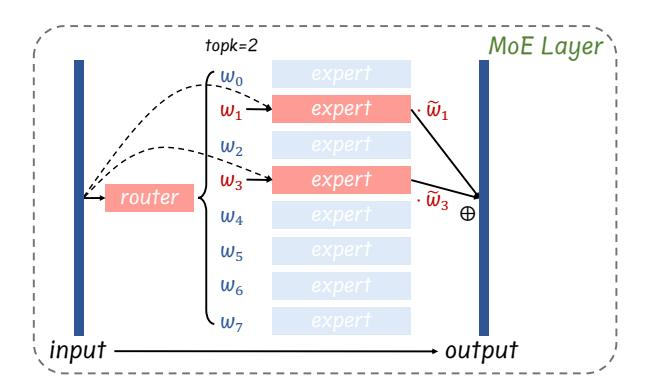

# Not All Experts are Equal: Efficient Expert Pruning and Skipping for Mixture-of-Experts Large Language Models

Xudong Lu∗1 , Qi Liu∗2,4 , Yuhui Xu3 , Aojun Zhou‡1 , Siyuan Huang2,4 Bo Zhang4 , Junchi Yan2,4 , Hongsheng Li†1,5

1CUHK MMLab 2Shanghai Jiao Tong University 3Salesforce AI Research 4Shanghai Artificial Intelligence Laboratory 5CPII under InnoHK {luxudong@link,hsli@ee}.cuhk.edu.hk purewhite@sjtu.edu.cn {xyh6666,aojunzhou}@gmail.com

## Abstract

A pivotal advancement in the progress of large language models (LLMs) is the emergence of the Mixture-of-Experts (MoE) LLMs. Compared to traditional LLMs, MoE LLMs can achieve higher performance with fewer active parameters, but it is still hard to deploy them due to their immense parameter sizes. Different from previous weight pruning methods that rely on specifically designed hardware, this paper mainly aims to enhance the deployment efficiency of MoE LLMs by introducing plug-and-play expert-level sparsification techniques. Specifically, we propose, for the first time to our best knowledge, posttraining approaches for task-agnostic and taskspecific expert pruning and skipping of MoE LLMs, tailored to improve deployment efficiency while maintaining model performance across a wide range of tasks. Extensive experiments show that our proposed methods can simultaneously reduce model sizes and increase the inference speed, while maintaining satisfactory performance. Code will be made available at [https://github.com/Lucky-Lance/](https://github.com/Lucky-Lance/Expert_Sparsity) [Expert\\_Sparsity](https://github.com/Lucky-Lance/Expert_Sparsity).

## 1 Introduction

Large language models (LLMs) have shown remarkable abilities across various domains [\(Ope](#page-9-0)[nAI,](#page-9-0) [2023;](#page-9-0) [Zhou et al.,](#page-10-0) [2024\)](#page-10-0), as evidenced by the widespread use of ChatGPT and Gemini [\(Team et al.,](#page-10-1) [2023\)](#page-10-1). Recent notable advancement in this area is the introduction of the opensourced Mixture-of-Experts (MoE) LLM, Mixtral 8x7B [\(Jiang et al.,](#page-9-1) [2024\)](#page-9-1), which sparsely activates only a portion of its parameters during the training and inference process. This model surpasses the performance of dense Transformer-based LLMs, such as LLaMA-2 70B [\(Touvron et al.,](#page-10-2) [2023a](#page-10-2)[,b\)](#page-10-3), with fewer active parameters (13B) during inference.

MoE LLMs achieve a reduction in on-the-fly (active) parameters by choosing only top-k experts for the inference of each token, thereby enhancing inference speed [\(Sanseviero et al.,](#page-9-2) [2023\)](#page-9-2). However, the static parameters, particularly those required for constructing the MoE architecture, still demand considerable memory and storage for deployment. For example, loading the Mixtral 8x7B model in bf16 format requires at least two A100-80G GPUs. Notably, in this MoE model, the eight experts constitute around 96% (45B out of 47B) of the total number of parameters.

On the other hand, not all experts are equal in the MoE model. Recent studies, such as [\(Chi et al.,](#page-8-0) [2022\)](#page-8-0), have demonstrated this discrepancy in expert training outcomes. The differing levels of training among each expert highlight the importance and practicality of identifying and pruning less significant experts, thereby improving the deployment efficiency of MoE models.

Unlike existing post-training weight pruning schemes for LLMs, which primarily target unstructured sparsity and N:M semi-structured sparsity [\(Sun et al.,](#page-10-4) [2023;](#page-10-4) [Frantar and Alistarh,](#page-9-3) [2023\)](#page-9-3), our approach focuses on expert-level sparsity for model sparsification. The aforementioned finegrained weight pruning techniques are effective in reducing the total number of parameters. However, they face challenges in plug-and-play deployment due to the necessity for specific hardware designs (e.g., FPGA) [\(Zhou et al.,](#page-10-5) [2021\)](#page-10-5), which demands an extensive co-design of hardware and systems.

In this paper, we systematically explore *expertlevel* sparsity in MoE LLMs and, for the first time to our best knowledge, introduce hardware-friendly post-training methods for either permanently removing unimportant experts (expert pruning) or dynamically skipping experts during inference (dynamic expert skipping). Our proposed method significantly reduces memory usage for deploying MoE LLMs and enhances their inference speed.

∗Equal contribution †Corresponding author ‡ Project lead

Figure 1: Memory usage reduction (bf16) and inference speedup illustration of our proposed post-training expert pruning and dynamic (expert) skipping methods on the Mixtral 8x7B (Jiang et al., 2024) model. Our method greatly reduces memory consumption and enhances inference speed.

Initially, we investigate how to prune less important experts while maintaining satisfactory performance, utilizing an efficient post-training approach. We aim to minimize the token reconstruction loss in a layer-by-layer manner. Given the limited number of experts in a single MoE layer of the LLM, we meticulously enumerate and choose combinations of experts that yield the lowest token reconstruction loss, subsequently, concatenating them to obtain the final pruned MoE model. This strategy significantly lowers the memory demands for deploying MoE LLMs. We examine expert-level pruning for both task-agnostic and task-specific (first in literature) models, tailoring our strategies to optimize performance across a wide range of applications.

Building on this foundation, we further dive into strategies for accelerating the inference speed of MoE LLMs without compromising their robustness. Specifically, based on the model's fixed expert count, we introduce an online method for dynamically skipping certain experts. This approach, which is complementary to our expert pruning strategy, allows for on-the-fly adjustment of the number of active experts during inference, thus enhancing the inference speed. By integrating the dynamic (expert) skipping approach with expert pruning, we achieve a more streamlined and efficient deployment for MoE LLMs.

Experiments on Mixtral 8x7B (Instruct) models (Jiang et al., 2024) demonstrate that our methods significantly reduce memory usage and increase inference speed. Take the example of post-training pruning two experts. As shown in Fig. 1, we halve the number of GPUs needed, allowing deployment on a single 80G GPU and achieving a  $1.2\times$  inference speedup. The pruning also results in mild performance loss, specifically, around 2.9 points for task-agnostic and 6.2 points (reducible to

1.6 with task-specific fine-tuning) for task-specific models. Further combination of dynamic skipping with expert pruning can lead to the same inference speedup with dropping 4 experts while achieving much higher model performances. To the best of our knowledge, this study is the first to discuss expert-level sparsity and propose efficient schemes for expert pruning and skipping for MoE LLMs.

#### 2 Related Works

#### 2.1 Mixture-of-Experts Models

First introduced in (Jacobs et al., 1991), a Mixture-of-Experts (MoE) model contains multiple separate networks, and each network processes a subset of the entire dataset. This separation can be viewed as a modular transformation of a multi-layer network. MoE structure is used for designing Recurrent Neural Networks (RNNs) in (Shazeer et al., 2017) and further extended to encoder-decoder Transformer-based models (Lepikhin et al., 2020). With the recent development of decoder-only GPT family of models (Brown et al., 2020; Touvron et al., 2023a,b), MoE models based on this structure gain popularity (Jiang et al., 2024). In this paper, we focus on post-training expert pruning/skipping methodologies for MoE LLMs.

#### 2.2 Expert Pruning for MoE Models

Expert pruning within MoE models has garnered attention in the realm of Natural Language Processing, particularly in machine translation tasks. In these contexts, the translation of specific languages often renders the expertise of other language specialists superfluous. The most activated experts are reserved in (Kim et al., 2021) to prune a machine translation MoE model, and (Koishekenov et al., 2022) proposes expert pruning metrics based on gate statistics collected during decoding. Al-

though these methods actively deal with expert pruning for MoE models, they are still limited to the machine translation domain with linguistic models. Researchers in (Chen et al., 2022) provide a dropping-while-training method that progressively drops the non-professional experts for target downstream tasks, and experiments are carried out on Switch Transformers models (Fedus et al., 2022). However, in the LLM era, it is usually difficult to afford such a training paradigm.

#### 2.3 Post-training Pruning for LLMs

Post-training pruning (Kwon et al., 2022; Hubara et al., 2021) has become a popular topic for neural network sparsification in recent years. Given a trained model, post-training pruning aims at achieving the optimal model sparsification outcome by utilizing model parameters together with some calibration data. Recent works extend pruning methods to LLMs (Sun et al., 2023; Frantar and Alistarh, 2023). However, these pruning methods primarily focus on sparsifying the weight matrices of linear layers in the LLMs and require dedicated hardware. To the best of our knowledge, efficient post-training expert pruning methods have not been discussed for decoder-only LLMs with MoE structures.

#### 3 Method

To enhance the deployment efficiency of MoE LLMs, we concentrate on expert-level model sparsity and innovatively propose post-training techniques designed to reduce memory usage and increase inference speed. In this section, we offer a comprehensive explanation of our proposed methods for expert pruning (Sec. 3.2) and dynamic (expert) skipping (Sec. 3.3), considering both memory consumption and inference speed.

#### 3.1 Preliminary

In the decoder-only sparse MoE Transformer models, as discussed in (Gale et al., 2023), the Feed-Forward Network (FFN) sub-layers of the traditional dense model are replaced with MoE layers, each containing n experts. Specifically, within the MoE layer of the Mixtral 8x7B model, featuring 8 experts as detailed in (Jiang et al., 2024), each token  $\boldsymbol{x}$  in the input sequence is routed to the top-2 experts based on the routing weights  $\boldsymbol{w}$ .

The inference process for each input token x within the MoE layer of the Mixtral 8x7B decoder layer is depicted in Fig. 2. Initially, the router computes routing logits  $l = \{l_0, \ldots, l_{n-1}\}$  and routing

Figure 2: Illustration of the MoE layer in the Mixtral 8x7B model for per-token inference. The output of the layer is the weighted sum of the outputs from selected experts over input token  $\boldsymbol{x}$ .  $\widetilde{w}_i$  denotes the normalized routing weight of each selected expert.

weights  $w = \operatorname{Softmax}(l)$  for the experts. Then the top-k experts, where k = 2 for the Mixtral 8x7B model, are selected based on their routing weights to process the token. Each of these k selected experts, applying a SwiGLU transformation  $\mathcal{E}_i(\cdot)$  ( $i \in \{0,1,\ldots,n-1\}$ ), contributes to the final output. This output is a weighted sum of the individual expert outputs, with weights  $\widetilde{w}_i$  being the normalized values of the corresponding routing weights for the selected experts. The normalized weight for expert  $e_j$  ( $j \in \{0,1,\ldots,k-1\}$ ) $^l$  is calculated as follows:

$$\widetilde{w}_{e_j} = \frac{w_{e_j}}{\sum_{m=0}^{k-1} w_{e_m}},\tag{1}$$

yielding the MoE layer's output for the token x as:

$$z = \sum_{j=0}^{k-1} \widetilde{w}_{e_j} \cdot \mathcal{E}_{e_j}(x). \tag{2}$$

Aside from these specified mechanisms, the remaining aspects of the MoE network mirror those of a standard decoder-only Transformer model.

#### 3.2 Post-training Expert Pruning

As demonstrated in the preliminary subsection, the parameters of experts occupy the major proportion of the whole MoE LLM model. However, for a single token, only a small subset of these experts are activated, leading to considerable inefficiencies in parameter utilization. Existing post-training weight pruning methods for LLMs (e.g., Wanda (Sun et al., 2023), SparseGPT (Frantar and Alistarh, 2023)), while effective in reducing model

 $^{1}e_{j}$  is the index of the j-th largest element of w, i.e. the index of the j-th selected expert

Figure 3: Framework of our proposed expert pruning and dynamic skipping methods. (a) The expert pruning method evaluates the contributions of experts via a small calibration dataset and then permanently discards those with low contributions (e.g., experts with a slashed background). (b) The dynamic skipping method discard no experts instead dynamically decides whether to skip certain experts (e.g., experts with a yellow background) during inference.

Figure 4: Expert selection comparison between C4 and MATH dataset with r=6 for Mixtral 8x7B model. Significant divergence is observed in the selection of experts across these two datasets, and identical expert combinations are observed in only four specific layers (i.e., layer 2, layer 4, layer 16, and layer 31).

parameters, do not support efficient deployment of MoE LLMs without specialized hardware implementations (Mishra et al., 2021). Therefore, we introduce a heuristic search method to prune the number of experts in a post-training manner.

Tasks. Different from existing pruning schemes leveraging unstructured or semi-structured weight sparsity (Sun et al., 2023; Frantar and Alistarh, 2023) for LLMs, our proposed post-training expert pruning method aims at reducing the parameter numbers of MoE LLMs by permanently discarding less important experts, thereby improve the inference efficiency. It is a post-training pruning method and does not require any parameter update. Fig. 3 (a) illustrates our proposed post-training expert pruning method. We conduct expert pruning in a layer-wise manner. Specifically, the pruning method contains two steps as follows.

Firstly, we set up a small calibration dataset, then perform inference on the original MoE model with all experts over the dataset, and cache the input-output token pairs of each MoE layer. We use samples from the pre-training dataset C4 (Raffel

et al., 2019) as calibration data, since pre-training datasets are often more comprehensive and not dominated by knowledge specific to any particular domain (Sun et al., 2023).

Secondly, after caching input-output pairs for each MoE layer, we enumerate expert combinations based on the preset parameter r, denoting the number of preserved experts. Assume the function of the MoE layer at layer l is  $\mathcal{F}(\cdot)$ , with the cached input represented by x. During each enumeration, we maintain r experts and eliminate the remaining experts along with their associated routing weights. Subsequently, we employ the pruned MoE layer, denoted as  $\mathcal{F}'(\cdot, \mathbf{C})$ , to recalculate the corresponding output, where C represents a subset containing r experts selected from the original nexperts. Inspired by channel pruning in CNNs (He et al., 2017), the Frobenius norm of the difference between cached output  $\mathcal{F}(x)$  and the output of pruned layer  $\mathcal{F}'(x, \mathbf{C})$  is used to quantify the discrepancy between the model before and after expert pruning, and we denote it as reconstruction loss. The expert subset corresponding to the minimum reconstruction loss is retained. The n-r experts

left are considered to contribute least to the original MoE model and are thus discarded. The expert pruning process in layer l can be formulated as:

$$\min_{\mathbf{C}} \|\mathcal{F}'(\boldsymbol{x}, \mathbf{C}) - \mathcal{F}(\boldsymbol{x})\|_{F}$$
s.t.  $\mathbf{C} \subseteq \{\text{expert}_{0}, \dots, \text{expert}_{n-1}\}, |\mathbf{C}| = r.$ 

We heuristically search for expert subset C with the lowest reconstruction loss in each layer separately and obtain an MoE model with r experts by the concatenation of each pruned layer. After removing the insignificant experts, the pruned model can be easily loaded using existing packages (e.g., Huggingface Transformers (Wolf et al., 2020)) with just a change of the model configuration. Especially, with 2 experts pruned, the deployment budget is reduced to a single 80G GPU for loading the Mixtral 8x7B (Instruct) model with bf16 data type.

Task-specific Expert Pruning for Domain**specific Tasks.** Previous research on post-training pruning for LLMs (Sun et al., 2023; Frantar and Alistarh, 2023) typically considers the performance over general tasks. For the first time, in our work, we investigate the task-specific post-training pruning for MoE LLMs. Our above-proposed expert pruning strategy is adept at conserving the knowledge encapsulated by the experts of an MoE model for general tasks. However, as a pre-training dataset, C4 spans a wide array of domains, posing challenges when pruning experts for domain-specific tasks (e.g., models tailored for mathematics (Yu et al., 2023; Wang et al., 2024)). We evaluate the 5-shot performance of the C4 pruned MoE LLM model with r = 6 on math tasks (GSM8K) (Cobbe et al., 2021), resulting in a performance degradation plummeting from 58.61 to 41.02 for the Mixtral 8x7B model. To address this challenge, we propose to shift the calibration dataset from C4 to the training set of MATH (Hendrycks et al., 2021), to concentrate the pruning process on the mathematics domain.

**Remark.** For a better comparison between general tasks and domain-specific tasks, we visualize the distribution of pruned experts selected by C4 and MATH, as shown in Fig. 4. For both the Mixtral 8x7B and Mixtral 8x7B Instruct model, identical expert combinations are observed in only four specific layers. This suggests that there are distinct differences in the distributions of pre-training datasets and domain-specific datasets. Further details and discussions are provided in Sec. 4.2.

#### 3.3 Dynamic Skipping During Inference

Our expert pruning strategy effectively reduces memory consumption during model deployment. However, each token is still processed by k selected experts, without a reduction in runtime FLOPs. Intuitively, not all tokens require the selection of all top-k experts during the token generation process. Consequently, we introduce a scheme that dynamically skips certain experts for individual token inference, to further enhance inference efficiency.

As shown in Fig. 2, during the inference process, top-k experts are chosen with routing weights  $\boldsymbol{w} = \{w_{e_0}, w_{e_1}, \dots, w_{e_{k-1}}\}$  for each token  $\boldsymbol{x}$  in an MoE layer. For simplicity, we assume k=2 (as in Mixtral 8x7B)2. Our proposed dynamic expert skipping method is illustrated in Fig. 3 (b). Without loss of generality, assume experts with indices  $e_0$  and  $e_1$  are chosen, and  $w_{e_1} < w_{e_0}$ . To accelerate inference speed, if  $w_{e_1} < \beta w_{e_0}$ , we do not assign x to expert  $e_1$ , where  $\beta$  is a hyper-parameter separately set for each MoE layer. In our implementation, we forward the model over the sampled calibration data and set  $\beta$  as the median value of  $\frac{w_{e_1}}{w}$  for each MoE layer. The dynamic skipping scheme can be carried out on the fly to speed up inference, and can be used simultaneously with expert pruning. In our experiments, we observe a  $1.2\times$  to  $1.3\times$  inference speedup with r=6.

#### 4 Experiment

In this section, a series of experiments are carried out to evaluate our proposed methods. We introduce experiments of expert pruning for general tasks in Sec. 4.1, domain-specific tasks in Sec. 4.2, and dynamic expert skipping results in Sec. 4.3.

#### 4.1 Expert Pruning for General Tasks

In this subsection, we evaluate the proposed expert pruning method on some general tasks, which can comprehensively reflect the knowledge retention of the model after expert pruning.

**Experiment Setup.** Similar to Wanda (Sun et al., 2023), we choose calibration data from the C4 (Raffel et al., 2019) dataset and combine them into 128 token sequences, each with a length of 20483. We perform expert pruning on both Mixtral 8x7B and Mixtral 8x7B Instruct models, resulting in MoE

&lt;sup>2Deeper theoretical insight and a broader application to the top-k scenario of dynamic skipping can be found in Sec. A.2.

&lt;sup>3For more experiments about the influence of the calibration dataset size, please refer to Sec. A.3.

| Model        | Method | Sparsity | ARC-c | ARC-e | BoolQ | HellaSwag | MMLU  | OBQA  | RTE   | WinoGrande | Average | Mem (MB) | Speedup |
|--------------|--------|----------|-------|-------|-------|-----------|-------|-------|-------|------------|---------|----------|---------|
| Mixtral 8x7B | Wanda  | 2:4      | 42.06 | 74.16 | 76.64 | 53.16     | 52.21 | 27.00 | 63.90 | 70.96      | 57.51   | 51,214   | 0.91×   |
|              | Ours   | r = 4    | 48.89 | 78.16 | 81.35 | 57.66     | 47.30 | 29.00 | 61.37 | 72.85      | 59.57   | 46,879   | 1.27×   |
| Mixtral 8x7B | Wanda  | 2:4      | 48.89 | 78.70 | 86.27 | 56.24     | 57.84 | 30.40 | 72.20 | 71.82      | 62.80   | 51,210   | 0.92×   |
| Instruct     | Ours   | r = 4    | 53.92 | 79.88 | 84.77 | 60.05     | 52.75 | 30.40 | 75.45 | 73.80      | 63.88   | 46,879   | 1.27×   |

Table 1: Comparison with Wanda (Sun et al., 2023) at the structured 2:4 sparsity pattern. Our proposed expert pruning method (r=4) outperforms Wanda in all aspects. **Mem** stands for memory usage. †The original average performance of Mixtral 8x7B and Mixtral 8x7B Instruct model is 67.58 and 69.98, respectively.

| Model        | Method    | r      | ARC-c          | ARC-e          | BoolQ          | HellaSwag      | MMLU           | OBQA           | RTE            | WinoGrande     | Average        |
|--------------|-----------|--------|----------------|----------------|----------------|----------------|----------------|----------------|----------------|----------------|----------------|
|              | None      | 8      | 57.17          | 84.01          | 85.35          | 64.88          | 67.88          | 35.00          | 70.40          | 75.93          | 67.58          |
| Mixtral 8x7B | Random    | 6 4 | 48.04 39.85 | 78.49 68.35 | 81.99 78.59 | 59.02 53.32 | 60.77 49.23 | 33.40 29.20 | 66.79 62.82 | 75.85 69.93 | 63.04 56.41 |
|              | Frequency | 6 4 | 49.06 43.86 | 78.83 73.61 | 77.03 76.97 | 59.38 54.01 | 55.18 41.48 | 33.60 26.20 | 57.40 57.04 | 75.69 73.48 | 60.77 55.83 |
|              | Ours      | 6 4 | 51.62 48.89 | 81.94 78.16 | 83.64 81.35 | 61.60 57.66 | 58.72 47.30 | 33.00 29.00 | 67.87 61.37 | 75.37 72.85 | 64.22 59.57 |
|              | None      | 8      | 62.20          | 87.04          | 88.50          | 67.59          | 68.87          | 36.60          | 72.20          | 76.87          | 69.98          |
| Mixtral 8x7B | Random    | 6 4 | 54.52 48.81 | 83.04 75.46 | 87.25 78.47 | 63.21 57.48 | 62.70 53.68 | 35.40 31.80 | 72.92 72.56 | 77.19 70.96 | 67.03 61.15 |
| Instruct     | Frequency | 6 4 | 55.89 49.40 | 82.83 77.27 | 86.33 82.97 | 63.69 57.66 | 58.89 47.03 | 37.00 32.20 | 63.18 66.79 | 76.01 74.03 | 65.48 60.92 |
|              | Ours      | 6 4 | 58.19 53.92 | 84.89 79.88 | 87.34 84.77 | 65.24 60.05 | 62.47 52.75 | 35.60 30.40 | 70.04 75.45 | 75.85 73.80 | 67.45 63.88 |

Table 2: Zero-shot performance evaluation of different expert pruning methods with r set to 6 and 4. **Random** stands for randomly choosing experts to discard in each MoE layer. **Frequency** stands for dropping experts based on their activation frequency during the inference over calibration data. Our proposed expert pruning method leads to the least performance drop, with around 2.9 points for dropping 2 experts and 7.1 points for dropping 4 experts.

models with two experts discarded (r=6) and four experts discarded (r=4) in each layer. Pruning a Mixtral 8x7B model takes about 30 minutes for r=6 and 90 minutes for r=4.

After expert pruning, we evaluate the performance of the pruned MoE models following Wanda (Sun et al., 2023). Specifically, we report zero-shot accuracies of 8 tasks from EleutherAI LM Harness (Gao et al., 2023). We also test the token generation speed4, together with the peak GPU memory usage during model inference.

