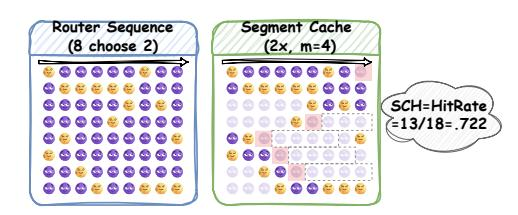
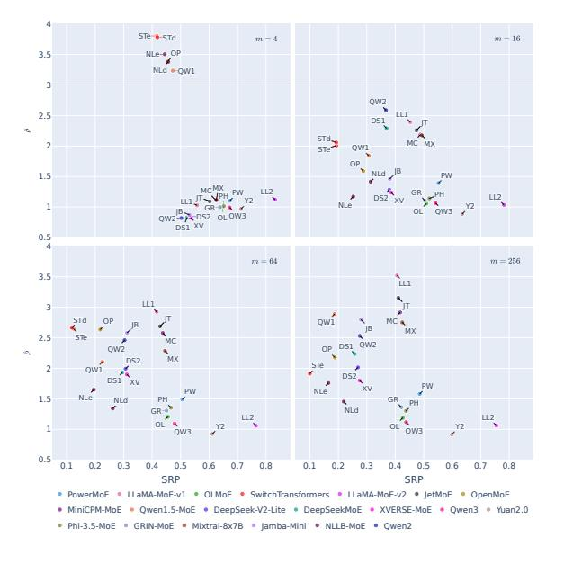
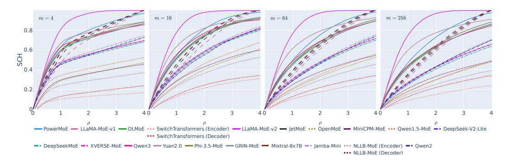

# 1 INTRODUCTION

Mixture-of-Experts (MoE) is a widely adopted model architecture in many large language models (LLMs) that enables efficient model size scaling through sparse activation[\(Fedus et al., 2022;](#page-12-0) [Jiang](#page-12-1) [et al., 2024;](#page-12-1) [Dai et al., 2024;](#page-10-0) [Abdin et al., 2024\)](#page-10-1). MoE models replace dense feed-forward networks (FFNs) with multiple expert modules, with only a subset activated during inference. However, the vanilla implementation requires all experts to be loaded into memory, restricting its application on memory-constrained devices such as mobile phones. To address this limitation, the *expert offloading* technique has been proposed to allow partial loading of expert modules during inference [\(Eliseev &](#page-12-2) [Mazur, 2023;](#page-12-2) [Hwang et al., 2024;](#page-12-3) [Yi et al., 2025\)](#page-16-0). Specifically, expert offloading caches a subset of experts in fast memory (e.g., GPU memory) based on predefined heuristics, while storing remaining experts in slower but larger-capacity storage (e.g., CPU memory or disk). During inference, especially

\*Corresponding authors.

in the decoding stage, if a token activates an expert not cached in fast memory, the system either computes the expert forward results with CPU and slow memory (Kamahori et al., 2024; Tang et al., 2024), or unloads a cached expert according to specific rules such as Least Recently Used (LRU), and replaces it with the demanded expert (Kong et al., 2024; Zhong et al., 2025).

However, frequent CPU offloads or on-demand loading within a short period can significantly degrade the efficiency of the expert offloading system and slow down inference, particularly when processing lengthy contexts with inevitable topic shifts. Prior research has focused on optimizing the design of the expert offloading system, aiming to strategically select which experts to cache in a given context to maximize cache hit rates. Among them, some observed and exploited the locality of expert activations, where similar routing choices appear within a consecutive segment of tokens, thereby minimizing the need for CPU offloads and on-demand loading (Eliseev & Mazur, 2023; Xue et al., 2024b; Zhang et al., 2025). This is especially beneficial during the decoding phase, where tokens are generated one after another.

Nevertheless, not all MoE models exhibit such continuous routing patterns uniformly, and the degree or frequency of this phenomenon varies across models. Understanding this variance may help design MoE architectures that are friendly to expert offloading systems and vice versa. In this work, we investigate the degree of this inherent consecutive routing property, which we term local routing consistency, of different MoE-based LLMs to explore their potential effectiveness in segment-based expert routing or caching. Figure 1 illustrates how different levels of local routing consistency reflect different routing patterns. Specifically, we propose two metrics that quantitatively reflect the local routing consistency of a specific model. (1) Segment Routing Best Performance (SRP) measures how effectively a segment router that selects a fixed group of experts for all tokens in a segment can approximate the original router's decisions. SRP not only reflects local routing consistency without parameters other than segment length, but also enables analyzing activation patterns of individual experts. (2) Segment Cache Best Hit Rate (SCH) represents the hit rate of an oracle expert cache that evicts unused experts based on the activation frequency within a specific length of future, under a cache size limit related to the number of active experts. SCH measures local routing consistency on model- and router-levels, yet is more related to the performance of real expert offloading systems as it accounts for the true cache limit.

Figure 1: Routing results by GRIN-MoE (Liu et al., 2024) layer 21 and Jamba-Mini-1.6 (Lenz et al., 2025) layer 25 on the same input (Java code). Despite having similar model sizes and the same number of experts, GRIN-MoE exhibits more consistent routing patterns than Jamba-Mini-1.6, activating certain experts continuously, so expert caching with it will be more feasible and effective.

We conduct experiments on 20 MoE-based LLMs, covering parameter scales ranging from 3 billion to 54 billion and encompassing diverse architectures. While most models exhibit similar local routing consistency within a few tokens, the variance enlarges when the segment length increases. Further verification on toy models reveals a **trade-off relation between local routing consistency** and *local* load balance; however models can achieve good *global* load balance with high local routing consistency. Meanwhile, Shared experts harms local routing consistency, as well as expert configurations that **limit expert combination space**. Additionally, we investigate local routing consistency across different context domains and assess its relationship with experts' domain and vocabulary preferences. The findings reveal that **domain-specialized experts**, if they exist,

**contribute more** to local routing consistency, whereas vocabulary specialization has less impact. Finally, we verify the strong correlation between SCH and hit rates of common cache algorithms, confirming the bond between local routing consistency and expert offloading efficiency. We conclude that most MoE models can achieve **optimal balance** between segment caching effectiveness and deployment efficiency with a **cache size approximately 2x the number of active experts**.\*

Overall, our contributions are threefold:

- 1. We propose *local routing consistency*, a property of MoE models that reflects the potential efficiency of expert offloading for the model. We design two metrics to quantify local routing consistency: segment routing best performance (SRP), which provides parameter-free fine-grained analysis, and segment cache best hit rate (SCH), aligned with practical expert offloading.
- 2. We conduct empirical analysis across 20 MoE-based LLMs, identifying and verifying (with toy models) key factors that affect local routing consistency, such as local load balance, shared experts, and expert combination space. We also reveal that domain-specialized experts contribute more to local routing consistency than vocabulary-specialized ones, as well as global load balance.
- 3. We analyze SCH under different cache sizes relative to the number of active experts. Alongside the optimal cache size derived from SRP results, we conclude that cache sizes 2x the size of active parameters achieve the best segment caching results on most models.

#### 2 DEFINITIONS

### 2.1 Preliminary: mixture of experts

Transformer-based language models have most parameters on feed-forward network (FFN) layers. As the model size scales up, LLMs often replace them with sparse MoE layers to reduce computational cost during inference. A typical MoE layer with E experts can be parameterized by E smaller FFNs  $F_1(;\theta_1),\ldots,F_E(;\theta_E)$ , where each  $F_i\colon\mathbb{R}^d\to\mathbb{R}^d$  defines a single expert. There is also a router  $R\colon\mathbb{R}^d\to\mathbb{R}^E$  in the MoE layer to choose experts and give weights. For each token x with hidden representation  $h_x\in\mathbb{R}^d$ , its output is given by

$$[s_1, \dots, s_E] = \text{Softmax}(R(h_x)); [w_1, \dots, w_E] = \text{Top}_k(s_1, \dots, s_E); o_x = \sum_{i=1}^E w_i F_i(h_x; \theta_i)$$
 (1)

where  $\operatorname{Top}_k$  preserves the k largest scores and sets others to 0. Experts with a null score can be effectively deactivated without calculating, thus saving computational resources. Other components in the transformer architecture may also be replaced by their MoE variant, such as Mixture-of-Attention (Zhang et al., 2022) for self-attention and MixLoRA (Li et al., 2024a) for LoRA adapters. Nevertheless, we focus on MoE layers that replace FFNs, as this is the most prominent and effective design (in terms of the number of parameters). More discussions about MoE LLMs can be found in Appendix B, where we also briefly review expert offloading for MoE models.

The above routing procedure is done token by token, which does not guarantee consecutive routing. Since the consistency of consecutive routing decisions can benefit expert offloading systems, it is necessary to investigate the degree of consecutive routing of different MoE-based LLMs. In the following sections, we propose two metrics to measure this **local routing consistency** and compare them across MoE models with different structure parameters.

### 2.2 SEGMENT ROUTING BEST PERFORMANCE (SRP)

An intuitive way to measure local routing consistency is to compare the distribution of routing choices between tokens in a continuous segment. However, typical metrics for distribution comparison, such as the Kullback-Leibler divergence, are designed for two distributions and are therefore unsuitable for our purpose. Instead, we propose **Segment Routing best Performance (SRP)** (Figure 2), which measures how well a simplified, segment-based router can mimic the behavior of the original token-based router. Here we give a brief introduction of SRP, with formal definition in Appendix C.1.

\*We propose this insight from the aspect of model design, especially when building models for devices with known memory constraints (e.g., mobile phones).

Figure 2: An illustration of segment routing best performance (SRP). Left: SRP on a single expert, where a segment estimator gives segmented predictions on every segment, and SRP is the best possible F1 score. Right: SRP on a group of experts, where a segment router predicts which experts are activated in a segmented manner, and SRP is the upper bound of F1.

On a single expert Given an input sequence, the activation pattern of an expert in an MoE model on this sequence can be seen as a series of binary classification tasks. A segment estimator with segment length m aims to predict this activation sequence, but in a segmented manner: At position i, it predicts the same result (active or not) for positions from i to i + m − 1. We select the F1 score to measure the performance of the estimator, because missing major activations is worse than activating on minor activations [\(Kong et al., 2024;](#page-13-0) [Skliar et al., 2025\)](#page-15-2); recall (hit-rate) is also inappropriate as we do not set up an upper bound on how frequently the expert can be activated. Moreover, to diminish positional effects, we consider all possible positions and treat each position as an individual binary classification task with m samples. Based on all the settings above, the SRP on this expert is defined as the upper bound F1 of such estimators.

Despite modelling using a virtual segment estimator, SRP itself solely depends on the expert and the segment length: The F1 score is maximized if and only if the estimator gives active predictions for all segments that had the expert activated more times than a specific threshold; a formal proof is given in Appendix [C.3.](#page-19-0) Therefore, SRP is an intrinsic property of the expert that reflects its local routing consistency, unrelated to any specific routing methods.

On a group of experts For a group of experts (in the same layer or in the same model), we can combine single-expert SRPs for *expert-choice* routing [\(Zhou et al., 2022\)](#page-16-4), since experts are independent of each other. However, in the more traditional and prevalent *token-choice* routing, experts are not activated independently of one another. Therefore, we use a segment router that decides which experts should be activated, also in a segmented manner. Similar to the single expert case, we define SRP as the upper bound of F1 between the routing decisions of the original router and the segment router, respectively. For a group of experts, SRP measures how well the original router coordinates the experts to achieve layer-level or model-level routing consistency.

Like SRP on a single expert, we do not limit the number of activated experts the segment router can choose at each position. Nevertheless, we do not want it to activate too many experts to achieve a high F1. Therefore, we define the segment routing size ratio ρˆ as the ratio between the average number of activated experts of the segment router and the original router (which is usually a fixed number). A small ratio indicates that the local routing consistency of the experts is high enough, so that segment routing does not need to select too many experts to cover real demands under average cases. We use it as a supplementary metric to distinguish between cases where groups of experts have similar segment routing best performances.

### 2.3 SEGMENT CACHE BEST HIT RATE (SCH)

The advantage of SRP as a local routing consistency metric is that it solely relies on the expert (group) and the segment length, making it suitable for analyzing individual experts. However, real expert offloading scenarios usually have a hard cache size limit, so the best global F1 score may not be achievable. Moreover, when considering caching performance, F1 score is not as straightforward as hit rate (recall). Therefore, we propose Segment Cache best Hit rate (SCH) (Figure [3\)](#page-4-0), which is more related to expert offloading.

Following the expert group case, instead of a segment router with unlimited activation settings, we now consider a segment cache with a hard cache size limit. More specifically, the cache has a specific cache ratio  $\rho$ , which is the ratio between the cache size and the number of activated experts. This cache works like the other caches in expert offloading systems: for each token, it loads (or preloads) the demanded experts not in the cache while evicting the same number of unused experts. The difference is that it evicts experts that are activated the least times in the next m tokens. Under this setting, SCH is defined as the hit rate of the segment cache. Due to their similar segment-based behavior, SCH can act as a bridge between SRP and the efficiency of real expert offloading systems.

Note that the upper bound hit-rate of any cache is given by the clairvoyant replacement algorithm that evicts the expert whose next activation will occur farthest in the future. Although SCH is also modeled on a cache algorithm that relies on some oracle information, the required information is easier to learn and predict (future activation). Thus, practical cache algorithms are more likely to reach a cache hit rate close to SCH. Furthermore, in Section 5.2 we show that SCH is already close to the optimal cache hit rate under certain conditions. Therefore, we stice

Figure 3: An illustration of segment cache best hit rate (SCH). An oracle expert cache evicts experts (red shade) that are least activated in the next m tokens (grey dash box); SCH is its hit rate.

rate under certain conditions. Therefore, we stick to SCH to align with SRP-based results.

### 3 SRP-BASED CONSISTENCY ANALYSIS

#### 3.1 Experiment setup

**Models** We first conduct experiments on 20 MoE-based LLMs with model sizes ranging from 3B to 57B, covering both popular (SwitchTransformers, Mixtral) and recent (DeepSeek-V2, Qwen3) models. We list their architecture and configuration details in Appendix D.1. We may also use shorter names (e.g., OLMoE and Qwen3) when there is no ambiguity. Given that many models also have post-trained (e.g., SFT, RL) versions, we compare the local routing consistency between base and post-trained versions of several models in Appendix E.1, where we find no significant difference. Therefore, we stick to the base version in our main experiments.

To validate our observations on existing MoE models concerning architecture design, we further pretrain a series of OLMoE-like toy models from scratch, and conduct the same observational experiments on them. The baseline model has 1.43B parameters, with shrunk depth and hidden dimensions compared to the original OLMoE. Each other model modifies one key architectural or training parameter, such as expert granularity, number of shared experts, and load balance loss coefficient, while maintaining the same total number of parameters (1.43B). Appendix D.2 provides more details about the model and training configurations. In the following sections, we refer to the above two groups of models as REAL and TOY, respectively.

**Dataset** We construct our sample corpus S from two sources: (1) **Generic Corpora:** We include all 7 categories from RedPajama (Together Computer, 2023), including C4, CommonCrawl, Books, Wikipedia, ArXiv, StackExchange, and GitHub. (2) **Downstream Application:** We append several datasets with cases aligned with modern LLM applications, including arena-human-preference-140k (LMArena; LMArena, 2025, OpenMathInstruct-2 (OpenMath; Toshniwal et al., 2025), OpenCode-Instruct (OpenCode; Ahmad et al., 2025), and OpenScienceReasoning-2 (OpenScience; NVIDIA Corporation, 2025). We treat each RedPajama category and downstream application dataset as a distinct domain, and refer to its subset corpus using the data source (Books, GitHub, etc.). The full corpus contains 22,528 input samples, each sample having 512 tokens. Appendix D.3 gives more details on the data processing and input generation process.

**Method and configuration** We collect every MoE layer's routing decisions for every input‡, and for each expert, count the number of activated tokens f in every segment. Although modern LLMs utilize position encodings to distinguish tokens from different positions, we demonstrate in Appendix E.2

&lt;sup>†We only describe the decoding stage; prefilling is similar except that one expert may handle multiple tokens.

&lt;sup>‡In encoder-decoder models, encoder layers only consider encoder input, and decoder layers likewise.

that segments from different positions have nearly identical SRP, except for the very first ones that may contain special head tokens. Therefore, we perform calculations on all segments and do not care about their positions. To obtain SRP, we count the number of segments with the same f for each expert (group), then compute the  $F_1$  score for every  $\alpha$  candidate, choose the  $\alpha$  that achieves the highest  $F_1$  and finally obtain the segment routing best performance and size ratio.

#### 3.2 Overall results

Figure 4 illustrates the SRP of each REAL model under various segment lengths m. While most models have similar SRP and  $\hat{\rho}$  when m=4, the difference between models becomes significant as the segment length increases, yet the relative order remains after m=16. There is a gap between short-term (m=4) and long-term  $(m\geq 16)$  local routing consistency, where **many models exhibit** the short-term one but only a few demonstrate the long-term one.

Figure 5: SRP and log perplexity of TOY models on the full corpus. We only show m = 16 results for simplicity.

Figure 4: SRP and  $\hat{\rho}$  of REAL models on the full corpus.

We roughly divide REAL into four groups that have similar SRP characteristics, whose SRP when m=16 are demonstrated in Table 1:

- Group 1 (LLaMA-MoE-v2–OLMoE) has the highest SRP (> 0.5 when m=16) and  $\hat{\rho}$  ( $\sim 1.25$ ) across all segment lengths, showing strong long-term local routing consistency.
- Group 2 (Mixtral-8x7B–LLaMA-MoE-v1) have the second highest SRP ( $\sim 0.48$  when m=16), but their long-term  $\hat{\rho}$  becomes high ( $\sim 2.5$ ).
- Group 3 (XVERSE-MoE–DeepSeekMoE) has a significantly lower SRP than group 2, especially the long-term one ( $\sim 0.36$  when m=16), but their  $\hat{\rho}$  is a bit lower  $\sim 2.0$ .
- Group 4 (NLLB-MoE–SwitchTransformers) have the lowest SRP (< 0.31 when m=16); contrasting other models, their short-term  $\hat{\rho}$  is already high, but their long-term  $\hat{\rho}$  becomes lower.

### 3.3 What affects local routing consistency?

Table 1 already provides clues about the relationship between local routing consistency (SRP) and model architecture. Nevertheless, due to the vast heterogeneity among REAL models, we further validate possible factors with TOY models, results illustrated in Figure 5. Significant points include:

**Load balance** This is one of the most intuitive factors related to local routing consistency, which is another key feature for efficient MoE inference (Lepikhin et al., 2021). For instance, both DeepSeek-AI et al. (2024b) and Skliar et al. (2025) suggest adding bias to router outputs. Still, the former promotes *little activated* experts for load balance and the latter promotes *recently cached* experts for

Table 1: REAL model SRP in descending order compared with several architecture parameters. "A:T": ratio between active and all experts; "S:A": ratio between shared and active experts; "every x": apply MoE every x layers; "after 1st": apply MoE after the first layer.

| Model              | SRP            | MoE        | A:T        | S:A    | Model                                       | SRP   | MoE             | A:T   | S:A |
|--------------------|----------------|------------|------------|--------|---------------------------------------------|-------|-----------------|-------|-----|
| LLaMA-MoE-v2 78.16 |                | all        | 1:4        | 0      | XVERSE-MoE                                  | 38.58 | all             | 3:32  | 1:3 |
| Yuan2.0            | 63.48          | all        | 1:16       | 0      | Jamba-Mini                                  | 38.08 | every 2         | 1:8   | 0   |
| PowerMoE           | 55.17          | all        | 1:5        | 0      | DeepSeek-V2-Lite                            |       | 37.92 after 1st | 3:32  | 1:3 |
| Qwen3              | 54.14          | all        | 1:16       | 0      | DeepSeekMoE                                 |       | 36.94 after 1st | 3:32  | 1:3 |
| Phi-3.5-MoE        | 51.98          | all        | 1:8        | 0      | Qwen2                                       | 36.74 | all             | 1:8   | 1:1 |
| OLMoE GRIN-MoE  | 50.91 50.39 | all all | 1:8 1:8 | 0 0 | NLLB-MoE (encoder) 25.24 (decoder) 31.35 |       | every 4         | 1:64  | 0   |
| Mixtral-8x7B       | 49.36          | all        | 1:4        | 0      | Qwen1.5-MoE                                 | 30.71 | all             | 1:15  | 1:1 |
| MiniCPM-MoE        | 48.85          | all        | 1:4        | 0      | OpenMoE                                     | 28.77 | every 6         | 1:16  | 1:2 |
| JetMoE             | 47.45          | all        | 1:4        | 0      | SwitchTF (encoder)                          | 19.33 | every 2         | 1:128 | 0   |
| LLaMA-MoE-v1 45.29 |                | all        | 1:4        | 0      | (decoder)                                   | 19.27 |                 |       |     |

effective caching. To investigate their relation, we compute the standard deviation (SD) of all experts' activation frequencies in a model and compare it with SRP in Table [2.](#page-6-1) Many REAL models with high SRP exhibit imbalanced routing, which largely contributes to their local routing consistency (see Appendix [E.7\)](#page-25-0). We also verify this on TOY models, where NoLB reaches a high SRP but has very poor load balance, while OverLB, which further prioritizes load balance during training, has very low SRP. Although load balance is also important for efficient training, from the aspect of expert offloading applications (e.g., edge computing), it is still worth trading some load balance for local routing consistency if expert offloading will be involved.

Table 2: SRP (m = 16) and load balance (LB) measured by activation frequency SD of experts.

| Model                    | SRP         | LB   | Model                  | SRP   | LB   | Model          | SRP         | LB   |
|--------------------------|-------------|------|------------------------|-------|------|----------------|-------------|------|
| LLaMA-MoE-v2 78.16 29.04 |             |      | XVERSE-MoE             | 38.58 | 2.71 | NoLB           | 56.42 13.21 |      |
| Yuan2.0                  | 63.48 13.86 |      | Jamba-Mini             | 38.08 | 3.05 | ActMore        | 55.69       | 6.54 |
| PowerMoE                 | 55.17 12.90 |      | DeepSeek-V2-Lite 37.92 |       | 2.34 | DenseFst       | 44.87       | 4.25 |
| Qwen3                    | 54.14       | 3.19 | DeepSeekMoE            | 36.94 | 2.03 | DenseHlf 43.67 |             | 3.71 |
| Phi-3.5-MoE              | 51.98       | 4.90 | Qwen2                  | 36.74 | 6.74 | Baseline       | 43.56       | 4.02 |
| OLMoE                    | 50.91       | 6.79 | NLLB-MoE (en)          | 25.24 | 1.75 | FewerExp 41.62 |             | 3.63 |
| GRIN-MoE                 | 50.39       | 3.89 | (de)                   | 31.35 | 2.13 | 1ShrExp        | 41.38       | 3.43 |
| Mixtral-8x7B             | 49.36       | 2.70 | Qwen1.5-MoE            | 30.71 | 0.58 | 2ShrExp        | 38.79       | 3.06 |
| MiniCPM-MoE              | 48.85       | 2.59 | OpenMoE                | 28.77 | 2.56 | OverLB         | 36.42       | 1.79 |
| JetMoE                   | 47.45       | 1.12 | SwitchTF (en)          | 19.33 | 0.58 | ActFewer 27.13 |             | 1.14 |
| LLaMA-MoE-v1 45.29       |             | 2.66 | (de)                   | 19.27 | 0.66 |                |             |      |
|                          |             |      |                        |       |      |                |             |      |

Note that models like Qwen3 and GRIN-MoE show high SRP and moderate load balance simultaneously. Since high local routing consistency almost always means low *local* load balance, we conclude that these models exhibit good *global* load balance: While a single query may only activate a portion of experts, queries from different topics are likely to activate different sets of experts, eventually covering all experts. Section [4](#page-7-0) further reveals that these models possess strong domain-specialized experts that help increase both local routing consistency and global load balance.

Shared experts and expert combination space Besides training objectives, model architecture can also play an important role in forming local routing consistency, the most significant of which we found is the existence of shared experts: Among REAL models, all models in groups 1 and 2 do not use shared models; Among TOY models, Share1 and Share2, having similar perplexity levels with Baseline, show significantly lower SRP than Baseline. We suggest two potential reasons for why shared experts harm local routing consistency: One reason could be the bypass effect, where more information is processed by shared experts, making the real MoE part less important. Another reason, which is linked to multiple MoE design factors, is the decreased size of expert combination space, which is also mentioned by [Muennighoff et al.](#page-14-1) [\(2025\)](#page-14-1). More specifically, the existence of shared experts decreases the number of both available and activated experts, resulting in fewer possible expert

combinations for routing. This may prevent the router from making local adjustments on routing decisions between consecutive tokens, resulting in low local routing consistency. In fact, among the TOY models, 32Exp (use fewer experts) and Top2 (activate fewer experts) do exhibit lower SRP than Baseline, while Top16 (activate more experts but less than half) show higher SRP. This further demonstrates that **more expert combinations benefit local routing consistency**. Nevertheless, this is a less significant factor compared to load balance and shared experts, as some REAL models (e.g., Phi and GRIN) do not strictly follow this rule.

**Interleaved MoE layers** Different from introducing dense components (shared experts) *inside* MoE layers, *interleaving or concatenating* MoE layers with dense ones seems to have less significant impact. Although Skip1 (first layer dense) and Sparse2 (MoE every 2 layers) possess higher SRP than Baseline, the lead is minor, and both models suffer from high perplexity. Meanwhile, all REAL models that involve dense layers fall into groups 3 and 4. However, the low SRP of these models may not be due to dense layers: they either use shared experts (e.g., DeepSeekMoE) or activate experts sparsely (e.g., SwitchTransformers), both of which can contribute to low local routing consistency.

### 4 LOCAL ROUTING CONSISTENCY AND EXPERT SPECIALIZATION

#### 4.1 Domain-wise local routing consistency

In Section 3, we analyze models on the full corpus, which consists of text data from 11 different domains. However, each domain has its token distributions, which may affect the router decision's distribution. Figure 6 illustrates the relative difference between domain-wise and global SRP of each model when m=16, where we observe three different patterns among all models: (1) Models like Phi-3.5-MoE, GRIN-MoE, and OLMoE have significantly **higher SRP on ArXiv, StackExchange and GitHub**, whose SRP can be more than 10% higher than global SRP. They also exhibit higher SRP on OpenMath and OpenCode, indicating specialized experts for math and coding tasks. (2) Models like LLaMA-MoE-v2, Yuan2.0, and Qwen3 have significant **higher SRP on Wikipedia and other generic domains** but lower on OpenMath and OpenCode. They seem to have specialized experts for generic text (e.g., multilingual experts) instead of math or coding. (3) Models like Mixtral-8x7B, MiniCPM-MoE and JetMoE have **similar SRP across all domains** with insignificant differences. All of them have mediocre to low SRP. Interestingly, we found that all TOY models show the first pattern (like the original OLMoE) regardless of architectural or training configuration tweaks, indicating that **the formation of such patterns may stem from the pretraining data distribution.** 

Figure 6: SRP (m=16) on each domain corpus, relative to SRP on the full corpus. In-group bars (from left to right): C4, CommonCrawl, Books, Wikipedia, ArXiv, StackExchange, GitHub, LMArena, OpenMath, OpenCode, and OpenScience. For encoder-decoder models, light colors represent the encoder and dark colors represent the decoder.

#### 4.2 EXPERT SPECIALIZATION

We argue that domain-wise local routing consistency patterns appear across models due to specialized experts in each model. To clarify this, we consider two types of expert specialization, first introduced by Muennighoff et al. (2025): (1) **Domain specialization:** the normalized frequency of an expert being activated on tokens from a specific domain. We compute the coefficient of variation (CV) of activation frequency across all domains as a domain-free metric. (2) **Vocabulary specialization:** the normalized frequency of an expert being activated on a specific token ID. We follow Muennighoff

et al. (2025) to obtain the vocabulary specialization of each expert. We compare each model's SRP, average expert specialization, and the correlation between its experts' specialization and SRP in Figure 7; expert distribution between specialization and SRP is also demonstrated in Appendix E.7.

Domain specialization Many REAL models show a positive correlation between their experts' domain specialization and SRP. Exceptions include LLaMA-MoE-v2, which constantly activates a group of experts, resulting in very high SRP; Qwen2 and LLaMA-MoE, meanwhile, hardly have any domain specialization. In contrast, Qwen3, Phi-3.5-MoE, GRIN-MoE, and OLMoE exhibit high SRP, high average expert domain specialization, and strong correlation between them simultaneously. As mentioned in Section 3.3, these models also demonstrate global load balance (see Table 2); with domain specialized experts this is explanable: A domain-specialized expert tends to be active when the context comes from certain domains or topics, but not others. Therefore, when the context matches, the expert is likely to be consistently activated (local routing consistency), but as long as the context becomes unrelated, the expert becomes inactive (global load balance).

Figure 7: SRP, expert specialization, and their correlation. Correlation between SRP and expert specialization is *per model*, based on single-expert results.

### **Vocabulary specialization** We consider

three kinds of vocabulary specialization on the input, the model's predicted output, and the ground-truth, respectively (Muennighoff et al., 2025). Most models demonstrate negative or insignificant correlation between *input* vocabulary specialization and SRP, except for LLaMA-MoE-v2 due to its constantly activated experts. On the other hand, SRP is slightly positively correlated to *prediction* or *ground* truth vocabulary specialization. We conjecture that such specialization happens more in later layers (Muennighoff et al., 2025) that process high-level information related to the context topic.

Above all, we can see that **domain specialization plays a more important role in local routing consistency than vocabulary specialization**, especially on models with both high local routing consistency and global load balance.

#### 5 SCH-BASED CONSISTENCY ANALYSIS

### 5.1 OVERALL RESULTS

As mentioned in Section 2.3, SRP has several flaws that hinder its application in expert offloading. This section focuses on the segment cache best hit rate (SCH), which works with a size limit, to obtain a more straightforward insight into expert offloading and cache management. We calculate each model and each layer's SCH on every possible cache size by simulating the oracle cache described in Section 2.3 and recording the hit rate.

Figure 8 illustrates SCH of REAL models under different ms and  $\rho s$ . We can easily identify the four groups of models mentioned in Section 3.2 starting from m=16: Group 1 models have the fastest growing SCH with respect to rho when  $\rho$  is small, as well as turning points near  $\rho=2$ , after which they share similar SCH with group 2 models. Meanwhile, models from groups 3 and 4 have relatively low SCH, growing nearly linearly as  $\rho$  increases. Since only group 1 models (with the highest local routing consistency) have turning points on SCH, we claim that in general,  $\rho=2$  can balance cache effectiveness and efficiency.

Figure 8: SCH of REAL models on the full corpus under different segment length m and cache ratio  $\rho$ . Solid line: group 1; dashed: group 2; dash-dotted: group 3; dotted: group 4.

### 5.2 SCH AND COMMON CACHE ALGORITHM

Since SCH is based on an ideal cache system that relies on oracle information, it is crucial to understand how well it is correlated with real-world implementations. Table 3 lists the correlation between SCH and the cache hit rate of two widely adopted cache algorithms: least recently used (LRU) and least frequently used (LFU). All compared cache algorithms have hit rates highly correlated to SCH, even for short segments (m=4). Furthermore, Appendix E.4 reveals that SRP and SCH are also highly correlated with each other. This suggests that models with higher local routing consistency tend to achieve higher expert cache hit rates, hence greater performance gain with expert offloading.

Furthermore, we use the optimal cache hit rate given by the clairvoyant replacement algorithm as a baseline, and compared the relative hit rate of the mentioned cache algorithms in Figure 4 (using Baseline as an example). When the cache size is moderate, SCH (m=16) is very close to the optimal hit rate, while LRU and LFU consistently have hit rates lower than SCH. From this point, SCH can act as a "practical" ideal case for analytical analysis on expert offloading.

Table 3: Correlation between SCH and hit rate of cache algorithms across REAL models. LRU: least recently used; LFU: least frequently used.

| m   | LRU   | LFU   | Fixed |
|-----|-------|-------|-------|
| 4   | 81.20 | 77.39 | 76.26 |
| 16  | 90.43 | 88.70 | 89.79 |
| 64  | 93.10 | 92.82 | 95.50 |
| 256 | 97.52 | 99.20 | 97.91 |

Table 4: Baseline's SCH (m=16) and hit rates of LRU and LFU relative to the optimal hit rate under different cache ratios  $\rho$ . The optimal hit rate is normalized to 100.

| OTTITUE | ILCU to I       | 00.                                                         |                                    |
|---------|-----------------|-------------------------------------------------------------|------------------------------------|
| $\rho$  | LRU             | LFU                                                         | SCH                                |
| 1.0     | 56.49           | 61.92                                                       | 80.97                              |
| 2.0     | 67.04           | 70.87                                                       | 90.55                              |
| 3.0     | 75.26           | 78.35                                                       | 96.23                              |
|         | ρ 1.0 2.0 | <ul><li>ρ LRU</li><li>1.0 56.49</li><li>2.0 67.04</li></ul> | 1.0 56.49 61.92 2.0 67.04 70.87 |

### 6 Conclusion

In this paper, we investigate the property of MoE LLMs where similar experts can be continuously activated, namely *local routing consistency*. We propose two metrics to measure this property: segment routing best performance (SRP) and segment cache best hit rate (SCH). We compare SRP and SCH between multiple models and identify several key designs that may help improve local routing consistency of MoE LLMs, including local load balance trade-off, (no) shared experts and (enlarging) expert combination space. We also identify that domain-specialized experts contribute more to local routing consistency and help achieving global load balance. We further suggest that a cache size around 2x the number of active experts can balance cache effectiveness and efficiency.

**Acknowledgements** The work is supported by AI for Science Program, Shanghai Municipal Commission of Economy and Informatization (2025-GZL-RGZN-BTBX-02028). The project's computational resources are partially supported by CFFF platform of Fudan University.

Ethics statement Our analytic methods and results still help design new MoE LLMs friendly to expert offloading and enable deployment on resource-constrained edge devices. While our study will likely have an indirect social impact, developers implementing local routing consistency to build more powerful LLMs must take responsibility for their products' societal implications.

Reproducibility statement We constructed our sample corpus with deterministic algorithms, and we will publish the sampled corpus to ensure reproducibility. We also conducted all experiments with a deterministic configuration and will release relevant source code.

