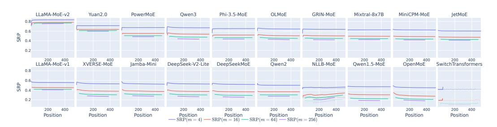
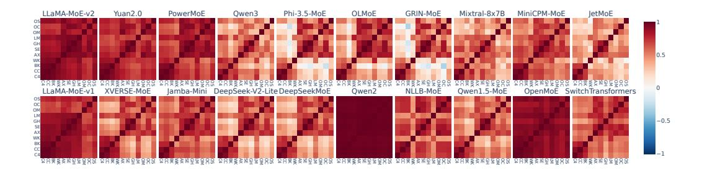
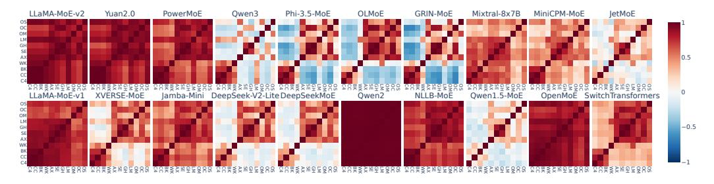
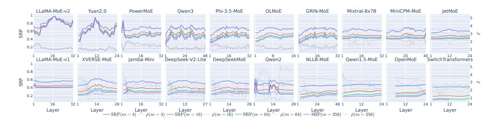
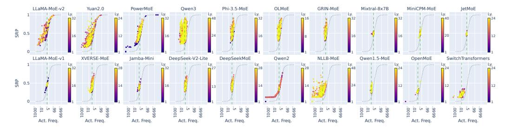
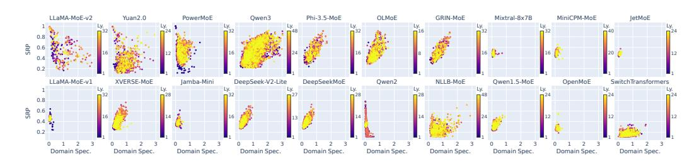
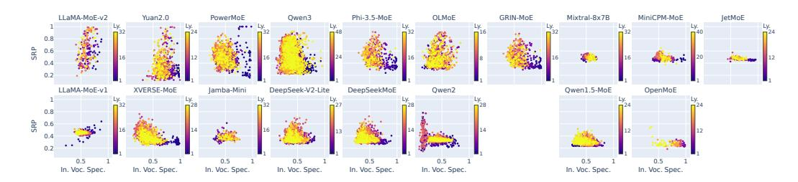
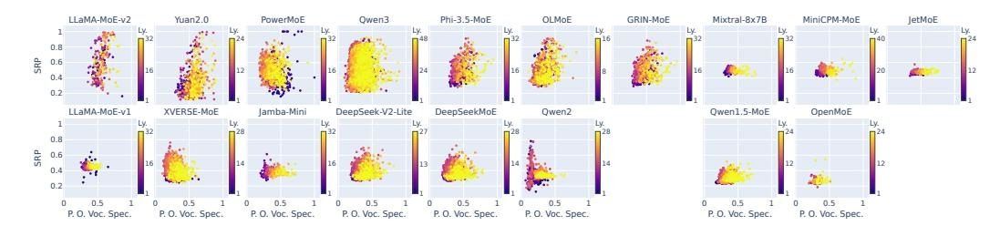
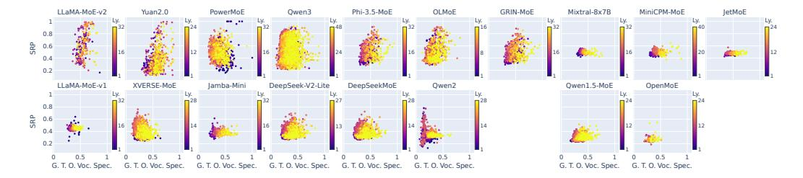

# E ADDITIONAL RESULTS

### E.1 BASE VS. POST-TRAINED

We selected three models—LLaMA-MoE-v1, OLMoE, and JetMoE—that have both base and posttrained versions released, and calculated SRP and ρˆ of each version. Table [6](#page-22-3) lists the results, from which we can see that the differences of both SRP and ρˆ between models before and after posttraining are not significant enough to change the degree of local routing consistency, regardless of what type of post-training (SFT, DPO, etc.) is applied. Another related fact is that Phi-MoE-3.5 and GRIN-MoE, which share the same model architecture but are trained differently, have similar local routing consistency. Both indicate that the training method may be less important than the model architecture concerning local routing consistency.

| Model        |       | m = 4 |       | m = 16 |       | m = 64 |       | m = 256 |
|--------------|-------|-------|-------|--------|-------|--------|-------|---------|
|              | SRP   | ρˆ    | SRP   | ρˆ     | SRP   | ρˆ     | SRP   | ρˆ      |
| LLaMA-MoE-v1 | 55.78 | 1.03  | 45.29 | 2.39   | 41.61 | 2.92   | 40.62 | 3.52    |
| +SFT         | +0.01 | -0.00 | -0.01 | -0.00  | -0.01 | +0.00  | -0.00 | -0.00   |
| OLMoE        | 64.69 | 1.00  | 50.91 | 1.06   | 45.53 | 1.21   | 42.64 | 1.19    |
| +SFT         | +0.40 | +0.00 | +0.47 | +0.01  | +0.50 | +0.02  | +0.60 | -0.02   |
| +DPO         | +0.37 | +0.00 | +0.43 | +0.01  | +0.47 | +0.02  | +0.57 | -0.02   |
| +Instruct    | +0.45 | +0.00 | +0.56 | +0.01  | +0.62 | +0.02  | +0.74 | -0.02   |
| JetMoE       | 60.22 | 1.09  | 47.45 | 2.26   | 42.78 | 2.69   | 41.09 | 3.15    |
| +SFT         | -0.20 | -0.00 | -0.14 | +0.01  | -0.12 | +0.02  | -0.09 | +0.03   |

Table 6: SRP between models before and after post-training.

## E.2 SRP PER SEGMENT POSITION

To determine whether the segment position p can affect the segment routing best performance, we calculate SRP on each segment position by summarizing statistics of all segments that share the same

+Chat -0.20 -0.00 -0.15 +0.01 -0.13 +0.02 -0.10 +0.03

position. Figure 9 illustrates this position-wise SRP at each possible segment position. Most models have nearly constant SRP at every position except p=0, where many models activate specialized experts to handle the beginning of the input sequence. This stability of local routing consistency across input positions allows us to use segments from all positions to calculate SRP, and apply conclusions based on SRP to any segment of the input (except the very first one).

Figure 9: Position-wise SRP of each model on the full corpus. For encoder-decoder models, dotted lines show the encoder SRP and solid lines show the decoder ones.

#### E.3 SRP ACROSS DOMAINS

To verify whether local routing consistency is transitive across different domains, we calculate the correlation of expert segment routing best performance between pair-wise domains and demonstrate it in Figure 10. We also compute the correlation of expert activation frequency between pair-wise domains, results illustrated in Figure 11. By comparing corresponding heapmaps, we can see that local routing consistency is nearly always positively correlated, even between distant domains on which the experts' activation frequencies are negatively correlated. This means that local routing consistency is transitive; domain-specialized experts with high local routing consistency in one domain tend to exhibit it in any other domain. We also found that some models (e.g., LLaMA-MoE-v2 and Qwen2) do not show a significant difference between domains, which is aligned with the results in Section 4.2.

Figure 10: Correlation between domain-wise expert SRP of each model. C4: C4; CC: Common-Crawl; BK: Books; WK: Wikipedia; AX: ArXiv; SE: StackExchange; GH: GitHub; LM: LMArena; OM: OpenMath; OC: OpenCode; OS: OpenScience.

### E.4 SRP vs. SCH

To clarify the relation between SRP and SCH, Table 7 lists the correlation between them across all models. The two metrics are always highly positively correlated regardless of the values of m and  $\rho$ . This ensures that SCH shares the same property of SRP under reasonable segment length and cache size. Furthermore, when  $\rho$  is around 1.5, the two metrics are most closely related, nearly perfectly linear, aligned with Figure 4 where most models have  $\hat{\rho} \in [1,3]$  when  $m \geq 16$ , as well as our previous claim that  $\rho = 2$  balances cache effectiveness and efficiency.

Figure 11: Correlation between the domain-wise expert activation frequency of each model. C4: C4; CC: CommonCrawl; BK: Books; WK: Wikipedia; AX: ArXiv; SE: StackExchange; GH: GitHub; LM: LMArena; OM: OpenMath; OC: OpenCode; OS: OpenScience.

Table 7: Correlation between SRP and SCH across all models. Bold font indicates the highest correlation across  $\rho$  for each m.

| $\rho = 0.5$ | $\rho = 1.0$            | $\rho = 1.5$                              | $\rho = 2.0$                                                                     | $\rho = 2.5$                                                                                                                   | $\rho = 3.0$                                                                 |
|--------------|-------------------------|-------------------------------------------|----------------------------------------------------------------------------------|--------------------------------------------------------------------------------------------------------------------------------|------------------------------------------------------------------------------|
| 67.28        | 94.17                   | 97.46                                     | 91.91                                                                            | 87.47                                                                                                                          | 81.49                                                                        |
| 81.16        | 97.09                   | 97.37                                     | 94.87                                                                            | 91.02                                                                                                                          | 84.87                                                                        |
| 86.77        | 97.76                   | 98.03                                     | 96.15                                                                            | 92.22                                                                                                                          | 87.31                                                                        |
| 88.28        | 97.35                   | 97.89                                     | 96.24                                                                            | 92.68                                                                                                                          | 87.69                                                                        |
|              | 67.28 81.16 86.77 | 67.28 94.17 81.16 97.09 86.77 97.76 | 67.28 94.17 <b>97.46</b> 81.16 97.09 <b>97.37</b> 86.77 97.76 <b>98.03</b> | 67.28       94.17 <b>97.46</b> 91.91         81.16       97.09 <b>97.37</b> 94.87         86.77       97.76 <b>98.03</b> 96.15 | 81.16 97.09 <b>97.37</b> 94.87 91.02 86.77 97.76 <b>98.03</b> 96.15 92.22 |

### E.5 STATISTICAL SIGNIFICANCE

Due to the very high correlation between SRP and SCH, we choose SCH to represent local routing consistency, and report the 95% confidence intervals when  $\rho=2$  in Table 8. The confidence intervals are obtained by bootstrapping 1,000 times with samples from the full corpus.

Table 8: 95% confidence interval of SCH ( $\rho=2$ ) of REAL models. The decoder of SwitchTransformer does not have valid data when m=256.

| Model            | m=4            | m = 16         | m = 64         | m = 256        |
|------------------|----------------|----------------|----------------|----------------|
| LLaMA-MoE-v2     | (96.88, 97.17) | (97.82, 98.03) | (97.28, 97.58) | (96.64, 97.01) |
| Yuan2.0          | (77.45, 78.17) | (81.69, 82.33) | (78.69, 79.44) | (76.98, 77.83) |
| PowerMoE         | (79.77, 80.30) | (80.62, 81.24) | (74.86, 75.71) | (72.47, 73.44) |
| Qwen3            | (72.86, 73.78) | (76.49, 77.46) | (68.14, 69.46) | (62.91, 64.55) |
| Phi-3.5-MoE      | (72.81, 74.03) | (74.57, 75.91) | (67.37, 69.13) | (63.65, 65.71) |
| OLMoE            | (71.27, 72.46) | (73.39, 74.71) | (65.74, 67.42) | (61.94, 63.87) |
| GRIN-MoE         | (71.02, 72.24) | (72.75, 74.09) | (65.35, 67.10) | (61.53, 63.57) |
| Mixtral-8x7B     | (76.67, 77.03) | (73.92, 74.42) | (66.59, 67.20) | (63.16, 63.86) |
| MiniCPM-MoE      | (76.14, 76.43) | (73.29, 73.67) | (65.57, 65.96) | (61.99, 62.44) |
| JetMoE           | (74.37, 74.66) | (70.60, 71.00) | (63.60, 64.04) | (60.30, 60.80) |
| LLaMA-MoE-v1     | (70.50, 70.80) | (66.07, 66.44) | (60.64, 61.02) | (58.16, 58.57) |
| XVERSE-MoE       | (55.32, 56.04) | (58.38, 59.14) | (47.53, 48.40) | (42.72, 43.64) |
| Jamba-Mini-1.6   | (57.33, 58.00) | (57.51, 58.24) | (47.49, 48.37) | (42.82, 43.84) |
| DeepSeek-V2-Lite | (55.16, 56.00) | (57.65, 58.49) | (47.04, 47.96) | (41.98, 42.99) |
| DeepSeekMoE      | (53.77, 54.65) | (56.24, 57.13) | (45.41, 46.52) | (40.25, 41.28) |
| Qwen2            | (54.73, 55.09) | (54.75, 55.08) | (46.52, 46.74) | (42.91, 43.14) |
| NLLB-MoE (en)    | (28.36, 29.55) | (35.92, 36.96) | (28.94, 30.06) | (24.62, 25.79) |
| (de)             | (35.39, 36.87) | (42.26, 43.54) | (37.31, 38.61) | (32.51, 33.83) |
| Qwen1.5-MoE      | (40.67, 41.47) | (45.79, 46.50) | (34.73, 35.50) | (29.45, 30.32) |
| OpenMoE          | (35.21, 36.55) | (39.42, 40.68) | (32.35, 33.80) | (29.02, 30.56) |
| SwitchTF (en)    | (12.39, 13.58) | (20.74, 21.86) | (16.92, 18.06) | (14.50, 15.66) |
| (de)             | (16.43, 17.81) | (23.89, 25.16) | (21.39, 22.61) | (21.39, 22.61) |

### E.6 LAYER LEVEL RESULTS

Figure 12 illustrates each model's layer-wise SRP. Most models have peak SRPs among middle layers, while some (e.g., Yuan2.0 and MiniCPM) have another peak at the last layer. We conjecture that middle layers are less tied to input/output tokens and thus more sensitive to the general topic, and the final layers process highly abstract information that is also more related to the overall topic. Both encourage routers to select similar experts within a local segment that share the same topic across tokens. PowerMoE and Qwen2 have another peak on layer 2 due to expert imbalance. Appendix E.7 gives a clear view on this.

Figure 12: Layer-wise SRP on the full corpus of each REAL model. Solid lines show SRP while dotted lines show corresponding  $\hat{\rho}$ .

We also calculated layer-wise SCH, results demonstrated in Figure 13. The patterns are the same as SRP, indicating a high correlation between the two metrics.

Figure 13: Layer-wise SCH on the full corpus of each REAL model. Solid lines show SCH when  $\rho = 1$  while dotted lines show SCH when  $\rho = 2$ .

### E.7 EXPERT LEVEL RESULTS

We demonstrate expert-wise segment routing best performance against activation frequency in Figure 14. LLaMA-MoE-v2, Yuan2.0, and PowerMoE have experts with very high activation frequency. These experts naturally have very high local routing consistency and contribute to these models' high model-level local routing consistency. The imbalanced experts of PowerMoE mainly belong to layer 2, which also explains the observation in Section E.6.

Furthermore, Figures 15, 16, 17 and 18 compares SRP with domain and vocabulary specialzations. The plots are aligned with the conclusion of Section 4.2 that when the model exhibits domain specialization, domain-specialized experts contribute more to overall local routing consistency than vocabulary-specialized experts.

### F FURTHER DISCUSSIONS ON THROUGHPUT

The purpose of SRP and SCH is to provide a general metric that is agnostic to concrete implementations, where SRP solely depends on the model and SCH also considers a hard limit on cached experts. On the other hand, the performance of a true expert offloading system, usually measured through throughput, is not only decided by the deployed model, but also the implementation of the

Figure 14: Per-expert activate frequency vs. SRP. The x-axis is stretched to show experts with very low or high activation frequency. Gray dashed lines indicate the theoretical lower bound of SRP at different activation frequencies. Green dashed lines show the expected activation frequency of experts from each model.

Figure 15: Per-expert domain specialization vs. SRP.

Figure 16: Per-expert input vocabulary specialization vs. SRP. Encoder-decoder models are not involved due to different input formats from other decoder-only models.

Figure 17: Per-expert predicted output vocabulary specialization vs. SRP. Encoder-decoder models are not involved due to different input formats from other decoder-only models.

Figure 18: Per-expert ground-truth output vocabulary specialization vs. SRP. Encoder-decoder models are not involved due to different input formats from other decoder-only models.

system, including but not limited to cache management, overlap exploitation, hardware coordinate, etc. Nevertheless, local routing consistency still plays an important role on the model side. Below is an informal, theoretical analysis about how local routing consistency (we use SCH as an example) may affect the actual throughput.

For simplicity, we assume that there is only one GPU with limited GPU memory (insufficient for the whole model but enough for activated parameters and calculation), and a group of CPU with sufficient flash memory. (This is a common configuration on edge devices.) Consider an expert offloading system that offloads whole experts only. During the decoding stage (the more time-consuming stage), compared to full GPU inference, it may introduce the following overhead:

- 1. During the calculation of the last layer, the system (if capable) may predict what experts the upcoming layer (or the next forward run) will use, and prefetch these experts to GPU. The overhead of prefetching one expert can be relatively small because the prefetch process can overlap with the current calculation.
- 2. After the router decides what experts to use, if a demanded expert is not on the GPU, the system will need to either (1) load the expert to GPU on-the-fly, adding a communication overhead, or (2) run the expert on CPU directly, adding a calculation overhead. Both overheads are more significant than the prefetch overhead because no overlap can be utilized.

Based on the above analysis, during a forward run in the decoding phase, an ideal expert offloading system will always prefetch the correct group of experts for the upcoming layer or the next forward run, so the only overhead occurs during prefetching. This overhead also consists of two parts: (1) predicting the prefetched experts, whose overhead can be treated as constant as the system is ideal; (2) loading the selected experts, whose overhead is proportional to the number of cache misses between forward runs. As long as the GPU memory can hold more experts than the activated ones, the system will have to decide what extra experts to keep on GPU. When the expert activation sequence is known, the optimal eviction list is given by the Beladi algorithm; however, this algorithm relies on the precise time each expert will be activated in the future, which is very difficult to predict in practice. To this end, SCH with a specific segment length can be used as an approximation that considers the frequency of close-future expert activations, which is easier to predict. Therefore, SCH (more precisely 1 − SCH) can be seen as an upper bound of the minimum number of cache misses, which is approximately proportional to the minimum overhead any expert caching system under the same single-expert prefetching overhead.

To further verify the relation between local routing consistency and the actual throughput or overhead of typical expert offloading systems, we implemented a naive version that utilizes LRU cache and always load missed experts on-demand. We use it to deploy all TOY models and measure their throughput on the full corpus under different cache sizes. The benchmark results show that the relative overhead w.r.t. full GPU inference has different correlations to SCH at the two inference stages: positive during prefilling (r ≈ 0.2), and negative during decoding (r ≈ −0.3). The relation holds under various cache size ratio ρ. Note that the directions of the correlations align with the relation between local routing consistency and local load balance: During prefilling, multiple consecutive tokens are processed in one run, where tokens belong to the same expert will be dispatched to that expert together, so the bottleneck is the largest number of tokens an expert needs to process, which is related to local load balance. During decoding, however, only one token is processed per run, making the activated expert distribution between consecutive runs more important, which is the concern of local routing consistency. Since decoding is almost always more time-consuming on single queries, we conclude that local routing consistency is more important and local load balance may be sacrificed to some extent. Nevertheless, the correlation coefficient is not far from 0, indicating that there are also other significant factors that affects the system throughput, so the model (as well as local routing consistency) should not be the sole decider.