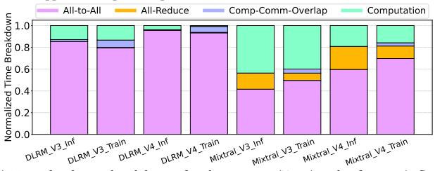

# 1 Introduction

Deep learning (DL) has demonstrated remarkable potential in numerous domains, such as computer vision [\[31,](#page-13-0) [41\]](#page-13-1), recommendation systems [\[18,](#page-13-2) [21,](#page-13-3) [51\]](#page-13-4), and natural language processing [\[67,](#page-14-0) [71\]](#page-14-1). To achieve higher model accuracy, advanced deep neural network (DNN) models possess large amounts of parameters [\[12,](#page-12-0) [24,](#page-13-5) [69\]](#page-14-2) and keep growing at an extremely rapid pace [\[10\]](#page-12-1). To meet the swiftly increasing processing demands within the constraints of single-device computational and storage capacities [\[62\]](#page-14-3), distributed computing has become a common practice [\[2,](#page-12-2) [25,](#page-13-6) [38,](#page-13-7) [58,](#page-13-8) [74\]](#page-14-4). By connecting from hundreds to more than tens of thousands of AI accelerators [\[37,](#page-13-9) [53\]](#page-13-10) to process partitioned computational tasks in parallel, distributed DL systems can effectively reduce model inference and training time. Collective communication is introduced for data synchronization of model weights and activations across numerous accelerators, with All-to-All being a notable example.

All-to-All collective is widely used for the conversion between data parallelism and model parallelism under hybrid parallel deep learning, as represented by Deep Learning Recommendation Model (DLRM) [\[51\]](#page-13-4) and Mixture-of-Experts (MoE) [\[35,](#page-13-11) [46,](#page-13-12) [59,](#page-13-13) [65\]](#page-14-5) models. As shown in Figure [1a,](#page-1-0) DLRM model features large embedding layers that need to be partitioned and processed in parallel across

multiple NPUs, known as model parallelism [51]. The outputs after embedding lookup operation must then serve as inputs into subsequent MLP layers that adopt data parallelism, necessitating the use of All-to-All to transform from computation in tensor dimension to that in batch dimension. Similarly, in MoE models, the experts layer assigns experts across multiple NPUs, which is called expert parallelism [46]. As shown in Figure 1b, the preceding self-attention layers usually employ data parallelism, where each token selects several experts for computation after gating. Then, All-to-All collective is invoked to communicate the input tokens in each device to the devices that host the selected experts of each token.

Figure 1c shows the normalized time breakdown for distributed computing of common DLRM and MoE models on typical TPU clusters which is simulated by the ASTRA-SIM simulator [60]. For DLRM models, the bottom MLP layer can be executed concurrently with All-to-All [51], which is fully overlapped. During back propagation, weight gradient synchronization among the devices requires All-Reduce, which can be nearly fully masked by the longer computation time. In contrast, All-to-All becomes the performance bottleneck. In summary, the embedding layers of DLRM and expert layers of MoE need to be partitioned and distributed across numerous NPUs, resulting in significant All-to-All data volume [14, 29]. Additionally, All-to-All is blocking and hard to be hidden by computation during the forward pass. These characteristics together makes All-to-All the bottleneck of model training.

Numerous proposals have focused on alleviating the All-to-All communication bottleneck encountered during DNN training with system-level optimizations [14, 29, 30, 33, 36, 57]. Lancet orchestrates the computation graph of model training to facilitate better overlapping of computation and communication, thereby mitigating All-to-All overhead [36]. ScMoE adopts algorithm-system codesigned method, which adjusts data interdependency to cover All-to-All with non-expert computation time [14]. However, these efforts are often tailored to specific models and fail to offer universal optimization solutions for a range of All-to-All constrained models, including DLRMs. Furthermore, All-to-All cannot be fully overlapped and remains a bottleneck in distributed deep learning when communication time significantly exceeds computation time.

Previous studies have proposed general algorithms, such as Bruck algorithm, to optimize All-to-All [27, 40, 54, 56, 68, 70]. These topology-oblivious methods work well for full-bisection-bandwidth networks such as switch-based Clos [7, 20, 63], which feature any-to-any connections [72]. But they struggle in direct torus networks, causing severe link contention and significant performance degradation at scale. Despite this challenge, torus networks remain a popular choice for HPC and machine learning systems due to their path diversity and cost-effective scaling, eliminating the need for expensive high-radix switches. This has led to their adoption in various systems, including the TPU-series clusters [38, 39], Fugaku supercomputer [5, 6], Amazon Trainium server [1], Enflame's AI Pod [55], and Graphcore IPU-POD [48]. Given their widespread use, it is imperative to optimize All-to-All in torus networks.

Prior work has proposed All-to-All algorithms for torus networks to improve bandwidth utilization and reduce contention [43, 44, 66, 78]. However, they rely on hardware routing for direct source-destination communication through multi-hop transmissions, which cannot fully eliminate network contention. Recently,

(a) Embedding layer in DLRMs with embedding table scattered on 2 devices. Training adopts model parallelism for table lookup, and data parallelism after concat operation.

(b) Expert layer in top-2 MoE models with 4 experts scattered on 2 devices. Training adopts data parallelism before gating and after aggregation, in between expert parallelism is applied for expert computation.

(c) Normalized time breakdowns for the training (Train) and inference (Inf) of DLRM [51] and Mixtral [4] models on 8×8 TPUv3 [39] and 8×8×8 TPUv4 [38] clusters. The portion of All-to-All varies from 41.5% to 95.7%.

Figure 1: All-to-All collective of distributed DLRM (a) and MoE models (b), and normalized time breakdown of model training and inference (c). Evaluation methodology is described in Section 5.1.

Google employs dimension-order routing on 3D-torus TPUv4 clusters, balancing intra-dimension traffic but still facing contention from multi-hop routing and inter-dimension load imbalance. In this work, we eliminate contention entirely by decomposing each multi-hop transmission into single-hop steps, using hop-by-hop store-and-forward scheduling to orchestrate fine-grained link allocation and achieve contention-free, full-bandwidth utilization.

Furthermore, keeping the daunting training job stable for a long-running time at scale presents a significant challenge. Large models like DLRM and MoE often require training on thousand-node clusters for weeks [37]. Network failures [23, 26], such as typical link failures, can cause collective communication interruptions, and thereby impacting the entire training process and incurring substantial extra overhead. In All-to-All, every node sends and receives data to and from all other nodes. This means that a single failure not only affects an individual point-to-point transmission but also the transmissions across all nodes, thereby severely degrading overall efficiency. Therefore, ensuring the reliability and scalability of All-to-All in large-scale networks becomes especially critical.

Figure 2: All-to-All in a ring (1-D torus) topology with Ring algorithm. In networks with bidirectional bandwidth, Ring algorithm splits the data evenly in both directions to fully utilize bandwidth. In the figure, right-side blocks represent data transmitted clockwise, while left-side blocks (with white dots) represent data transmitted anticlockwise. The four colors denote the final All-to-All data that each node receives, while the color shades indicate the data initially held by each node. The color of each link reflects the data block being transmitted at that moment. Ring algorithm adopts store-and-forward method for multi-hop transmissions to avoid congestion, marked as Fwd in each sub-stage.

Previous studies have explored fault-tolerant designs for model training in healthy networks [\[37,](#page-13-9) [73\]](#page-14-12), with MegaScale focusing on systemic optimizations for fault detection and rapid recovery during large-scale training [\[37\]](#page-13-9). Other work has addressed communication in faulty networks, such as Google's AltRing All-Reduce algorithm for 2D mesh [\[42\]](#page-13-32) and TPUv4's ICI routing with offline optimization to maintain network throughput under link failures for torus [\[78\]](#page-14-11). Despite these advances, dedicated optimizations for fault-tolerant All-to-All remain underdeveloped, leaving reliable and efficient large-scale All-to-All communication a significant challenge.

In this paper, we propose All-to-All optimizations for multidimensional torus networks under both fault-free and fault-tolerant scenarios. All-to-All on an -D torus can be decomposed into phases, each handling communication along one dimension.Our optimizations focus on two key aspects: communication algorithms within each dimension and the scheduling of execution order across dimensions for each data chunk. For fault-free networks, we introduce HalfRing algorithm, which achieves shortest path hop-by-hop store-and-forward data delivery and full bandwidth utilization, paired with DimRotation scheduling to balance traffic across dimensions. For faulty networks, we implement FoldedRing, a faulttolerant algorithm for each dimension, and MATE, a scheduling that exploits multi-dimensional links to accelerate communication on the faulty ring. In summary, our contributions are as follows:

- We propose HalfRing, a bandwidth- and latency-optimal All-to-All algorithm for each ring, paired with DimRotation scheduling to balance traffic across dimensions, greatly enhancing All-to-All efficiency in fault-free torus networks.
- We introduce FoldedRing, a fault-tolerant algorithm for handling link failures, and MATE scheduling, which exploits multi-dimensional link bandwidth to accelerate FoldedRing communication, ensuring reliable and efficient All-to-All communication even under link failures.
- Comprehensive experiments show that our methods achieve average speedups of 2.28× and 1.37× over the fault-free baseline for fault-free and fault-tolerant conditions, respectively, and outperform Google's routing by 1.57× and 1.61×.

