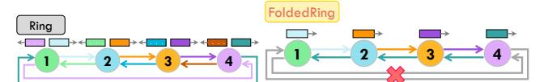

# 2.4 Fault-Tolerant Collective Communication

Common failures in interconnection networks include node and link failures [\[23,](#page-13-30) [26\]](#page-13-31). Typically, ML systems address them by replacing faulty components with healthy ones to resume training [\[15,](#page-12-12) [49,](#page-13-37) [73\]](#page-14-12). However, this incurs significant costs for data backup and checkpointing, disrupting the training process. Fault-tolerant routing offers a more efficient solution by creating new communication paths to circumvent fault areas, enabling fault tolerance without replacing devices or interrupting training [\[26,](#page-13-31) [78\]](#page-14-11). Figure [4a](#page-3-2) illustrates adaptive routing during node and link failures. Failures at endpoints may result in the loss of routing functionality in output ports, causing link failures associated with those connections [\[26\]](#page-13-31).

Additionally, faults in optical circuit switches (OCS) can lead to the failure of all connected links, creating a periodic link failure pattern [\[78\]](#page-14-11). As shown in Figure [4b,](#page-3-2) 4×4×4 TPUv4 pods require 48 OCSs for reconfigurable interconnects, with each pod's surface nodes on the X-Y, Y-Z, and X-Z planes connecting to 16 different OCSs. For example, the failure of OCS 34 (responsible for interconnects on the X-Z plane) causes four corresponding links to fail, including two wrap-around links: (2,3,0)-(2,3,3) and (6,3,0)-(6,3,3). Both fault types in Figure [4](#page-3-2) result in link failures, highlighting the critical need for fault-tolerant optimizations to address link failures.

Traditional fault-tolerant routing is designed for general pointto-point communication rather than collective communication common in model training. Collective communication involves data transmission across multiple devices, with fixed patterns and heavy overhead. While simple fault-tolerant routing can maintain data

<span id="page-4-0"></span>

Figure 5: All-to-All with HalfRing algorithm. The data volume transmitted in stage 1 is twice that of stage 1 in Ring algorithm. In this case, HalfRing reduces the All-to-All time to four sub-stages (Figure 5a- 5c), compared to six sub-stages (Figure 2a- 2f) in the Ring algorithm.

transmission for a single node, routing changes can affect link allocations and thus reduce efficiency of other nodes. Designing fault-tolerant schemes tailored for collective communications [42] can minimize the impact on communication efficiency, thus providing a basis for more reliable and high-performance model training.

#### 2.5 Fault Model and Assumptions

We follow Google's fault detection and tolerance mechanisms on TPUv4 [78]. Machine failures are identified and resolved through preflight checks before task assignment. During task execution, a software daemon, healthd, monitors hardware health by continuously checking link connectivity across all TPUs. If link or OCS failures occur, healthd notifies the cluster management service Borg, triggering job restarts from the last checkpoint. Affected TPUs then switch their inter-chip interconnect (ICI) routing tables from fault-free to fault-tolerant mode. From this point, all communications, including All-to-All, proceed despite network failures.

We optimize All-to-All for both fault-free and faulty torus. In faulty cases, we assume a single link failure at a random location. Thanks to the geometric symmetry of torus, the failure location presents a consistent view to our methods. Our approach also generalizes to more complex failure scenarios, such as OCS failures and multiple link failures, as discussed in Sections 4.2, 5.4 and 5.7.

#### 3 Fault-Free All-to-All

In this section, we optimize fault-free All-to-All from two perspectives. Section 3.1 introduces HalfRing algorithm for All-to-All in single-dimensional torus (ring); while Section 3.2 covers DimRotation for communication scheduling across multiple dimensions.

#### 3.1 Single-Dimensional HalfRing Algorithm

In Ring algorithm on a ring topology, all nodes transmit data concurrently over equal distances in each stage. The algorithm consistently achieves full link bandwidth utilization. However, it achieves suboptimal performance due to extra link bandwidth consumption caused by unnecessarily long transmission paths. As shown in Figure 2d-2f, following the clockwise order, data transmission from node 1 to node 4 requires 3 sub-stages, even though they are only one hop apart. In typical bidirectional networks, the Ring algorithm uses clockwise and anticlockwise links independently and communicates in both directions simultaneously. In stage 3, the transmission requires three hops clockwise but only one hop anticlockwise. This asymmetry leads to suboptimal performance for some stages, as non-minimal path forwarding consumes additional link bandwidth.

Based on this observation, we propose the HalfRing algorithm, which leverages bidirectional links for path allocation with shortest communication distance. In each stage, HalfRing determines the transmission direction based on the actual distance between sender and receiver. Since all nodes communicate over the shortest path, each stage consumes bandwidth in only one direction, thereby leaving the other direction available to be used by another stage with the same communication hops. Take node 1 in Figure 5a as an example, HalfRing selects anticlockwise and clockwise directions for transmitting two purple and two green blocks (both in one-hop), respectively. With no link conflicts, communications in both directions proceed simultaneously. In a ring with odd number of nodes (N=2k+1), there are 2k stages, and All-to-All can be completed in k pairs. For a ring with even number of nodes (N=2k), there are 2k-1 stages, resulting in one unpaired stage, like stage 2 in Figure 5b. HalfRing splits data of the unpaired stage evenly, and sends it in both directions, thus fully utilizing the bandwidth.

<span id="page-4-1"></span>Table 1: Performance analysis of different All-to-All algorithms on ring (1-D torus) under the linear cost model [68]. The total communication time consists of two parts: startup time and data transfer time. Startup time refers to the fixed delay caused by the algorithm and system latencies, which is independent of message size. Transfer time reflects the duration of data transmission. In All-to-All collectives for DL training, transfer time dominates the whole time. Parameter definitions: S: data size of each node, N: number of nodes in the ring, B: unidirectional bandwidth,  $\alpha$ : per hop propagation delay. Ratio denotes performance relative to the baseline ring algorithm.

| Algorithm               | Startup Time  | Transfer Time                        | Ratio |
|-------------------------|---------------|--------------------------------------|-------|
| Ring                    | α             | $\frac{N-1}{2} \cdot \frac{S}{2B}$   | 1     |
| HalfRing<br>(N even)    | α             | $\frac{N}{8} \cdot \frac{S}{B}$      | 1-2   |
| HalfRing<br>(N odd)     | α             | $\frac{N^2-1}{8} \cdot \frac{S}{NB}$ | 1.5-2 |
| FoldedRing <sup>†</sup> | $(N-1)\alpha$ | $\frac{N-1}{2} \cdot \frac{S}{B}$    | 0.5   |

 $<sup>^\</sup>dagger$  The performance of Folded Ring is analyzed in a network with a single random link failure, while others are analyzed in a healthy network.

By comprehensively leveraging bidirectional bandwidth in each multi-hop stage, HalfRing ensures both full bandwidth utilization and shortest communication path, achieving the optimal performance in terms of both bandwidth and latency on ring topologies. The performance analysis of algorithms is shown in Table 1, and the algorithm is detailed in **HalfRing\_Generator** of Algorithm 1. Take Ring algorithm in Table 1 as an example, there are  $\frac{N(N-1)}{2}$  one-hop data transmissions (i.e., sub-stages), each with data size of  $\frac{S}{N}$ . Given bidirectional bandwidth 2B, the transfer time is computed by multiplying the number of transmissions by data size per transmission and dividing by bandwidth. Similar to Ring algorithm, HalfRing decomposes all data transfers into single-hop transmission between neighbor nodes and orchestrates each hop explicitly, eliminating the possibility of deadlocks (no multi-hop transmission), livelocks (no detour), and network contention (no link sharing).

<span id="page-5-1"></span>

Figure 6: An example for DimRotation on 2D torus.

<span id="page-5-2"></span>

Figure 7: Comparison of pipeline and DimRotation for 3 data chunks on 3D network. X-1 denotes the X-dim communication of chunk 1.

#### 3.2 Multi-Dimensional DimRotation Scheduling

All-to-All on N-dimensional topologies can be divided into N phases, conducted sequentially across N dimensions, with communication in each dimension independently adopting its All-to-All algorithm. Despite such sequential dependencies, data can be divided into multiple chunks, each employing a different order of communication dimensions. DimRotation signifies the order of communication dimensions of each data chunk, as illustrated by walking through an example in Figure 6. In the 2D torus, data is split into two chunks, with chunk 1 following X-Y order and chunk 2 following Y-X, ensuring full-bandwidth utilization. For chunk 1, the data destined for a particular column y is sent to the corresponding intersecting node of column y and X-dim in phase 1 via HalfRing. Then, the data is relayed in phase 2 on Y-dim to the destinations using HalfRing.

We further illustrate the advantages of DimRotation through comparisons over time. All-to-All on 3D torus needs three phases across X, Y, and Z dimensions, and each phase fully utilizes the bandwidth of all rings in the corresponding dimension. Rings in each dimension transmit data simultaneously in each phase. Pipeline scheduling splits data into multiple chunks [61], which are then communicated sequentially with the same X-Y-Z dimension order. As depicted in Figure 7a, pipeline enhances bandwidth utilization by running several chunks on different dimensions concurrently.

We find that pipeline scheduling inevitably introduces bubbles that prevent full utilization of network bandwidth. Additionally, choosing an appropriate chunk size in pipeline scheduling is also challenging [16]. With a large chunk size, pipelining cannot sufficiently overlap time for different chunks across dimensions, leading to poor performance. Conversely, when the chunk size is small, numerous chunks introduce significant scheduling costs and communication initialization overhead, increasing overall latency.

To address these challenges, we propose DimRotation scheduling to ensure bubble-free and completely overlapping multi-dimensional All-to-All. For an N-D torus, data is evenly divided into N chunks, with the  $i_{th}$  chunk communicating in the order of dimensions  $i_{th}$ ,  $i_{th}+1,...$ , etc. Figure 7b demonstrates DimRotation timeline on 3D torus, where DimRotation allows three chunks to

perform conflict-free, full-coverage multi-dimensional communication, achieving complete bandwidth utilization. Simultaneously, the number of chunks is set to the minimum required to fully overlap communications, significantly reducing scheduling overhead.

```
Algorithm 1: Fault-Free All-to-All
```

```
Input: Data size per node: S, Topology dimension: N,
   A 2D list Torus[][] where Torus[i][j] indicates the j_{th} node in the
   ith dimension of torus network
   Output: A 2D list Schedule[][] where Schedule[k][]
   gives the order of dimensions that the k_{th} chunk should traverse for
   Dest\_CW[\alpha][\beta] and Dest\_ACW[\alpha][\beta] refer to the clockwise and
   anticlockwise destination for each node in the \alpha stage and \beta sub-stage,
   Comm Size [\alpha][\beta]
1 Procedure Scheduler(S, N):
        Chunk\_Num \leftarrow N, Chunk\_Size \leftarrow S/N, i, j \leftarrow 0
2
        for i \leftarrow 0 to Chunk_Num do
            for j \leftarrow 0 to N do
              6 Procedure
    HalfRing_Generator(Schedule, Torus, Chunk_ID, Phase):
       Dim \leftarrow Schedule[Chunk\_ID][Phase]
        Ring\_Nodes \leftarrow Torus[Dim][], N_{nodes} \leftarrow size(Ring\_Nodes)
        if N_{nodes} % 2 == 1 then
9
10
            Stage\_Num \leftarrow (N_{nodes} - 1)/2
11
        else
         | Stage_Num \leftarrow N_{nodes}/2
12
        for node ∈ Ring Nodes do
13
            comm\_size \leftarrow S/N_{nodes},
14
                                            \alpha \leftarrow 0
            for \alpha < Stage_Num do
15
                 if \alpha == Stage_Num - 1 and N_{nodes} \% 2 == 0 then
16
                   comm\_size \leftarrow comm\_size/2
17
                 Sub\_Stage\_Num \leftarrow \alpha, \quad \beta \leftarrow 0
                 for \beta < Sub Stage Num do
19
                      Dest\_CW[\alpha][\beta] \leftarrow (node + 1)\%N_{nodes}
20
                      Dest\_ACW[\alpha][\beta] \leftarrow (node + N_{nodes} - 1)\%N_{nodes}
21
                      Comm\_Size[\alpha][\beta] \leftarrow comm\_size
```

For networks with heterogeneous bandwidth or mixed-radix feature where number of nodes vary from dimensions, DimRotation can also provide optimal scheduling performance. When the heterogeneity leads to varying communication overhead across dimensions, the total time consumption is always limited by the dimension with the poorest performance. Unlike All-Reduce [61], changing the execution order or chunk sizes cannot optimize performance by the fixed data volume of each dimension. DimRotation ensures that the total All-to-All time does not exceed the communication time for complete data in the worst-performing dimension. Depending on Pod partitioning, the All-to-All topology may lack wraparound links in certain dimensions, resulting in bandwidth heterogeneity resembling a mixed-radix torus and can be handled similarly. The algorithm is presented in Scheduler of Algorithm 1.

#### 4 Fault-Tolerant All-to-All

In this section, we present our fault-tolerant All-to-All scheme from two aspects. Section 4.1 introduces fault-tolerant FoldedRing algorithm. Section 4.2 covers MATE and MATEe (MATE enhanced) which accelerate communication on the faulty ring.

<span id="page-6-1"></span>

(a) Ring algorithm on the fault-free ring (b) FoldedRing algorithm on the faulty ring Figure 8: Comparison of Ring and FoldedRing algorithms for All-to-All stage 1 in Figure 2a. With a link failure between nodes 1 and 4, all anticlockwise link bandwidth is repurposed to compensate for the faulty link. Communication is continued in a folded ring manner. FoldedRing needs twice as much time as Ring to complete stage 1.

