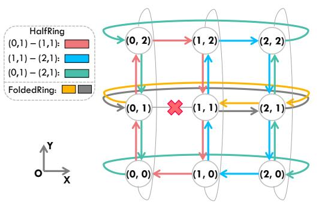

# 4.1 Single-Dimensional FoldedRing Algorithm

Ring algorithm requires direct links between every two nodes for data transmission. If a link fails, the nodes at either end cannot transmit data, leading to the failure of Ring algorithm. For a single link failure, we find that the end nodes of faulty link are not isolated and they can still establish a connection through detouring. Based on this, we propose FoldedRing algorithm, which constructs a compensation connection for the faulty link using all available anticlockwise links. Together with left clockwise links, a folded ring is created to continue communication in a Ring manner.

As shown in Figure 8b, when the link between nodes 1 and 4 fails, the logical connection from node 4 to node 1 can be constructed using three blue physical anticlockwise links. By utilizing other clockwise links which has the opposite direction to the blue links, Ring algorithm for these four nodes is restored. FoldedRing algorithm utilizes all available link bandwidth for communication. Note that FoldedRing can be further adapt for fault-tolerant ring algorithms in other collective communications such as All-Reduce, Reduce-Scatter, and All-Gather. The performance analysis of FoldedRing algorithm is presented in Table 1.

#### <span id="page-6-0"></span>4.2 Multi-Dimensional MATE Scheduling

While FoldedRing enables fault-tolerant All-to-All on the faulty ring, it still faces several challenges. Firstly, as shown in Table 1, FoldedRing's performance is half that of the baseline Ring algorithm and significantly lower than our proposed HalfRing algorithm. Additionally, FoldedRing requires a longer startup time to establish connections between endpoints across the faulty link, further widening the performance gap. As shown in Figure 10a, slow transmission on the faulty ring leads to a mismatch in the DimRotation scheduling. The transmission in X dimension is slowed down due to the faulty ring, which in turn affects transmissions in other dimensions, leading to a decrease in overall All-to-All performance.

Secondly, FoldedRing algorithm can only address single link failure within a ring. For two or more failures, FoldedRing cannot build connections on the faulty ring. Therefore, although communication between both endpoints of the faulty link can still continue through routing in other directions, All-to-All is still forced to interrupt.

These challenges motivates MATE, an scheduling optimization for fault-tolerant All-to-All. MATE utilizes links in other dimensions to accelerate data transmission on the faulty ring, thereby providing a more efficient and robust All-to-All fault tolerance solution.

Figure 9 illustrates the acceleration phase for handling the link failure between nodes (0,1) and (1,1). Initially, partial data is transmitted through the faulty ring using FoldedRing. Subsequently, MATE utilizes links from other X-dim rings to construct bidirectional connections for each node on the faulty ring, thus enabling

<span id="page-6-3"></span>

Figure 9: Link utilization during the acceleration phase of MATE on 2D torus. With the link failure between (0,1) and (1,1), MATE utilizes links from other dimensions to accelerate the slow communication on the faulty ring. On the 2D torus, one set of extra bidirectional links can be used to accelerate each data transmission except for original communication in the faulty ring with FoldedRing algorithm.

<span id="page-6-2"></span>

with allocated data size in X-dim, reducing the data volume in acceleration phase  $|M_e|$  Figure 10: Scheduling with a link failure in X-dim. Communication on the faulty X-dim ring uses FoldedRing, while communication on other X-dim rings uses HalfRing. As the acceleration requires links from other dimensions, it is executed as a separate acceleration

phase, denoted as M or  $M_e$ .

efficient communication of the remaining data using HalfRing. Taking the transmission between nodes (0,1) and (1,1) as an example, three red links in (0,1)-(0,2)-(1,2)-(1,1) are used to connect (0,1) and (1,1), and three red links below establish the connection from (1,1) to (0,1). These six red links form a bidirectional connection between the endpoints. Similarly, blue and green links establish bidirectional links between other adjacent nodes within the faulty ring for HalfRing. Therefore, All-to-All is enhanced by distributing data for simultaneous transmission through HalfRing on these additional X-dim links and FoldedRing within the faulty ring.

MATE is capable of reliably accelerating fault-tolerant All-to-All on N-D torus for two main reasons. First, each plane containing the faulty ring can construct conflict-free bidirectional connections for that ring. Essentially, data transmission in the faulty ring is offloaded to other rings within the same dimension. We only need to ensure that these fault-free rings are identified, and data can be transferred from the faulty ring to them. For example, in Figure 9, this is achieved by connecting nodes on the faulty ring with nodes of two fault-free rings through links in the Y-dim. These two rings are (0,2)-(1,2)-(2,2) and (0,0)-(1,0)-(2,0). Furthermore, links between each acceleration plane should be conflict-free. This feature is inherently guaranteed by the orthogonality of torus topologies. Thus, we can utilize HalfRing on N-1 planes to accelerate communication for a

single link failure in an N-D torus theoretically. MATE fully utilizes bandwidth of every point on the faulty ring to offer acceleration.

```
Algorithm 2: Fault-Tolerant All-to-All
```

```
Input: Data size per node: S, Topology dimension: N
   Faulty ring dimension: D_{fault}, 2D list Torus[i][j]
   Link state: Link[m][n], Acceleration planes: Planes
   mode \in \{MATE, MATEe\}, MATEe fraction: fraction
   Output: Communication schedule Schedule[chunk][phase][i][j]
 1 Procedure FoldedRing_Gen(Ring Nodes, Link):
        N_{nodes} \leftarrow \text{size}(Ring\_Nodes)
        for stage \leftarrow 1 to N_{nodes} - 1 do
             for node \leftarrow 0 to N_{nodes} - 1 do
                  dest \leftarrow (node + stage)\% N_{nodes}
                  if Link[node][dest] then
                    [ FoldedRing\_Comm[stage][node] \leftarrow dest
                  else
                       path \leftarrow [], \quad curr \leftarrow node
                       while curr ≠ dest do
10
                            next \leftarrow (curr - 1 + N_{nodes})\%N_{nodes}
11
                            if Link[curr][next] then
                             \lfloor path.append(next), curr \leftarrow next
 13
                            else
 14
 15
                                break
                       FoldedRing\_Comm[stage][node] \leftarrow path
17 Procedure
     \begin{tabular}{ll} {\tt MATE\_Scheduler}(S,N,D_{fault},Torus,Link,Planes,mode,fraction): \\ & Chunk\_Num \leftarrow N, & Chunk\_Size \leftarrow S/N \end{tabular} 
18
        \textbf{for } chunk \leftarrow 0 \textbf{ to } Chunk\_Num - 1 \textbf{ do}
             for phase \leftarrow 0 to 2N - 1 do
21
                  if phase\%2 == 0 then
                        Normal phase: p \leftarrow phase/2,
                       dim \leftarrow (chunk + p)\%N
                       if dim \neq D_{fault} then
23
                            Schedule[chunk][phase][i][j] \leftarrow
24
                            HalfRing\_Func(Torus[dim][:], Link)
                       else
                            if mode == MATE then
                              \c Schedule[chunk][phase][i][j] \leftarrow {\tt None}
27
                            else
28
                                 Data_in_FoldedRing \leftarrow
                                 Chunk Size × fraction
                                 Schedule[chunk][phase][i][j] \leftarrow
 30
                                 FoldedRing_Gen(Torus[dim][:], Link)
                  else
31
                        Acceleration phase: planes ←
32
                       {\tt GetAvailPlanes}(Planes, D_{fault})
                       Schedule[chunk][phase][i][j] \leftarrow
                       HalfRing_Planes(planes, Torus, Link),
                       FoldedRing\_Gen(Torus[D_{fault}][:], Link)
```

Figures 10b and 10c respectively illustrate the timelines for two scheduling schemes: MATE and MATEe (MATE enhanced) as Algorithm 2. The acceleration requires using other rings within the same dimension and links from other dimensions, thus necessitating the addition of a distinct phase M after each normal phase. Data volumes for acceleration are allocated across different planes through offline performance analysis, ensuring concurrent transmissions. MATE eliminates data transmission during normal phases, relying solely on the accelerated phase M to transmit data on the faulty ring. To reduce the communication workload during acceleration phases,

MATEe also allocates a portion of data to the faulty ring during normal phases, allowing part of the transmission to be completed before the acceleration stage, thus improving bandwidth utilization.

MATE can be applied to more complex fault scenarios to enhance network resiliency. First, when multiple faults occur within a single ring, FoldedRing fails to maintain fault-tolerant transmission. MATE resolves this by rerouting communication through links from other rings through acceleration phases. Second, MATE can also address faults across multiple rings. When the links required for the acceleration phase of each fault conflict or the faults occur in different dimensions, MATE allocates separate acceleration phases for each fault. If faults in the same dimension do not share the same links, multiple faulty rings can perform acceleration phases simultaneously. Taking OCS failure in Figure 4b as an example, MATE can be directly applied with the time overhead remaining consistent with that of a single-link fault. Furthermore, MATE can also be applied to multi-dimensional scheduling in other collectives.

#### 5 Evaluation

