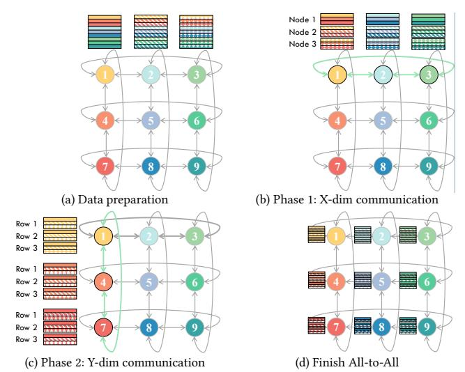

# 2.2 Single-Dimensional Algorithm

In All-to-All, each process sends unique data to every other process [\[68\]](#page-14-6). Common algorithms used for All-to-All communication include Ring [\[34\]](#page-13-36), Direct [\[68\]](#page-14-6), Halving-Doubling [\[25\]](#page-13-6), and Bruck [\[13\]](#page-12-10). The performance of these algorithms varies across different network topologies. Ring algorithm is frequently used in direct topologies such as mesh and torus because it offers good scalability and zero contention [\[61\]](#page-14-13).

Figure [2](#page-2-1) illustrates the All-to-All process with Ring algorithm in a four-node ring network, which can be divided into three stages.

Figure 3: All-to-All on 2D torus with X-Y scheduling. (b)-(c) show the end state of each phase, where the text denotes the data source.

As shown in Figure [2a,](#page-2-1) data of each node is divided into eight parts, with four parts transmitted in each direction. In All-to-All, each node aims to receive all the data parts whose index matches its own node index. These indices are represented by colors in Figure [2.](#page-2-1) To achieve this goal, the communication is organized into three All-to-All stages, each with a different hop distance. As depicted in Figure [2](#page-2-1) a-f, stages 1-3 correspond to hop distances of 1 to 3, respectively. Using a store-and-forward approach, multi-hop transmissions are completed over several sub-stages to avoid contention. Figure [2d- 2f](#page-2-1) illustrate the detailed process of stage 3, where a 3-hop transmission involves three forwarding sub-stages to reach its destination. For example, at stage 3-1, node 1 must forward its purple block through nodes 2 and 3 to reach node 4; similarly, its blue block is forwarded in the opposite direction. Meanwhile, other nodes perform similar forwarding operations concurrently.

