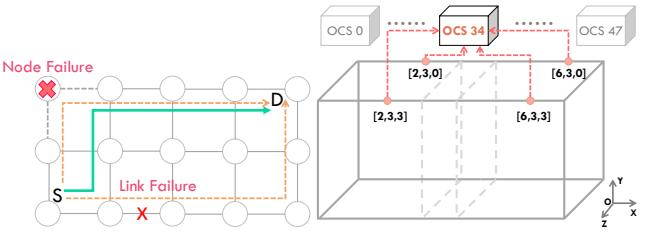

# 2.3 Multi-Dimensional Scheduling

Multi-dimensional network topologies are commonly used in largescale ML systems [\[2,](#page-12-2) [5,](#page-12-5) [6,](#page-12-6) [11,](#page-12-11) [38,](#page-13-7) [39,](#page-13-25) [78\]](#page-14-11), making the efficient communication scheduling across multiple dimensions a challenge. Allto-All on an N-dim network can be decomposed into N sequential single-dimension All-to-All phases. Communication in each phase is implemented with the algorithm introduced in Section [2.2.](#page-2-0) By dividing data into multiple chunks for pipeline scheduling [\[61\]](#page-14-13), the overall network bandwidth utilization can be improved.

As shown in Figure [3,](#page-3-1) All-to-All on a 2D torus network involves two phases, transmitting sequentially across the X and Y dimensions. Taking node 1 in Figure [3a](#page-3-1) as an example, its data is divided into nine parts, each is sent to node 1-9 respectively. Figure [3b](#page-3-1) shows the end of X-dim communication phase, where each part is sent to the columns corresponding to its destination (e.g., node 1 receives data targeting column 1 from nodes 1–3). Communication in each phase can be performed using a single-dimensional algorithm such as Ring. As shown in Figure [3c,](#page-3-1) after reaching the corresponding columns, each data part is sent to its final destination through the Y-dim phase. Finally, as illustrated in Figure [3d,](#page-3-1) node 1

(a) Node and link failures which can impact the original data transmissions and call for new routing to bypass the faults. (b) Two link failures induced by an OCS failure in an 8×4×4 torus consisting of two TPUv4 pods.

Figure 4: Common fault types in the network.

collects the first data part from all nine nodes by the end of phase 2, completing the All-to-All communication.

For fixed-radix networks with an equal number of nodes across all dimensions, the communication cost of each phase is held constant for the fixed amount of data transmitted in each dimension. For instance, in phase 1, node 1 sends three data parts that need to reach the second and third columns to nodes 2 and 3, respectively. Similarly, node 1 also receives three data parts from nodes 2 and 3 that are intended for column 1. Therefore, at the end of phase 1, node 1 still holds nine data parts. In phase 2, node 1 transmits data originating from nodes 1-3 that need to be sent to nodes 4 and 7, with each transmission still consisting of three data parts.

Optimizing communication scheduling in multi-dimensional networks is critical for maximizing bandwidth utilization as the network scales. While prior work [\[32,](#page-13-34) [61,](#page-14-13) [76\]](#page-14-16) has explored efficient All-Reduce scheduling in such networks, All-to-All scheduling across multiple network dimensions remains underexplored.

