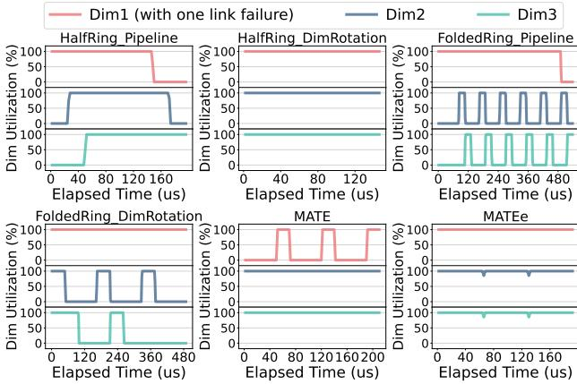
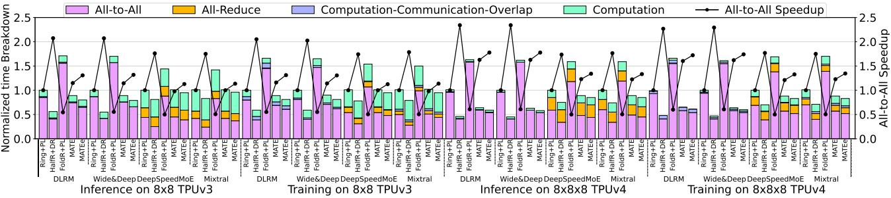
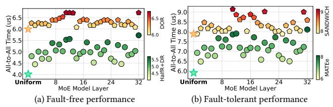
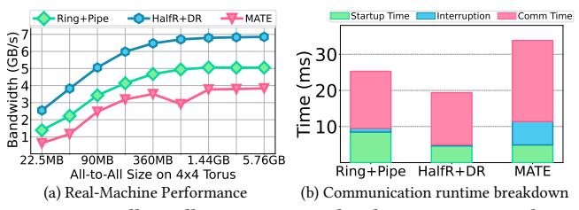

# 5.1 Methodology

We utilize the ASTRA-SIM simulator [60] to implement our proposed optimizations. ASTRA-SIM provides the capability to define the computational and communication workloads in advanced deep learning models, enabling us to carry out detailed implementations and evaluations of collective communication algorithms, scheduling, and fault tolerance within large-scale networks.

We conduct synthetic experiments to validate the speedup of each proposed method and our comprehensive approach, the All-to-All bandwidth improvement from algorithm optimization, and enhanced network bandwidth utilization through scheduling optimization. Additionally, we conduct scalability studies on these methods, demonstrating their effectiveness as the network scales. To show our advantages over state-of-the-art fault-tolerant solution in Google's TPUv4 torus network [78], we conduct comparative experiments. Finally, we evaluate performance speedup in real workloads training and inference scenarios involving All-to-All, assessing the impact of our enhancements in end-to-end applications.

We utilize the built-in analytical network backend in ASTRA-SIM to perform fast and flexible simulations for synthetic, scalability, and real workloads experiments considering that both our proposals and baselines are contention-free. We implement fault-free and fault-tolerant routing schemes for All-to-All in TPUv4 [78] clusters with GARNET simulator [3], which is integrated with ASTRA-SIM for cycle-accurate simulation.

We select appropriate system configurations for each experiment, as shown in Table 2. For synthetic and scalability experiments, we adopt more generic and diverse settings to demonstrate the broad applicability of our proposal under complex scenarios [47]. When comparing with Google's routing scheme, we use the network configurations of TPUv4 [38] and the packet/flit size settings from IBM Blue Gene/Q supercomputer [17]. We apply dateline to avoid deadlock in torus [22]. To assess the speedup of our proposal for training and inference of common deep learning workloads on torus networks, we select four representative DLRM and MoE models along with their corresponding parallelisms. End-to-end evaluations are conducted under the network configurations of TPUv3 and TPUv4.

Figure 11: All-to-All performance speedup with various data sizes for 2D, 3D, and 4D torus. Ring\_Pipeline, Ring\_DimRotation, HalfRing\_Pipeline, and HalfRing\_DimRotation are adopted for fault-free network, while FoldedRing\_Pipeline, FoldedRing\_DimRotation, MATE, and MATEe are adopted for network with one link failure in the first dimension.

Figure 12: All-to-All Bandwidth with various data sizes for 2D, 3D, and 4D torus where FoldedRing, MATE, and MATEe are adopted for networks with one link failure in the first dimension. We define the All-to-All bandwidth as: communication size per node divided by All-to-All time, which is consistent with prior work [25, 32, 75].

| Table 2: System configura | ations |
|---------------------------|--------|
| Parameter                 |        |

| Parameter                         |                       | Configuration                                                          |  |
|-----------------------------------|-----------------------|------------------------------------------------------------------------|--|
| Synthetic Exp, Scalability Exp | Topology              | 2D/3D/4D Torus                                                         |  |
|                                   | Bandwidth/Link        | 32 GB/s                                                                |  |
|                                   | Network Latency       | 100 ns                                                                 |  |
| Scalability Exp                   | Links/Node            | 2D: 4 / 3D: 6 / 4D: 8                                                  |  |
|                                   | Pipeline Chunk Number | 6                                                                      |  |
|                                   | Topology              | 4×4×4, 8×4×4 Torus                                                     |  |
| Comparison                        | Packet Size           | 512 Bytes                                                              |  |
| with Google                       | Flit Width            | 256 bits                                                               |  |
| TPUv4's                           | Bandwidth/Link        | 56 GB/s [38]                                                           |  |
| Routing                           | Network Latency       | 100 ns                                                                 |  |
|                                   | Links/Node            | 6                                                                      |  |
| Real Workloads Experiment   | Workloads             | DLRM [51], Wide&Deep [18], DeepSpeed-1.3B [59], Mixtral 7B×8 [4] |  |
|                                   | Topology              | TPUv3: 8×8, TPUv4: 8×8×8                                            |  |
|                                   | Peak Performance      | TPUv3: 123 TFLOPS [39], TPUv4: 275 TFLOPS [38]                      |  |
|                                   | Bandwidth/Link        | TPUv3: 82 GB/s [39], TPUv4: 56 GB/s [50]                            |  |
|                                   | Network Latency       | 100 ns                                                                 |  |
|                                   | Links/Node            | 6                                                                      |  |
|                                   | Pipeline Chunk Number | 6                                                                      |  |

#### **Synthetic Experiment**

**Performance Speedup:** We conduct synthetic experiments to evaluate the performance speedup of our methods on 2D, 3D, and 4D torus networks with communication size ranging from 8KB to 2GB. Each method is a combined solution of both algorithm and scheduling. We select Ring algorithm combined with pipeline scheduling on fault-free networks as the baseline. As shown in Figure 11, in fault-free scenarios, we evaluate the speedup brought by replacing Ring algorithm with HalfRing, replacing scheduling with DimRotation, and a combination of both HalfRing and DimRotation. HalfRing algorithm and DimRotation scheduling achieve average

speedups of 1.56× and 1.45× respectively, while their combined solution results in an average speedup of 2.28×.

For fault-tolerant scenarios, we assess the performance when a single link failure occurred in the first dimension. The baseline remains the fault-free All-to-All with Ring+Pipeline. FoldedRing + Pipeline and FoldedRing + DimRotation achieve 0.55× and 0.67× of the baseline performance, on average respectively, indicating a significant performance loss even though fault tolerance is achieved. With multi-dimensional acceleration, MATE and MATEe achieve an average speedup of 1.36× and 1.37×, respectively, even exceeding the performance of the fault-free baseline.

As network dimensions increase, we observe an enhancement in the speedup provided by scheduling optimizations for both faultfree and fault-tolerant scenarios, while the impact of algorithms remains relatively constant. This is because algorithm affects communication time within each dimension, whereas scheduling influences bandwidth utilization of the overall network. Specifically, in fault-free networks, as the number of dimensions each chunk need traversing increases, pipeline scheduling involves additional stages. This makes it more challenging to overlap between different chunks. In contrast, DimRotation maintains sufficient overlap among different chunks regardless of the number of dimensions. For faulty networks with higher dimensions, MATE can utilize more links for simultaneous transmission, thereby reducing the duration of acceleration phases and enhancing communication efficiency.

MATE performs better with small communication sizes, while MATEe proves to be more effective for larger data volumes. This is because MATEe statically allocates data transmission on the faulty ring during the normal phase based on the performance ratio of HalfRing and FoldedRing algorithms, without accounting for

Figure 13: Dimension utilization of different algorithms and scheduling settings for 8 MB All-to-All on  $5\times5\times5$  torus.

startup time. For small data volumes, the difference in startup time between these two algorithms causes the faulty ring to slow down the entire normal phase, leading to a performance drop. As data volume increases, the impact of startup time on total communication time decreases. The performance gains from a reduced data volume during the acceleration phase become more significant, resulting in higher speedup for MATEe compared to MATE.

All-to-All Bandwidth: As shown in Figure 12, we evaluate the All-to-All bandwidth under different algorithms. With increasing data volumes, HalfRing achieves significantly higher bandwidth due to fewer sub-stages required owing to shortest path. Meanwhile, FoldedRing maintains about half the bandwidth of Ring algorithm. For 2D torus, acceleration phases in MATE and MATEe can only use one additional set of bidirectional links, so their bandwidth is close to that of Ring algorithm. For 3D and 4D torus, the availability of more links allows acceleration phases in MATE and MATEe to be progressively shorter. As the number of network dimensions increases further, the performance of our fault-tolerant All-to-All scheme becomes closer to that of fault-free scenario.

Dimension Utilization: Figure 13 assesses the link utilization across each dimension on given 3D torus network under different scheduling schemes. When using HalfRing algorithm, pipeline scheduling inevitably introduces bubbles in all three dimensions, whereas DimRotation perfectly utilizes all links. The use of FoldedRing algorithm on the faulty ring leads to decreased link utilization in other fault-free dimensions. This negative impact is evident in both pipeline scheduling with six chunks and DimRotation with three chunks. MATE effectively mitigates this issue, but links in the faulty dimension are only used during acceleration phases. MATEe improves link utilization in the faulty dimension by distributing communication workload. Since the static allocation based on algorithm performance cannot ensure perfect synchronization between faulty and other dimensions, there are some temporary dips in utilization for normal phases.

## 5.3 Scalability Study

As shown in Figure 14, we conduct scalability studies separately for algorithms and scheduling with configuration in Table 2. By maintaining constant data size per node while changing the number of nodes per dimension, we demonstrate the good linear scalability

Figure 14: Scalability study: the left figure shows scalability with 4MB All-to-All size per node on 2D torus. MATE and MATEe results on 2D, 3D, and 4D networks are also shown due to their varying performance across dimensions. The right figure shows scalability with 4 MB size per node and 4 nodes per ring.

(a) All-to-All on a  $4\times4\times4$  TPUv4 pod. (b) All-to-All on  $8\times4\times4$  TPUv4 pods. WFR-WFR-x/y/z indicate applying WFR for link F1/F2 refer to one/two link failures caused failures in dimension 1/2/3, respectively. by OCS failure, both in dimension 2.

Figure 15: Performance comparisons for fault-free and fault-tolerant All-to-All on single and two TPUv4 pods, respectively. DOR and HalfR+DR (HalfRing + DimRotation) are adopted for fault-free scenario. WFR, MATE, and MATEe are utilized for fault tolerance.

of HalfRing and FoldedRing algorithms. To validate the scalability of MATE and MATEe across different dimensions, we display All-to-All duration on 2D, 3D, and 4D network simultaneously. MATE and MATEe show good scalability across different dimensions, with increased dimensions leading to improved performance. Under the communication loads of 4MB per node, the duration for MATEe is consistently shorter than that for MATE in the same dimension.

As shown in the right part of Figure 14, we verify the scalability of scheduling with increasing dimensions. As the total All-to-All size scales linearly with the number of nodes, DimRotation demonstrates performance that is almost invariant with the number of dimensions. MATE and MATEe become more stable in duration as dimensions increases, which is caused by faster acceleration phase.

#### 5.4 Comparison with TPUv4's Routing Design

We adopt the pairwise algorithm used in MPI\_Alltoall of widelyused MPICH for large data transmission [52, 68]. Each transmission utilizes XYZ dimension-order routing (DOR). For fault-tolerant Allto-All, we extend DOR by implementing wild-first routing (WFR) based on the sandwich law [78]. WFR routes a single hop in the next adjacent dimension before addressing the faulty dimension, effectively bypassing the fault region. Taking XYZ routing with an X-dim fault as an example, WFR uses yXYZ routing, where the prefix 'y' indicates a single hop in the Y-dim. For faults in the last dimension of DOR sequence, we bypass faults by taking a reverse path in the faulty dimension. We implement dateline with extra virtual channels for each ring in the network to avoid deadlock [23]. To evaluate the performance on mixed-radix torus (e.g., 8×4×4 torus) and other fault types (e.g., OCS faults), we implement fault-free and fault-tolerant All-to-All on 4×4×4 and 8×4×4 torus, corresponding to single and dual TPUv4 pods, respectively.

Figure 16: Normalized time breakdown of recommendation and MoE models across typical TPU network configurations. Using the combination of Ring algorithm and pipeline (PL) scheduling as the baseline, we demonstrate the fault-free performance of HalfRing (HalfR) + DimRotation (DR), as well as the performance of FoldedRing (FoldR) + pipeline, MATE, and MATEe in networks experiencing a single link failure.

In a single pod, the DOR scheme achieve an All-to-All bandwidth of 75.2 GB/s, which closely matches the actual measured value of 75.9 GB/s [78]. As the All-to-All size increases from 64 KB to 16 MB, the HalfRing+DimRotation scheme achieves an average speedup of 1.57× compared to DOR. We evaluate the performance of WFR under OCS-induced single link failure across three dimensions, as well as the performance of MATE and MATEe. The results show that WFR's performance varies with the faulty dimension due to the unfairness of applying the sandwich law to different faulty dimensions. In contrast, MATE and MATEe exhibit consistent performance on fixed-radix torus regardless of the faulty dimension. The implementation results indicate that MATE and MATEe achieve 1.26× and 1.24× speedups, respectively, compared to the average performance of WFR across dimensions, with speedups reaching 1.46× and 1.61× as the All-to-All bandwidth becomes saturated.

For dual-pods with no faults, DOR achieves 40.3 GB/s, closely matching the measured value of 40 GB/s [38]. The HalfRing + Dim-Rotation scheme provides an average speedup of 1.57× compared to DOR. We also assess fault-tolerant performance for a single Y-dim link failure (WFR-F1) and OCS failure (WFR-F2). The OCS failure manifests as two link failures with 4-hop distance, as illustrated in Figure 4b. Results show that the performance of DOR, WFR-F1, and WFR-F2 is very close, with fault scenarios achieving an average of 98.8% of the fault-free performance. This can be attributed to two factors. First, the bottleneck for All-to-All on mixed-radix torus networks occurs in the dimension with the largest number of nodes, as analyzed in Table 1. This limits the impact of faults in other dimensions on All-to-All performance. Second, due to the characteristics of OCS failures and WFR, the two faulty links cannot be utilized simultaneously, reducing the risk of exacerbated local network congestion caused by multiple failures. MATE and MA-TEe provide an average speedup of 1.18× and 1.19× compared to WFR-F1, and a saturation speedup of 1.25× and 1.42×, respectively.

The significant speedups stems from two main reasons. First, for fault-free All-to-All, although DOR ensures the shortest communication path, the fixed routing order leads to unbalanced utilization across dimensions. Taking XYZ routing as an example, in the beginning of All-to-All, the X-dim links are utilized far more frequently than other dimensions. This results in under-utilization of other dimensions and congestion in the X-dim. Second, for fault-tolerant All-to-All, while WFR combined with the sandwich law can bypass faults, it limited path flexibility introduces additional congestion around faulty links. For example, in yXYZ routing under an X-dim

fault, adjacent Y-dim links become more congested, whereas Z-dim links remain nearly unused. In contrast, MATE fully utilizes bandwidth of other dimensions around the faulty link, effectively balancing the traffic around the fault and avoiding congestion.

#### 5.5 Real Model Performance

We evaluate the training and inference time for two recommendation models, DLRM [51] and Wide & Deep [18], along with two MoE models, Deepspeed-1.3B+MoE-128 [59] and Mixtral 7Bx8 [4], on TPUv3 [39] and TPUv4 [38] networks by simulation. As shown in Figure 16, using Ring+Pipeline in a fault-free network as the baseline for normalization, we demonstrate the speedups provided by HalfRing + DimRotation in fault-free networks and FoldedRing + Pipeline, MATE, and MATE under a single link failure. For All-Reduce in healthy networks, we adopt bandwidth-optimal hierarchical Ring algorithm [76]. For All-Reduce in faulty networks, we adopt the FoldedRing + MATEe scheme to ensure its efficient and reliable execution. The total time could be divided into All-to-All, All-Reduce, computation-communication overlap, and computation time. The line graph displays speedups of proposed All-to-All schemes under each model and network configuration.

For recommendation models, we adopt row-wise partitioning across all TPUs for embedding layers, and data parallelism for other layers [51]. Under this partitioning, input queries on each TPU can only access a portion of the reduction results and require a uniform All-to-All to obtain the complete output. In inference tasks, the computation of bottom MLPs can overlap with the All-to-All of embedding layer, introducing a small amount of computation-communication overlap time. In training tasks, the non-blocking All-Reduce for synchronizing weight gradients can effectively overlap with the computation, resulting in a longer overlap time.

For MoE models, we also consider the uniform All-to-All. Although expert selection in practice is typically non-uniform, recent designs of gating layers and loss functions are promoting the uniformity [46, 77]. Both MoE models adopt a hybrid parallelism combining tensor, expert, and data parallelism (TP, EP, DP), where both DeepSpeedMoE and Mixtral are configured with TP=8 (i.e., each layer's weight is partitioned and deployed across 8 TPUs). For TPUv3, DP=EP=8; for TPUv4, DP=EP=16; allowing full utilization of all TPUs for parallel computation. TP introduces additional blocking All-Reduce for both activations in the forward pass and input gradients in the backward pass. In addition, the non-blocking All-Reduce

Figure 17: Non-Uniform All-to-All performance under expert selection distribution traces for training Mixtral7B×8 [4] with Al2 Reasoning Challenge (ARC) dataset [19] on a simulated TPUv4 pod.

used for synchronizing weight gradients overlaps with the backward computation. The results show that HalfRing+DimRotation, FoldedRing+Pipeline, MATE, and MATEe respectively achieve All-to-All speedups of  $1.97\times$ ,  $0.54\times$ ,  $1.24\times$ , and  $1.38\times$ , and total time speedups of  $1.64\times$ ,  $0.63\times$ ,  $1.20\times$ , and  $1.29\times$  on average.

#### 5.6 Non-Uniform All-to-All

We evaluate non-uniform All-to-All under both fault-free and fault-tolerant scenarios, comparing against Google's routing design. Non-uniform All-to-All is commonly observed in the distributed training of MoE models and often leads to significant performance degradation [46]. We extracted the expert selection distribution for each layer over 32 iterations by training the 32-layer Mixtral 7B×8 [4] model on the ARC dataset [19]. After normalization to one token per expert on average, the standard deviation of expert selection across layers ranges from 0.09 (layer 2) to 0.39 (layer 12), indicating a serious imbalance. We simulated the performance using 200 tokens (400KB) under a TP+EP+DP hybrid parallelism (the same with Section 5.5) on a single TPUv4 pod, as shown in Figure 17.

In the fault-free, non-uniform scenario, HalfRing+DimRotation achieves 70.2%–90.2% (avg. 80.6%) of uniform All-to-All performance, delivering an average speedup of 1.27× over DOR routing. In the non-uniform scenario with one Y-dim link failure, MATEe attains 72.8%–91.1% (avg. 82.5%) of the uniform baseline, yielding an average speedup of 1.17× over Google WFR routing. In real-world scenarios, stragglers can disrupt network synchronization and degrade performance, similar to the effect of communication imbalance where some nodes send more data than others.

#### 5.7 Resilience to Multiple Faults

We evaluated the performance of MATE (and MATEe) under multiple random link failures and compared them with Google's WFR. As shown in Figure 18, Type 1 involves two failures on the same ring; Type 2 consists of failures on two different rings in the Y-dim; and Type 3 includes one failure in both Y-dim and Z-dim. For fault-tolerant All-to-All, MATE, MATEe, and a two-acceleration-phase MATEe scheme are applied to handle them respectively (see Section 4.2). Results show that our proposed methods achieve average speedups of 1.43×, 1.14×, and 1.55× for Type 1-3, respectively.

#### 5.8 Real Machine Performance

We implemented proposed methods using PyTorch Distributed module [8], and conducted real-system experiments on two NPU (Neural Processing Unit) nodes, each equipped with 8 devices. NPUs

Figure 18: Fault-tolerant All-to-All performance under three kinds of link failures on a single TPUv4 Pod.

Figure 19: All-to-All on 16-NPU emulated 4×4 torus networks.

within a node are connected via high-bandwidth links, while internode communication is performed through a 200Gb/NPU fully connected RoCE Top-of-Rack (ToR) switch [28]. To emulate a 4×4 torus topology, we disabled intra-node interconnection and restricted communication to specific device pairs. As shown in Figure 19a, our fault-free and fault-tolerant designs achieve up to 1.84× and 0.77× speedups over the Ring+Pipeline baseline. Figure 19b presents a runtime breakdown based on profiling a 90MB All-to-All for each method. In both proposed methods, communication pairs and transmission order can be precomputed offline, reducing CPU overhead from kernel launches (i.e., Startup time). However, the multi-path detouring in MATE introduce greater complexity, leading to more frequent interruptions and higher overall communication time.

### 6 Related Work

## 6.1 All-to-All Collective Communication

Prior work has focused on optimizing All-to-All from the perspectives of algorithm and scheduling. A bandwidth-optimal algorithm is proposed for 1D/2D torus [44], which eliminates contention by scheduling each node's transfer state at every time step. However, it's limited to low-dimensional, fixed-radix torus with ring sizes divisible by 8, due to the exponential growth of scheduling space (e.g., over 20 states in 3D torus). An algorithm improves scalability by partitioning the network into subnets with grouped scheduling [66]. However, concurrent communication across subnets introduces network contention and bandwidth under-utilization, along with constraint topology (e.g., divisible by 4) by scheduling requirements.

In addition to manual efforts, recent proposals aim to automate collective algorithms through synthesis. SCCL uses satisfiability solvers and k-synchronous algorithms to deliver Pareto-optimal collectives in terms of latency and bandwidth [16]. But its optimality is limited to homogeneous and symmetric topologies and is confined to single-node networks. TACCL improves applicability with user-defined communication sketches to formulate integer linear programming (ILP) [64]. It is challenging to guarantee its

optimality under user-defined logical topologies and symmetry, and it remains limited to tens of NPUs. Both methods lack fine-grained modeling for network congestion and struggle to scale beyond hundreds of NPUs, making them unsuitable for practical large-scale networks. TACOS uses a greedy algorithm for link matching, effectively addressing topology heterogeneity and symmetry while scaling to large networks [\[75\]](#page-14-15). However, it is primarily designed for All-Reduce and its subsets, as it is challenging in addressing the quadratic complexity to All-to-All relative to network scale.

Table 3: Comparison with existing proposals that can optimize Allto-All and our work (with red color)

| Name        | Latency | Bandwidth      | Contention | Target Topologies | Fault Tolerance |
|-------------|---------|----------------|------------|----------------------|--------------------|
| SCCL [16]   | low     | pareto-optimal | yes        | single-node          | no                 |
| TACCL [64]  | low     | sub-optimal    | yes        | tens of NPUs         | no                 |
| tsMCF [9]   | low     | sub-optimal    | no         | direct-connect       | no                 |
| 2D-Opt [44] | low     | optimal        | no         | 2-D 8n- torus        | no                 |
| ND-Opt [66] | low     | sub-optimal    | yes        | N-D 4n- torus        | no                 |
| HalfRing    | low     | optimal        | no         | 1-D torus            | no                 |
| DimRotation | /       | /              | no         | N-D torus            | no                 |
| WFR [78]    | low     | sub-optimal    | yes        | N-D torus            | link failure       |
| FoldedRing  | high    | optimal        | no         | 1-D torus            | link failure       |
| MATE(e)     | /       | /              | no         | N-D torus            | link failure       |

Time-stepped Multi-Commodity Flow (tsMCF) solution reduces the computational complexity of All-to-All synthesis by decomposing the original MCF linear program (LP) into master LP and child LPs. This enables parallel LP processing to improve solver efficiency. While this approach enhances scalability, it does not guarantee optimality. Furthermore, its hard constraint that all nodes have the same degree limits its applicability to faulty networks. Existing synthesizers still struggle to deliver optimal solutions for largescale All-to-All, which poses significant challenges. Additionally, synthesizer design for fault-tolerant All-to-All remains unexplored, and the disruption of network symmetry further increases the complexity of the problem. We summarize these proposals in Table [3.](#page-12-15)

