# **Optimizing Dynamic Neural Networks with Brainstorm**

**Weihao Cui,** *Shanghai Jiao Tong University;* **Zhenhua Han,** *Microsoft Research Asia;*  **Lingji Ouyang,** *University of Science and Technology of China;* **Yichuan Wang,** *Shanghai Jiao Tong University;* **Ningxin Zheng, Lingxiao Ma, Yuqing Yang, Fan Yang, Jilong Xue, Lili Qiu, and Lidong Zhou,** *Microsoft Research Asia;* **Quan Chen,** *Shanghai Jiao Tong University;* **Haisheng Tan,** *University of Science and Technology of China;*  **Minyi Guo,** *Shanghai Jiao Tong University*

https://www.usenix.org/conference/osdi23/presentation/cui

**This paper is included in the Proceedings of the 17th USENIX Symposium on Operating Systems Design and Implementation.**

**July 10–12, 2023 • Boston, MA, USA**

978-1-939133-34-2

**Open access to the Proceedings of the 17th USENIX Symposium on Operating Systems Design and Implementation is sponsored by**


# Optimizing Dynamic Neural Networks with Brainstorm

Weihao Cui1<sup>∗</sup> , Zhenhua Han<sup>2</sup> , Lingji Ouyang3<sup>∗</sup> , Yichuan Wang<sup>1</sup> , Ningxin Zheng<sup>2</sup> , Lingxiao Ma<sup>2</sup> Yuqing Yang<sup>2</sup> , Fan Yang<sup>2</sup> , Jilong Xue<sup>2</sup> , Lili Qiu<sup>2</sup> , Lidong Zhou<sup>2</sup> , Quan Chen<sup>1</sup> , Haisheng Tan<sup>3</sup> , Minyi Guo<sup>1</sup> <sup>1</sup>*Shanghai Jiao Tong University,* <sup>2</sup>*Microsoft Research Asia,* <sup>3</sup>*University of Science and Technology of China*

### Abstract

Dynamic neural networks (NNs), which can adapt sparsely activated sub-networks to inputs during inference, have shown significant advantages over static ones in terms of accuracy, computational efficiency, and adaptiveness. However, existing deep learning frameworks and compilers mainly focus on optimizing static NNs with deterministic execution, missing optimization opportunities brought by non-uniform distribution of activation in dynamic NNs. The key to optimizing dynamic NNs is the traceability of how data are dynamically dispatched to different paths at inference. Such dynamism often happens at sub-tensor level (e.g., conditional dispatching tokens of a tensor), thus hard for existing tensor-centric frameworks to trace due to misaligned expression granularity.

In this paper, we present Brainstorm, a deep learning framework for optimizing dynamic NNs, which bridges the gap by unifying how dynamism should be expressed. Brainstorm proposes (1) *Cell*, the key data abstraction that lets model developers express the data granularity where dynamism exists, and (2) *Router*, a unified interface to let model developers express how *Cells* should be dynamically dispatched. Brainstorm handles efficient execution of routing actions. This design allows Brainstorm to collect profiles of fine-grained dataflow at the correct granularity. The traceability further opens up a new space of dynamic optimization for dynamic NNs to specialize their execution to the runtime dynamism distribution. Extensive evaluations show Brainstorm brings up to 11.7× speedup (3.29× on average) or leads to 42% less memory consumption for popular dynamic neural networks with the proposed dynamic optimizations.

### 1 Introduction

As deep neural network models become large and complex, it is more and more challenging to sustain the growth of model size due to the increased computing requirement. The key limitation is the static activation of a whole network regardless of inputs, which is much less efficient than a human brain that can dynamically and sparsely activate neurons related to perceived information. Therefore, there have been numerous efforts by machine learning researchers to design *dynamic* neural networks that can feed inputs into different sub-neural structures or parameters of a large model during inference. Dynamic neural networks have shown favorable properties including efficiency [\[1](#page-15-0)[–8\]](#page-15-1), adaptiveness [\[1,](#page-15-0) [9,](#page-15-2) [10\]](#page-15-3), generality [\[1,](#page-15-0) [9,](#page-15-2) [11,](#page-15-4) [12\]](#page-15-5), and interpretability [\[9,](#page-15-2) [13\]](#page-15-6). For example, by designing a large number of expert sub-networks but only conditionally activating a small subset of them, Mixture-of-Expert (MoE) has helped to scale Transformer to trillions of parameters and achieve superior performance [\[14,](#page-15-7) [15\]](#page-15-8).

Unfortunately, existing deep learning (DL) frameworks are not yet effective for running dynamic neural networks. Their optimization mainly focuses on static neural networks, whose operator execution order is deterministic for all inputs. It has been widely studied in compilers for general programs (e.g., Java, C#) to leverage runtime characteristics of programs to dynamically optimize their execution [\[16,](#page-15-9) [17\]](#page-15-10). By analyzing runtime profiles of dynamism, we find many dynamic NNs have similar opportunities due to their non-uniform distribution of branch activation or token dispatching, which can be further utilized for dynamic optimization.

However, existing tensor-centric programming models cannot support dynamic optimization well. The major challenge is the misaligned expression granularity, i.e., tensor-centric compilers can only trace how data flows at the tensor level in a static dataflow graph (DFG), but dynamism often happens at the sub-tensor level in dynamic NNs. For example, Mixture-of-Experts (MoE) networks use hidden dimensions within input tensors to represent the concept of "tokens", which are dynamically reordered to activate parallel expert sub-networks with different tokens. It is critical for dynamic optimizations to collect profiles of dynamism, which is hard for existing compilers because they have no knowledge about what "tokens" are and how they are dynamically dispatched.

In this paper, we present Brainstorm, the first framework to

<sup>∗</sup>This work is done while Weihao Cui and Lingji Ouyang are interns in Microsoft Research

<span id="page-2-2"></span>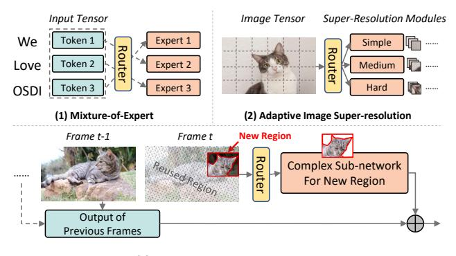

**(3) Reusing Temporal Result in Video Tasks**

Figure 1: Examples of dynamic neural networks routing at token-level, patch-level, and pixel-level.

optimize the execution of dynamic NNs. Brainstorm unifies the expression of dynamic NNs to make their dynamism easy to trace. At the core of Brainstorm is a new data abstraction called *Cell* that lets model developers describe the granularity of dynamism, e.g., a token inside a tensor. To make *Cell*-level dataflow traceable, Brainstorm unifies the *Router* interface to let model developers express how *Cells* should be dynamically dispatched among multiple branches. Brainstorm can collect the runtime profiles of *Router*s with negligible overhead. Inspired by profile-guided optimization of programming languages [\[16](#page-15-9)[–20\]](#page-15-11), Brainstorm proposes four dynamic optimizations with statistical analysis of *Cell*-level dataflow: (1) by analyzing the number of *Cells* routed to branches, horizontally fuses multiple branches with GPU kernels optimized for frequent *Cell* loads; (2) with cross-layer *Cell*-level analysis, optimizes distributed placement of parallel branches to minimize inter-GPU communication; (3) with branch activation profiles, speculatively launches branch operators to hide routing overhead; and (4) speculatively preloads branch weights to save GPU memory.

We implement Brainstorm based on PyTorch by extending it with *Cell* and *Router*. We have implemented 6 state-of-theart dynamic NNs using Brainstorm's APIs, which are extensively evaluated on Nvidia GPUs. With the proposed dynamic optimizations, our evaluation shows Brainstorm achieves up to 11.7× speedup (3.29× on average) or reduces memory consumption by 42%, compared with state-of-the-art solutions. We open-source Brainstorm to encourage more optimizations for dynamic NNs[1](#page-2-0) . The key contributions are as follows.

- We identify a new space of optimization for dynamic NNs by leveraging the statistical profiles of dynamism to specialize model execution to runtime dynamism distribution.
- We identify the major challenge of optimizing dynamic NNs in existing DL frameworks is the misaligned granularity between the tensor-level programming and the fine-grained dataflow required to trace.

- We unify the programming of dynamic NNs with *Cell* and *Router* abstraction, making dynamism easy to trace.
- We propose multiple dynamic optimization strategies, leveraging the *Cell*-level dataflow analysis, which are shown effective for popular dynamic NNs.

We explain background and motivation in [§2.](#page-2-1) We introduce Brainstorm's key abstraction in [§3.](#page-3-0) Four dynamic optimizations are proposed in [§4.](#page-4-0) We present Brainstorm's *Cell*-level dataflow analysis in [§5.](#page-6-0) We explain the implementation in [§6.](#page-7-0) We show the evaluation results in [§7.](#page-8-0) We discuss handling distribution drift and other opportunities in [§8.](#page-13-0) We compare with related works in [§9.](#page-14-0) We conclude this paper in [§10.](#page-14-1)

### <span id="page-2-1"></span>2 Background and Motivation

Dynamic Neural Networks. To mimic how the human brain works, the machine learning community actively works on how dynamic NNs should be designed. Various types of dynamism have been proposed to adapt the model structures and parameters to different inputs. [Figure 1](#page-2-2) illustrates representative patterns of dynamic NNs. The most common way of building a dynamic NN is to adaptively dispatch (parts of) inputs to different sub-networks with a routing mechanism. A common functionality, referred to as a *router* in this work, predicts which sub-network the input values should go through. Many routing policies have been proposed for different tasks, e.g., top-k router [\[3\]](#page-15-12). Sub-networks in different branches could have different weights, architectures, or the number of parameters to better fit the routed inputs. For example, MoE networks train parallel experts and dispatch input tokens into different expert sub-networks, each of which is expected to specialize in certain input categories [\[14,](#page-15-7) [15,](#page-15-8) [21,](#page-15-13) [22\]](#page-16-0). ClassSR [\[10\]](#page-15-3) routes image patches to heterogeneous branches based on super-resolution difficulty. Skip-Conv [\[23\]](#page-16-1) routes new pixels to computation and skips duplicated pixels of previous frames. Model developers often use a tensor to store multiple tokens/patches/pixels, and program sub-tensor dynamism using data movement operators like einsum [\[24\]](#page-16-2).

Dynamic optimization opportunities. It has been widely studied in programming languages [\[25,](#page-16-3) [26\]](#page-16-4) to leverage statistical profiles of program dynamism for just-in-time (JIT) optimization, e.g., HotSpot JVM speculatively trims paths never executed in collected runs [\[16\]](#page-15-9). However, optimizations in existing DL frameworks mainly focus on static NNs. They miss a lot of dynamic optimization opportunities brought by neural network dynamism.

[Figure 2](#page-3-1) illustrates routing distribution of four dynamic NNs. [Figure 2a](#page-3-1) and [Figure 2b](#page-3-1) are two dynamic NNs dispatching tokens and patches to different branches, respectively. We observe their distribution of tokens/patches is imbalanced: some branches receive non-negligibly more data than others. They have opportunities to tune efficient GPU kernels to

<span id="page-2-0"></span><sup>1</sup>Code available at <https://github.com/Raphael-Hao/brainstorm>

<span id="page-3-1"></span>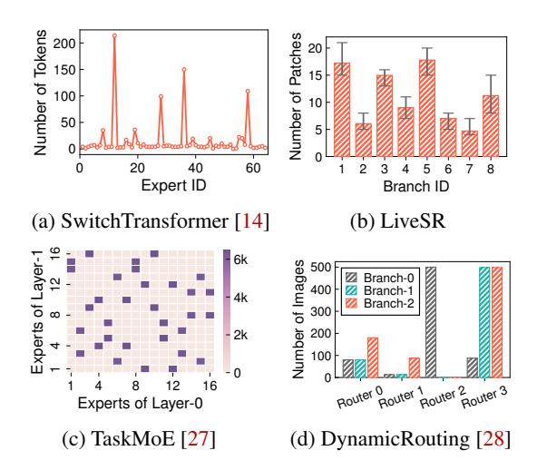

Figure 2: Distribution of routing in four dynamic NNs.

fit their shapes to load distribution, which could potentially bring over 10× speedup. Also, these parallel branches can be horizontally fused for concurrent execution (§4.1).

We also identify optimization opportunities by analyzing statistics of multi-layer correlation. Figure 2c illustrates the multi-layer correlation of TaskMoE [27], which is the portion of tokens from an expert at Layer-0 routed to another expert at Layer-1. We find the branch activation of two consecutive layers is correlated, e.g., it has a high probability that Expert-14/15 of Layer-1 will be activated after Expert-0 of Layer-0. Up to 87% of inter-GPU communication can be saved by co-locating correlated experts on the same GPU (§4.2).

Figure 2d shows branch activation of selected routers from DynamicRouting [28], which has 186 routers trained to forward images to one or two branches among three branches. Our measurement shows it spent over 44% time on routing. However, many routers have a biased distribution that tends to activate the same branch at different runs. E.g., Router-3 has a high probability of choosing Branch-1 and Branch-2. They create an opportunity for speculative execution, e.g., skipping routing computation to reduce routing overhead (§4.3), or opportunistically preload weight to GPU memory (§4.4).

Moreover, we find many dynamic NNs can be optimized by multiple dynamic optimizations simultaneously. The key requirement of these optimizations is the ability to collect statistical profiles at the granularity where dynamism happens, which is not explored by existing DL frameworks.

Misaligned programming model. The misaligned programming model is the major obstacle to tracing dynamism profiles in existing frameworks. As shown in Figure 1, language tasks typically route at the granularity of tokens from input sentences; vision tasks route patches from input images; video models partially reuse previous pixels depending on inter-frame similarity. All the dynamism happens inside the tensor of sentences, images, or frames. Existing frameworks

optimize models with a static dataflow graph, which expresses only the relation of tensors and operators. They have no ability to collect necessary profiles at runtime. Without explicit specification by model developers, they cannot understand what tokens are and how they are dynamically dispatched, let alone trace the complex token-level dataflow as Figure 2c requires. Moreover, tensor-level programming can only be applied with operator-level optimization (e.g., operator fusion) without the ability to optimize more fine-grained data movement or computation. These challenges motivate Brainstorm to propose a principled design to let model developers expose the information that needs to be traced and leverage the collected profiles for dynamic optimizations.

### <span id="page-3-0"></span>Cell and Router as the Core Abstraction

For model developers to express dynamic NNs in a traceable manner, Brainstorm unifies the model expression with Cell and Router to build dynamism at the correct granularity.

Cell. To let model developers define the data granularity where dynamism happens, Brainstorm augments a traditional tensor with a data abstraction called Cell. The Cell is the basic unit to be dynamically dispatched among multiple branches. Model developers can annotate any tensor using the brt.annotate\_cell API to specify the granularity of Cells in a tensor (brt is the package name of <u>Brainstorm</u>).

```
brt.annotate_cell(tensor, dims, shape)
```

Model developers need to specify the values in which dimensions (dims) and which shape (granularity) to route. Figure 3 shows three examples that route values in Cells at the granularity of token, patch, and pixel, respectively. The first example routes a tensor with three tokens located at the 0-th dimension (dims=(0)), each represented by a vector of 768 float values (shape=(1,768)). The second and third examples route 32x32 patches (shape=(32, 32)) and 1x1 pixels (shape=(1,1)) in a 2D image tensor (dims=(0,1)).

**Router.** To dynamically dispatch Cells, Brainstorm introduces a unified Router API that supports customized rules via router\_fn to decide the dynamic placement of Cells among multiple branches. The API definition of Router and router\_fn are elaborated as follows<sup>2</sup>.

```
class Router:
  def __init__(router_fn : Func)
def forward(x : Tensor, kwargs) : Tuple[Tensor], Routes
def router_fn(x : Tensor, kwargs) : Routes
```

When initializing a Router, the router\_fn should be specified to define the routing rule, i.e., how Cells should be routed among multiple branches. The router fn takes the tensor

<span id="page-3-2"></span><sup>&</sup>lt;sup>2</sup>We only show routing *Cells* of a single tensor. Multi-tensor routing has similar APIs, which are omitted due to the limited space.

<span id="page-4-2"></span>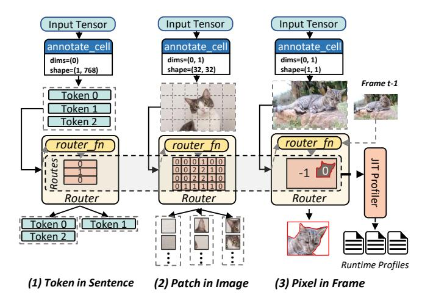

Figure 3: Examples of routing *Cells* at token-level, patchlevel, and pixel-level. router\_fn generates routing decisions indicating branch IDs should Cells be routed to (-1 for dropping), collected by the JIT profiler for dynamic optimization.

annotated with Cells as inputs and generates a special tensor Routes, whose value indicates which branch should *Cell* go. The shape of Routes has the same layout as Cells of the source tensor to route. E.g., the second example in Figure 3 has  $6 \times 4$  patches, thus router\_fn should also generate  $6 \times 4$ Routes. Auxiliary inputs can be set in kwarqs when making routing decisions. In the forward process of a model, *Router* feeds the input tensor to router\_fn to get routing decisions for Cells, then dispatch Cells to corresponding branches. It is easy to port existing code of dynamic NNs to Brainstorm, e.g., we modify only 12 lines of code to port the official PyTorch implementation of SwitchTransformer [14] to Brainstorm.

Brainstorm's Router abstraction decouples control-flow of deciding how Cell should be dynamically dispatched from its execution. Depending on runtime profiles, the optimal execution strategy varies greatly. Brainstorm eases model developers from challenging execution optimizations. They only need to focus on designing routing logic and leave execution optimizations to Brainstorm. The Routes given by router\_fn are collected by JIT Profiler to get statistical profiles. Brainstorm's dynamic optimizations analyze these statistics to find the most efficient execution strategy (§4).

Behind *Router* are a series of efficient GPU operations to realize the routing actions specified by router\_fn. When branches receiving Cells are located on the same GPU, Brainstorm uses an efficient data rearrangement GPU kernel to generate multiple tensors containing *Cells* routed to each branch. Unlike existing solutions that heavily use computation operators (e.g., einsum) for fine-grained dynamic data rearrangement, Brainstorm uses a GPU kernel to directly move data to avoid unnecessary computation. When Cells are distributed to multiple GPUs, Brainstorm has a sparse communication primitive to efficiently scatter and gather Cells. Compared with the commonly used all-to-all primitive in existing DL

<span id="page-4-3"></span>

|                          | Single layer | Multi-layer      | Branch     |
|--------------------------|--------------|------------------|------------|
|                          | Cell Loads   | Cell Correlation | Activation |
| Dynamic                  | 1            |                  |            |
| Horizontal Fusion        |              |                  |            |
| Profile-Guided Placement | <b>/</b>     | <b>/</b>         |            |
| Speculative Routing      |              |                  | ~          |
| Speculative Preloading   |              |                  |            |

Table 1: The statistical information used by different dynamic optimization strategies in Brainstorm.

frameworks [22, 29], Brainstorm's sparse communication is more efficient when Cells are routed unevenly to multiple GPUs because it avoids unnecessary communication due to padding (refer to §6 for implementation details).

Comparison to IR with control-flow. Different from intermediate representations (IR) of existing DL frameworks that mix control-flow and dataflow together, Brainstorm chooses a decoupled design with Router. Brainstorm's dataflow graph hides complex control-flow of Router behind router fn. A Router can be regarded as a data distribution operator dynamically dispatching Cells of tensors to multiple branches. This greatly eases the tracing and analysis of Cell-level dataflow because compilers no longer need to separate dynamism-related operators from dataflow graphs, which is hard for DL frameworks [30–32]. Actually, instead of knowing how routing logic is constructed, it is more useful for compilers to know statistical information about routing decisions, which is sufficient to be captured by Brainstorm's Router.

Moreover, Brainstorm further enhances control-flow operators in existing IR with Cell-level routing ability. Brainstorm's Router itself can be regarded as a switch-case operator to route Cells to different branches for conditionally applying different functions. Together with a while-loop operator, a dynamic NN can route some *Cells* back to loop entry for the next iterations, and drop others to the output, which is commonly used by auto-regressive decoding of language tasks.

### <span id="page-4-0"></span>**Dynamic Optimizations**

Brainstorm analyzes the collected program execution profiles to improve runtime performance. Different from traditional dynamic optimization that analyzes the invocation of program functions or code blocks, the key for optimizing dynamic NNs is to profile and analyze Cell-level dataflow to specialize model execution to runtime dynamism distribution. In this section, we introduce four dynamic optimizations we identified for dynamic NNs. More optimizations are possible with Brainstorm's Cell and Router abstraction. Table 1 lists the required information to conduct each dynamic optimization.

#### <span id="page-4-1"></span>4.1 **Dynamic Horizontal Fusion**

Horizontal fusion is a compiler optimization to fuse concurrent branches of a model into a fused operator to improve

<span id="page-5-2"></span>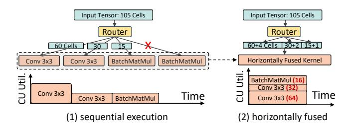

Figure 4: Operators of multiple branches are horizontally fused into one kernel. Only activated operators are executed. Each branch uses the nearest tuned kernel for least padding.

GPU Compute Unit (CU) utilization and reduce launching overhead. Existing approaches [33, 34] cannot be applied to dynamic NNs, because they assume a static dataflow graph whose branches are all activated with the same input. Brainstorm introduces a dynamic horizontal fusion optimization that supports dynamically and sparsely activated branches so that they can be executed on GPU simultaneously.

Especially, as we have shown in Figure 2, the *Cell* distribution can be very imbalanced for dynamic NNs. Even for large batch size, it can still accelerate the model execution by dynamical horizontal fusion of branches receiving a few numbers of Cells. Brainstorm leverages the profiles collected from *Router* to extract the statistical loads of each branch, i.e., how many Cells are routed to each branch. Brainstorm finds multiple percentiles (e.g., 50%, 90%, 100%) of the Cell load distribution, and tunes GPU kernels for these shapes. All tuned kernels are fused into one operator. At inference, Brainstorm pads the input of each branch to the nearest tuned kernel. This requires the traceability of the dynamic *Cell*-level dataflow at runtime that we explain how Brainstorm achieves it in §5.2. Note that the dynamically fused GPU kernel only uses the weights of activated branches without needing to load the weights of all branches into the GPU memory.

Figure 4 shows an example of routing 112 Cells among four parallel branches. Only three of the branches (only known at runtime) are activated. Before horizontal fusion, the three activated branches have to be executed sequentially, which may not saturate the GPU CU utilization. After fusing all branches into one GPU kernel, GPU can execute the activated branches simultaneously at a higher CU utilization. Each branch is executed with the tuned kernel of the least padding for the most efficient execution. For example, the fused kernel contains two tuned kernels of Conv 3x3 for 32 Cells and 64 Cells, which is used by the first two Conv 3x3 branches in the network by padding 4 and 2 Cells, respectively.

#### <span id="page-5-0"></span>4.2 **Profile-Guided Model Placement**

The cerebral cortex of human brain is organized into distinct areas, whose neurons of a function are located closely [35]. By analyzing statistical routing decisions, we observe similar effects in artificially designed dynamic NNs. As shown in Fig-

<span id="page-5-3"></span>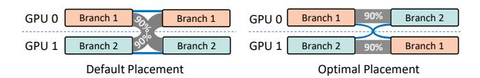

Figure 5: Profile-guided model placement. The example shows the default placement has 90% inter-GPU traffic, which is reduced to 10% by the optimized placement.

<span id="page-5-4"></span>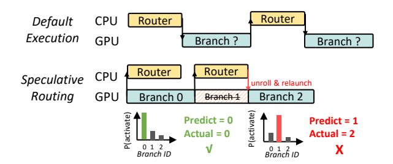

Figure 6: Speculative routing: skip routing computation and speculatively launch the branch w/ highest probability; unroll and relaunch to correct branches when mispredicted.

ure 2c, experts from two layers are activated together with a high probability. The *Cell*-level communication between these highly-correlated experts is higher than the others. Figure 5 illustrates an example that, by analyzing the multi-layer correlation, Brainstorm can co-locate correlated sub-networks on the same GPU to reduce inter-GPU communication. Note that, in addition to dynamic Cell-level dataflow collected at runtime, the multi-layer correlation also needs to analyze static Cell-level dataflow to infer correct placement constraints. Our analysis in §5.1 shows each *Cell* of a sentence tensor depends on all Cells from the previous MoE layer. This implies a placement constraint that all Cells of a sentence should be gathered at the same GPU so that its self-attention operator can generate correct outputs. This presents a challenge requiring both dynamic and static *Cell*-level dataflow analysis to understand the inter-layer correlation of Cells. We explain Brainstorm's static *Cell*-level dataflow analysis in §5.1.

In addition to cross-layer analysis, we find single-layer *Cell* distribution like Figure 2a can also help model placement. Some branches could take more Cells than others. Heavy branches can be co-located with light branches to balance the overall communication to avoid stalling on some GPUs.

### <span id="page-5-1"></span>**Speculative Routing**

Model developers often build routing logic involving control flows, which may require CPU processing and incur CPU-GPU synchronization overhead. Compared to their theoretical performance (based on FLOPs), routing overhead may dominate the inference latency. Our measurement shows MS-DNet [1] and DynamicRouting [28] spend 65% and 44% time in routing. We find these model often has a biased probability when selecting branches at inference. Our analy-

<span id="page-6-3"></span>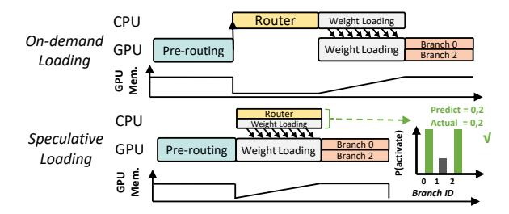

Figure 7: Speculatively preload weights with the highest probability; fallback to on-demand loading when mispredicted.

sis of Brainstorm's *Router* profiles shows many *Router*s are highly predictable. Brainstorm can predict the decisions of DynamicRouting [28] with an accuracy over 90% by just choosing the most frequently appeared branches ( $\S7.4.6$ ). As Figure 6 shows, Brainstorm can predict the routing decisions of *Routers* in advance (based on statistical profiles) and skip router\_fn to hide the routing overhead. To guarantee the correctness, Brainstorm uses a parallel thread to check the result of router\_fn. When misprediction happens, the model execution will be unrolled to re-execute the correct branch with negligible misprediction overhead (§7.3).

#### <span id="page-6-1"></span>**Speculative Weight Preloading** 4.4

To run inference of a large model on a limited size of GPU memory, it often requires swapping weights of layers between GPU memory and host memory to reduce the GPU memory requirement [36]. To hide the memory migration latency, existing solutions need to know the execution order of layers to preload necessary weights while executing previous layers in a pipelined manner [37, 38]. However, dynamic NNs do not have a static order of layer execution. The execution of dynamically activated branches is only known when the routing decisions are made. This makes it hard for existing solutions to preload weights of dynamic layers. As shown in Figure 7, similar to speculative routing, Brainstorm leverages the statistical profiles of branch activation distribution to speculatively preload weights of branches that can be activated with a high probability. It falls back to on-demand loading with negligible overhead (§7.3) when the predictive preloading misses.

#### <span id="page-6-0"></span>5 Tracing *Cell*-level Dataflow

To realize optimizations in §4, it is important to understand how Cells are transmitted along a network so that the compiler can leverage the Cell-level dataflow to optimize model execution. In dynamic NNs, there are two types of *Cell*-level dataflow: (1) static dataflow existing in most static operators (e.g., Conv2D), which is fixed for all inputs; and (2) dynamic dataflow, which is determined by Routers at runtime. The former is to understand *Cell's* relationship across static layers; the latter is to identify the *Cell* routing among branches.

<span id="page-6-4"></span>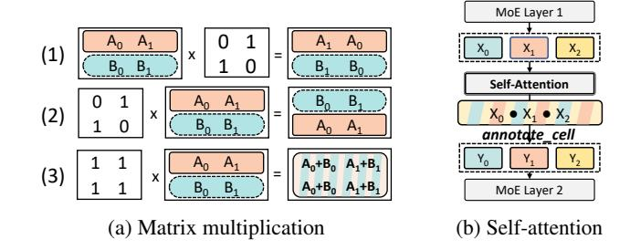

Figure 8: Different types of static dataflow at Cell-level.

#### <span id="page-6-2"></span>5.1 Static *Cell*-level Dataflow

Tensor-centric dataflow graphs only preserve relations between tensors without the information of Cells. To trace all possible *Cell*-level dataflow of static operators, Brainstorm uses symbolic execution at Cell-level to extract finer-grained relations in ahead-of-time compiling. With the annotated Cells of a tensor, Brainstorm initializes a symbolic version of the tensor, whose *Cells* are symbols. Tensor values belonging to one *Cell* share the same symbol. Brainstorm leverages the tensor expression of operators (widely used in DL compilers [39]) to build computation logic of operators. By checking the results of symbolic computation, Brainstorm understands how *Cells* are transmitted in static operators.

Figure 8a illustrates three examples of matrix multiplication between a tensor of multiple *Cells* and a constant matrix. The tensor has two *Cells* annotated as *A* and *B*. The first preserves Cell positions; the second reorders Cells; the third mixes all Cells in the output. This example shows the static Cell-level dataflow could vary when the tensor values are different. It is hard for tensor-level dataflow analysis to obtain this finer-grained relation. Figure 8b demonstrates the static Cell-level dataflow of the self-attention operator between two MoE layers. Because there is a matrix multiplication between two tensors in the self-attention operator and both tensors contain Cells of  $X_i$ , this self-attention operator mixes all Cells from input X to generate the output Y. With symbolic execution of Cells, we can derive the relations between the Cells in X and Y, i.e., every *Cell* in Y is derived from all *Cells* in X.

The static Cell-level dataflow analysis is necessary to derive cross-layer relations of Cells, which is important in data movement-related optimization. It allows Brainstorm to explore data movement at the Cell-level, breaking the limitation of tensor-level data movement when optimizing multi-GPU execution. For example, if Cells are only reordered without mixing (e.g., the first two types in Figure 8a), the framework has more freedom to dispatch Cells among multiple GPUs based on their data locality for better performance. For MoE-based models, because the tokens are mixed up in the self-attention layer, it introduces a constraint that requires aggregating all tokens of a sentence to the same GPU before self-attention to derive the output. As we have shown in §4.2, this requirement creates constraints of how Cells should be

<span id="page-7-2"></span>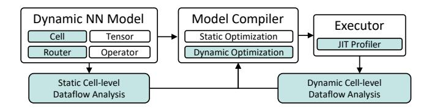

Figure 9: The system architecture of Brainstorm. Shaded components are introduced by Brainstorm for dynamic NNs.

dynamically placed in optimization, which is only known after the static *Cell*-level dataflow is analyzed.

#### <span id="page-7-1"></span>5.2 **Dynamic** *Cell*-level Dataflow

In Brainstorm, model developers express dynamism using Router. The routing logic is defined in router\_fn, which generates routing decisions of Cells at runtime. Brainstorm's Router abstraction makes it easy to trace the necessary information. Similar to dynamic optimization of traditional programming languages, Brainstorm focuses on collecting statistical profiles of routing decisions without caring about how they are generated.

If Cell-level profiling is enabled, when each time a Router is called, Brainstorm records its routing decision into a buffer. Brainstorm has a separate thread to stream the buffer to a profile file. Brainstorm supports multi-level profiling. Some optimizations only require local statistical profile of Router (e.g., branch load of Cells). Some optimizations require Celllevel dataflow across multiple layers, thus needing to dump raw decisions directly. As control signals, routing decisions are much smaller than other data tensors in dynamic NNs. Our evaluation in §7.3 shows the profiling overhead is negligible.

### <span id="page-7-0"></span>**Implementation**

We implement Brainstorm on Pytorch with 13,000 LOC: 3,000 lines for Brainstorm core abstraction, 3,000 lines for dynamic optimizations, 3,000 lines of C++ code for kernel scheduling and sparse Cell communication, and 1,500 lines for auto-transformation to support dynamic optimizations.

Figure 9 summarizes Brainstorm's architecture. In addition to widely-used Tensor and Operator in existing frameworks, Brainstorm introduces Cell and Router to express dynamic NNs in a unified abstraction (§3). The programmed dynamic NNs will be optimized by the compiler with both static and dynamic optimizations (§4). Brainstorm's dynamic optimization needs both static and dynamic *Cell*-level dataflow analysis (§5). Brainstorm first infers the static *Cell*-level dataflow in static operators (§5.1) in an ahead-of-time manner. When executing the compiled model, a JIT profiler collects Router profiles for further dynamic dataflow analysis (§5.2).

**Efficient** *Cell* **routing.** Brainstorm is responsible for dy-

<span id="page-7-3"></span>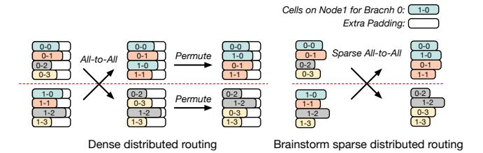

Figure 10: Sparse All-to-All for distributed *Cell* routing. It saves redundant communication of extra padding.

namic Cell dispatching that is aware of dynamic optimization applied, leaving model developers to focus on designing the routing algorithm. For Cell routing on a single GPU, we use a custom GPU kernel to rearrange Cells inside a tensor according to the routing decisions. We borrow the idea from Tutel [22] for MoE models by rearranging Cells for all branches in parallel with a custom GPU kernel. But our implementation is general to all dynamic NNs in addition to MoE models. Moreover, our implementation is aware of the dynamic optimization applied. For instance, a dynamic horizontal fused operator may contain GPU kernels of varied sizes, thus requiring variable padding. For Cell routing across multiple GPUs, we provide a more flexible sparse communication primitive. As shown in the left of Figure 10, model developers often combine dense all-to-all primitive and permutation operations for distributed Cell routing. Its efficiency is restricted to balanced routing. With Brainstorm's sparse communication, it only transmits Cells without extra padding. The underlying implementation of sparse communication is a collection of point-to-point communication. However, it can adapt to the dynamic optimization's requirements and provide the most efficient communication mechanism.

Excessive Candidates for Kernel Fusion. Brainstorm fuses multiple branches into one kernel function, each comprising several potential candidates. At runtime, Brainstorm triggers suitable candidates based on the dispatched Cells. However, excessive kernel candidates derived from profiling analysis can lead to considerable time overhead when searching for them using auto-tuning tools [39]. To avoid issues in this case, Brainstorm only fuses a limited set of candidates of each branch. Meanwhile, kernel candidates are shared between branches if the fused branches are homogeneous (the same operator only with different weights). For instance, since SwitchTransformer uses the same feed-forward layer for its experts, Brainstorm only needs six candidate kernels to optimize the execution of 256 experts per layer (§7.4.1).

**Optimization Passes.** Most automatic transformations in Brainstorm are implemented with torch.fx. With the dataflow graph traced by torch.fx, Brainstorm uses the statistical profiles collected from *Routers* to manipulate the dataflow graph for optimization. E.g., in dynamic horizon-

<span id="page-8-1"></span>

| Model           | Dataset          | Fusion | Place | Route | Load |
|-----------------|------------------|--------|-------|-------|------|
| Switch [14]     | MNLI [40]        | "      |       |       |      |
| TaskMoE [27]    | Synthetic        |        | "     |       |      |
| SwinV2-MoE [41] | ImageNet22k [42] |        | "     |       |      |
| LiveSR          | Iowa-DOT [43]    | "      |       |       |      |
| DRouting [28]   | Cityscapes [44]  |        |       | "     | "    |
| MSDNet [1]      | Imagenet [42]    | "      |       | "     |      |

Table 2: Benchmark specifications. (Fusion: Dynamic Horizontal Fusion; Place: Profile-Guided Placement; Route: Speculative Routing; Load: Speculative Weight Preloading.)

tal fusion, we replace operators of multiple branches in the dataflow graph with the generated fused kernel of multiple shapes and change *Router* to pad tensors to supported shapes while routing *Cells*. For speculative routing, we reorder operators in the dataflow graph to skip and unroll routing logic. For speculative weight loading, we collect parameters of branches, and insert extra operators for loading and unloading them at runtime. The profile-guided model placement is an exceptional case, as the loading of model weights falls outside the scope of torch.fx. Before inference, Brainstorm loads corresponding weights given by the placement plan derived from the statistical profiles. At runtime, Brainstorm's *Router* will translate routing decisions given by router\_fn according to the placement to route *Cells* to the appropriate devices.

Selecting Dynamic Optimizations. Given a dynamic model, we use a rule-based policy to select dynamic optimizations. Dynamic horizontal fusion is used for models with parallel branches when a single branch cannot saturate GPU cores. Profile-Guided model placement is used for multi-GPU inference. Speculative routing and weight preloading are enabled when routers block GPU kernel submission. Speculative weight preloading is used when GPU memory is limited, and paging is used. [Table 2](#page-8-1) has listed the dynamic optimizations applied to each model. For example, LiveSR is a lightweight super-resolution model, and a single branch may not saturate a GPU. Thus we apply dynamic horizontal fusion to it. Also, MoE-based models are usually large language models requiring multi-GPU deployment. Therefore we apply the placement optimization. The input for TaskMoE is sufficiently large for high GPU utilization, thus no need for horizontal fusion.

### <span id="page-8-0"></span>7 Evaluation

We evaluate the performance of Brainstorm (BRT) on six representative dynamic NNs. We compare Brainstorm with various approaches to execute and optimize dynamic NNs, including PyTorch-native static optimizations and model-specific optimizations (e.g., Tutel for MoE). Overall, Brainstorm achieves up to 11.7× speedup (3.29× on average) or reduces GPU memory usage by 42%.

<span id="page-8-2"></span>

| Model | Switch | TaskMoE  | SwinV2-MoE |
|-------|--------|----------|------------|
| LOC   | 12     | 24       | 14         |
| Model | LiveSR | DRouting | MSDNet     |
| LOC   | 6      | 18       | 14         |

Table 3: Lines of code for porting the model to Brainstorm.

### 7.1 Experimental Setup

Testbed. We evaluate Brainstorm with two separate setups for single-GPU and multi-GPU experiments. The single-GPU evaluations use a server with AMD-EPYC-7V13 CPUs and one NVIDIA A100 (80GB) GPU running CUDA 11.3 and cuDNN 8.6. The multi-GPU evaluations use a server with Intel Xeon CPU E5-2690 v4 CPU and *eight* NVIDIA V100 (32GB) GPUs running CUDA 11.3 and cuDNN 8.2.

Benchmarks and datasets. Our evaluations are performed to run inference of six representative dynamic NNs, covering vision and natural language processing (NLP) tasks. [Table 2](#page-8-1) lists evaluated models, datasets, and dynamic optimizations we apply in Brainstorm. SwitchTransformer (Switch) [\[14\]](#page-15-7) and TaskMoE [\[27\]](#page-16-5) are two MoE models for NLP, whose *Cells* are defined at token level and sentence level, respectively; SwinV2-MoE [\[22,](#page-16-0) [41\]](#page-17-0), LiveSR, DynamicRouting (DRouting) [\[28\]](#page-16-6), and MSDNet [\[1\]](#page-15-0) are four models for vision tasks. SwinV2-MoE and LiveSR define a *Cell* at image patch level. DynamicRouting and MSDnet use an image as a *Cell*. Statistical profiles used for Brainstorm's dynamic optimizations are collected from training datasets and evaluated in test datasets.

Baselines. We mainly compare Brainstorm with PyTorch and Tutel in all experiments. As far as we know, PyTorch is a state-of-the-art framework that can flexibly support dynamic neural networks (thanks to the expressiveness of Python). The official implementation of all models we evaluated are based on PyTorch and thus are compared in all evaluations in this paper. Tutel is designed specifically for MoE. Thus we only compared Brainstorm with Tutel on MoE-based models. To evaluate the benefit of the new proposed dynamic optimizations, Brainstorm and all baselines use the same static optimizations (e.g., vertical kernel fusion) in all experiments.

### 7.2 Effectiveness of Brainstorm Abstraction

Expressiveness of Brainstorm. Brainstorm's abstraction can express various dynamic neural networks in a simple and concise manner. [Table 3](#page-8-2) shows the lines of code for porting the six dynamic neural network models to Brainstorm. Brainstorm unifies the API of expressing routing logic through *Router* and *Cell*. This only adds a marginal extra coding effort to porting existing models and building new dynamic models. Brainstorm eases the programming by providing common

<span id="page-9-1"></span>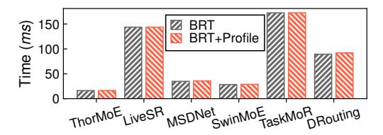

Figure 11: Latency of Brainstorm with or without profiling.

<span id="page-9-2"></span>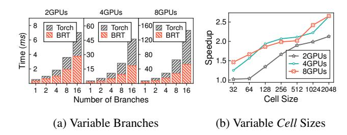

Figure 12: Performance comparison of sparse all-to-all between PyTorch and Brainstorm.

router\_fns (e.g., Top-K) and allows model developers to construct more complex ones atop them.

Overhead of Tracing Dynamic Cell-level Dataflow. This micro-benchmark presents the overhead of tracing dynamic Cell-level dataflow. Figure 11 shows the latency variation when tracing is on and off. The latencies of all models are almost equal before and after tracing is enabled. The average overhead is less than 1.0% for all models.

When routing actions are calculated at GPU, major overhead comes from GPU kernels for statistics. The synchronization overhead is negligible because Brainstorm dumps profiles to the CPU periodically and asynchronously.

Effectiveness of Cell Routing. Brainstorm's Router decouples routing logic from execution. Brainstorm has efficient implementations to conduct dynamic data movement for sparse communication. Figure 12 demonstrates two microbenchmarks for sparse communication, which is a multi-gpu experiment. We randomly generate 1024 Cells routed from one GPU to multiple GPUs. Figure 12a measures the latency of PyTorch's all-to-all collective (nccl [45] as backend) and Brainstorm's sparse communication with varied numbers of branches and GPUs. Each Cell has 512 Float 32 values (same as TransformerBase [46]). Brainstorm achieves 1.88× to 2.78× speedup from 2 to 8 GPUs. Figure 12b shows Brainstorm's speedup with a varied Cell size from 32 to 2048 Float 32 values, with 4 branches on each GPU. Brainstorm achieves  $2.13 \times$  to  $2.66 \times$  speedup on 2 to 8 GPUs. Overall, Brainstorm performs better than PyTorch in all experiments. The root cause is the extra communication for padding using PyTorch's all-to-all communication, which is avoided by Brainstorm's sparse communication.

<span id="page-9-3"></span>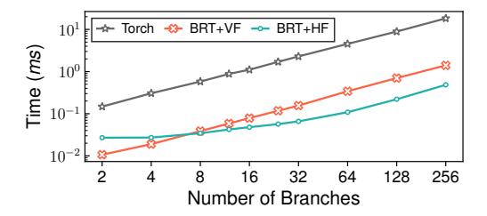

Figure 13: Latencies of serial execution, vertical fusion, and dynamic horizontal fusion with variable branches

#### <span id="page-9-0"></span>Micro Benchmarks

**Dynamic Horizontal Fusion.** In the micro-benchmark of Brainstorm's dynamic horizontal fusion, we build a simple multi-branch network, each of which contains a Conv2D operator. A Router dispatches 32x32 image patches to different branches based on image content. Brainstorm tunes kernels from 4 patches to 9 patches based on the collected Router profiles. It is conducted on the single-GPU server.

Figure 13 presents the latencies of PyTorch's serial execution (Torch), Brainstorm's serial execution but with tuned kernels (BRT+VF), and Brainstorm's dynamic horizontal fusion (BRT+HF).

Vertical fusion (VF) is the commonly used fusion of consecutive operators to reduce kernel launching overhead [39, 47]. Compared to Torch, BRT+HF achieves up to 41.8× speedup. The improvement comes from two sources: the improved CU utilization with concurrent execution of multiple branches, and efficient kernels tuned for frequently appeared *Cell* loads. By comparing BRT+VF and Torch, we identify the statistically tuned GPU kernels that bring 13.1× speedup. The concurrent execution of multiple branches further brings 3.18× speedup (BRT+HF/BRT+VF). Since dynamic horizontal fusion has an overhead of extra GPU kernels to calculate input pointer addresses, we find BRT+HF performs slightly worse than BRT+VF  $(12.3\mu s)$  on average) when the number of branches is small.

**Profile-Guided Placement.** In §4.2, we show that profileguided model placement can save inter-GPU communication for dynamic NNs. In this micro-benchmark, we compare the communication latency of default placement in PyTorch with Brainstorm's optimized placement. We conduct this experiment on the multi-GPU server. We replace PyTorch's communication with Brainstorm's sparse communication to isolate the improvement from efficient sparse communication. In the default placement, each GPU-i routes 1024 tokens to each branch on GPU-(i+1) and 10 tokens per each other branch. In the optimized placement, Brainstorm can route 1024 tokens to the same GPU without inter-GPU communication. In Figure 14a, the Cell size is fixed to 512 Float 32 values for evaluation with variable branches. Brainstorm achieves 2.45× to 6.23× speedup on 2 to 8 GPUs. In Figure 14b, the number

<span id="page-10-1"></span>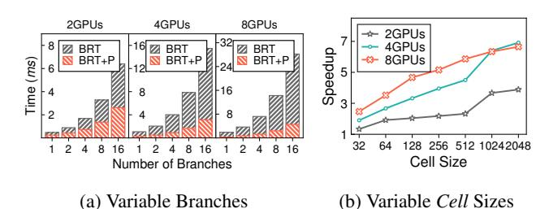

Figure 14: Performance comparison of sparse communication of Brainstorm with (BRT+T) and without (BRT) the placement optimization.

<span id="page-10-2"></span>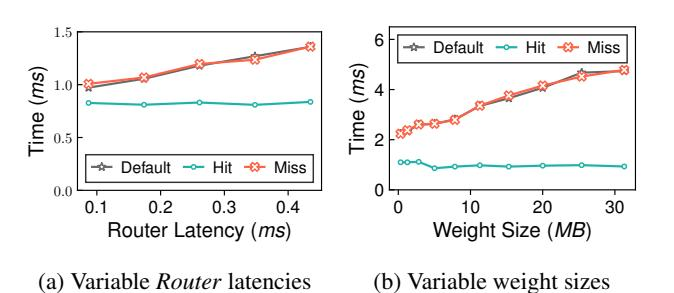

Figure 15: Performance comparison of default execution and hit/miss cases in speculative optimizations.

of branches on a single GPU is fixed to 4 with variable Cell sizes. Brainstorm achieves  $3.89 \times$  to  $6.65 \times$  speedup on 2 to 8 GPUs. Brainstorm achieves the improvement due to reduced communication in the optimized placement. More branches and larger Cell further increase inter-GPU communication volume amplifying the gap between the default placement and Brainstorm's optimized placement.

**Hit or Miss of Speculative Optimization.** §4.3 and §4.4 introduce two speculative optimizations for dynamic NNs, i.e., speculative routing and weight preloading. The following two micro-benchmarks demonstrate a comparison between default execution and Brainstorm's speculative optimization, conducted on the single-GPU server. We build a simple network routing an input tensor to 8 branches. Each branch has 20 gemm operators. Brainstorm speculatively executes Branch-0 or loads Branch-0's weights in the speculative routing and weight preloading, respectively. Figure 15a shows inference time with varied Router latency. When prediction hits, Router latency can be hidden by gemm operators on the correct branch. When prediction misses, these gemm operators will be unrolled. Brainstorm achieves a constant inference time when prediction hits, and a similar inference time with the default execution when prediction misses.

Figure 15b shows weight preloading overhead of the same model but with varied weight sizes. Since only weights of the activated branch are loaded, the GPU memory requirement is reduced by 8×. When Brainstorm's prediction hits, the

<span id="page-10-3"></span>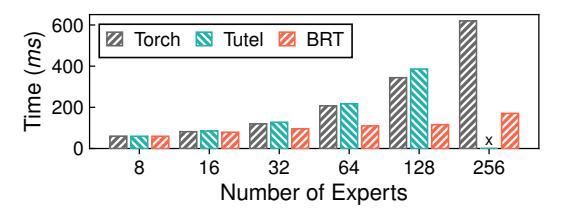

Figure 16: Latencies of SwitchTransformer.

weights are speculatively preloaded before *Router*, whose latency is hidden by previous computation and Router latency. When prediction misses, Brainstorm falls back to the default execution that loads weights of the correct branch. Brainstorm achieves a consistent latency when prediction hits, and similar latency with the default execution when prediction misses.

### **End-to-end Model Execution**

### <span id="page-10-0"></span>7.4.1 SwitchTransformer

In SwitchTransformer, each expert has a capacity of 64 tokens for each sentence. By analyzing Router profiles, we find an imbalanced distribution of the number of tokens routed to each expert (shown in Figure 2a). This motivates us to apply dynamic horizontal fusion to execute experts in parallel with GPU kernels tuned for different loads. We use the official weights trained by Google with 8 to 256 experts per MoE layer. The batch size is 8, and each sentence has 128 tokens. The experiment is conducted on the single-GPU server.

Figure 16 shows latencies of SwitchTransformer with official implementation in PyTorch (Torch), replacing MoE layers with an optimized implementation from Tutel (Tutel), and Brainstorm with dynamic horizontal fusion. The official implementation executes experts in serial. Tutel runs experts concurrently with BatchMatmul, which requires padding to the same number of tokens for all experts. Brainstorm outperforms by  $3.63\times$ , and  $3.33\times$  compared to Torch, and Tutel, respectively. The speedup increases with more experts in each MoE layer. In addition to improved utilization of concurrently executed experts, Brainstorm also benefits from imbalanced token distribution. Because many experts only receive a few tokens, Tutel pads many dummy tokens in all paths, leading to vast wasted computation on padding. The excessive padding also uses more GPU memory leading to out-of-memory in Tutel when there are 256 experts. By analyzing loads of different branches, Brainstorm compiles multiple GPU kernels to minimize the padding.

### 7.4.2 LiveSR

LiveSR is our internal model for super-resolution, which slices a single image into 32x32 patches and routes them to different branches. It uses a ResNet-18 model to extract patterns, which are then routed by K-nearest neighbor (kNN) to multiple branches. By collecting the routing distribution of patches,

<span id="page-11-0"></span>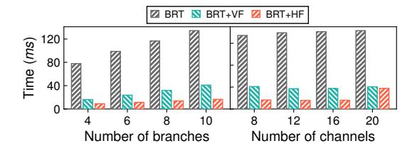

Figure 17: Latencies of LiveSR in Brainstorm with vertical fusion and dynamic horizontal fusion.

we find a distribution in the number of patches routed to each branch (as shown in Figure 2b). This creates the opportunity for Brainstorm to tune GPU kernels for frequently *Cell* loads. Also, since different patches of an image are routed to different branches, Brainstorm can horizontally fuse these branches to concurrently execute them to improve CU utilization.

Figure 17 shows latencies of LiveSR with different optimizations, while being executed on the single-GPU server. BRT-HF applies dynamic horizontal fusion of both multiple branches and multiple tuned kernels of different loads. To dissect the improvement of both types of fusion, we evaluate BRT-VF that only fuses Conv2D, BatchNorm, and ReLU operators in each branch but with statistically tuned GPU kernels. In Figure 17, we vary both the number of branches with a fixed number (8) of channels and the number of convolution channels with a fixed number (10) of branches.

Overall, BRT+HF achieves up to  $8.62\times$  speedup compared to BRT. BRT+VF brings a speedup up to  $3.5\times$  compared with BRT. BRT+HF further brings  $1.79\times$  to  $2.48\times$  gains over BRT+VF with an increasing number of branches because of the improved CU utilization with more branches. When increasing the number of channels, we find the latency of BrainstormBRT+HF remains the same until it reaches 20 channels as it goes beyond the upper bound of GPU CUs.

### 7.4.3 TaskMoE

TaskMoE routes input tensors at the granularity of the sentence. Each MoE layer has 16 experts. Each sentence is routed to 2 experts. The key difference of TaskMoE is its routing algorithm: it decides expert of a sentence based on *task type*. Sentences of the same task will be routed to the same expert branches. Therefore, as we have shown in Figure 2c, TaskMoE has a strong inter-layer expert correlation that experts of the same task are activated together with a high probability, which brings the opportunity for profile-guided placement.

Brainstorm optimizes placement by reordering experts of MoE layers for the most efficient communication. Brainstorm's *Routers* are aware of reordering and dispatch sentences to correct GPUs in the optimized placement. We conduct this experiment with three input settings: 256 sentences on each GPU with 32/64 tokens in each sequence; 512 sequences on each GPU with 32 tokens in each sequence. The

<span id="page-11-1"></span>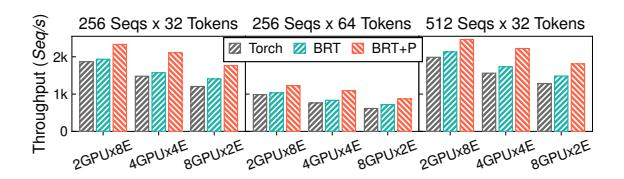

Figure 18: Throughput of TaskMoE. Torch: routing with Py-Torch's native communication primitive. BRT: routing with Brainstorm's sparse communication primitive. BRT+P: placement optimized routing over BRT.

<span id="page-11-2"></span>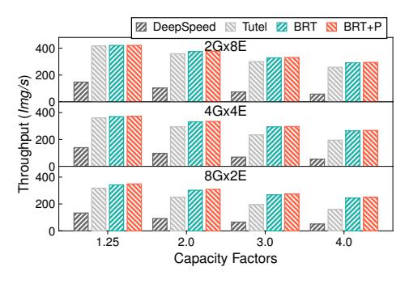

Figure 19: Throughput of SwinV2-MoE. G: the number of GPUs. E: the number of experts per GPU.

task ID of each sequence is randomly generated. Since routing of TaskMoE only works on task ID, the synthetic dataset does not affect the optimal placement and evaluation conclusion.

Figure 18 shows the per-GPU throughput on 2-8 GPUs. The experiment is conducted on the multi-GPU server. Compared with Torch, BRT first brings up to  $1.17\times$  speedup with efficient sparse communication. The speedup of BRT grows with more GPUs because of the increased data volume for inter-GPU transmission. Brainstorm's sparse communication saves unnecessary communication due to padding. On top of this, BRT+P further achieves up to  $1.34\times$  speedup with the optimized placement. The optimized placement derived from runtime profiles helps BRT+P to reduce  $42 \sim 87\%$  inter-GPU communication, speeding up routing of MoE layers.

### 7.4.4 SwinV2-MoE

SwinV2-MoE is the MoE-version of SwinTransformer [41] for image tasks, introduced in Tutel [22]. It defines tokens as *Cells*, each of which contains 384 float32 values tokenized from a 48x48 image patch. SwinV2-MoE uses a capacity factor to control the number of patches each expert receives. When the capacity is exceeded, extra patches are dropped during routing. The capacity factor varies in [1.25, 2.0, 3.0, 4.0] in the experiments. We evaluate SwinV2-MoE with 16 experts on the multi-GPU server by evenly placing the experts on 2 GPUs, 4 GPUs, and 8 GPUs, respectively. The batch size per GPU is 128 images for each inference.

Figure 19 shows throughput of four approaches: a PyTorch

<span id="page-12-1"></span>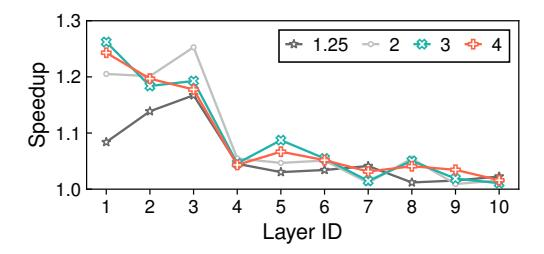

Figure 20: Gaps between the best and the worst placement for MoE Layers in SwinV2-MoE with varied capacity factors.

implementation using DeepSpeed-MoE [48] (DeepSpeed), optimized version with Tutel's MoE kernels [22] (Tutel), optimized version with Brainstorm's Router (BRT), and Brainstorm's profile-guided placement optimization (BRT+P). Brainstorm's efficient *Router* first brings up to 5.04× and 1.52× speedup over DeepSpeed and Tutel, respectively. Both BRT and Tutel use custom GPU kernels for efficient routing inside a GPU, thus greatly outperforming DeepSpeed, which uses einsum. With an increased capacity factor, BRT brings higher speedup over Tutel because of saved inter-GPU communication due to increased padding.

By optimizing expert placement via runtime profiles, we find BRT+P only brings marginal improvement. After using Brainstorm's efficient Router, SwinV2-MoE model only spends up to 35% of time on inter-GPU communication, which reduces the potential by further reducing communication overhead. Similar to TaskMoE, we do observe different expert placements have greatly varied efficiency. Figure 20 shows our evaluation of a single SwinV2-MoE layer to compare the performance of the best placement and the worst placement with 8 GPUs and 2 experts per GPU. The gap is up to 1.26× speedup for ten SwinV2-MoE layers. The smaller the layer id is, the more imbalance appears in token distribution, creating more space for improvement by placement. It shows great potential for larger MoE models with more experts, whose communication latency dominates [22].

#### **7.4.5** MSDNet

MSDNet [1] is a dynamic network that can adapt this execution path to the computational resource limits at test time. The network contains 5 exits that allow the inference of an image to end in the middle, if the output quality is higher than the predefined thresholds. Users can configure the threshold of each exit to control the inference cost. For instance, [0,0,0,0.4,0.6] represents that 40% of the inferences in the dataset end at the 4th exit and 60% end at the last exit. There are no inferences ending at the other exits.

Figure 21 shows the experiment results with 6 kinds of exit configurations applying different optimizations, running on the single-GPU server. We set the batch size to a single image at inference. We first tune the GPU kernels with vertical fusion (BRT+VF) as the baseline. On top of that, we first

<span id="page-12-2"></span>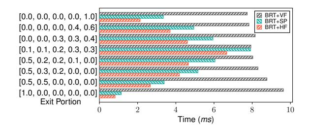

Figure 21: Latencies of MSDNet with vertical fusion, speculative routing, and dynamic horizontal fusion.

<span id="page-12-3"></span>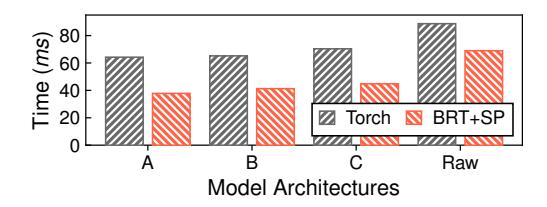

Figure 22: Latencies of DynamicRouting.

apply speculative routing (BRT+SP) and then dynamic horizontal fusion (BRT+HF) to evaluate the benefits of dynamic optimizations. Compared with BRT+VF, Brainstorm achieves up to  $8.44\times$ ,  $11.7\times$  speedup by BRT+SP and BRT+HF, respectively. We observe BRT+SP reduces higher latency when the inferences end at either very early exists or very last exits, due to the speculative routing making more correct predictions. If the inference has a similar opportunity to end at each exit, BRT+SP has a similar performance with BRT+VF (e.g., for [0.1, 0.1, 0.2, 0.3, 0.3]). For dynamic horizontal fusion (BRT+HF), Brainstorm performs better when the inferences prefer ending at the last exits, further bringing up to  $1.57 \times$  gain over BRT+SP. The root cause is the uncertain routers break many horizontal fusion opportunities. MSDNet has some operators that can be executed in parallel if the inference does not end at an exit. If a *Router* may terminate in the middle, Brainstorm cannot determine whether it is safe to horizontally fuse them, thus falling back to BRT+VF.

#### <span id="page-12-0"></span>7.4.6 **DynamicRouting**

DynamicRouting [28] is a semantic segmentation model for images that introduces a lot of *Routers*. It contains 186 Routers and 186 computation operators, leading to a very high routing overhead. At each Router, input images are routed to 1 or 2 branches among 3 designed branches with convolution operators for down-sampling, up-sampling, or keepingresolution, respectively. DynamicRouting proposes four architecture configurations (A, B, C, and Raw for short, in order of growing computation). By analyzing *Routers*' runtime profiles collected by Brainstorm, we find many Routers exhibit a high probability of making consistent routing decisions, which brings opportunities for speculative optimizations. The following experiments are conducted on the single-GPU server.

<span id="page-13-1"></span>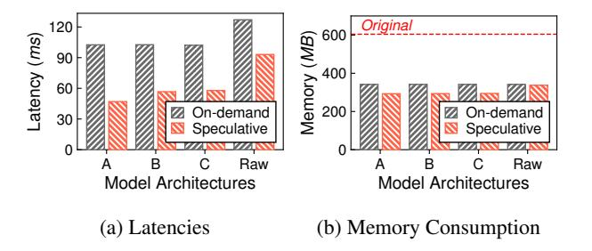

Figure 23: Speculative weight preloading of DynamicRouting with variable model architectures.

Figure 22 presents the latency of four configurations optimized by Brainstorm's speculative routing (BRT+SP), where batch size is set to a single image. Brainstorm achieves up to  $1.7\times$  speedup compared to the official implementation in PyTorch (Torch). BRT+SP achieves  $1.7\times$ ,  $1.58\times$ ,  $1.57\times$ , and  $1.29\times$  speedup compared with Torch in the four architecture, respectively. With statistical distribution derived from the runtime profiles, BRT+SP can predict the routing decisions of the 186 routers with an accuracy of  $90\% \sim 95\%$ . This greatly reduces the routing overhead in the four model architectures. As we have shown in the micro-benchmark of Figure 15a, the overhead of speculative routing is negligible even when the prediction is wrong.

Figure 23 shows the inference latency and the GPU memory usage of DynamicRouting optimized by Brainstorm's speculative weight preloading. In the baseline (on-demand loading), Brainstorm only loads the weight of a branch after the routing decision is made. Brainstorm will preload the weights of the branch to be activated with the highest probability, and falls back to on-demand loading if the prediction is wrong. Because the weight loading latency is hidden, Brainstorm's speculative optimization can accelerate the model inference by up to 1.97× than on-demand loading. Moreover, the official implementation needs to load all model weights to the GPU memory for single-image inference (i.e., 604.5MB of Original in Figure 23). With on-demand loading and speculative preloading, memory usage is greatly reduced by 50.7% and 43.5%, respectively. This creates the opportunity to infer large models on GPUs with limited GPU memory. Brainstorm's speculative weight preloading requires slightly lower GPU memory than on-demand loading. This is because speculative weight preloading also releases some GPU memory in advance speculatively.

#### <span id="page-13-0"></span>8 Discussion

**Handling distribution drift.** The profiling data is analyzed offline by dynamic optimization policies. Profiling data should be statistically representative of reality; otherwise, it could mislead Brainstorm's optimization and result in reduced or even negative gain. As shown in Figure 24, the impact de-

<span id="page-13-2"></span>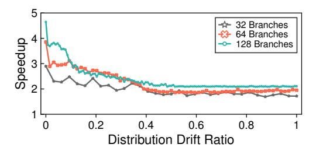

Figure 24: Speedup of Brainstorm's dynamic horizontal fusion when the distribution of branch loads drifts from the statistics used for tuning GPU kernels.

pends on the models and the degree of drifts.

Figure 24 evaluate the impact of distribution drift on dynamic horizontal fusion. Based on the collected profiles, Brainstorm only tunes Conv2D kernels with 4 and 27 patches. Therefore, when a branch receives more than 4 patches, it needs to be padded to 27 patches running with the non-optimal 27-patch kernel. An initial dispatch of 4 patches per branch is made so that no padding is needed. To simulate increasing distribution drift, we add loads of some branches to 8 patches, which are less frequently appearing in the profile and thus not tuned by Brainstorm. We define the distribution drift ratio as the fraction of branches whose received patches differ from the tuned shapes (4 and 27 in this experiment). In Figure 24, we find the speedup of Brainstorm's dynamic horizontal fusion BRT+HF diminishes with an increasing drift ratio, from  $4.65 \times$  to  $2.11 \times$ , compared with applying only vertical fusion. This is due to the wasted computation from the padding on branches receiving 8 patches.

The optimization policy needs to monitor profiles continuously collected by Brainstorm and triggers re-optimization when distribution drifts. It takes time for re-optimization (usually a few minutes), e.g., searching for a new placement, and tuning new GPU kernels. Therefore, during cold-start or re-optimization, the model execution does not use dynamic optimization. Currently, Brainstorm focuses on the mechanisms of enabling dynamic neural optimizations. We hope to inspire more advanced solutions to be robust to distribution drifts.

More dynamic optimization opportunities. Brainstorm can also be applied to training. When fine-tuning MoE-based Large Language Models, the statistics of expert activation can be leveraged similarly with inference, e.g., re-arranging the expert placements across GPUs to reduce communication volume. Moreover, many algorithms in Neural Architecture Search also design dynamic architectures (e.g., DARTS [49], SPOS [50]), whose activation is known only at runtime. Their latter stage of training may show more stable branch activation, which can be potentially exploited by Brainstorm.

To support training, there are still some engineering efforts that need to be resolved. Firstly, backward propagation

is needed for automatic differentiation in training, which is missed in the current implementation. Secondly, some operators may invalidate Brainstorm's tracing for dynamic optimization. For instance, Batchnorm performs cross-*Cell* computing different from the *Cell*-level computation at inference, which requires manual specification.

Brainstorm can also be applied to dynamic sparsity, which uses different value/block-level sparsity patterns for different inputs (e.g., Longformer). To optimize their execution, Brainstorm needs to collect pattern statistics at a fine granularity. Then we can compile multiple specialized GPU kernels for different sparsity patterns (e.g., using SparTA [\[51\]](#page-17-10)), and activate the most efficient one at runtime.

