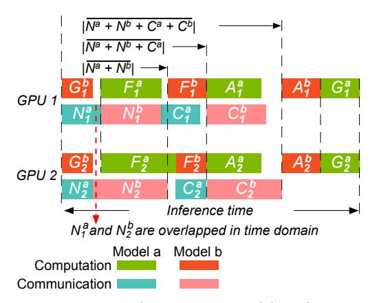
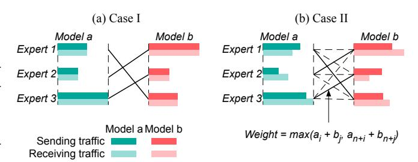

# Takeaway 2

- The GPU assignment affects the inference time in heterogeneous clusters.
- The optimal GPU assignment involves sorting experts by number of tokens processed, then assigning them to GPUs from highest to lowest performance.
- The transmission order developed for homogeneous clusters remains optimal in a heterogeneous environment.

#### 6 COLOCATING MODELS ON HOMOGENEOUS CLUSTERS

In this section, we explore the best way to place two MoE models on a homogeneous cluster. This scenario is termed Colocating + Homogeneous.

**Solution overview.** We first demonstrate that the colocation choice affects the aggregated communication time and further the inference time. Next, we prove that a colocation solution minimizing aggregated communication time will also minimize inference time (§6.1). We determine the optimal expert colocation, which minimizes communication time, by solving the bottleneck matching problem (§6.2).

## 6.1 Minimizing inference time equals minimizing communication time

Fig. 7 illustrates a scenario where two MoE models, a and b, run simultaneously on a homogeneous cluster3. Components of Model a are shown in shades of green, while those of Model b are in shades of red. The subscript numbers (1 and 2) indicate the GPU index, and the superscript letters (a and b) refer to the model index. For example,  $G_1^b$  denotes the computation time of Model b's Gate network on GPU 1.

The Colocating + Homogeneous scenario inherits characteristics of the Exclusive + Homogeneous case (§4). These characteristics include: no need to decide GPU assignment on a homogeneous cluster, equal computation time for the Gate and Aggregation, and increased computation time for an expert when processing more tokens. Additionally, running two experts on the

Fig. 7. Running colocating MoE models on homogeneous clusters.

tokens. Additionally, running two experts on the same GPU introduces new characteristics and constraints, as illustrated below.

- (1) *Computation competition.* One model's computation components cannot start if another model is still under computing processes.
- (2) Communication overlapping. The all-to-all communications from two models can overlap in the time domain. For instance, Model a's all-to-all communication,  $C_2^a$ , can begin while Model b's communication,  $N_1^b$ , on GPU 1 is still in progress.

**Aggregated communication times.** The term  $|\overline{N^a} + \overline{N^b}|$  represents the time required to complete the first all-to-all communication for two models, which we refer to as the aggregated communication time. This differs from  $|N^a| + |N^b|$ , which simply adds the communication times of each

&lt;sup>3We only colocate models with the same number of experts, even though it's not a strict requirement in theory.

| Component | Start time               | End time                         |
|-----------|--------------------------|----------------------------------|
| $G^b$     | 0                        | $ G^b $                          |
| $N^a$     | 0                        | $ \overline{N^a} $               |
| $F^a$     | $\max( G^b , N^a )$      | $\max( G^b , N^a ) +  F^a $      |
| $N^b$     | $\geq  G^b $             | $ \overline{N^a + N^b} $         |
| $F^b$     | $\max(E_{F^a}, E_{N^b})$ | $\max(E_{F^a}, E_{N^b}) +  F^b $ |
| $C^a$     | $\geq E_{Fa}$            | $ \overline{N^a + N^b + C^a} $   |
| $A^a$     | $\max(E_{F^b}, E_{C^a})$ | $\max(E_{F^b}, E_{C^a}) +  A^a $ |
| $C^{b}$   | $\geq E_{F^b}$           | $ \overline{N^a+N^b+C^a+C^b} $   |
| $A^b$     | $\max(E_{A^a},E_{C^b})$  | $\max(E_{A^a},E_{C^b}) +  A^b $  |
| $G^a$     | $E_{A^b}$                | $E_{Ab} +  G^a $                 |

Table 2. Start and end time of each component on the Colocating + Homogeneous scenario.

model without considering potential overlap. As shown in Fig. 7, communications  $N_1^a$  from Model a and  $N_2^b$  from Model b overlap, resulting in  $|\overline{N^a+N^b}|$  being smaller than  $|N^a|+|N^b|$ .  $|\overline{N^a+N^b}|$  is impacted by the expert colocation choice. When colocating two experts, pairing one with high communication demands with another that has fewer tokens to send can reduce the aggregated communication time.

**Inference time expression.** Based on Fig. 7, we determine the finish time of each component, as shown in Table 2. For simplicity, we display only the maximum start and end times across the n GPUs for each component. For example,  $|G^b|$  is defined as  $\max(|G_i^b|)$  for  $i \in [1, n]$ , thereby omitting the GPU index subscript. Additionally, we use E to denote the end time; for instance,  $E_{A^b}$  indicates the end time of component  $A^b$ . The inference time corresponds to the end time of  $G^a$ , which is  $E_{A^b} + |G^a|$ , as shown below.

Inference time 
$$t = E_{Ab} + |G^a|$$
 (4)

In Eqn. 4,  $|G^a|$  is known in advance, while  $E_{A^b}$ , the end time of component  $A^b$ , is given by  $\max(E_{A^a}, E_{C^b}) + |A^b|$ . Both  $E_{A^a}$  and  $E_{C^b}$  can be further defined by the start and end times of other components. Following this approach, we can derive the complete expression for the inference time t, though it is not displayed here due to its complexity.

Rather than directly targeting inference time, we approach the problem by minimizing the aggregated communication time. In §4, we minimize the communication time by determining an optimal transmission order using Theorem 4.2. This is conducted under the context where traffic matrix is fixed. In contrast, colocation scenarios present different aggregated traffic matrices depending on the colocation choice. In the Colocating + Homogeneous scenario, minimizing communication time requires finding an expert colocation choice. The resulting traffic matrix achieves the shortest communication time when applying Theorem 4.2.

Theorem 6.1. Minimizing aggregated all-to-all communication times of two colocating models ensures minimum inference time in a homogeneous cluster.

PROOF. We use proof by contradiction. Assume we have an optimal colocating strategy that minimizes communication times, resulting in an inference time of  $t = E_{A^b} + |G^a|$ . Now, suppose there exists another colocating strategy with higher communication times but a shorter inference time:  $E'_{N^b} > E_{N^b}, E'_{C^a} > E_{C^a}, E'_{C^b} > E_{C^b}$ , and t' < t. According to Theorem 4.2, the minimum communication time is determined solely by the maximum column or row sum. Thus, different GPU

assignment solutions for Model a do not affect this value. So we have  $E'_{N^a} = |N^a|' = E_{N^a} = |N^a|$ . In a homogeneous cluster, we have  $|G^a|' = |G^a|$ ,  $|G^b|' = |G^b|$ ,  $|A^a|' = |A^a|$ , and  $|A^b|' = |A^b|$ . Since computation time is proportional to communication time in such a cluster, it follows that  $|F^a|' > |F^a|$  and  $|F^b|' > |F^b|$ . We will now proceed with the proof by contradiction to show it is impossible to achieve a lower inference time. Specifically, we need to prove that  $t' = E'_{A^b} + |G^a|' < t = E_{A^b} + |G^a|$  cannot hold.

$$|G^{a}|' = |G^{a}|, \ E'_{A^{b}} + |G^{a}|' < E_{A^{b}} + |G^{a}| \Rightarrow \max(E'_{A^{a}}, E'_{C^{b}}) + |A^{b}|' < \max(E_{A^{a}}, E_{C^{b}}) + |A^{b}|$$

$$|A^{b}|' = |A^{b}|, \ E'_{C^{b}} > E_{C^{b}} \Rightarrow E'_{A^{a}} < E_{A^{a}} \Rightarrow \max(E'_{F^{b}}, E'_{C^{a}}) + |A^{a}|' < \max(E_{F^{b}}, E_{C^{a}}) + |A^{a}|$$

$$|A^{a}|' = |A^{a}|, \ E'_{C^{a}} > E_{C^{a}} \Rightarrow E'_{F^{b}} < E_{F^{b}} \Rightarrow \max(E'_{F^{a}}, E'_{N^{b}}) + |F^{b}|' < \max(E_{F^{a}}, E_{N^{b}}) + |F^{b}|$$

$$|F^{b}|' > |F^{b}|, \ E'_{N^{b}} > E_{N^{b}} \Rightarrow E'_{F^{a}} < E_{F^{a}} \Rightarrow \max(|G^{b}|', |N^{a}|') + |F^{a}|' < \max(|G^{b}|, |N^{a}|) + |F^{a}|$$

$$|F^{a}|' > |F^{a}|, \ |N^{a}|' = |N^{a}| \Rightarrow |G^{b}|' < |G^{b}|$$

Eqn. 5 demonstrates that  $|G^b|' < |G^b|$ , which contradicts our earlier assertion that  $|G^b|' = |G^b|$ . This contradiction validates the correctness of Theorem 6.1.

#### 6.2 Finding optimal expert colocation

Next, we focus on finding an expert colocation which minimizes the communication time. In Table 2, for the terms related to communication times directly, the priority is to reduce  $|\overline{N^a+N^b}|$ . Since  $E_{N^a}=|N^a|$  is unaffected by the expert colocation solution, and  $|\overline{C^a+C^b}|$  equals  $|\overline{N^a+N^b}|$ , minimizing  $|\overline{N^a+N^b}|$  also minimizes  $|\overline{N^a+N^b+C^a+C^b}|$ . Because  $N^a$  and  $C^a$  do not overlap in the time domain (they are separated by  $F^a$ ),  $|\overline{N^a+N^b+C^a}|$  can be expressed as  $|\overline{N^a+N^b}|+|\overline{C^a}|$ . This highlights the importance of optimizing  $|\overline{N^a+N^b}|$ .

In the following, we discuss how to find the expert colocation to minimize  $|N^a + N^b|$ . Suppose  $\mathbb{D}_{N_1}$  and  $\mathbb{D}_{N_2}$  represent the first all-to-all communication traffic matrices of Model a and Model b, respectively. For each potential expert colocating choice, by combining the traffic matrices of  $\mathbb{D}_{N_1}$  and  $\mathbb{D}_{N_2}$ , we create a new traffic matrix  $\mathbb{D}_{new}$ .  $\mathbb{D}_{new}$  represents the aggregated traffic matrix of the two colocating models. According to Theorem 4.2, the communication time with  $\mathbb{D}_{new}$  is determined solely by the maximum sum of traffic within each column or row. In the following, we try to find the optimal expert colocating solution, which minimizes the maximum sum of each column or row among all possible  $\mathbb{D}_{new}$ .

For traffic matrix  $\mathbb{D}_{N_1}$ , the sending and receiving traffic on GPU i are denoted as  $a_i = \sum_{j=1}^n d_{ij}$  and  $a_{n+i} = \sum_{j=1}^n d_{ji}$ , respectively. Utilizing a vector  $\mathbf{a} = [(a_1, a_{n+1}), (a_2, a_{n+2}), ..., (a_n, a_{2n})]$ , the sending/receiving traffic on n GPUs is represented. Similarly, for  $\mathbb{D}_{N_2}$ , a vector  $\mathbf{b} = [(b_1, b_{n+1}), (b_2, b_{n+2}), ..., (b_n, b_{2n})]$  is generated. For an expert colocating choice, an element is selected from both  $\mathbf{a}$  and  $\mathbf{b}$  each time, creating a new vector  $\mathbf{h}$ , which is shown in the following equation4.

$$\mathbf{h} = \mathbf{a}_i + \mathbf{b}_j = (a_i + b_j, a_{n+i} + b_{n+j}), \ i, j \in [1, n]$$
 (6)

The vector **h** represents the column/row sum of the traffic matrix  $\mathbb{D}_{new}$ . Next, we try to minimize the maximum value in **h**.

&lt;sup>4Considering the synchronous all-to-all communication constraint in Eqn. 6, we have  $\mathbf{h} = \mathbf{a}_i + \mathbf{b}_j = (a_i + \max(b_j, G^b), a_{n+i} + \max(b_{n+j}, G^b))$ . However, this adjustment does not impact the optimal expert colocating choice. For clarity in the following proof, we will continue to use Eqn. 6.

We minimize the maximum value in h under two cases. In Case I (Fig. 8(a)), the quantity of sending traffic is equal to the receiving traffic for each GPU. In Case II (Fig. 8(b)), the sending traffic may not necessarily be equal to the receiving traffic. Case I can be considered a specific instance of Case II. The reason for categorizing this problem into two cases is the availability of a lower-complexity algorithm tailored for Case I.

Fig. 8. (a) Case I: The optimal expert colocation solution is alternating between selecting one popular and one unpopular expert from Model a and Model b. (b) Case II: Solving the bottleneck matching problem yields the optimal expert colocation solution.

## Case I: The amount of sending traffic is equal to the receiving traffic for each GPU

For this particular case, we employ the following theorem to determine the optimal expert colocation solution.

Theorem 6.2. Vectors  $\mathbf{a}$  and  $\mathbf{b}$  are of the same sizes. Vector  $\mathbf{h}$  is formed by adding the values selected each from  $\mathbf{a}$  and  $\mathbf{b}$ . Sort  $\mathbf{a}$  in ascending and  $\mathbf{b}$  in descending order. Selecting values from  $\mathbf{a}$  and  $\mathbf{b}$  sequentially minimizes the maximum value in  $\mathbf{h}$ .

Proof.

$$\begin{pmatrix} a_1 & \cdots & a_{k-1} \\ b_n & \cdots & b_{n-k+2} \end{pmatrix} \begin{pmatrix} a_k \\ b_{n-k+1} \end{pmatrix} \begin{pmatrix} a_{k+1} & \cdots & a_n \\ b_{n-k} & \cdots & b_1 \end{pmatrix}$$
 (7)

Assuming **a** and **b** are sorted in ascending and descending order, respectively, denoted as  $a_1 \le a_2 \le ... \le a_n$  and  $b_n \ge b_{n-1} \ge ... \ge b_1$ , as depicted in Eqn. 7. By summing the elements from **a** and **b** in a sequential manner, we obtain  $\mathbf{h} = [a_1 + b_n, a_2 + b_{n-1}, ..., a_n + b_1]$ . Without loss of generality, let's assume the  $k_{th}$  item of **h**, which is  $a_k + b_{n-k+1}$ , serves as the maximum value. Our next objective is to demonstrate that it is impossible to rearrange **a** and **b** to create a new vector **h**, where the maximum value is smaller than  $a_k + b_{n-k+1}$ .

Let's consider the subarray  $\mathbf{a}_{[k+1,n]} = [a_{k+1}, a_{k+2}, ..., a_n] \subseteq \mathbf{a}$ . For any value  $a_i \in \mathbf{a}_{[k+1,n]}$ , it is apparent that  $a_i \geq a_k$ . To maintain the maximum value of  $\mathbf{h}$  below  $a_k + b_{n-k+1}$ ,  $a_i$  must be paired with a value smaller than  $b_{n-k+1}$ . For any value  $b_i \in \mathbf{b}_{[1,n-k]} = [b_1, b_2, ..., b_{n-k}]$ , it holds that  $b_i \leq b_{n-k+1}$ . Therefore, the values from  $\mathbf{a}_{[k+1,n]}$  must be matched with the values from  $\mathbf{b}_{[1,n-k]}$ . Similarly, the subarray  $\mathbf{a}_{[1,k-1]} = [a_1, a_2, ..., a_{k-1}] \subseteq \mathbf{a}$  must be matched with the values from  $\mathbf{b}_{[n-k+2,n]} = [b_{n-k+2}, b_{n-k+3}, ..., b_n] \subseteq \mathbf{b}$ . Now the elements from  $\mathbf{a}_{[k+1,n]}$  are paired with elements from  $\mathbf{b}_{[1,n-k]}$ , and  $\mathbf{a}_{[1,k-1]}$  is paired with  $\mathbf{b}_{[n-k+2,n]}$ . With only  $a_k$  and  $b_{n-k+1}$  remaining, they must be paired together, obtaining  $a_k + b_{n-k+1}$ . In this scenario, the maximum value of the new vector cannot be less than  $a_k + b_{n-k+1}$ .

The idea behind Theorem 6.2 is to alternate between selecting one large and one small value from  $\bf a$  and  $\bf b$ . This means we should colocate a popular expert from Model a and an unpopular expert from Model b. This strategy reduces the aggregated communication time on that GPU where these two experts are colocated.

#### Case II: The amount of sending traffic is not equal to the receiving traffic

In Case II, where  $a_i \neq a_{n+i}$  and  $b_j \neq b_{n+j}$ , Theorem 6.2 is not applicable. This is because we cannot sort **a** and **b** where one element contains two distinct values. Attempting to sort **a** and **b** according to the larger value inside an element and then applying Theorem 6.2 does not minimize the maximum value in **h**.

We reformulate the problem as a matching problem. In Fig. 8(b), we construct the graph as follows: the experts of Model a and Model b are represented as nodes on the left and right sides of the bipartite graph, respectively. Each node on the left is connected to every node on the right with an edge weighted by  $max(a_i + b_j, a_{n+i} + b_{n+j})$ , where  $i, j \in [1, n]$ . This creates a fully connected bipartite graph with  $n^2$  edges. The weight of each edge indicates the maximum amount of data transmitted (sent or received) by a GPU if the corresponding experts from each model are colocated.

There is a direct one-to-one correspondence between the mappings of sequences a and b and perfect matchings in the constructed bipartite graph. A perfect matching is one that covers all nodes. Finding an optimal sequence mapping is thus equivalent to identifying a perfect matching that minimizes the maximum edge weight. This problem is known as the bottleneck matching problem [2]. The algorithm for solving the bottleneck matching problem is straightforward. It involves a binary search [15] on the sorted array of edges to find the minimum weight  $w_{min}$  such that a perfect matching exists in the subgraph induced by all edges with weights not exceeding  $w_{min}$ . The existence of a perfect matching in a bipartite graph can be verified using the Hopcroft-Karp algorithm [10], which has a complexity of  $O(n^2\sqrt{n})$ . Combined with binary search, the overall complexity is  $O(n^2\sqrt{n}\log n)$ .

With the optimal expert colocation solution determined, we can derive the communication time and the corresponding optimal inference time as outlined in Table 2.

In summary, this section outlines the optimal expert colocation solution to minimize inference time on homogeneous clusters. We demonstrate that optimizing the communication time for colocated models is crucial. Using Theorem 6.2 and solving the bottleneck matching problem, we identify the expert colocation solution that achieves the minimum inference time.

