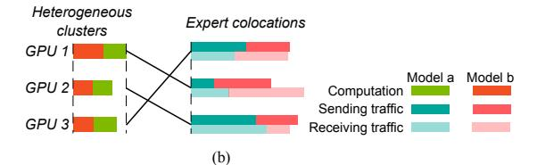
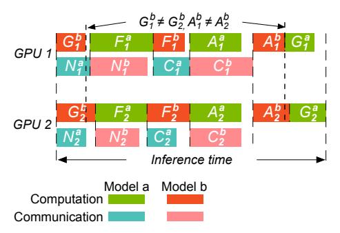

# Takeaway 3

- Expert colocation choices impact both the aggregated communication time and, consequently, the inference time.
- Minimizing aggregated communication time ensures minimum inference time in a homogeneous cluster.
- Aurora identifies the optimal expert colocation by solving the bottleneck matching problem, thus achieving the minimum inference time.

## 7 COLOCATING MODELS ON HETEROGENEOUS CLUSTERS

In this section, we focus on colocating models on heterogeneous clusters. Achieving minimum inference time in the Colocating + Heterogeneous scenario requires expert colocation, GPU assignment, and communication scheduling.

**Solution overview.** We first identify that optimizing inference time in the Colocating + Heterogeneous scenario is an NP-hard problem (§7.1), and then we propose a sub-optimal yet effective solution (§7.2).

#### 7.1 NP-hardness proof

Fig. 9 illustrates the case of running two MoE models on a heterogeneous cluster. Similar to the Colocating + Homogeneous scenario, the inference time can be expressed using Eqn. 4, with the finish times for each component detailed in Table 2.

Fig. 10. (a) Optimal expert colocation and GPU assignment solution is obtained by solving a 3-dimensional matching problem. (b) We can reduce the 3-dimensional matching problem to two 2-dimensional matching problems.

In §6, Theorem 6.1 demonstrates that minimizing aggregated communication times ensures the minimum inference time on a homogeneous cluster. However, this theorem does not apply to a heterogeneous cluster. In the homogeneous environment, computation times are identical across GPUs. Therefore, we have  $|G^a|' = |G^a|$ ,  $|G^b|' = |G^b|$ ,  $|A^a|' = |A^a|$ , and  $|A^b|' = |A^b|$  in the proof of Theorem 6.1. Additionally, we apply  $|F^a|' > |F^a|$  and  $|F^b|' > |F^b|$ , indicating that computation time is proportional to communication time. However, these equations and inequalities do not hold in a heterogeneous cluster. As demonstrated in Fig. 9,  $G_1^b \neq G_2^b$ ,  $A_1^b \neq A_2^b$ , rendering Theorem 6.1 inapplicable in such heterogeneous environments.

Fig. 9. Running colocating MoE models on heterogeneous clusters.

We can reformulate the optimization problem as a 3-dimensional matching problem, as illustrated in Fig. 10(a). Unlike the scenario depicted in Fig. 8, this formulation requires both expert colocation and GPU assignment. The 3-dimensional matching problem extends bipartite matching (also known as 2-dimensional matching). A hyperedge, connecting one GPU and one expert from Model a and one expert from Model b, represents the inference time occurring on that GPU. We must determine two perfect matchings among two bipartite graphs. Similar to the bottleneck matching problem applied in Case II (a6), we need to find a perfect matching that minimizes the maximum weight. The 3-dimensional matching problem is proven to be NP-hard [a6], meaning that we cannot solve the optimization problem in polynomial time.

## 7.2 Sub-optimal approach

We use a sub-optimal solution by decoupling the matchings in the two bipartite graphs.

We first determine the perfect matching among experts, setting aside GPU assignment initially. Following the method described in Case II (§6), we solve the bottleneck matching problem to obtain the expert colocation solution. This reduces the 3-dimensional matching problem to a 2-dimensional matching problem. In Fig. 10(b), the left side represents GPUs, and the right side represents the combination of two experts, with the edge weight indicating inference time on the connected GPU. We resolve the bottleneck matching problem to determine the minimum of the maximum weights. Combined with the expert colocation solution, this provides a complete, sub-optimal solution.

In conclusion, achieving minimum inference time in the Colocating + Heterogeneous scenario can be formulated as a 3-dimensional matching problem, which is proven to be NP-hard [6]. Based on our evaluation in §8, this solution achieves an inference time just 1.07× of the optimal.

