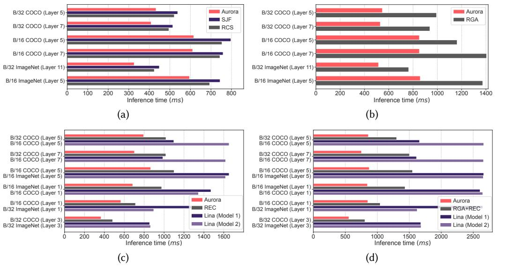
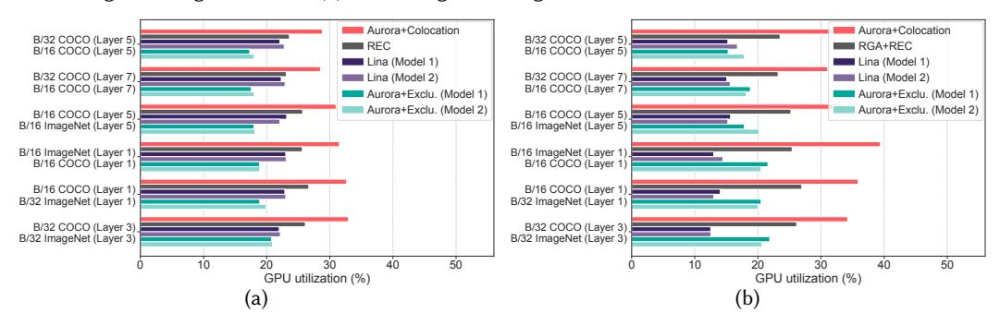

# Takeaway 4

- In a heterogeneous cluster, minimizing aggregated all-to-all communication times of two colocating models does not ensure minimum inference time.
- Minimizing inference time in the Colocating + Heterogeneous scenario can be formulated as an NP-hard matching problem.
- We propose a sub-optimal approach by decoupling the optimization problem into two perfect matching problems.

#### 8 EVALUATION

The evaluation seeks to address the following key questions.

**Q1:** Can Aurora reduce inference time across four scenarios? Aurora achieves up to 1.38× faster inference time in the Exclusive + Homogeneous scenario and up to 1.81× faster in the Exclusive + Heterogeneous scenario. In the colocating scenario, Aurora shows an improvement of up to 2.38× in the homogeneous case and up to 3.54× in the heterogeneous case.

**Q2: Can Aurora improve GPU utilization?** In the colocation scenario, Aurora delivers a 1.28× to 1.50× improvement in GPU utilization compared to the state-of-the-art solution.

Q3: How close is Aurora to the optimum in the Colocating + Heterogeneous scenario? On average, Aurora prolongs the inference time by only  $1.07 \times$  compared to the optimum.

**Q4:** How does Aurora perform under imprecise traffic inputs? Aurora maintains inference time performance under unpredictable inference requests, with only a 15.8% degradation.

#### 8.1 Simulation setup

**GPU clusters.** The GPUs are connected through a large switch, as shown in Fig. 4(a). In homogeneous clusters, the network bandwidth is set to 100 Gbps. For heterogeneous clusters, we define four types of GPUs, with bandwidths of 100 Gbps, 80 Gbps, 50 Gbps, and 40 Gbps, ordered from highest to lowest performance. The number of GPUs for each type is the same. In the exclusive scenario, each MoE model uses the network bandwidth independently. In the colocation scenario, models only compete bandwidth when their experts are placed on the same device.

**MoE models.** We use production model statistics from Google [21] to drive our simulation. It includes data for four layers of two MoE models, B/16 and B/32, each with 8 experts. We derive Aurora's input parameters from the model information based on the COCO and ImageNet datasets. **Metrics.** We consider the following metrics in the evaluation.

- *Inference time*. We calculate the inference time for all four scenarios.
- *GPU utilization*. GPU utilization is the ratio of computation time (including the Gate, FFN, and Aggregation) to the inference time.

**Baselines.** Aurora is the first of its kind, making it difficult to find directly comparable work. For expert colocation, we compare Aurora with Lina [18], the latest approach using expert colocation. We also implement vanilla expert colocation, referred to as random expert colocation (REC), as the baseline. To ensure fairness, all solutions colocate two experts on the same device. Lina5 pairs the most popular expert with the least popular one within each job, while Aurora and REC colocate experts from two different models.

For GPU assignment in heterogeneous clusters, we use the vanilla approach, random GPU assignment (RGA), as the baseline.

&lt;sup>5Lina consists of three main components: prioritizing all-to-all over all-reduce, pipelining communication and computation, and packing multiple experts on a single device. The first component is specific to MoE training and does not apply to Aurora. The second complements Aurora, while the third is closely related. We implement the third component for Lina.

Fig. 11. Inference time comparison in (a) Exclusive + Homogeneous, (b) Exclusive + Heterogeneous, (c) Colocating + Homogeneous, and (d) Colocating + Heterogeneous scenarios.

Fig. 12. GPU utilization in the (a) Colocating + Homogeneous and (b) Colocating + Heterogeneous scenarios.

For all-to-all communication scheduling, we employ the shortest job first (SJF), which is a wellknown flow scheduling policy for minimizing average flow completion time. We also include the vanilla method, random communication scheduling (RCS).

