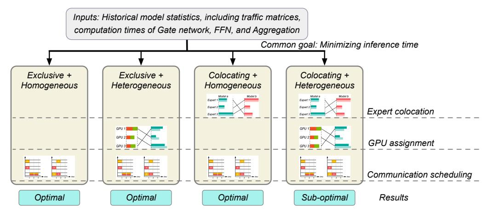
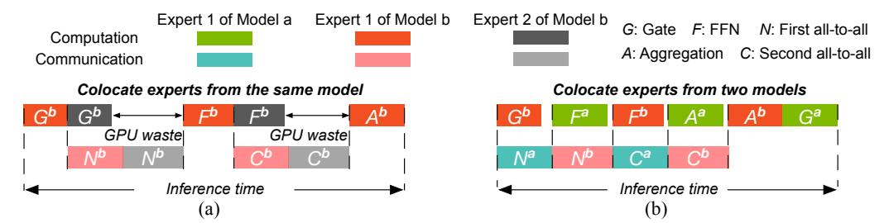
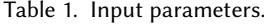
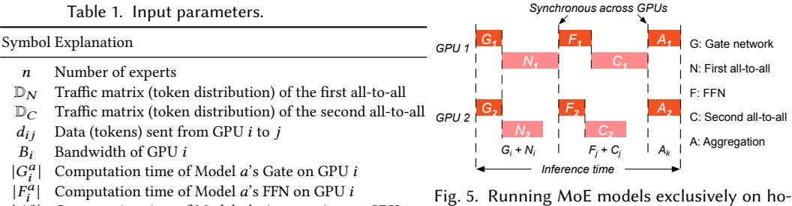

# 2.3 MoE Inference Bottlenecks

High communication overhead. Existing research has identified all-to-all communication as a significant bottleneck in MoE inference [\[9,](#page-20-0) [27\]](#page-21-0). A recent study [\[11\]](#page-20-1) highlights that the all-to-all communication can constitute over 60% of inference time when using four GPUs, and the overhead increases substantially with additional GPUs .

The high communication overhead arises from two main factors. First, the dynamic selection of experts results in an uneven distribution of tokens among GPUs [\[4,](#page-20-7) [9,](#page-20-0) [26\]](#page-21-13), leading to some GPUs being heavily loaded while others remain idle. Second, the all-to-all communication is typically implemented using synchronous operations [\[18\]](#page-20-2). These operations are inefficient as they cause resource wastage when either communication or computation is not fully utilized. This inefficiency is further exacerbated by the dynamic nature of expert selection.

Low GPU utilization. Uneven load distribution and synchronous all-to-all communication also contribute to low GPU utilization. GPUs supporting unpopular experts remain idle most of the time [\[13\]](#page-20-9). A study of GPU cluster data from Alibaba reveals that less than 10% of GPUs reach 80% utilization [\[40\]](#page-21-14).

Fig. 2. Aurora aims to minimize inference time across four different scenarios. It optimizes expert colocation, GPU assignment, and communication scheduling for each case. Aurora achieves optimal results in the first three scenarios and delivers suboptimal performance in the final one due to its NP-hardness.

GPU cluster heterogeneity. In production clusters, GPU heterogeneity is common due to incremental deployments and rapid advancements in GPU design [\[14,](#page-20-13) [22,](#page-20-6) [37,](#page-21-5) [41,](#page-21-6) [44\]](#page-21-15). These clusters feature varied hardware configurations, including different types of GPUs and diverse resource setups. This heterogeneity complicates the deployment of MoE models and must be considered to optimize performance.

## 2.4 Prerequisites in Aurora

Before we delve into the details of each scenario, let's outline the key prerequisites for this work. Each GPU hosts at most two models. As shown in Fig. [1,](#page-1-0) MoE inference involves alternating computation and communication phases separated by clear barriers. Colocating two models on a GPU allows them to efficiently interleave resource usage—one model performs computation while the other uses the network. Adding a third model, however, forces one to wait for resource access, leading to increased inference time.

The network is represented by a big switch model. MoE inference typically requires several to dozens of GPUs, often housed within a single rack and connected by a high-performance network. As illustrated in Fig. [4\(](#page-4-0)a), this non-blocking network fabric can be modeled as a big switch, which interconnects GPUs enabling low-latency and high-throughput communication between them.

The optimization is based on historical statistics of MoE models. Inference service providers usually collect statistics of MoE models for performance monitoring and troubleshooting, such as the token distribution across GPUs and the average computation times for the Gate network, FFN, and Aggregation operations. Aurora uses such historical data to guide optimization, and this work focuses on theoretical analysis of our optimization mechanisms based on these precise inputs. As shown in our simulations (§[8\)](#page-16-0), even with up to 75% unpredictable inference requests after the optimization plan is deployed, the inference time of Aurora is only degraded by 15.8%.

## 3 OVERVIEW

In this section, we begin by outlining Aurora's inputs and optimization goal across four scenarios of GPU cluster settings. Next, we explain how expert colocation, GPU assignment, and communication scheduling impact inference time. Finally, we provide a summary of each scenario.

Inputs. As discussed in §[2.4,](#page-3-0) we use historical model statistics to guide decisions on expert colocation, GPU assignment, and communication scheduling. At a high level, the inputs include

Fig. 3. (a) Colocating experts from the same model results in wasted GPU resources and increased inference time, as follow-up computations are delayed by synchronous all-to-all communications. (b) Colocating experts from different models enables full interleaving of computation and communication, resolving this issue.

Fig. 4. (a) A big switch model representing the non-blocking inter-GPU network fabric. (b) Originally, the all-to-all communication of tokens from GPU 1 (red) and GPU 2 (yellow) to all other GPUs takes 3 units of time overall. (c) Optimizing the token order reduces transmission time to 2 units.

traffic matrices of token distribution across GPUs during each all-to-all communication, as well as computation times for the Gate network, FFN, and Aggregation operations. The detailed input parameters are listed in Table 1 and explained in §4.

**Optimization goal.** Aurora is designed to minimize the inference time of MoE models. Given the diverse settings of modern GPU clusters, we analyze two key dimensions: exclusive GPU usage per model vs. colocating models on the same GPUs, and homogeneous vs. heterogeneous GPU types. Across the four combinations of these dimensions, as shown in Fig. 2, Aurora achieves optimal performance in the first three scenarios. We prove the last scenario to be NP-hard and propose a sub-optimal solution with inference time only 1.07× the optimum, based on our evaluation in §8. When possible, we colocate MoE models on GPUs to maximize GPU utilization at best effort.

**Expert colocation.** Aurora colocates experts on the same GPU to maximize utilization, where applicable, as shown in the colocating scenarios in Fig. 2. As motivated in §2.4, Aurora colocates up to two experts per GPU, interleaving their computation and communication. Previous studies colocated experts from the same model [18], which wastes GPU resources and extends inference time. As shown in Fig. 4(a), this is because experts from the same model are bound by the synchronous all-to-all communication, delaying subsequent computation phases like FFN and Aggregation.

In contrast, Aurora colocates experts from different models. To maximize GPU utilization and minimize inference time, it identifies the optimal combination of experts that complement each other in terms of computation and communication needs. As illustrated in Fig. 4(b), the two experts take turns to use available computation and communication resources. Aurora pairs a computation-intensive expert with a communication-intensive one to efficient use of GPUs.

**GPU** assignment. Heterogeneous clusters, as shown in Fig. 2, require selecting the appropriate GPU types for experts. For instance, deploying a popular expert on a high-performance GPU with high FLOPS, memory capacity, and network bandwidth helps minimize computation and communication times. Aurora assigns experts to suitable GPU types without worrying about the

 $|A_i^a|$ 

Computation time of Model a's Aggregation on GPU i

mogeneous clusters.

deployment to specific GPU IDs, as GPUs of the same type are interchangeable when connected through the "big switch" model of a non-blocking network, as discussed in §2.4.

**Communication scheduling.** All four scenarios in Fig. 2 require communication scheduling to reduce the communication time, which involves determining the order of token transmission in the all-to-all communications. Different transmission orders can lead to varying communication times. For instance, in Fig. 4(a), GPU 1 sends tokens to GPUs 2 and 3, while GPU 2 sends to GPUs 1 and 3. In Fig. 4(b), communication takes 3 units of time when GPU 1 first sends to GPU 2 and then to GPU 3, and GPU 2 sends to GPU 1 and then to GPU 3. However, as shown in Fig. 4(c), changing GPU 2's transmission order to send to GPU 3 first, then to GPU 1, reduces communication time to 2 units. In practice, reordering token transmission can be achieved with a buffer layer at the computation operations, which calls communication collective libraries, such as NCCL, in the desired order.

We summarize the main results of our theoretical analysis of each scenario as follows.

Exclusive + Homogeneous (§4). This scenario considers running models exclusively on clusters where all GPUs have identical computing power and network bandwidth. Theorem 4.1 proves that minimizing inference time is equivalent to minimizing communication time. Theorem 4.2 further shows that communication time is minimized by ordering token transmission to avoid bandwidth contention at the receiving GPUs. The minimum communication time is determined by the GPU handling the largest traffic volume, whether sending or receiving. Alg. 1 (§ 4.2) provides the algorithm for finding the optimal order that minimizes inference time.

Exclusive + Heterogeneous (§5). This scenario tackles the challenges of running models exclusively on GPUs with different computing power and network bandwidth. Theorem 5.1 demonstrates that sorting experts by token load and assigning them to GPUs in descending order of performance minimizes inference time. Theorem 5.2 proves that the transmission order for homogeneous clusters (Theorem 4.2) also minimizes communication time in a heterogeneous setting.

Colocating + Homogeneous (§6). This scenario examines improving GPU utilization by colocating two MoE models. The colocation strategy affects the aggregated communication time of the two models, and thus, their overall inference time. Theorem 6.1 shows that minimizing the aggregated communication time leads to optimal overall inference time. To this end, we solve the bottleneck matching problem to find the optimal expert colocation, thereby minimizing communication time and achieving optimal inference time.

Colocating + Heterogeneous (§7). Extending the colocation strategy to heterogeneous clusters involves communication scheduling, GPU assignment, and expert colocation, making it the most complex scenario. We model it as a 3-dimensional matching problem, which is NP-hard. By decoupling the matching into two dependent bipartite graphs, we propose a sub-optimal but effective solution, which prolongs the inference time by only 1.07× compared to the optimum.

#### 4 EXCLUSIVE MODELS ON HOMOGENEOUS CLUSTERS

In this section, we derive the minimum inference time for running models exclusively on homogeneous clusters, referred to as the Exclusive + Homogeneous scenario.

**Input parameters.** Table 1 lists the input parameters used by all four scenarios. For a specified MoE model consisting of n experts, each expert is placed on one GPU, requiring a total of n GPUs. The token distribution in each layer is known in advance is represented by a traffic matrix  $\mathbb{D}_N$  for the first all-to-all communication, and  $\mathbb{D}_C$  for the second all-to-all communication. Note that  $\mathbb{D}_N$  and  $\mathbb{D}_C$  are reversed as we state in §2.2. The matrix is an  $n \times n$  matrix with elements  $d_{ij}$ , indicating the traffic sent from GPU i to j. The symbol  $|G_i^a|$ ,  $|F_i^a|$ , and  $|A_i^a|$  represent the computation times of Model a's Gate, FFN, and Aggregation components, respectively, on GPU i.

**Solution overview.** We first prove that in the Exclusive + Homogeneous scenario, minimizing inference time is equivalent to minimizing communication time (§4.1). Next we show how to determine the transmission order to achieve minimal communication time (§4.2).

## 4.1 Minimizing inference time equals minimizing communication time

Theorem 4.1. In the Exclusive + Homogeneous scenario, minimizing inference time is equivalent to minimizing communication time.

PROOF. This proof is straightforward because, in the Exclusive + Homogeneous scenario, the only factor influencing inference time is the communication scheduling.

We first derive the inference time expression. As shown in Fig. 5, the two all-to-all communications are synchronous across GPUs. This synchronization means that the FFN and Aggregation processes can only start after the last data flow is complete. The inference time is therefore divided into three parts: the Gate and the first all-to-all communication, the FFN and the second all-to-all communication, and the Aggregation. Due to the strict barrier between each layer, the inference time for a layer is determined by the slowest GPU. So the inference time is determined by summing the maximum values of each part, as represented by the following equation.

Inference time 
$$t = \max(|G_i| + |N_i|) + \max(|F_j| + |C_j|) + \max(|A_k|), i, j, k \in [1, n]$$
 (1)

In Eqn. 1, the symbols  $|G_i|$ ,  $|F_i|$ , and  $|A_i|$  indicate the duration of the Gate, FFN, and Aggregation processes on GPU i. The symbols i, j, k each represent different GPUs, as the maximum processing time for each part can occur on different GPUs. For this scenario, we can make the following three observations.

- (1) The assignment of GPUs to experts in homogeneous clusters requires no special decisions, as all GPUs possess identical computational power and network bandwidth.
- (2) The computation times for Gate processes are equal across all GPUs, and the same applies to Aggregation.
- (3) The computation time for the FFN is determined by the number of tokens it processes, with more tokens resulting in longer computation times.

With observations (1) and (2), we have  $|G_i| = |G|$ ,  $|A_k| = |A|$ . Based on observation (3), we can state that  $\max(|F_j| + |C_j|) = \max(|F_j|) + \max(|C_j|)$ , since  $|F_j|$  and  $|C_j|$  increase simultaneously. Thus, Eqn. 1 can be expressed as follows.

$$t = |G| + \max(|N_i|) + \max(|F_i|) + \max(|C_i|) + |A|, i, j \in [1, n]$$
 (2)

As discussed in §2.2, the two all-to-all communications are reversed. The GPU receiving the highest volume of data at  $\mathbb{D}_N$  is also the one transmitting the largest amount at  $\mathbb{D}_C$ . Consequently,  $\max(|N_i|)$  and  $\max(|C_i|)$  occur on the same GPU. Therefore, Eqn. 2 can be further expressed as:

$$t = |G| + \max(|N_i|) + \max(|F_i|) + \max(|C_i|) + |A|, \ i \in [1, n]$$
(3)

In Eqn. 3,  $\max(|F_i|)$  represents the computation time of the FFN processing the highest number of tokens, which is constant regardless of its deployment. Therefore, to achieve optimal inference time, the remaining task is to minimize  $\max(|N_i|)$ , the first all-to-all communication time.

#### 4.2 Scheduling transmission order to minimize communication time

Fig. 4(a)-(c) show that the communication time depends on the order in which tokens are transmitted. Intuitively, the time for an all-to-all communication cannot be less than the time it takes for the GPU with the heaviest traffic to send or receive its tokens. For example, suppose GPU i receives the largest amount of traffic, denoted by d, and the bandwidth is B. This means GPU i will need at least d/B time to receive all tokens. The question is, can we design a transmission order that completes the all-to-all communication in exactly d/B time? The following theorem provides an affirmative answer.

Theorem 4.2. The communication time is minimized by transmitting tokens in an order that avoids bandwidth contention at the receiving sides. The minimum communication time is  $b_{max} = max(\sum_{j=1}^{n} d_{ij}, \sum_{i=1}^{n} d_{ij})/B$ .

Theorem 4.2 establishes that GPU should avoid sending tokens to the same destination simultaneously. Fig. 4(c) presents an optimal order that avoids bandwidth contention at the receiving sides. This order guarantees that at any time, each GPU only receives tokens from one GPU. Theorem 4.2 also shows that the minimum communication time is determined by the maximum column or row sum in the traffic matrix  $\mathbb{D}^1$ . In other words, if the largest amount of data being sent or received on a single GPU is d, then the entire all-to-all communication can be completed in d/B time. A sketch of the proof is provided below, with the detailed proof available in Appx. A.

Sketched Proof. In homogeneous clusters, we set B to 1 for simplification. The proof involves transforming the traffic matrix  $\mathbb D$  into  $\mathbb D'$  by adding artificial traffic matrix  $\mathbb X$  with non-negative values. With the updated matrix  $\mathbb D'$ , it ensures that the sum of each column or row equals  $b_{max}$ . We then demonstrate the all traffic in  $\mathbb D'$  can be transmitted within the time  $b_{max}$ , by constructing a transmission order where GPUs do not send tokens to the same destination simultaneously. Since  $\mathbb D'$  is constructed by augmenting the original traffic matrix  $\mathbb D$  with the non-negative traffic matrix  $\mathbb X$ , the time required for transmitting traffic in  $\mathbb D$  cannot exceed  $b_{max}$ . The optimal transmission order can also be obtained by removing artificial traffic from  $\mathbb D'$ .

Moving forward, our approach unfolds in three key steps. Initially, we illustrate the conversion of the traffic matrix  $\mathbb{D}$  into  $\mathbb{D}'$  by incorporating matrix  $\mathbb{X}$ . Subsequently, we prove that the minimum communication time for  $\mathbb{D}'$  is  $b_{max}$ . Finally, we prove the existence of a non-negative  $\mathbb{X}$ .

## 1. Convert $\mathbb{D}$ to $\mathbb{D}'$ by adding non-negative $\mathbb{X}$

- Construct  $\mathbb{D}'$  by adding non-negative artificial traffic matrix  $\mathbb{X}$  to  $\mathbb{D}$ :  $\mathbb{D} + \mathbb{X} = \mathbb{D}'$ .
- Ensure for each row  $\sum_{i=1}^{n} d'_{ij} = b_{max}$ , and for each column  $\sum_{i=1}^{n} d'_{ij} = b_{max}$ ,  $d'_{ij} \in \mathbb{D}'$ .

