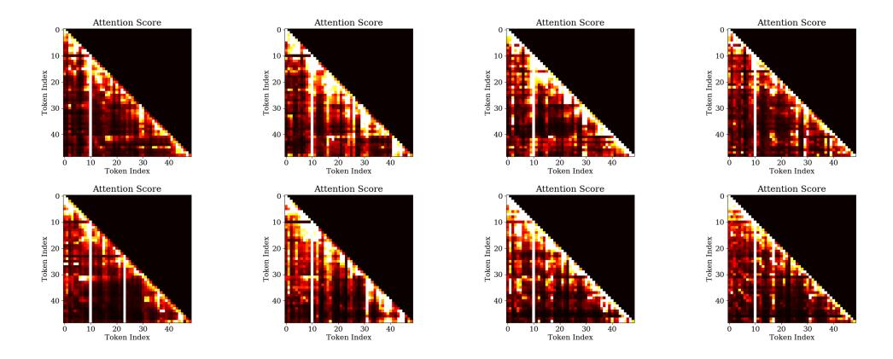

# **B.3.** MoE with fine-grained experts

We train a model following the setting of DeepSeekMoE-16B but with fewer parameters(3B): 12 MoE layers with 64 routed experts each as baseline, where hidden size is set to 1536 and expert intermediate size is set to 1024. The top 6 experts are selected for each token. Our method still achieved a 75% latency reduction at 2.5GB memory. Meanwhile, our model maintains the performance of downstream tasks. On Trivia QA, our model achieves an F1 Score of 50.20, compared to the baseline of 50.75. On XSum, our model attains a ROUGE-1 score of 21.74, while the baseline score is 21.22.

Figure 12. Attention scores on randomly sampled data of Wizard-of-Wikipedia(upper)and Synthetic-Persona-Chat(bottom) in DeepSeekMoE-16B from layers 5,10,15,20.

Figure 13. Semantic groups obtained by the Oracle-MoE method on Wizard-of-Wikipedia and Synthetic-Persona-Chat across different DeepSeekMoE-16B layers with semantic groups from the same sequence or user interaction are colored the same.

Figure 14. Attention scores on randomly sampled data of Wizard-of-Wikipedia(upper) and Synthetic-Persona-Chat(bottom) in Qwen1.5- MoE-A2.7B from layers 5,10,15,20.

Figure 15. Semantic groups obtained by the Oracle-MoE method on Wizard-of-Wikipedia and Synthetic-Persona-Chat across different Qwen1.5-MoE-A2.7B layers with semantic groups from the same sequence or user interaction are colored the same.

Figure 16. Attention scores on dierent diverse data(the top and bottom rows are different data) in DeepSeekMoE-16B from layers 5,10,15,20.

Figure 17. Semantic groups obtained by the Oracle-MoE method on diverse data from DeepSeekMoE-16B layers 5,10,15,20 with semantic groups from the same sequence or user interaction are colored the same.

Figure 18. Attention scores on different diverse data(the top and bottom rows are different data) in Qwen1.5-MoE-A2.7B from layers 5,10,15,20.

Figure 19. Semantic groups obtained by the Oracle-MoE method on diverse data from Qwen1.5-MoE-A2.7B layers 5,10,15,20 with semantic groups from the same sequence or user interaction are colored the same.