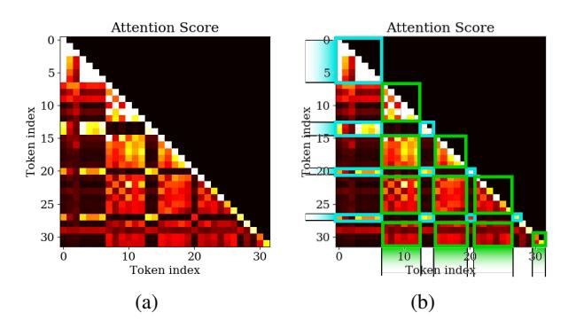
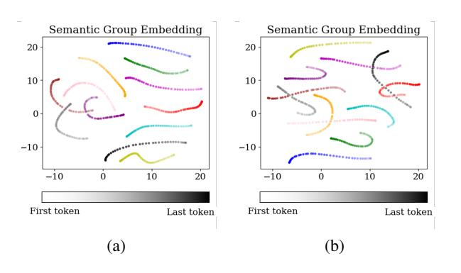

# 2.1. Latency Problem Formalization

Deploying Mixture of Expert (MoE) models on edge devices faces the challenge of expert swapping latency. Meanwhile, we do not want latency optimization to degrade the model's performance. So, we introduced a constraint that the latency optimization must ensure that the measurement of performance M that the user is interested in is better than a threshold γ:

$$\min L_{total}$$
 s.t.  $M > \gamma$ 

Our experiments in Section [5](#page-5-0) will show that latency optimization does not necessarily lead to performance degradation. For simplicity, we omit the subject to item in the

following of this section. The total latency  $L_{\text{total}}$  can be written as:

$$L_{\text{total}} = \sum_{t=1}^{T} L_{\text{compute}}(t) + L_{\text{swap}}(e_t, e_{t-1}),$$

where  $L_{\text{compute}}(\mathbf{t}_t)$  denotes computation latency for token embedding  $\mathbf{t}_t$ , and  $e_t$  denotes the set of activated expert indices for token  $\mathbf{t}_t$ .  $L_{\text{swap}}(e_t, e_{t-1})$  captures swapping latency caused by loading experts that are activated by  $\mathbf{t}_t$  but not activated by  $\mathbf{t}_{t-1}$ . Specifically:

$$L_{\text{swap}}(e_t, e_{t-1}) = l_{\text{swap}} \cdot |e_t \setminus e_{t-1}|,$$

where  $|e_t \setminus e_{t-1}|$  is a set minus operation. In practice, MoE-based LLMs on edge devices generate continuous semantics, the large variance in the token-level MoE routing mechanism is essentially due to the high inter-token semantic variance, resulting in frequent changes in routing results. We define Consecutive Semantic Difference (CSD) to measure the variation in expert selection over consecutive tokens:

$$CSD = \sum_{t=2}^{T} \Delta e_t,$$

Given fixed hardware and swapping algorithms,  $L_{compute}$  and  $l_{swap}$  are fixed, thus **CSD** determines  $L_{total}$ . The final optimization goal is:

$$\min \sum_{t=2}^{T} \Delta e_t.$$

**Remark:** Setting  $\Delta e_t = 0$  leads to a dense model that would trivially minimize CSD, which is not considered in our work as it negates the fundamental advantage of MoE models—leveraging multiple experts for specialized processing.

In existing token-level MoE models, experts are usually selected through a linear gate  $W_g \in \mathbb{R}^{N \times d}$  (Cai et al., 2024), which projects the token embedding  $\mathbf{t}_t \in \mathbb{R}^d$  into expert scores  $g(\mathbf{t}_t) = W_g \mathbf{t}_t \in \mathbb{R}^N$ . The experts are then chosen as:

$$e_t = \mathsf{Top\text{-}k}_{i \in \{1, \dots N\}}(\mathsf{softmax}(W_g\mathbf{t}_t)_i)$$

where Top-k denotes the indices of top k largest elements. Inspired by previous work (Xue et al., 2024), current token-level MoEs tend to dispatch on token-identity semantics. So, we approximate the change in Top-k expert selection between consecutive tokens by the difference in their transformed embeddings:

$$CSD_{token} = \sum_{t=2}^{T} \Delta e_t \approx \sum_{t=2}^{T} C(W_g, k) \|\mathbf{t}_t - \mathbf{t}_{t-1}\|$$

where  $C(W_g, k)$  is a constant dependent on  $W_g, k$ .

However, since there is a large variance between token embeddings, as is shown in Figure 2 left, the CSD is hard to optimize for existing token-level MoE. Xue et al. (2024) also mentioned that token-level MoEs tend to dispatch tokens according to token ID. But the linguistic meaning of consecutive user interactions on edge devices is notably similar, which we term as semantic locality. This inspires us to minimize swapping latency by extracting high-level semantics and designing a new gating mechanism.

#### 2.2. Semantic Groups and Oracle Space

**Token Embeddings** In token-level MoEs, tokens in the same sequence do share some similar high-level semantics, with their high-level semantics' locality and tendency to cluster logically, as shown in Figure 2. But their embeddings are still influenced primarily by the token-identity features, leading us to explore semantic spaces. These tokens simultaneously contain two types of semantic information.

**Definition 1** (Token Embedding). For each token embedding  $\mathbf{t}_i$ ,

$$\mathbf{t}_i = \mathbf{s}_i + \mathbf{u}_i,$$

where  $\mathbf{s}_i$  represents shared high-level semantic information between consecutive tokens and  $\mathbf{u}_i$  represents unique token-identity information.

Figure 2. UMAP visualization of embedding space in existing token-level MoE models. Left: Tokens tend to cluster according to token-identity semantics. Right: Tokens from the same sequence are colored the same. They share similar semantics and stay closer to each other in each token cluster.

Semantic Groups Studies ((Vaswani et al., 2017; Kovaleva et al., 2019; Clark et al., 2019)) indicate that attention captures high-level semantic correlations between tokens. Therefore, we intuitively claim that the mapping of the Q/K matrices and the calculation of the attention scores will group consecutive tokens with similar high-level semantics together through significant attention score distribution differences. Our analysis in Appendix A.1 demonstrates that under our definition of token embedding and analysis of the Q/K matrix, a high attention score between tokens indicates

that they share similar high-level semantics. So, we propose to model this through a causal graph perspective, where semantic groups emerge from connectivity in the attention score matrix.

Consider a directed acyclic graph Gglobal = (Vglobal, Eglobal), where Vglobal contains all tokens and Eglobal consists of edges ti → tj weighted by aij from the lower-triangular attention score matrix Aglobal = [aij ] (i.e., aij exists only for i > j). We define semantic groups as maximally connected components that only tokens with an attention score larger than a predefined threshold ϵ are considered connected:

Definition 2 (Semantic Group). *A subset containing tokens* S = {tk1 , ..., tkm} *(indices* k1 < ... < km*) is called a semantic group if:*

$$\begin{cases} \forall i, j \in \{k_1, \dots, k_m\}, \ (i > j) \implies a_{ij} > \epsilon \\ \textit{No proper superset of S satisfies the condition above} \end{cases}$$

This can be regarded as a reformulation of the Minimum Clique Cover Problem [\(Gavril, 1972\)](#page-9-4) for DAGs. The definition leverages the block structure of attention score matrices as is shown in Figure [3,](#page-3-0) which is also observed in previous works([\(Liu et al., 2024\)](#page-9-5)). So, although the Minimum Clique Cover is NP-hard, we claim that it can be computationally tractable on attention score matrix via polynomial-time greedy algorithms [\(Farjas, 2018\)](#page-9-6). We first initialize each token as a singleton group, then for the token xi from left to right, we find the maximal j < i with aij > ϵ and merge xi into xj 's group if ∀xk in the group, aik > ϵ.

Figure 3. Visualization of attention score matrix. There are two semantic groups where tokens in each group show high attention scores with each other.

Discussion: Previous studies [\(Kamath et al., 2019\)](#page-9-7) on representation space analysis have shown that semantically similar samples exhibit higher similarity in their embeddings compared to semantically dissimilar ones, which is also widely validated in experiments with general-purpose large models. We corroborate this observation and further identify a more fine-grained similarity pattern: token representations encapsulate both high-level semantics and token identity

semantics. Among tokens with the same identity, the embeddings of those that share the same high-level semantic meaning tend to be more similar. This pattern is consistently observed in various models, including widely used large models like DeepSeek-16B-2.8B [\(Dai et al., 2024\)](#page-9-8) and Qwen1.5-MoE-A2.7B [\(Team, 2024\)](#page-10-7), which are illustrated in Figure [2,](#page-2-0) Figure [10](#page-15-0) and Figure [11](#page-15-1) in Appendix [B.2.](#page-15-2) Theoretical insights into how attention mechanisms compute correlations between tokens using the inner product of query (Q) and key (K) vectors are also supported by existing studies [\(Raffel et al., 2020;](#page-10-8) [Vig & Belinkov, 2019\)](#page-10-9). The computation of attention scores involves first assessing token correlations through inner products of query (Q) and key (K) vectors, followed by normalization of these correlations via softmax, and finally allocating contextual information through value (V) vectors weighted by the normalized scores. Among which, the Q-K inner product effectively captures token similarity and reflects high-level semantic alignment, as visualized in Appendix [B.2.](#page-15-2)

Oracle Space Following sentence meta-embedding techniques [\(Poerner et al., 2019;](#page-9-9) [Takahashi & Bollegala, 2022\)](#page-10-10), we compute semantic group embeddings as the average token embeddings in it. Formally:

Definition 3 (Semantic Group Embedding). *For a Semantic Group* Si *, its semantic group embedding* zSi *is defined as:*

$$\mathbf{z}_{S_i} = \frac{1}{|S_i|} \sum_{\mathbf{t}_j \in S_i} \mathbf{t}_j$$

As proven in [\(Xu et al., 2018;](#page-10-11) [Soltanolkotabi et al., 2013\)](#page-10-12) and demonstrated in Appendix [A.2,](#page-12-1) this aggregation reduces token-identity noise while preserving essential high-level semantics. Thus, we can efficiently extract various highlevel semantic information from the embedding space using semantic group embeddings. We collect semantic group embeddings from different data and name the space consisting of these embeddings as Oracle Space, efficiently describing various high-level semantics.

In inference task, new tokens arrive sequentially over time. To model the evolution of semantic groups and derive token embeddings based on these groups, we propose the semantic embedding of each token as its semantic group embedding. Given a token tt at time step t, let S(t) denote the semantic group corresponding to tt. We use the embedding of S(t) as the token's semantic embedding:

$$\mathbf{z}_{\mathbf{t}_t} = \mathbf{z}_{S(t)} = \frac{1}{|S(t)|} \sum_{\mathbf{t} \in S(t)} \mathbf{t},$$

The S(t) includes all tokens from previous time steps t ′ < t such that:

$$\forall \mathbf{t}_{t'} \in S(t), \quad a_{tt'} > \epsilon,$$

where att′ is the attention score between tokens tt and tt ′ . When the model generates consecutive tokens, it retains the KV cache of previous tokens, so that att′ can be obtained by adding a new row to Aglobal.

This provides a way to compute semantic groups with a streaming input, which is the case for auto-regressive generation. As is shown in Figure [4,](#page-4-0) in an auto-regressive generation process, the token's semantic embedding varies smoothly and slowly in the oracle space, preserving highlevel semantic information.

Figure 4. UMAP visualization of sampled semantic group embeddings (token's semantic embeddings) in different model layers. Each color represents a sequence(user interaction). As token generation goes on, the embeddings based on semantic groups vary slowly and smoothly.

