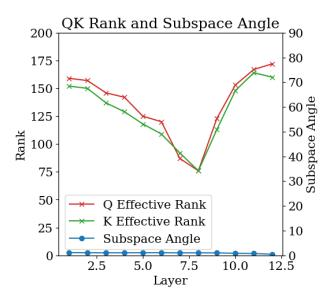

# A.1. Property of semantic element

In this section, we delve into the detailed analysis of the approximate attention mechanism, specifically focusing on the impact of the inner product between query  $(W_Q)$  and key  $(W_K)$  matrices.

Figure 9. Effective rank of matrices  $W_Q$  and  $W_K$  in different layers' self-attention and their subspaces angle. The space determined by  $W_Q$  and  $W_K$  is very similar.

The attention score computation can be viewed as a mapping from two token representations to a scalar value:

$$A: \mathcal{H} \times \mathcal{H} \to \mathbb{R}$$
,

In Figure 9,  $W_Q$  and  $W_K$  exhibit similar ranks and minimal angles between their subspaces. Combined with the empirical success of shared QK matrices in transformers (e.g., Kowsher et al. (2024)), we propose that  $W_Q$  and  $W_K$  can be decomposed into a shared projection followed by subspace-specific transformations. We therefore propose:

$$W_Q = M_Q P, \quad W_K = M_K P,$$

where  $P:\mathcal{H}\to\mathcal{H}_{\mathcal{S}}$  is a shared projection matrix mapping tokens to a common subspace  $\mathcal{H}_{\mathcal{S}}$  of dimension r (with  $r\leq \dim(\mathcal{H})$ ), and  $M_Q,M_K:\mathcal{H}_{\mathcal{S}}\to\mathcal{H}_{\mathcal{S}}$  are full-rank linear transformations within  $\mathcal{H}_{\mathcal{S}}$ .

Given this understanding:

**Assumption 1** (Semantic Subspace). The token representation space  $\mathcal{H}$  can be decomposed into a low-dimensional semantic subspace  $\mathcal{H}_s$  and its orthogonal complement  $\mathcal{H}_s^{\perp}$ :

$$\mathcal{H} = \mathcal{H}_S \oplus \mathcal{H}_S^{\perp}$$
.

Followed by the analysis and the experiment results in Section 2.2, although we recognize that  $W_Q \neq W_K$ , meaning  $M_Q \neq M_K$ , under our analysis, where both  $M_Q$  and  $M_K$  are different full-rank linear mappings from  $\mathcal{H}_S$  to  $\mathcal{H}_S$ , we can derive a relatively symmetric bound for the inner products involving these mappings. Specifically, for any non-zero, unit vectors  $X,Y\in\mathcal{H}_S$ , we have:

$$\begin{aligned} |\langle M_Q X, M_K Y \rangle| &\leq ||M|| \cdot |\langle X, Y \rangle|, \\ |\langle M_Q Y, M_K X \rangle| &\leq ||M|| \cdot |\langle Y, X \rangle|. \end{aligned}$$

where ||M|| denotes the operator norm (spectral norm) of matrix  $M_Q^T M_K$  This bound reflects how the transformations  $M_Q$  and  $M_K$  affect the original inner product  $\langle X,Y\rangle$ .

Furthermore, although the above discussion is based on an approximate attention mechanism and focuses on the properties of token components in the  $\mathcal{H}_S$  space, Figure 2 shows that tokens with the same identity (i.e., semantically similar tokens) tend to cluster together in low-dimensional representations that preserve relative distances. But this clustering behavior also suggests that tokens with the same high-level semantic meaning have small relative distances in the semantic component space. Therefore, for tokens within the same subgraph or semantic context, we make the following assumption:

**Assumption 2.** For tokens  $\mathbf{t_i}$  in the same subgraph, or Semantic Group  $S_j$ , their components in semantic space  $\mathcal{H}_{\mathcal{S}} \mathbf{s_i}$ , there exist r, s.t.  $\mathbf{s}_i \in B_{\mathcal{H}_{\mathcal{S}}}(c_i, r)$ 

**Assumption 3** (Uniform Distribution in Semantic Space). *Tokens in the same semantic group*  $s_j$  *are uniformly distributed in the semantic space with an expected value at the center:* 

$$\mathbb{E}[\mathbf{s}_i] = \mathbf{c}_j, \quad \forall i \in s_j.$$

#### A.2. The advantage of mean embedding of subgraph

Given the definition of semantic groups, we now make an assumption about the distribution of token identity information  $\mathbf{u_i}$ , which refers to the unique characteristics within each subgraph, distinguishing one token from another beyond their shared high-level semantics:

**Assumption 4** (Normal Distribution in Token Identity Space). *Token identical information follows a normal distribution within each subgraph*  $S_j$ :

$$\mathbf{u}_i \sim \mathcal{N}(\mu_i, \Sigma_i), \quad \forall i \in S_i.$$

Then we have The variance of the semantic representation of token  $\mathbf{t_i}$  is defined as:

$$\operatorname{Var}(\mathbf{z}_{\mathbf{t}_t}) = \operatorname{Var}(\frac{1}{|S(t)|} \sum_{\mathbf{t} \in S(t)} \mathbf{t})$$

Let the neighborhood size be n = |S(t)|, then:

$$\mathbf{z}_{S(t)} = \frac{1}{n} \sum_{i \in S(t)} \mathbf{t}_i = \frac{1}{n} \sum_{i \in S(t)} (\mathbf{s}_i + \mathbf{u}_i)$$
 (2)

It can be decomposed into two parts:

$$\mathbf{z}_{S(t)} = \underbrace{\frac{1}{n} \sum_{i \in S(t)} \mathbf{s}_i}_{\text{Mean of semantic part}} + \underbrace{\frac{1}{n} \sum_{i \in S(t)} \mathbf{u}_i}_{\text{Mean of identity part}}$$
(3)

Variance decomposition:

$$\operatorname{Var}(\mathbf{z}_{S(t)}) = \operatorname{Var}\left(\frac{1}{n}\sum_{i}\mathbf{s}_{i}\right) + \operatorname{Var}\left(\frac{1}{n}\sum_{i}\mathbf{u}_{i}\right) + 2\operatorname{Cov}\left(\frac{1}{n}\sum_{i}\mathbf{s}_{i}, \frac{1}{n}\sum_{i}\mathbf{u}_{i}\right)$$
(4)

Then we have the analysis of each component:

1. Covariance term: Given the orthogonal subspace decomposition Hs ⊥ H⊥ s , the semantic part si and the identity part ui are independent, hence the covariance is zero:

$$\operatorname{Cov}\left(\frac{1}{n}\sum \mathbf{s}_{i}, \frac{1}{n}\sum \mathbf{u}_{i}\right) = 0 \tag{5}$$

2. Variance of the semantic part: According to Assumption [3](#page-12-3) (uniform distribution), within the same subgraph, si are independently and identically distributed with E[si ] = cj . Let Var(si) = Σs, then:

$$\operatorname{Var}\left(\frac{1}{n}\sum \mathbf{s}_{i}\right) = \frac{1}{n^{2}}\sum_{i=1}^{n}\operatorname{Var}(\mathbf{s}_{i}) = \frac{\Sigma_{s}}{n} \tag{6}$$

3. Variance of the identity part: According to Assumption [4](#page-12-4) (normal distribution), within the same subgraph, ui ∼ N (µj , Σj ) and they are independent, then:

$$\operatorname{Var}\left(\frac{1}{n}\sum \mathbf{u}_i\right) = \frac{1}{n^2}\sum_{i=1}^n \operatorname{Var}(\mathbf{u}_i) = \frac{\Sigma_j}{n}$$
 (7)

thus we have

$$\operatorname{Var}(\mathbf{z}_{S(t)}) = \frac{\Sigma_s + \Sigma_j}{n} < \operatorname{Var}(\mathbf{t}_t)$$
 (8)

## A.3. Approximation Analysis of Oracle CSD

The expert assignment change ∆et is defined as the symmetric difference between consecutive expert sets:

$$\Delta e_t = |e_t \setminus e_{t-1}|$$

For simplicity, assume each token activates a single expert, so ∆et = I(et ̸= et−1) (0 or 1).

When zS(t) and zS(t−1) reside in the same cluster, ∆et = 0. When they lie in different clusters, ∆et = 1. Let B denote cluster boundaries in the oracle space. The probability of crossing B between t − 1 and t increases with ∥zS(t) − zS(t−1)∥.

For small displacements, we approximate the discrete boundary-crossing event by the continuous embedding displacement:

$$\Delta e_t \approx \|\mathbf{z}_{S(t)} - \mathbf{z}_{S(t-1)}\| \cdot \frac{\text{Cluster density at } \mathcal{B}}{\text{Cluster volume}}$$

Under uniform cluster assumptions, the density-to-volume ratio simplifies to a constant, yielding:

$$\sum_{t=2}^{T} \Delta e_t \approx \sum_{t=2}^{T} \|\mathbf{z}_{S(t)} - \mathbf{z}_{S(t-1)}\|$$

## A.4. Proof of Theorem 1

First, we have this lemma:

Lemma 5 (Norm Comparison with Additive Threshold). *For* n < m*,* ∥Y ∥ + m < K∥Z∥ *holds with probability approaching 1 as* d → ∞*, where* m > 0 *and* K > 0 *are fixed constants.*

*Proof.* Let {xi} m i=1 be i.i.d. d-dimensional Gaussian vectors with:

- E[xi ] = µ ∈ R d
- Cov(xi) = σ 2 Id, where Id is the d × d identity matrix.

Let S = {k1, . . . , kn} be a uniformly random subset of {1, . . . , m} (without replacement) with n < m. Define:

$$Y = \frac{1}{m} \sum_{i=1}^{m} x_i - \frac{1}{n} \sum_{j=1}^{n} x_{k_j}, \quad Z = x_1 - x_2.$$

For Y :

$$\begin{split} \mathbb{E}[Y] &= 0, \\ \mathrm{Cov}(Y) &= \sigma^2 \left(\frac{1}{n} - \frac{1}{m}\right) I_d, \\ \mathbb{E}[\|Y\|^2] &= d\sigma^2 \left(\frac{1}{n} - \frac{1}{m}\right). \end{split}$$

For Z:

$$\begin{split} \mathbb{E}[Z] &= 0,\\ \mathrm{Cov}(Z) &= 2\sigma^2 I_d,\\ \mathbb{E}[\|Z\|^2] &= \mathrm{tr}(\mathrm{Cov}(Z)) = 2d\sigma^2. \end{split}$$

For n < m:

$$\frac{1}{n} - \frac{1}{m} < 2$$

$$\implies \mathbb{E}[\|Y\|^2] = d\sigma^2 \left(\frac{1}{n} - \frac{1}{m}\right)$$

$$< 2d\sigma^2 = \mathbb{E}[\|Z\|^2].$$

Define the modified gap WK = K2∥Z∥ 2 − ∥Y ∥ 2 . We analyze:

$$P(||Y|| + \mathbf{m} < K||Z||) = P(||Y||^2 + 2\mathbf{m}||Y|| + \mathbf{m}^2 < K^2||Z||^2).$$

| Table 3. Hyperparameters of Models |          |          |          |           |  |  |  |
|------------------------------------|----------|----------|----------|-----------|--|--|--|
| Hyperparameters                    | 195M MoE | 295M MoE | 729M MoE | 2.06B MoE |  |  |  |
| Attention heads                    | 12       | 12       | 12       | 16        |  |  |  |
| Transformer layers                 | 12       | 12       | 12       | 24        |  |  |  |
| MoE layers                         | 2        | 4        | 8        | 9         |  |  |  |
| Expert Number                      | 4        | 8        | 16       | 32        |  |  |  |
| Activated Expert Number            | 1        | 1        | 1        | 1         |  |  |  |
| Hidden dimension size              | 768      | 768      | 768      | 1024      |  |  |  |
| Dropout                            | 0.1      | 0.1      | 0.1      | 0.1       |  |  |  |
| Attention dropout                  | 0.1      | 0.1      | 0.1      | 0.1       |  |  |  |
| Sequence length                    | 256      | 256      | 512      | 1024      |  |  |  |
| Batch size                         | 320      | 320      | 160      | 80        |  |  |  |
| Learning rate decay                | Cosine   | Cosine   | Cosine   | Cosine    |  |  |  |
| Maximum Learning rate              | 4e-4     | 4e-4     | 2e-4     | 1e-4      |  |  |  |

| Activation inconsistency | DeepSeek | Qwen  | Switch | Oracle |
|--------------------------|----------|-------|--------|--------|
| 1st 1/4 layers avg       | 80.84    | 81.56 | 69.20  | 6.03   |
| 2nd 1/4 layers avg       | 65.35    | 71.04 | 64.87  | 4.82   |
| 3rd 1/4 layers avg       | 70.68    | 75.37 | 53.36  | 4.20   |
| 4th 1/4 layers avg       | 76.61    | 77.16 | 75.44  | 5.11   |

Table 4. Activation inconsistency comparison across layers.

Using Chebyshev's inequality for  $W_K$ :

Therefore:

$$\begin{split} \mathbb{E}[W_K] &= K^2 \mathbb{E}[\|Z\|^2] - \mathbb{E}[\|Y\|^2] = d\sigma^2 \left(2K^2 - \frac{1}{n} + \frac{1}{m}\right), \quad \frac{\mathrm{Var}(W_K)}{\epsilon_K^2} = O\left(\frac{1}{d}\right) \to 0 \\ \mathrm{Var}(W_K) &= K^4 \mathrm{Var}(\|Z\|^2) + \mathrm{Var}(\|Y\|^2) \quad \text{(independence)}, \\ &= 8K^4 d\sigma^4 + 2d\sigma^4 \left(\frac{1}{n} - \frac{1}{m}\right)^2. \end{split}$$

Set  $\epsilon_K = \mathbb{E}[W_K] - 2m\sqrt{\mathbb{E}[||Y||^2]} - m^2$ . Substituting  $\mathbb{E}[||Y||^2]$ :

$$\epsilon_K = d\sigma^2 \left( 2K^2 - \frac{1}{n} + \frac{1}{m} \right) - 2m\sqrt{d\sigma^2 \left( \frac{1}{n} - \frac{1}{m} \right)} - m^2.$$

Applying Chebyshev's inequality:

$$P(W_K \ge \epsilon_K) \ge 1 - \frac{\operatorname{Var}(W_K)}{\epsilon_K^2}.$$

Thus:

$$\begin{split} &P\left(\|Y\|+m < K\|Z\|\right) \geq \\ &1 - \frac{8K^4d\sigma^4 + 2d\sigma^4\left(\frac{1}{n} - \frac{1}{m}\right)^2}{\left[d\sigma^2\left(2K^2 - \frac{1}{n} + \frac{1}{m}\right) - 2m\sqrt{d\sigma^2\left(\frac{1}{n} - \frac{1}{m}\right)} - m^2\right]^2}. \end{split}$$

The dominant terms scale as:

$$Var(W_K) = O(d), \quad \epsilon_K = \Theta(d).$$

**Note:** we also give the analysis of the impact of parameter constrains: when n approaches m:

$$\frac{1}{n} - \frac{1}{m} \approx 0 \implies \begin{cases} \mathbb{E}[W] \approx 2K^2 d\sigma^2 - m^2, \\ \mathrm{Var}(W) \approx 8K^4 d\sigma^4 + 4m^2. \end{cases}$$

The probability bound becomes:

$$P(W > 0) \ge 1 - \frac{8K^4d\sigma^4 + 4m^2}{(2K^2d\sigma^2 - m^2)^2}.$$

For large d, the dominant terms yield:

$$P(W > 0) \ge 1 - \frac{8K^4d\sigma^4}{4K^4d^2\sigma^4} = 1 - \frac{2}{d}$$

So if we make an extreme assumption about the left and right components in semantic space, that is

$$(\mathbf{t}_t - \mathbf{t}_{t-1})|_{\mathcal{H}_S} = 0, (\mathbf{z}_{S(t)} - \mathbf{z}_{S(t-1)})|_{\mathcal{H}_S} = 2r$$

$$\|\mathbf{z}_{S(t)} - \mathbf{z}_{S(t-1)}\| = \|(\mathbf{z}_{S(t)} - \mathbf{z}_{S(t-1)})\|_{\mathcal{H}_{S}}^{\perp} + \|(\mathbf{z}_{S(t)} - \mathbf{z}_{S(t-1)})\|_{\mathcal{H}_{S}}^{\perp} = \|(\mathbf{z}_{S(t)} - \mathbf{z}_{S(t-1)})\|_{\mathcal{H}_{S}}^{\perp} + 2r\|.$$

$$\|(\mathbf{t}_t - \mathbf{t}_{t-1})|_{\mathcal{H}^{\perp}_{S}}\| = \|(\mathbf{t}_t - \mathbf{t}_{t-1})\|$$

Since  $(\mathbf{t}_t - \mathbf{t}_{t-1})|_{\mathcal{H}^{\perp}_S}, (\mathbf{z}_{S(t)} - \mathbf{z}_{S(t-1)})|_{\mathcal{H}_S}^{\perp}$  follows Lemma5, so let 2r,  $C(W_g,k)$  to be  $\mathbf{m},K$  in Lemma 5, with a existing d mentioned in lemma 5,

$$C(W_g, k) \| (\mathbf{t}_t - \mathbf{t}_{t-1})|_{\mathcal{H}^{\perp}_S} \| > \| \mathbf{z}_{S(t)} - \mathbf{z}_{S(t-1)})|_{\mathcal{H}_S}^{\perp} + 2r \|$$

Thus we have

$$C(W_g, k) \| (\mathbf{t}_t - \mathbf{t}_{t-1}) \| > \| \mathbf{z}_{S(t)} - \mathbf{z}_{S(t-1)}) \|$$

