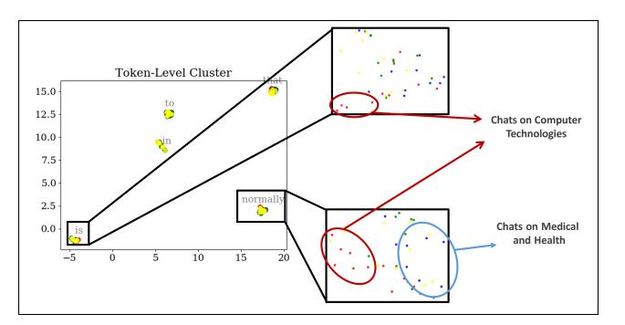

# **B.2.** Activation Inconsistency and Semantic Locality in Existing MoEs

We propose temporal activation inconsistency, defined as the average number of inconsistent expert activations per 100 consecutive tokens per expert. Results over the entire dataset and across different models and layers are listed in Table 4. Existing MoEs show strong temporal activation inconsistency within all layers, while Oracle-MoE reduces this.

Experiments with DeepSeekMoE-16B and Qwen1.5-MoE-A2.7B on real chat datasets(Wizard-of-Wikipedia and Synthetic-Persona-Chat) are shown in Figure 10 and Figure 11. Semantic locality appears across different models/layers/samples. Semantic groups can still be distinguished based on attention score and obtained by our method, as shown in Figure 12 to Figure 15. It indicates the potential of Oracle-MoE being a general-purpose solution.

We tested scenarios where the topic changes frequently. We randomly sample sentences from different datasets and combine them into a whole sequence. We observed that our proposed oracle space can still distinguish semantic groups efficiently, both in our models and public large MoE models, as shown in Figure 16 to Figure 19. We also tested the expert activation variation of such highly diverse data with Oracle-MoE and switch-transformer. On average, in every 100 consecutive token generations, Oracle-MoE only changes 12.20 times while the switch transformer changes

Figure 10. UMAP visualization of embedding space in DeepSeekMoE-16B from layer 10 on Wizard-of-Wikipedia datasets. Left: Tokens tend to cluster according to token-identity semantics. Right: Tokens from the same sequence are colored the same. They share similar semantics and stay closer to each other in each token cluster.

Figure 11. UMAP visualization of embedding space in DeepSeekMoE-16B from layer 15 on Wizard-of-Wikipedia datasets. Left: Tokens tend to cluster according to token-identity semantics. Right: Tokens from the same sequence are colored the same. They share similar semantics and stay closer to each other in each token cluster.

90.54 times. This is because in human natural language, it takes at least dozens of tokens to express a complete meaning, so our method still benefits from such "abrupt" semantic locality.

