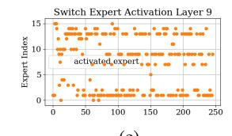
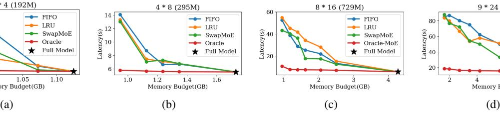
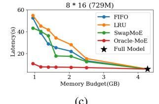
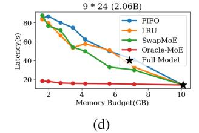
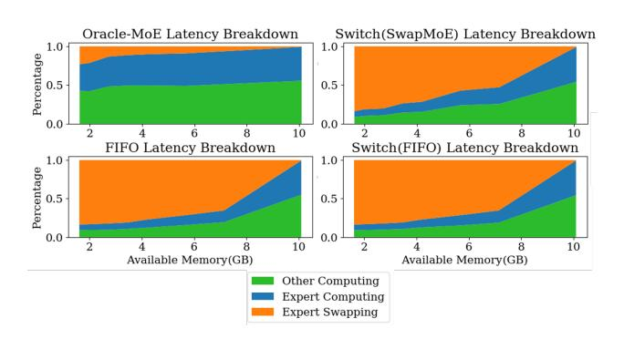

# 5. Experiments

#### 5.1. Settings

Hardware Platform Since mainstream mobile phones(like Android and Apple ) and NPU manufacturers (e.g., Apple, Hisilicon, Qualcomm, Samsung) do not provide commercial APIs for low-level GPU memory operations, we adopt NVIDIA Jetson Xavier NX as our experimental platform. The NVIDIA Jetson Xavier NX is equipped with a 384-core NVIDIA Volta architecture GPU with 8 GiB of GPU memory and an estimated 21 TOPS AI computing power.

Models We mainly compare Oracle-MoE with Switch Transformer [\(Fedus et al., 2022\)](#page-9-0), a representative tokenlevel MoE architecture. Experts are loaded on demand under our experiment settings. We use models containing m MoE layers with n experts each and with a total parameter of p, denoted as n ∗ m(p). In our experiments, we use models of 2\*4(192M), 4\*8(295M), 8\*16(729M) and 9\*24(2.06B). Detailed model configurations are in Appendix [B.](#page-15-3)

Figure 6. Expert activation results of (8\*16)729M models. In Switch Transformer, almost every 2 consecutive tokens activate different experts, and nearly all experts are activated, demanding frequent expert swapping. Whereas Oracle-MoE requires only a few expert swappings as the token generation continues.

Figure 7. Memory-Latency curve of models of different sizes, where n ∗ m(p) denotes a model consisting of n MoE Layers with m experts each, and in total p parameters. Full model refers to a model with the same number of activated parameters.

Swapping Strategies As introduced in Section [1,](#page-0-0) swapping strategies assign a certain priority to each expert so that lower-priority experts can be swapped out first. We evaluate both our model and the Switch Transformer with First-In-First-Out (FIFO), Least Recently Used (LRU), and the strategy in SwapMoE [\(Kong et al., 2024\)](#page-9-1). FIFO swaps out the expert that is loaded first, and LRU swaps out the experts that have not been used for the longest time. In SwapMoE[\(Kong et al., 2024\)](#page-9-1), experts are weighted by their frequency, magnitude, and input tokens. However, since our model eliminates the requirement of expert swapping, different strategies don't make a big difference in our model. So, we report the average of 3 strategies on our model.

Data & Workload Models are pretrained on Openweb-Text [\(Komatsuzaki, 2019\)](#page-9-19), which is one of the pretraining datasets of GPT2 [\(Radford et al., 2019\)](#page-10-4). We primarily use downstream tasks of 3 types: question answering, classification, and summarization. For QA tasks, we adopt Trivia QA [\(Joshi et al., 2017\)](#page-9-20). For classification, we adopt GLUE [\(Wang et al., 2019\)](#page-10-17), MAG [\(Sinha et al., 2015\)](#page-10-18) and Sci-Cite [\(Beltagy et al., 2019\)](#page-8-7). We also use XSum [\(Narayan](#page-9-21) [et al., 2018\)](#page-9-21) for summarization tasks. In experiments, we always kept the batch size equal to 1, which is the real situation when running on edge devices like mobile phones, processing one user request at a time.

Metrics We adopt mainly 3 evaluation metrics. a) Expert Activation, to evaluate the variation in expert activation of different models. b) Memory-latency curve measures the average time the model takes to process a single data point for a given memory size. A larger memory provides models with redundancy to store temporarily unused experts and mitigate the penalty of expert activation variation. c) First token Latency measures the time before the first token is generated after the users provide the input. This is also an important metric for user experience.

#### 5.2. Results

Expert Activation Figure [6](#page-6-0) illustrates the expert activation of two models. During consecutive auto-regressive generation passes, our method shows a lower expert activation variation, where expert swapping is only triggered after hundreds of tokens are generated. In Switch Transformer, expert activation changes frequently.

Memory-Latency Figure [7](#page-6-1) illustrates the memory-latency curve for methods of different sizes. The result of our model is reported as the average of different strategies. As is shown in the figure, while with a small-sized model, the latency is acceptable, the case becomes worse rapidly as the model size gets larger. For the 8\*16(729M) model, even though only 1 expert is allowed for each layer (which is about only 25% of the full-size memory), our method introduces only 3s additional latency compared with the full-size inference. Whereas Switch Transformer with FIFO, LRU, or Swap-MoE load-on-demand strategy introduces inevitable latency, increasing latency by up to 2000% compared to a full-size memory inference. When the memory budget increases by up to 50% of the full-size model, the latency of the Switch Transformer with different strategies is still unacceptably high, whereas our model does not introduce latency.

| Size  | Model  | TrivialQA(F1) | GLUE(Acc.) | MAG(Acc.) | Sci-Cite(Acc.) | Xsum(Rouge-1) | Avg.  |
|-------|--------|---------------|------------|-----------|----------------|---------------|-------|
| 195M  | Switch | 27.00         | 62.25      | 20.00     | 30.83          | 13.55         | 30.73 |
|       | Ours   | 26.72         | 62.86      | 18.33     | 32.50          | 13.36         | 30.75 |
| 295M  | Switch | 30.10         | 64.76      | 22.67     | 31.25          | 14.62         | 32.68 |
|       | Ours   | 30.31         | 64.66      | 22.17     | 33.75          | 15.53         | 33.28 |
| 729M  | Switch | 35.08         | 68.33      | 25.29     | 35.00          | 15.62         | 35.86 |
|       | Ours   | 35.56         | 68.00      | 25.50     | 36.67          | 16.05         | 36.35 |
| 2.06B | Switch | 46.06         | 77.75      | 31.33     | 46.75          | 16.77         | 43.73 |
|       | Ours   | 46.96         | 78.00      | 30.67     | 47.50          | 17.35         | 44.09 |

Table 1. The zero-shot performance of models of different sizes on different tasks. Metrics reported depend on specific tasks. Our method does not pose a drawback to model performance on downstream tasks.

Figure 8. Latency composition of our proposed Oracle-MoE and Switch Transformer equipped with different swapping strategies. Our model reduces the percentage of expert swapping latency and thus reduces the overall latency.

The latency composition breakdown in Figure [8](#page-7-0) gives a detailed visualization of the above results. It can be observed that even with the most limited memory budget, the latency introduced by expert swapping in our model only contributes to 50% of the overall latency. In token-level routing, such as the switch transformer, expert swapping contributes to more than 99% of latency.

First token latency Our model activates fewer experts for a single input, so that only 1 or 2 experts are needed for the prefilling stage. So, our model requires only one-time expert loading during the prefilling stage. However, existing tokenlevel MoE methods still need to swap experts during the prefilling stage, leading to worse first token latency. Among the three expert swapping strategies, FIFO does not help at the prefilling stage, and the LRU strategy needs a warmup stage to decide on frequently used tokens. SwapMoE, however, uses off-line statistical information to decide the loaded expert at the beginning of inference, thus resulting in a lower first token latency than baselines, but still not as good as ours.

| Model(Strategy) | First token latency(s) |  |  |
|-----------------|------------------------|--|--|
| Switch(FIFO)    | 22.395                 |  |  |
| Switch(LRU)     | 23.428                 |  |  |
| Switch(SwapMoE) | 12.767                 |  |  |
| Oracle-MoE      | 4.910                  |  |  |

Table 2. First token latency of 765M models on different architectures(strategies) under 50% of full-size memory. The memory budget only influences SwapMoE since it uses offline statistics to determine which expert to load first.

## 5.3. Overhead Analysis

Performance on Downstream Tasks Although designed for edge-oriented scenarios, our model does not sacrifice performance on downstream tasks for edge-deploy inference latency. As is shown in Table [1,](#page-7-1) our proposed semantic group gating method shows a similar task performance, in some tasks even surpasses, the widely accepted tokenlevel gating MoE models. We believe this is attributable to our proposed semantic group-level routing strategy. This setup allows each expert to focus on a subset of high-level semantics rather than requiring every expert to learn all possible high-level semantics present in their target tokens, thereby reducing redundancy among experts.

Training Stage Overhead Our approach differs from existing token-level MoE in that it includes a one-time cluster analysis after the warm-up phase and cluster routing in each forward pass. In our experiments, with a sample size of 8192, the wall clock time for clustering analysis per layer is approximately 4 min, which is negligible compared with tens of hours of pretraining. For routing in each pass, tokenlevel MoE is equivalent to performing a matrix multiplication. It requires 1e-4 seconds, whereas our low-dimensional cluster Euclidean distance computation requires three matrix multiplications and a square root operation. Thanks to the low-dimensional semantic space, the final wall-clock time

of our routing is 2.5e-4 seconds, which is also negligible compared to the single forward-backward pass taking 3.5 seconds.

#### 5.4. Expert Prediction-based Optimization

The Oracle-MoE has significantly diminished the necessity for expert swapping, thereby fundamentally reducing latency. However, the load-on-demand strategy still inherently suffers from another limitation: it cannot decide which expert to load for a layer before that layer is reached. Consequently, we propose to predict deep layers' expert activation at shallower layers, enabling inferring current tokens and loading experts synchronously. Specifically, we use the embeddings of the first layer to predict the expert activation in the following layers. Experimental results show that Oracle-MoE reaches an expert prediction accuracy of 85% to 95%, whereas Switch-Transformer-like token-level routing structure only has an accuracy of 40% to 60%. Employing this can further reduce the expert loading latency of Oracle-MoE by 10% to 15%. The underlying reasons for this expert predictability will be left for future investigation.

