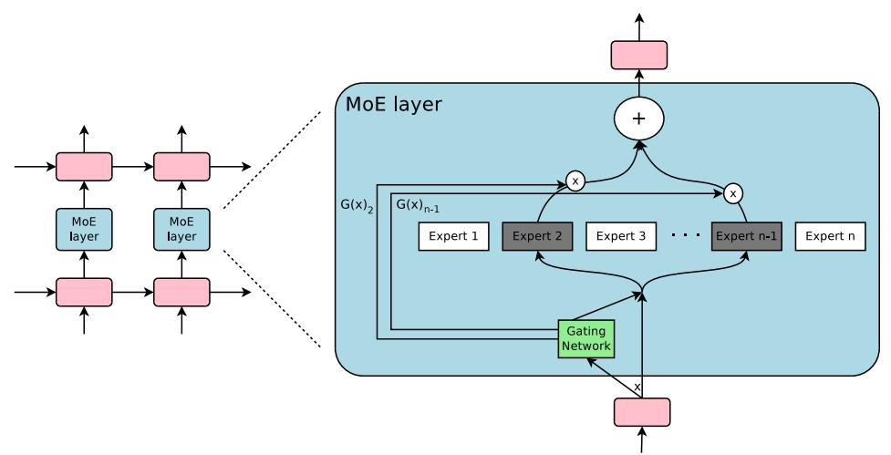

# 1 INTRODUCTION AND RELATED WORK

#### 1.1 CONDITIONAL COMPUTATION

Exploiting scale in both training data and model size has been central to the success of deep learning. When datasets are sufficiently large, increasing the capacity (number of parameters) of neural networks can give much better prediction accuracy. This has been shown in domains such as text (Sutskever et al., 2014; Bahdanau et al., 2014; Jozefowicz et al., 2016; Wu et al., 2016), images (Krizhevsky et al., 2012; Le et al., 2012), and audio (Hinton et al., 2012; Amodei et al., 2015). For typical deep learning models, where the entire model is activated for every example, this leads to a roughly quadratic blow-up in training costs, as both the model size and the number of training examples increase. Unfortunately, the advances in computing power and distributed computation fall short of meeting such demand.

Various forms of conditional computation have been proposed as a way to increase model capacity without a proportional increase in computational costs (Davis & Arel, 2013; Bengio et al., 2013; Eigen et al., 2013; Ludovic Denoyer, 2014; Cho & Bengio, 2014; Bengio et al., 2015; Almahairi et al., 2015). In these schemes, large parts of a network are active or inactive on a per-example basis. The gating decisions may be binary or sparse and continuous, stochastic or deterministic. Various forms of reinforcement learning and back-propagation are proposed for trarining the gating decisions.

\*Equally major contributors

&lt;sup>†Work done as a member of the Google Brain Residency program (g.co/brainresidency)

Figure 1: A Mixture of Experts (MoE) layer embedded within a recurrent language model. In this case, the sparse gating function selects two experts to perform computations. Their outputs are modulated by the outputs of the gating network.

While these ideas are promising in theory, no work to date has yet demonstrated massive improvements in model capacity, training time, or model quality. We blame this on a combination of the following challenges:

- Modern computing devices, especially GPUs, are much faster at arithmetic than at branching. Most of the works above recognize this and propose turning on/off large chunks of the network with each gating decision.
- Large batch sizes are critical for performance, as they amortize the costs of parameter transfers and updates. Conditional computation reduces the batch sizes for the conditionally active chunks of the network.
- Network bandwidth can be a bottleneck. A cluster of GPUs may have computational power thousands of times greater than the aggregate inter-device network bandwidth. To be computationally efficient, the relative computational versus network demands of an algorithm must exceed this ratio. Embedding layers, which can be seen as a form of conditional computation, are handicapped by this very problem. Since the embeddings generally need to be sent across the network, the number of (example, parameter) interactions is limited by network bandwidth instead of computational capacity.
- Depending on the scheme, loss terms may be necessary to achieve the desired level of sparsity per-chunk and/or per example. Bengio et al. (2015) use three such terms. These issues can affect both model quality and load-balancing.
- Model capacity is most critical for very large data sets. The existing literature on conditional computation deals with relatively small image recognition data sets consisting of up to 600,000 images. It is hard to imagine that the labels of these images provide a sufficient signal to adequately train a model with millions, let alone billions of parameters.

In this work, we for the first time address all of the above challenges and finally realize the promise of conditional computation. We obtain greater than 1000x improvements in model capacity with only minor losses in computational efficiency and significantly advance the state-of-the-art results on public language modeling and translation data sets.

## 1.2 OUR APPROACH: THE SPARSELY-GATED MIXTURE-OF-EXPERTS LAYER

Our approach to conditional computation is to introduce a new type of general purpose neural network component: a Sparsely-Gated Mixture-of-Experts Layer (MoE). The MoE consists of a number of experts, each a simple feed-forward neural network, and a trainable gating network which selects a sparse combination of the experts to process each input (see Figure 1). All parts of the network are trained jointly by back-propagation.

While the introduced technique is generic, in this paper we focus on language modeling and machine translation tasks, which are known to benefit from very large models. In particular, we apply a MoE convolutionally between stacked LSTM layers (Hochreiter & Schmidhuber, 1997), as in Figure 1. The MoE is called once for each position in the text, selecting a potentially different combination of experts at each position. The different experts tend to become highly specialized based on syntax and semantics (see Appendix E Table 9). On both language modeling and machine translation benchmarks, we improve on best published results at a fraction of the computational cost.

