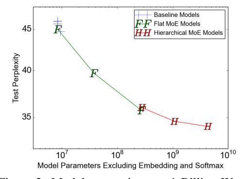
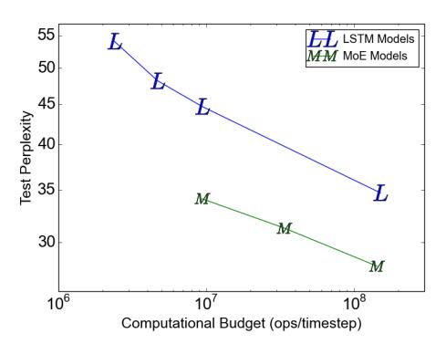
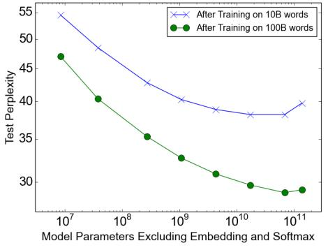

# 5 EXPERIMENTS

## 5.1 1 BILLION WORD LANGUAGE MODELING BENCHMARK

Dataset: This dataset, introduced by (Chelba et al., 2013) consists of shuffled unique sentences from news articles, totaling approximately 829 million words, with a vocabulary of 793,471 words.

Previous State-of-the-Art: The best previously published results (Jozefowicz et al., 2016) use models consisting of one or more stacked Long Short-Term Memory (LSTM) layers (Hochreiter & Schmidhuber, 1997; Gers et al., 2000). The number of parameters in the LSTM layers of these models vary from 2 million to 151 million. Quality increases greatly with parameter count, as do computational costs. Results for these models form the top line of Figure 2-right.

MoE Models: Our models consist of two stacked LSTM layers with a MoE layer between them (see Figure 1). We vary the sizes of the layers and the number of experts. For full details on model architecture, training regimen, additional baselines and results, see Appendix C.

Low Computation, Varied Capacity: To investigate the effects of adding capacity, we trained a series of MoE models all with roughly equal computational costs: about 8 million multiply-andadds per training example per timestep in the forwards pass, excluding the softmax layer. We call this metric (ops/timestep). We trained models with flat MoEs containing 4, 32, and 256 experts, and models with hierarchical MoEs containing 256, 1024, and 4096 experts. Each expert had about 1 million parameters. For all the MoE layers, 4 experts were active per input.

The results of these models are shown in Figure 2-left. The model with 4 always-active experts performed (unsurprisingly) similarly to the computationally-matched baseline models, while the largest of the models (4096 experts) achieved an impressive 24% lower perplexity on the test set.

Figure 2: Model comparison on 1-Billion-Word Language-Modeling Benchmark. On the left, we plot test perplexity as a function of model capacity for models with similar computational budgets of approximately 8-million-ops-per-timestep. On the right, we plot test perplexity as a function of computational budget. The top line represents the LSTM models from (Jozefowicz et al., 2016). The bottom line represents 4-billion parameter MoE models with different computational budgets.

Varied Computation, High Capacity: In addition to the largest model from the previous section, we trained two more MoE models with similarly high capacity (4 billion parameters), but higher computation budgets. These models had larger LSTMs, and fewer but larger experts. Details can

Table 1: Summary of high-capacity MoE-augmented models with varying computational budgets, vs. best previously published results (Jozefowicz et al., 2016). Details in Appendix C.

|                         | Test       | Test       | #Parameters         | ops/timestep  | Training          | TFLOPS |
|-------------------------|------------|------------|---------------------|---------------|-------------------|--------|
|                         | Perplexity | Perplexity | excluding embedding |               | Time              | /GPU   |
|                         | 10 epochs  | 100 epochs | and softmax layers  |               | 10 epochs         |        |
| Best Published Results  | 34.7       | 30.6       | 151 million         | 151 million   | 59 hours, 32 k40s | 1.09   |
| Low-Budget MoE Model    | 34.1       |            | 4303 million        | 8.9 million   | 15 hours, 16 k40s | 0.74   |
| Medium-Budget MoE Model | 31.3       |            | 4313 million        | 33.8 million  | 17 hours, 32 k40s | 1.22   |
| High-Budget MoE Model   | 28.0       |            | 4371 million        | 142.7 million | 47 hours, 32 k40s | 1.56   |

be found in Appendix C.2. Results of these three models form the bottom line of Figure 2-right. Table 1 compares the results of these models to the best previously-published result on this dataset. Even the fastest of these models beats the best published result (when controlling for the number of training epochs), despite requiring only 6% of the computation.

**Computational Efficiency:** We trained our models using TensorFlow (Abadi et al., 2016) on clusters containing 16-32 Tesla K40 GPUs. For each of our models, we determine computational efficiency in TFLOPS/GPU by dividing the number of floating point operations required to process one training batch by the observed step time and the number of GPUs in the cluster. The operation counts used here are higher than the ones we report in our ops/timestep numbers in that we include the backwards pass, we include the importance-sampling-based training of the softmax layer, and we count a multiply-and-add as two separate operations. For all of our MoE models, the floating point operations involved in the experts represent between 37% and 46% of the total.

For our baseline models with no MoE, observed computational efficiency ranged from 1.07-1.29 TFLOPS/GPU. For our low-computation MoE models, computation efficiency ranged from 0.74-0.90 TFLOPS/GPU, except for the 4-expert model which did not make full use of the available parallelism. Our highest-computation MoE model was more efficient at 1.56 TFLOPS/GPU, likely due to the larger matrices. These numbers represent a significant fraction of the theoretical maximum of 4.29 TFLOPS/GPU claimed by NVIDIA. Detailed results are in Appendix C, Table 7.

#### 5.2 100 BILLION WORD GOOGLE NEWS CORPUS

Figure 3: Language modeling on a 100 billion word corpus. Models have similar computational budgets (8 million ops/timestep).

On the 1-billion-word corpus, adding additional capacity seems to produce diminishing returns as the number of parameters in the MoE layer exceeds 1 billion, as can be seen in Figure 2-left. We hypothesized that for a larger training set, even higher capacities would produce significant quality improvements.

We constructed a similar training set consisting of shuffled unique sentences from Google's internal news corpus, totalling roughly 100 billion words. Similarly to the previous section, we tested a series of models with similar computational costs of about 8 million ops/timestep. In addition to a baseline LSTM model, we trained models augmented with MoE layers containing 32, 256, 1024,

4096, 16384, 65536, and 131072 experts. This corresponds to up to 137 billion parameters in the MoE layer. Details on architecture, training, and results are given in Appendix D.

**Results:** Figure 3 shows test perplexity as a function of capacity after training on 10 billion words (top line) and 100 billion words (bottom line). When training over the full 100 billion words, test perplexity improves significantly up to 65536 experts (68 billion parameters), dropping 39% lower than the computationally matched baseline, but degrades at 131072 experts, possibly a result of too much sparsity. The widening gap between the two lines demonstrates (unsurprisingly) that increased model capacity helps more on larger training sets.

Even at 65536 experts (99.994% layer sparsity), computational efficiency for the model stays at a respectable 0.72 TFLOPS/GPU.

## 5.3 MACHINE TRANSLATION (SINGLE LANGUAGE PAIR)

**Model Architecture:** Our model was a modified version of the GNMT model described in (Wu et al., 2016). To reduce computation, we decreased the number of LSTM layers in the encoder and decoder from 9 and 8 to 3 and 2 respectively. We inserted MoE layers in both the encoder (between layers 2 and 3) and the decoder (between layers 1 and 2). Each MoE layer contained up to 2048 experts each with about two million parameters, adding a total of about 8 billion parameters to the models. Further details on model architecture, testing procedure and results can be found in Appendix E.

**Datasets:** We benchmarked our method on the WMT'14 En→Fr and En→De corpora, whose training sets have 36M sentence pairs and 5M sentence pairs, respectively. The experimental protocols were also similar to those in (Wu et al., 2016): newstest2014 was used as the test set to compare against previous work (Luong et al., 2015a; Zhou et al., 2016; Wu et al., 2016), while the combination of newstest2012 and newstest2013 was used as the development set. We also tested the same model on Google's Production English to French data.

Table 2: Results on WMT'14 En→ Fr newstest2014 (bold values represent best results).

| Model                                       | Test       | Test  | ops/timenstep | Total       | Training       |
|---------------------------------------------|------------|-------|---------------|-------------|----------------|
|                                             | Perplexity | BLEU  |               | #Parameters | Time           |
| MoE with 2048 Experts                       | 2.69       | 40.35 | 85M           | 8.7B        | 3 days/64 k40s |
| MoE with 2048 Experts (longer training)     | 2.63       | 40.56 | 85M           | 8.7B        | 6 days/64 k40s |
| GNMT (Wu et al., 2016)                      | 2.79       | 39.22 | 214M          | 278M        | 6 days/96 k80s |
| GNMT+RL (Wu et al., 2016)                   | 2.96       | 39.92 | 214M          | 278M        | 6 days/96 k80s |
| PBMT (Durrani et al., 2014)                 |            | 37.0  |               |             |                |
| LSTM (6-layer) (Luong et al., 2015b)        |            | 31.5  |               |             |                |
| LSTM (6-layer+PosUnk) (Luong et al., 2015b) |            | 33.1  |               |             |                |
| DeepAtt (Zhou et al., 2016)                 |            | 37.7  |               |             |                |
| DeepAtt+PosUnk (Zhou et al., 2016)          |            | 39.2  |               |             |                |

Table 3: Results on WMT'14 En  $\rightarrow$  De newstest2014 (bold values represent best results).

| Model                       | Test       | Test  | ops/timestep | Total       | Training      |
|-----------------------------|------------|-------|--------------|-------------|---------------|
|                             | Perplexity | BLEU  |              | #Parameters | Time          |
| MoE with 2048 Experts       | 4.64       | 26.03 | 85M          | 8.7B        | 1 day/64 k40s |
| GNMT (Wu et al., 2016)      | 5.25       | 24.91 | 214M         | 278M        | 1 day/96 k80s |
| GNMT +RL (Wu et al., 2016)  | 8.08       | 24.66 | 214M         | 278M        | 1 day/96 k80s |
| PBMT (Durrani et al., 2014) |            | 20.7  |              |             | -             |
| DeepAtt (Zhou et al., 2016) |            | 20.6  |              |             |               |

Table 4: Results on the Google Production En→ Fr dataset (bold values represent best results).

| Model                  | Eval       | Eval  | Test       | Test  | ops/timestep | Total       | Training       |
|------------------------|------------|-------|------------|-------|--------------|-------------|----------------|
|                        | Perplexity | BLEU  | Perplexity | BLEU  |              | #Parameters | Time           |
| MoE with 2048 Experts  | 2.60       | 37.27 | 2.69       | 36.57 | 85M          | 8.7B        | 1 day/64 k40s  |
| GNMT (Wu et al., 2016) | 2.78       | 35.80 | 2.87       | 35.56 | 214M         | 278M        | 6 days/96 k80s |

**Results:** Tables 2, 3, and 4 show the results of our largest models, compared with published results. Our approach achieved BLEU scores of 40.56 and 26.03 on the WMT'14 En→Fr and En→De benchmarks. As our models did not use RL refinement, these results constitute significant gains of 1.34 and 1.12 BLEU score on top of the strong baselines in (Wu et al., 2016). The perplexity scores are also better.2 On the Google Production dataset, our model achieved 1.01 higher test BLEU score even after training for only one sixth of the time.

#### 5.4 MULTILINGUAL MACHINE TRANSLATION

**Dataset:** (Johnson et al., 2016) train a single GNMT (Wu et al., 2016) model on a very large combined dataset of twelve language pairs. Results are somewhat worse than those for 12 separately trained single-pair GNMT models. This is not surprising, given that the twelve models have 12 times the capacity and twelve times the aggregate training of the one model. We repeat this experiment with a single MoE-augmented model. See Appendix E for details on model architecture. We train our model on the same dataset as (Johnson et al., 2016) and process the same number of training examples (about 3 billion sentence pairs). Our training time was shorter due to the lower computational budget of our model.

**Results:** Results for the single-pair GNMT models, the multilingual GNMT model and the multilingual MoE model are given in Table 5. The MoE model achieves 19% lower perplexity on the dev set than the multilingual GNMT model. On BLEU score, the MoE model significantly beats the multilingual GNMT model on 11 of the 12 language pairs (by as much as 5.84 points), and even beats the monolingual GNMT models on 8 of 12 language pairs. The poor performance on English → Korean seems to be a result of severe overtraining, as for the rarer language pairs a small number of real examples were highly oversampled in the training corpus.

| Table 5: Multilingual | Machine | Translation ( | (bold val | ues repre | sent best results). |
|-----------------------|---------|---------------|-----------|-----------|---------------------|
|                       |         |               |           |           |                     |

|                                            | GNMT-Mono    | GNMT-Multi       | MoE-Multi        | MoE-Multi vs. |
|--------------------------------------------|--------------|------------------|------------------|---------------|
|                                            |              |                  |                  | GNMT-Multi    |
| Parameters                                 | 278M / model | 278M             | 8.7B             |               |
| ops/timestep                               | 212M         | 212M             | 102M             |               |
| training time, hardware                    | various      | 21 days, 96 k20s | 12 days, 64 k40s |               |
| Perplexity (dev)                           |              | 4.14             | 3.35             | -19%          |
| French $\rightarrow$ English Test BLEU     | 36.47        | 34.40            | 37.46            | +3.06         |
| German $\rightarrow$ English Test BLEU     | 31.77        | 31.17            | 34.80            | +3.63         |
| Japanese → English Test BLEU               | 23.41        | 21.62            | 25.91            | +4.29         |
| Korean → English Test BLEU                 | 25.42        | 22.87            | 28.71            | +5.84         |
| Portuguese → English Test BLEU             | 44.40        | 42.53            | 46.13            | +3.60         |
| Spanish → English Test BLEU                | 38.00        | 36.04            | 39.39            | +3.35         |
| English → French Test BLEU                 | 35.37        | 34.00            | 36.59            | +2.59         |
| English → German Test BLEU                 | 26.43        | 23.15            | 24.53            | +1.38         |
| English $\rightarrow$ Japanese Test BLEU   | 23.66        | 21.10            | 22.78            | +1.68         |
| English → Korean Test BLEU                 | 19.75        | 18.41            | 16.62            | -1.79         |
| English $\rightarrow$ Portuguese Test BLEU | 38.40        | 37.35            | 37.90            | +0.55         |
| English → Spanish Test BLEU                | 34.50        | 34.25            | 36.21            | +1.96         |

## 6 CONCLUSION

This work is the first to demonstrate major wins from conditional computation in deep networks. We carefully identified the design considerations and challenges of conditional computing and addressed them with a combination of algorithmic and engineering solutions. While we focused on text, conditional computation may help in other domains as well, provided sufficiently large training sets. We look forward to seeing many novel implementations and applications of conditional computation in the years to come.

#### ACKNOWLEDGMENTS

We would like to thank all of the members of the Google Brain and Google Translate teams who helped us with this project, in particular Zhifeng Chen, Yonghui Wu, and Melvin Johnson. Thanks also to our anonymous ICLR reviewers for the helpful suggestions on making this paper better.

&lt;sup>2Reported perplexities relative to the tokenization used by both our models and GNMT.

