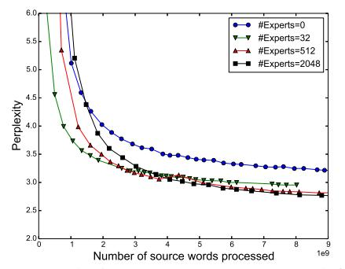
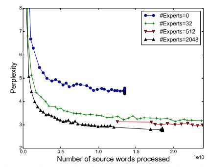

# C.1 8-MILLION-OPERATIONS-PER-TIMESTEP MODELS

Model Architecture: Our model consists of five layers: a word embedding layer, a recurrent Long Short-Term Memory (LSTM) layer (Hochreiter & Schmidhuber, 1997; Gers et al., 2000), a MoE layer, a second LSTM layer, and a softmax layer. The dimensionality of the embedding layer, the number of units in each LSTM layer, and the input and output dimensionality of the MoE layer are all equal to 512. For every layer other than the softmax, we apply dropout (Zaremba et al., 2014) to the layer output, dropping each activation with probability DropP rob, otherwise dividing by (1 − DropP rob). After dropout, the output of the previous layer is added to the layer output. This residual connection encourages gradient flow (He et al., 2015).

MoE Layer Architecture: Each expert in the MoE layer is a feed forward network with one ReLU-activated hidden layer of size 1024 and an output layer of size 512. Thus, each expert contains [512 ∗ 1024] + [1024 ∗ 512] = 1M parameters. The output of the MoE layer is passed through a sigmoid function before dropout. We varied the number of experts between models, using ordinary MoE layers with 4, 32 and 256 experts and hierarchical MoE layers with 256, 1024 and 4096 experts. We call the resulting models MoE-4, MoE-32, MoE-256, MoE-256-h, MoE-1024-h and MoE-4096 h. For the hierarchical MoE layers, the first level branching factor was 16, corresponding to the number of GPUs in our cluster. We use Noisy-Top-K Gating (see Section 2.1) with k = 4 for the ordinary MoE layers and k = 2 at each level of the hierarchical MoE layers. Thus, each example is processed by exactly 4 experts for a total of 4M ops/timestep. The two LSTM layers contribute 2M ops/timestep each for the desired total of 8M.

3We have not found the need for deeper hierarchies.

**Computationally-Matched Baselines:** The MoE-4 model does not employ sparsity, since all 4 experts are always used. In addition, we trained four more computationally-matched baseline models with no sparsity:

- MoE-1-Wide: The MoE layer consists of a single "expert" containing one ReLU-activated hidden layer of size 4096.
- MoE-1-Deep: The MoE layer consists of a single "expert" containing four ReLU-activated hidden layers, each with size 1024.
- 4xLSTM-512: We replace the MoE layer with two additional 512-unit LSTM layers.
- LSTM-2048-512: The model contains one 2048-unit LSTM layer (and no MoE). The output of the LSTM is projected down to 512 dimensions (Sak et al., 2014). The next timestep of the LSTM receives the projected output. This is identical to one of the models published in (Jozefowicz et al., 2016). We re-ran it to account for differences in training regimen, and obtained results very similar to the published ones.

**Training:** The models were trained on a cluster of 16 K40 GPUs using the synchronous method described in Section 3. Each batch consisted of a set of sentences totaling roughly 300,000 words. In the interest of time, we limited training to 10 epochs, (27,000 steps). Training took 12-16 hours for all models, except for MoE-4, which took 18 hours (since all the expert computation was performed on only 4 of 16 GPUs). We used the Adam optimizer (Kingma & Ba, 2015). The base learning rate was increased linearly for the first 1000 training steps, and decreased after that so as to be proportional to the inverse square root of the step number. The Softmax output layer was trained efficiently using importance sampling similarly to the models in (Jozefowicz et al., 2016). For each model, we performed a hyper-parmeter search to find the best dropout probability, in increments of 0.1.

To ensure balanced expert utilization we set  $w_{importance} = 0.1$  and  $w_{load} = 0.1$ , as described in Section 4 and Appendix A.

**Results:** We evaluate our model using perplexity on the holdout dataset, used by (Chelba et al., 2013; Jozefowicz et al., 2016). We follow the standard procedure and sum over all the words including the end of sentence symbol. Results are reported in Table 7. For each model, we report the test perplexity, the computational budget, the parameter counts, the value of DropProb, and the computational efficiency.

Table 7: Model comparison on 1 Billion Word Language Modeling Benchmark. Models marked with \* are from (Jozefowicz et al., 2016).

| Model              | Test       | Test       | ops/timestep | #Params excluding | Total      | Drop- | TFLOPS     |
|--------------------|------------|------------|--------------|-------------------|------------|-------|------------|
|                    | Perplexity | Perplexity | (millions)   | embed. & softmax  | #Params    | Prob  | per GPU    |
|                    | 10 epochs  | (final)    |              | (millions)        | (billions) |       | (observed) |
| Kneser-Ney 5-gram* |            | 67.6       | 0.00001      |                   | 1.8        |       |            |
| LSTM-512-512*      |            | 54.1       | 2.4          | 2.4               | 0.8        | 0.1   |            |
| LSTM-1024-512*     |            | 48.2       | 4.7          | 4.7               | 0.8        | 0.1   |            |
| LSTM-2048-512*     | 45.0       | 43.7       | 9.4          | 9.4               | 0.8        | 0.1   | 0.61       |
| LSTM-2048-512      | 44.7       |            | 9.4          | 9.4               | 0.8        | 0.1   | 1.21       |
| 4xLSTM-512         | 46.0       |            | 8.4          | 8.4               | 0.8        | 0.1   | 1.07       |
| MoE-1-Wide         | 46.1       |            | 8.4          | 8.4               | 0.8        | 0.1   | 1.29       |
| MoE-1-Deep         | 45.7       |            | 8.4          | 8.4               | 0.8        | 0.1   | 1.29       |
| MoE-4              | 45.0       |            | 8.4          | 8.4               | 0.8        | 0.1   | 0.52       |
| MoE-32             | 39.7       |            | 8.4          | 37.8              | 0.9        | 0.1   | 0.87       |
| MoE-256            | 35.7       |            | 8.6          | 272.9             | 1.1        | 0.1   | 0.81       |
| MoE-256-h          | 36.0       |            | 8.4          | 272.9             | 1.1        | 0.1   | 0.89       |
| MoE-1024-h         | 34.6       |            | 8.5          | 1079.0            | 1.9        | 0.2   | 0.90       |
| MoE-4096-h         | 34.1       |            | 8.9          | 4303.4            | 5.1        | 0.2   | 0.74       |
| 2xLSTM-8192-1024*  | 34.7       | 30.6       | 151.0        | 151.0             | 1.8        | 0.25  | 1.09       |
| MoE-34M            | 31.3       |            | 33.8         | 4313.9            | 6.0        | 0.3   | 1.22       |
| MoE-143M           | 28.0       |            | 142.7        | 4371.1            | 6.0        | 0.4   | 1.56       |

### C.2 MORE EXPENSIVE MODELS

We ran two additional models (MoE-34M and MoE-143M) to investigate the effects of adding more computation in the presence of a large MoE layer. These models have computation budgets of 34M and 143M ops/timestep. Similar to the models above, these models use a MoE layer between two LSTM layers. The dimensionality of the embedding layer, and the input and output dimensionality of the MoE layer are set to 1024 instead of 512. For MoE-34M, the LSTM layers have 1024 units. For MoE-143M, the LSTM layers have 4096 units and an output projection of size 1024 (Sak et al., 2014). MoE-34M uses a hierarchical MoE layer with 1024 experts, each with a hidden layer of size 2048. MoE-143M uses a hierarchical MoE layer with 256 experts, each with a hidden layer of size 8192. Both models have 4B parameters in the MoE layers. We searched for the best DropProb for each model, and trained each model for 10 epochs.

The two models achieved test perplexity of 31.3 and 28.0 respectively, showing that even in the presence of a large MoE, more computation is still useful. Results are reported at the bottom of Table 7. The larger of the two models has a similar computational budget to the best published model from the literature, and training times are similar. Comparing after 10 epochs, our model has a lower test perplexity by 18%.

## D 100 BILLION WORD GOOGLE NEWS CORPUS - EXPERIMENTAL DETAILS

**Model Architecture:** The models are similar in structure to the 8-million-operations-per-timestep models described in the previous section. We vary the number of experts between models, using an ordinary MoE layer with 32 experts and hierarchical MoE layers with 256, 1024, 4096, 16384, 65536 and 131072 experts. For the hierarchical MoE layers, the first level branching factors are 32, 32, 64, 128, 256 and 256, respectively.

**Training:** Models are trained on a cluster of 32 Tesla K40 GPUs, except for the last two models, which are trained on clusters of 64 and 128 GPUs so as to have enough memory for all the parameters. For all models, training batch sizes are approximately 2.5 million words. Models are trained once-through over about 100 billion words.

We implement several memory optimizations in order to fit up to 1 billion parameters per GPU. First, we do not store the activations of the hidden layers of the experts, but instead recompute them on the backwards pass. Secondly, we modify the optimizer on the expert parameters to require less auxiliary storage:

The Adam optimizer (Kingma & Ba, 2015) keeps first and second moment estimates of the perparameter gradients. This triples the required memory. To avoid keeping a first-moment estimator, we set  $\beta_1=0$ . To reduce the size of the second moment estimator, we replace it with a factored approximation. For a matrix of parameters, instead of maintaining a full matrix of second-moment estimators, we maintain vectors of row-wise and column-wise averages of that matrix. At each step, the matrix of estimators is taken to be the outer product of those two vectors divided by the mean of either one. This technique could similarly be applied to Adagrad (Duchi et al., 2010).

| Model             | Test       | Test       | ops/timestep | #Params excluding | Total      | TFLOPS     |
|-------------------|------------|------------|--------------|-------------------|------------|------------|
|                   | Perplexity | Perplexity | (millions)   | embed. & softmax  | #Params    | per GPU    |
|                   | .1 epochs  | 1 epoch    |              | (millions)        | (billions) | (observed) |
| Kneser-Ney 5-gram | 67.1       | 45.3       | 0.00001      |                   | 76.0       |            |
| 4xLSTM-512        | 54.5       | 47.0       | 8.4          | 8.4               | 0.1        | 1.23       |
| MoE-32            | 48.5       | 40.4       | 8.4          | 37.8              | 0.1        | 0.83       |
| MoE-256-h         | 42.8       | 35.3       | 8.4          | 272.9             | 0.4        | 1.11       |
| MoE-1024-h        | 40.3       | 32.7       | 8.5          | 1079.0            | 1.2        | 1.14       |
| MoE-4096-h        | 38.9       | 30.9       | 8.6          | 4303.4            | 4.4        | 1.07       |
| MoE-16384-h       | 38.2       | 29.7       | 8.8          | 17201.0           | 17.3       | 0.96       |
| MoE-65536-h       | 38.2       | 28.9       | 9.2          | 68791.0           | 68.9       | 0.72       |
| MoE-131072-h      | 39.8       | 29.2       | 9.7          | 137577.6          | 137.7      | 0.30       |

Table 8: Model comparison on 100 Billion Word Google News Dataset

**Results:** We evaluate our model using perplexity on a holdout dataset. Results are reported in Table 8. Perplexity after 100 billion training words is 39% lower for the 68-billion-parameter MoE

model than for the baseline model. It is notable that the measured computational efficiency of the largest model (0.30 TFLOPS/GPU) is very low compared to the other models. This is likely a result of the fact that, for purposes of comparison to the other models, we did not increase the training batch size proportionally to the number of GPUs. For comparison, we include results for a computationally matched baseline model consisting of 4 LSTMs, and for an unpruned 5-gram model with Kneser-Ney smoothing (Kneser & Ney, 1995).4

## E MACHINE TRANSLATION - EXPERIMENTAL DETAILS

Model Architecture for Single Language Pair MoE Models: Our model is a modified version of the GNMT model described in (Wu et al., 2016). To reduce computation, we decrease the number of LSTM layers in the encoder and decoder from 9 and 8 to 3 and 2 respectively. We insert MoE layers in both the encoder (between layers 2 and 3) and the decoder (between layers 1 and 2). We use an attention mechanism between the encoder and decoder, with the first decoder LSTM receiving output from and providing input for the attention 5 . All of the layers in our model have input and output dimensionality of 512. Our LSTM layers have 2048 hidden units, with a 512-dimensional output projection. We add residual connections around all LSTM and MoE layers to encourage gradient flow (He et al., 2015). Similar to GNMT, to effectively deal with rare words, we used subword units (also known as "wordpieces") (Schuster & Nakajima, 2012) for inputs and outputs in our system.

We use a shared source and target vocabulary of 32K wordpieces. We also used the same beam search technique as proposed in (Wu et al., 2016).

We train models with different numbers of experts in the MoE layers. In addition to a baseline model with no MoE layers, we train models with flat MoE layers containing 32 experts, and models with hierarchical MoE layers containing 512 and 2048 experts. The flat MoE layers use k = 4 and the hierarchical MoE models use k = 2 at each level of the gating network. Thus, each input is processed by exactly 4 experts in each MoE layer. Each expert in the MoE layer is a feed forward network with one hidden layer of size 2048 and ReLU activation. Thus, each expert contains [512 ∗ 2048] + [2048 ∗ 512] = 2M parameters. The output of the MoE layer is passed through a sigmoid function. We use the strictly-balanced gating function described in Appendix F.

Model Architecture for Multilingual MoE Model: We used the same model architecture as for the single-language-pair models, with the following exceptions: We used noisy-top-k gating as described in Section 2.1, not the scheme from Appendix F. The MoE layers in the encoder and decoder are non-hierarchical MoEs with n = 512 experts, and k = 2. Each expert has a larger hidden layer of size 8192. This doubles the amount of computation in the MoE layers, raising the computational budget of the entire model from 85M to 102M ops/timestep.

Training: We trained our networks using the Adam optimizer (Kingma & Ba, 2015). The base learning rate was increased linearly for the first 2000 training steps, held constant for an additional 8000 steps, and decreased after that so as to be proportional to the inverse square root of the step number. For the single-language-pair models, similarly to (Wu et al., 2016), we applied dropout (Zaremba et al., 2014) to the output of all embedding, LSTM and MoE layers, using DropP rob = 0.4. Training was done synchronously on a cluster of up to 64 GPUs as described in section 3. Each training batch consisted of a set of sentence pairs containing roughly 16000 words per GPU.

To ensure balanced expert utilization we set wimportance = 0.01 and wload = 0.01, as described in Section 4 and Appendix A.

Metrics: We evaluated our models using the perplexity and the standard BLEU score metric. We reported tokenized BLEU score as computed by the multi-bleu.pl script, downloaded from the public implementation of Moses (on Github), which was also used in (Luong et al., 2015a).

4While the original size of the corpus was 130 billion words, the neural models were trained for a maximum of 100 billion words. The reported Kneser-Ney 5-gram models were trained over 13 billion and 130 billion words respectively, giving them a slight advantage over the other reported results.

5 For performance reasons, we use a slightly different attention function from the one described in (Wu et al., 2016) - See Appendix G

**Results:** Tables 2, 3 and 4 in Section 5.3 show comparisons of our results to other published methods. Figure 4 shows test perplexity as a function of number of words in the (training data's) source sentences processed for models with different numbers of experts. As can be seen from the Figure, as we increased the number of experts to approach 2048, the test perplexity of our model continued to improve.

Figure 4: Perplexity on WMT'14 En $\rightarrow$  Fr (left) and Google Production En $\rightarrow$  Fr (right) datasets as a function of number of words processed. The large differences between models at the beginning of training are due to different batch sizes. All models incur the same computational budget (85M ops/timestep) except the one with no experts.

We found that the experts indeed become highly specialized by syntax and/or semantics, as can be seen in Table 9. For example, one expert is used when the indefinite article "a" introduces the direct object in a verb phrase indicating importance or leadership.

Table 9: Contexts corresponding to a few of the 2048 experts in the MoE layer in the encoder portion of the WMT'14 En $\rightarrow$  Fr translation model. For each expert i, we sort the inputs in a training batch in decreasing order of  $G(x)_i$ , and show the words surrounding the corresponding positions in the input sentences.

| Expert 381                       | Expert 752                          | Expert 2004                    |
|----------------------------------|-------------------------------------|--------------------------------|
| with <b>researchers</b> ,        | plays <b>a</b> core                 | with <b>rapidly</b> growing    |
| to <b>innovation</b> .           | plays <b>a</b> critical             | under <b>static</b> conditions |
| tics <b>researchers</b> .        | provides <b>a</b> legislative       | to <b>swift</b> ly             |
| the <b>generation</b> of         | play <b>a</b> leading               | to <b>dras</b> tically         |
| technology <b>innovations</b> is | assume a leadership                 | the <b>rapid</b> and           |
| technological innovations,       | plays <b>a</b> central              | the <b>fast</b> est            |
| support innovation throughout    | taken <b>a</b> leading              | the <b>Quick</b> Method        |
| role innovation will             | established <b>a</b> reconciliation | rec <b>urrent</b> )            |
| research <b>scienti</b> st       | played <b>a</b> vital               | provides quick access          |
| promoting innovation where       | have a central                      | of <b>volatile</b> organic     |
| <b></b>                          |                                     |                                |

