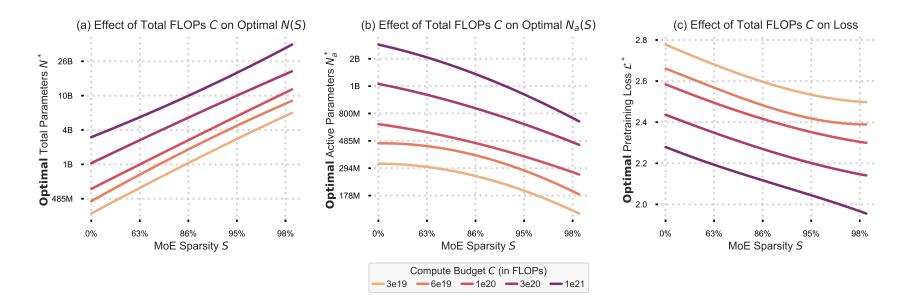
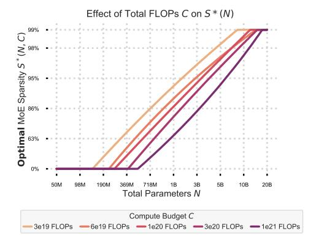
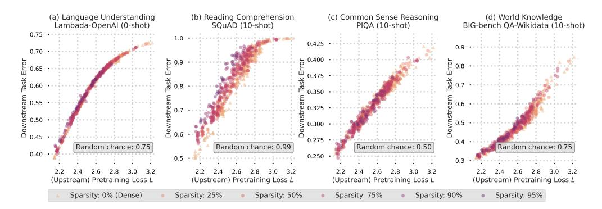
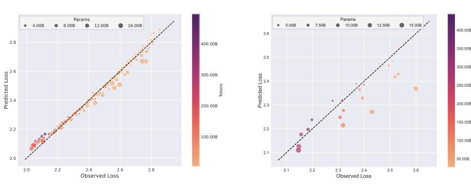
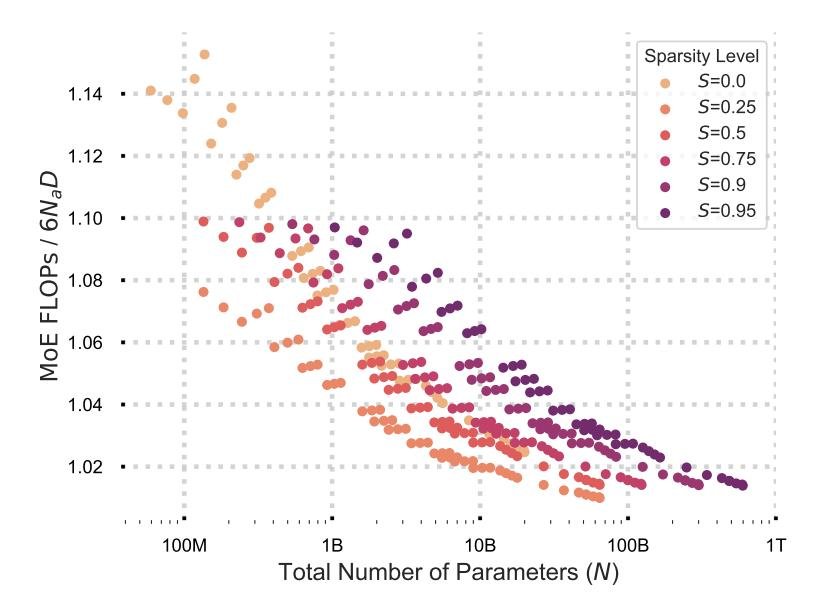
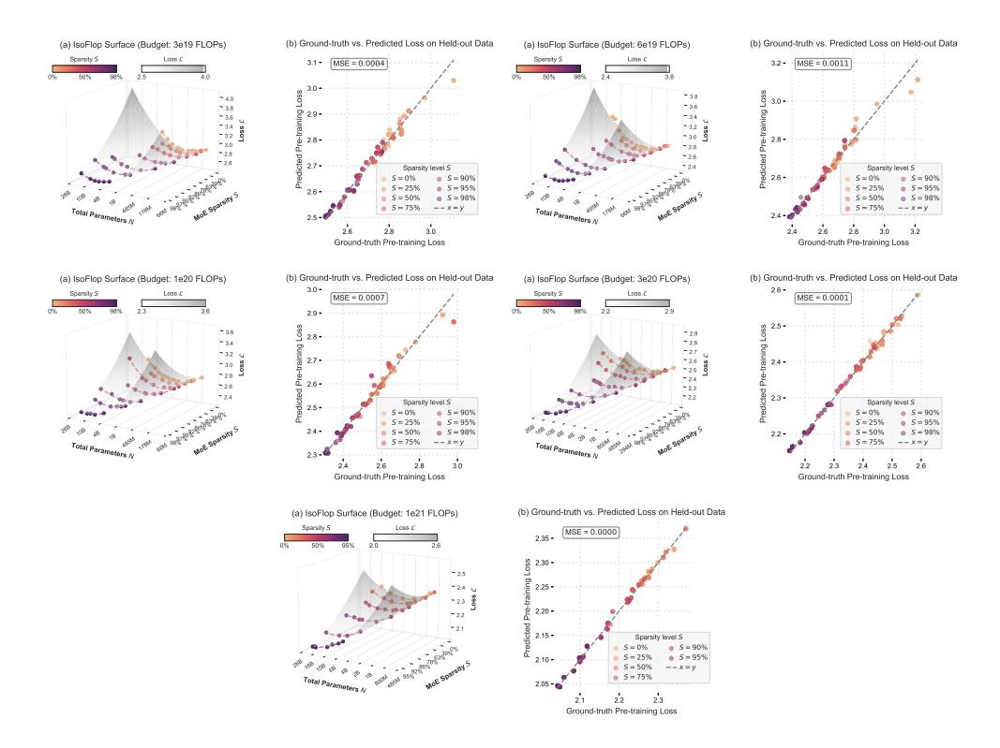
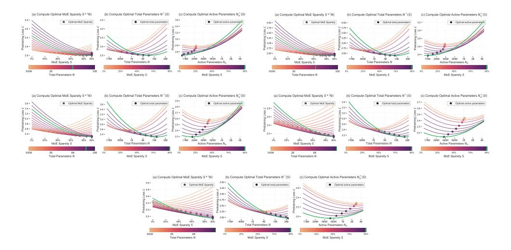
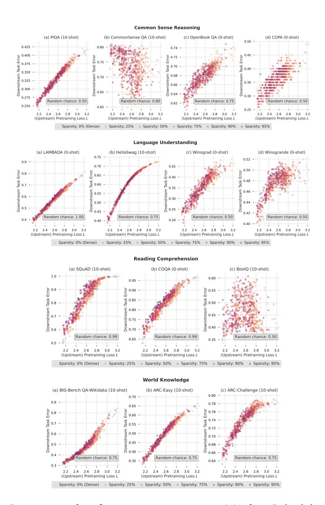
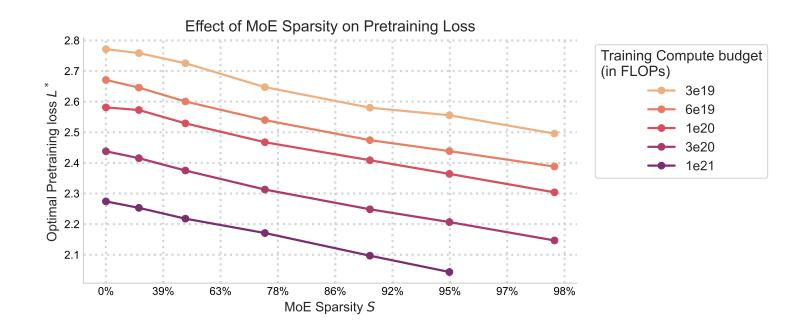
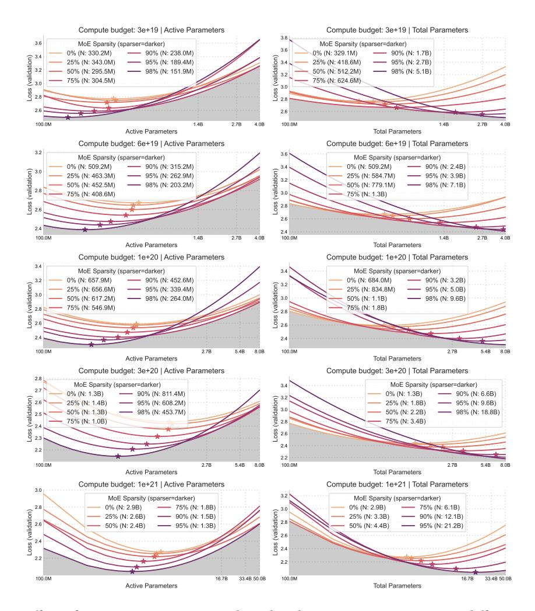

# 2 The Interplay between Model Parameters and Sparsity in MoEs

Is there an optimal trade-off between parameter count and FLOPs per example in MoEs under the setting where the training compute budget (i.e., total training FLOPs) is fixed?

Intuitively, under infinite data setting, scaling model capacity along with the training compute budget leads to performance improvements. Previous scaling law studies suggest that, conditioned on a training compute budget measured in FLOPs denoted by C, the optimal number of parameters,  $N^*(C)$ , exhibits a power-law relationship with C (Hoffmann et al., 2022):

$$N^*(C) = \arg\min_{N} \mathcal{L}(N; C) \propto C^a \tag{1}$$

Our goal is to study how to optimally trade-off FLOPs per example and total parameters in MoEs. In MoEs the balance between parameters and FLOPs can be expressed through the sparsity level, S. We define S as the ratio of non-active to total number of experts, i.e.,  $S = \frac{E-K}{E}$ ; where E

&lt;sup>2A relevant discussion here is the recent trend of increasing test-time compute, e.g., OpenAI o1 model (OpenAI, 2024), achieved by generating more tokens as a way for introducing parameter-free-FLOPs.

is the total number of experts and K is the number of selected experts per token. We can vary the sparsity level by either changing the number of active experts K or total number of experts E. Sessentially, for models with the same N, the model with a higher S will have fewer active parameters  $N_a$ , resulting in fewer FLOPs per example. For more details on the notations and experimental settings see Appendix A and Appendix B.

$$(N^*, S^*) = \arg\min_{N,S} \mathcal{L}(N, S; C)$$
(2)

To simplify the problem of understanding the joint role of N and S in predicting L, we break the problem, Equation 2, into two parts:

1. "How does the sparsity level impact the scaling laws of the relationship between N and C for training-compute optimal models?" To address this question in §2.1, we fix S and vary N, studying how optimal N and  $N_a$  change for different values of S:

$$N^* = \underset{N}{\arg\min} \mathcal{L}(N; C, S) \tag{3}$$

2. "Is there an optimal balance between total number of parameters and the sparsity level under fixed training-compute budget?" To address this question in §2.2, we fix N and vary S, studying how optimal S changes across different values of N:

$$S^* = \operatorname*{arg\,min}_{S} \mathcal{L}(S; C, N) \tag{4}$$

As the first step, considering a fixed training compute budget C, we fit a 3D surface, referred to as the IsoFLOP surface, in Figure 1a, using a polynomial function, following approach II of Hoffmann et al. (2022). Compared to Hoffmann et al. (2022) we include the sparsity variable and fit a single 3d IsoFLOP surface across all data points, rather than fitting separate 2d IsoFLOP curves for fixed sparsity levels or model sizes. We conducted a grid search to determine the optimal polynomial degree for N, S, and the interaction term  $N \times S$ , finding that a degree of (2,2,2) resulted in the lowest cross-validation error. Both N and S are in log space (see Appendix B for more details).

As seen in Figure 1a, the IsoFLOP surface plot is parabolic along model size, suggesting that the findings of Hoffmann et al. (2022) extend to MoEs across different sparsity levels, i.e.,  $\mathcal{L}(N;C,S)$  is parabolic, with its optimal solution located at the turning point. When considering the total number of parameters N, the optimal value increases as the sparsity level increases, while for the active number of parameters  $N_a$  the optimal value decreases with the sparsity level. This indicates that by increasing the sparsity level the training compute optimal models are larger but have fewer FLOPs per example, i.e., lower inference cost. Moreover, along sparsity, the pretraining loss decreases monotonically, indicating that, for the same compute budget, sparser models achieve better pretraining performance. We observe the same pattern across different training compute budgets (See Appendix D.1). To better understand and explain these observations, we examine slices of the IsoFLOP surface along the axes of S and N separately in §2.1 and §2.2, respectively.

#### 2.1 Optimal Model Size for Fixed Sparsity Level

Here we examine how sparsity influences scaling laws governing the relationship between  $N, N_a$  and C for training-compute optimal models, i.e. how does  $N^*$  and  $N_a^*$ , for a given C, S (Equation 3), change as we increase S? Looking at slices of the IsoFLOP surface along the model size dimension, in Figure 2b and Figure 2c, we observe how the IsoFLOP curves shift along loss and model size. Considering the training-compute optimal model, for a fixed compute budget, loss

&lt;sup>3Sparsity level determines the number of active parameters given the total number of parameters and we use the active number of parameters as a proxy for FLOPs per example, as  $6N_aD$  provides a good estimate of the total FLOP count for MoEs; see Appendix C for details.

Figure 3: Effect of compute budget on model size, number of active parameters and loss with sparsity. Across all compute budgets, we observe that (a) the optimal model size N increases with sparsity, (b) the optimal number of active parameters  $N_a$  decreases with sparsity, and (c) the loss L decreases with sparsity.

decreases as we increase sparsity. Furthermore, while sparser models have larger N compared to denser models, as seen in Figure 2b, they have a smaller active parameter count  $N_a$ ; hence, fewer FLOPs per example. Intuitively, more parameters in total increase the capacity of the sparser models to fit the data, while fewer number of active parametes, hence fewer FLOPs per example, allow the model to be trained with more tokens, i.e., higher D, for the same training compute budget.

#### 2.2 Optimal Sparsity Level for Fixed Model Size

In this section we aim to understand the dynamics between the total number of parameters and FLOPs per example in MoEs. In Section 2.1 we are considering the case where there is no bound on the total number of parameters. In this case, we observe that under fixed training compute budget in terms of FLOPs, it is better to train sparser models with higher total number of parameters. However in practical scenarios it is reasonable to assume that there would be some bounds on the memory and hence the total number of parameters of a model. This leads us to a fundamental question: Is there an optimal balance between the total number of parameters and and FLOPs per example under a fixed training-compute budget? Thus, we investigate the optimal sparsity level when total number of parameters is fixed. Specifically, we ask: Given N and C, How does  $S^*$  change as we vary N?

To address this, we look into slices of the IsoFLOP surface along the sparsity dimension. As we can see in Figure 2a, for a fixed training compute budget and fixed model size  $\mathcal{L}(S; N, C)$  exhibits a parabolic profile, reaching its optimum value at the vertex where  $S=S^*$ . It is noteworthy that for a given total training compute, there is threshold value  $N_{th}$  for the total number of parameters, where for larger models, models with  $N>N_{th}$ , increasing sparsity always has a positive impact, i.e., optimal sparsity level approaches 1.0. More accurately, for a fixed compute budget the optimal sparsity level increases with model size and converges to 1 as the model size grows (see Figure 4 in §D.2 in the Appendix for more details). Note that the optimal model, here is not the largest model, i.e., there is a compute optimal model size in terms of total parameters even after sparsity is introduced, and increasing total number of parameters would lead to under-training if training compute budget is fixed.

These results highlight the importance of balancing the number of parameters with FLOPs per example in MoEs. Intuitively, when the total number of parameters is small, higher sparsity results in fewer active parameters, and thus fewer FLOPs per example. This reduction in FLOPs per example may lead to inefficiencies during both training and inference. Conversely, when the total number of parameters is large, for a reasonable amount of FLOPs per example, a fixed compute budget may not allow sufficient training on enough tokens to make use of the model's additional capacity.

## 3 Impact of Training Compute Budget on the Interaction between Model Parameters and Sparsity

Does increasing compute budget impact the interaction between the parameters and FLOPs per example in MoEs and how they contribute to model's capacity? In other words, does the recipe for optimally increasing model capacity, i.e., optimal sparsity level for MoEs change as we scale up the total training compute?

To answer this question. in Figure 3 we illustrate the trends for changing the total number of parameters,  $N^*$ , the number of active parameters,  $N^*_a$ , and the loss,  $L^*$ , with sparsity level across different compute budgets.

Figure 3c shows that the optimal sparsity level approaches 1 across all compute budgets used in our experiments. There is no significant difference observed in the slope of the loss vs sparsity curves across different training compute budgets used in our experiments. This observation suggests that there is no diminishing effect of sparsity on the pretraining loss as we increase training compute budget, i.e., if there is no constraint on the model size, sparsity improves the performance of the model across all training budgets.

In Figure 3a and Figure 3b, , we see a consistent trend of increasing N and decreasing  $N_a$  for compute optimal models as sparsity level increases across all training compute budgets. Moreover, as can be seen in Figure 4, when model size in terms of total number of parameters is fixed, optimal sparsity level decreases with training compute budget while increases with model size as discussed in Section 2.2.

#### 4 Effect of MoE Sparsity on Downstream Task Performance

In this section, we study how sparsity affects the relationship between upstream and downstream performance of MoEs. In other words, does sparsity impact the relative gains from improvements in pretraining tasks on downstream tasks?

We use downstream tasks from the evaluation suite in 11m-foundry4 for benchmarking our pretrained models, specifically in an incontext few-shot learning setup. This setup focuses on evaluating a model's ability to learn and adapt to new tasks with limited examples. The downstream task are devided into four pre-defined categories namely: language understanding, world knowledge, reading comprehension, and symbolic reasoning to help us systematically test whether the downstream vs upstream performance trend remains the same or is different as we vary sparsity values.

We observe from Figure 5a (language understanding), Figure 5c (commonsense reason-

Figure 4: Effect of training budget C and total parameters N on MoE sparsity. Optimal MoE sparsity  $S^*$  changes with respect to the total number of parameters N and the training budget C. The x-axis represents the total parameters N on a logarithmic scale, and the y-axis shows the optimal MoE sparsity  $S^*$ .

ing), and Figure 5d (world knowledge) that, in an in-context few-shot learning setting, there is a strong correlation between upstream (pretraining) loss and downstream performance (error)

&lt;sup>4Github repository: https://github.com/mosaicml/llm-foundry

Figure 5: **Effect of sparsity on downstream vs upstream performance.** Downstream error shows a tight relationship with pretraining ("upstream") loss across downstream tasks across all sparsity levels.

across all these tasks. For these tasks, downstream performance in the few-shot setting is predictable based on upstream performance, regardless of the sparsity level. This indicates that, in the context of these tasks, the optimal sparsity level follows the same trend as the optimal sparsity observed during pretraining. However, Figure 5b (reading comprehension) shows an example of a task where models with higher sparsity transfer more poorly compared to denser models. This decrease in the transfer performance of sparser models on these tasks may be due to the lower inference-time compute in sparser models compared to their denser counterparts for a similar pretraining loss. Further analysis is needed to verify this intuition.

If fewer FLOPs per example are the reason behind the worse transfer performance in sparser models, this effect might diminish with a larger total training compute budget, as the optimal active number of parameters increases. Moreover, one can use approaches like chain-of-thought reasoning (Wei et al., 2022b) to independently increase FLOPs per example during inference time.

In Appendix E, we explore whether increasing inference-time compute via Chain-of-Thought (CoT) prompting can improve the performance of MoEs on tasks that require more reasoning. Our experiments indicate that MoEs benefit more from this increased compute compared to dense models with a similar number of active parameters. This suggests that dynamic compute allocation during inference may be crucial for MoEs to perform well on complex reasoning tasks.

While our results may indicate that there may be no additional benefit obtained via sparsity in MoEs beyond the efficiency gains for pretraining, we caution the reader that this suggestion may be an artifact of the scale of our experiments. In the end, since, as shown in §2, sparser models are more efficient both in terms of training and inference cost (when measured in terms of theoretical FLOPs), we can reach better pretraining performance with higher sparsity levels at a lower cost, which can translate to better downstream performance.

## 5 Incorporating Sparsity into Scaling Laws

The scaling laws proposed by Kaplan et al. (2020) provide a framework for predicting loss in dense models by establishing a power-law relationship between loss L, number of parameters N and dataset size D, where N and D interact linearly. Formally, the relationship is given by:

$$L(N,D) = \frac{a}{N^{\alpha}} + \frac{b}{D^{\beta}} + e \tag{5}$$

Here, the term  $N^{\alpha}$  captures the inverse relationship between model size and loss, where an increase in model size N leads to a reduction in loss. The exponent  $\alpha$  quantifies the rate of this decrease; a larger  $\alpha$  suggests a steeper reduction in loss with increasing model size. Similarly, the term  $D^{\beta}$  indicates the impact of dataset size D on loss, with larger datasets contributing to lower loss values. The exponent  $\beta$  measures this relationship, where a larger  $\beta$  implies a greater benefit from

increased data. The constant e represents an asymptotic minimum for the loss, as both model size and dataset size approach infinity.

For dense models with a fixed total training FLOPs, C, the parameters N and D are interrelated through the equation for estimating FLOPs per example, given as C=6ND for transformers. However, in MoEs (Mixture of Experts models), this relationship involves the active number of parameters  $N_a$  rather than the total parameter count N. Thus, D and  $N_a$  define the total training FLOPs rather than D and N. Given the analysis conducted in §2, we know that if the total number of parameters N is fixed, the optimal sparsity level, i.e., active number of parameters would depend on N. Motivated by this observation, we suggest the following parametric form that includes a multiplicative interaction between N and S or  $N_a$  to predict the loss:

$$L(N, D, S) = \frac{a}{N^{\alpha}} + \frac{b}{D^{\beta}} + \frac{c}{(1 - S)^{\lambda}} + \frac{d}{(1 - S)^{\delta} N^{\gamma}} + e$$
 (6)

The term (1-S) in the above equation provides a rough estimate of the percentage of active parameters. If the exponent for the multiplicative terms is the same then that term provides an approximate estimate of the number of active parameters.

By incorporating sparsity into the scaling law equation, we can eliminate the need for parameters specific to MoEs, such as the total and active number of experts. As demonstrated by Frantar et al. (2024), this formulation also holds for other sparsity mechanisms, such as weight sparsity, where individual neural network connections are pruned.

We use the recipe described by Hoffmann et al. (2022) and use the L-BFGS algorithm to fit the coefficients in equation 6 using a Huber loss with  $\delta=10^{-3}$ . Optimal coefficient values were determined through a grid search (see Table 2 for search values). The results of data fitting and validation are shown in Figure 6. The estimated values are shown in Table 3 in Appendix F.

(a) Fit on data used to estimate coefficients.

(b) Validating scaling law on held-out dataset.

Figure 6: Scaling law fit on data obtained from training compute-optimal models. Figure 6(a) shows the fit on the data used to estimate the coefficients for equation 6, while Figure 6(b) validates these coefficients on a held-out dataset. All data points with S=0.98 were excluded from the fitting process for out-of-sample validation. The dashed lines represent equal loss values.

#### 6 Discussion

Our findings amplify the findings of Ludziejewski et al. (2024) and further justify the effort to work toward MoEs with experts larger in number and smaller in size (He, 2024). For downstream tasks which their performance is predictable given the pretraining loss (i.e., perplexity), sparsity potentially provides efficiency gains both during pretraining and inference.

Here is a summary of our observations as discussed in Sections [2](#page-2-0) to [5](#page-6-0) :

- Larger, Sparser Models Perform Better under a Fixed Compute Budget: When memory and communication overheads are disregarded, increasing sparsity while proportionally expanding the total number of parameters consistently leads to a lower pretraining loss, even when constrained by a fixed training compute budget (see § [2\)](#page-2-0).
- Optimal Sparsity for Fixed Model Size: For any given number of parameters and under a fixed training compute budget, model performance as a function of sparsity exhibits a parabolic pattern, reaching its peak at an optimal sparsity level (see [§2.2\)](#page-4-0). Specifically, the optimal sparsity level:
  - Increases with the total number of parameters approaching 1.0 for larger models. i.e., if a model is relatively small for a given training compute budget, sparsifying it more than a threshold will hurt its performance. On the other hand, if a model is relatively large for a given compute budget, further sparsifying it helps as it leads to increase in the number of tokens the model is trained on under the given training budget constraints (see [§2.2\)](#page-4-0).
  - Increases across all model sizes as the training compute budget increases (see [§D.1](#page-23-0) and [§D.2\)](#page-23-0).
- Effect of Sparsity on Scaling Laws for Optimal Model Size: For any specific sparsity level, performance of the models as a function of their size exhibits parabolic behavior under a fixed training compute budget. i.e., the model reaches its optimal performance at a vertex, that indicates optimal model size. Under these conditions:
  - The optimal active number of parameters decreases as the sparsity level increases, leading to smaller FLOPs per example and more efficient inference even though the total number of parameters increases (see [§2.1\)](#page-3-0).
  - While the trend of increasing active number of parameters is similar across all training compute budgets; the optimal active number of parameters decrease more rapidly with sparsity as the training compute budget increases (see [§3\)](#page-5-0).
- Effect of Sparsity on Downstream Performance: For most downstream tasks, models with similar pretraining perplexity have similar downstream task performance regardless of sparsity. For reading comprehension tasks (e.g., CoQA [\(Reddy et al.,](#page-14-0) [2019\)](#page-14-0), SQuAD [\(Rajpurkar et al.,](#page-14-0) [2018\)](#page-14-0)), denser models perform better, potentially due to their higher inference-time compute than a perplexity-matched sparse model. Strategies to increase inference time compute dynamically [\(Wei et al.,](#page-15-0) [2022b;](#page-15-0) [Goyal et al.,](#page-13-0) [2024\)](#page-13-0) may address this gap.
- Parametric Scaling Law: We propose a parametric form for scaling laws that accounts for sparsity. The model coefficients are estimated using the empirical data obtained by training compute-optimal models. An interesting observation from Appendix [F](#page-30-0) is that the exponent for sparsity term λ is negative which is consistent with our intuition that sparser models lead to a lower perplexity.

#### 6.1 Limitations

In our analysis, similar to other scaling law studies [\(Kaplan et al.,](#page-13-0) [2020;](#page-13-0) [Hoffmann et al.,](#page-13-0) [2022\)](#page-13-0), we have measured the costs for both training and inference exclusively in terms of FLOPs. While there may be discrepancies between actual computational costs and theoretical FLOPs due to hardware specifications, infrastructure, and implementation details, it is reasonable to abstract away from these factors when comparing similar models under fixed conditions. However, an important aspect not accounted for in this study is the cost associated with memory usage and communication overhead, which could potentially increase as we raise the sparsity level. Incorporating these factors is challenging because they are highly dependent on the hardware used. To address this limitation to some extent, in Section [2.2](#page-4-0) we investigate the optimal sparsity level under the setting where total number of parameters is fixed.

Despite the limitation with using an approximate method to quantify FLOPs, our findings highlight

the importance of investing in methods to enhance the efficiency of sparse Mixture-of-Experts models. By increasing model capacity through additional parameters while minimizing per-unit computation costs, these models have the potential to improve both efficiency and performance. The availability of GPUs with larger memory, for e.g., the recently introduced H200 GPU chip with 141 GB of memory as well as improving the efficiency of training and deployment pipelines [\(NeMo](#page-14-0) [Authors,](#page-14-0) [2025\)](#page-14-0) suggest that there is significant interest in developing efficient implementations for MoEs.

## 7 Related Work

#### 7.1 Scaling Laws for Language Models

Scaling laws have proven to be a powerful framework for understanding and predicting the performance of language models. Existing studies, such as [Kaplan et al.](#page-13-0) [\(2020\)](#page-13-0) and [Hoffmann et al.](#page-13-0) [\(2022\)](#page-13-0), reveal that power-law relationships govern model performance as a function of factors like model size, data size, and compute budget, offering predictable performance improvements with increased resources.

[Hoffmann et al.](#page-13-0) [\(2022\)](#page-13-0) emphasizes the critical balance between model size and the number of training tokens when the training compute budget is fixed, showing that scaling the model without corresponding data increases can lead to suboptimal performance. Additionally, [DeepSeek-AI](#page-12-0) [\(2024\)](#page-12-0) explores more nuanced scaling behaviors by incorporating data quality, demonstrating that higherquality data allows for more efficient scaling, and thus, a larger portion of the compute budget should be allocated to increasing model size.

Recent work extends scaling law analysis to specialized contexts, including over-training [\(Gadre](#page-13-0) [et al.,](#page-13-0) [2024\)](#page-13-0), downstream task performance, and multilingual or multi-modal settings, where scaling laws provide valuable insights and can be adapted to address specific challenges.

#### 7.2 Scaling Laws for MoEs

Mixture-of-Experts (MoE) models [\(Shazeer et al.,](#page-14-0) [2017;](#page-14-0) [Lepikhin et al.,](#page-14-0) [2021;](#page-14-0) [Fedus et al.,](#page-13-0) [2022;](#page-13-0) [DeepSeek-AI,](#page-12-0) [2025\)](#page-12-0) have emerged as a powerful architecture for language modeling, primarily because they decouple computational cost from parameter count. This separation between parameters and FLOPs per token in MoE architectures calls for scaling laws that can accurately factor in the contributions of both.

Previous research on the scaling behavior of MoE models has established foundational scaling laws, incorporating factors such as total parameter count, the number of experts, and the granularity of these experts [\(Clark et al.,](#page-12-0) [2022;](#page-12-0) [Ludziejewski et al.,](#page-14-0) [2024;](#page-14-0) [Wang et al.,](#page-14-0) [2024\)](#page-14-0). However, these studies typically assume a fixed configuration for other critical variables influencing FLOPs per token, such as the number of active experts per input. In contrast, we propose a generalized scaling law that considers variables like active parameter count and sparsity level, thereby expanding the applicability of MoE scaling laws.

A common theme in the literature suggests that training sparser models—achieved by increasing the number of smaller experts—offers significant gains in efficiency for both pretraining and inference phases. Through a comprehensive large-scale study, we provide empirical evidence for this, analyzing the impact of sparsity level on efficiency and defining optimal configurations.

Supporting this, [Du et al.](#page-13-0) [\(2021\)](#page-13-0) demonstrates GLaM's superior efficiency and performance compared to GPT-3, showing that MoE architectures can achieve high performance with significantly lower computational and energy costs. Further insights are offered by [Clark et al.](#page-12-0) [\(2022\)](#page-12-0), who analyze scaling behaviors across various MoE routing techniques. While their study finds that MoEs generally outperform dense models, it also notes diminishing benefits as base model sizes grow. [Ludziejewski et al.](#page-14-0) [\(2024\)](#page-14-0) challenge this conclusion, attributing the diminished returns partly to the fixed number of training tokens across models and constant expert sizes. By introducing "granularity" and adjusting training durations, they demonstrate that MoEs can outperform dense models across any compute budget, debunking the notion of diminishing returns for MoEs with adaptive expert configurations. More recently, [Jelassi et al.](#page-13-0) [\(2024\)](#page-13-0) finds that, on downstream tasks, MoEs scale efficiently with the number of experts (i.e., increasing sparsity) on memorization tasks, but their reasoning capabilities saturate and lag behind dense models on tasks requiring complex reasoning when compared based on total number of parameters.

Another approach by [He](#page-13-0) [\(2024\)](#page-13-0) explores the benefits of training MoEs with larger numbers of smaller experts rather than the conventional setup of fewer, larger experts. They introduce Parameter Efficient Expert Retrieval (PEER), a novel routing mechanism designed to tackle the computational and optimization challenges that arise when handling a high number of experts, thus enabling efficient scaling of MoE models.

Lastly, [Yun et al.](#page-15-0) [\(2024\)](#page-15-0) draws attention to the increased inference costs associated with scaling MoEs by adding experts. While additional experts may not substantially affect training costs, they can inflate inference costs, thereby diminishing deployment efficiency. To address this, the study proposes an over-trained budget allocation strategy, optimizing MoE models for both performance and efficiency in deployment.

## 8 Conclusion

In this paper, we investigated the optimal trade-off between parameters and compute per example for maximizing model capacity. Our findings indicate that sparsity, as a knob that controls FLOPs per example in MoEs, is a powerful mechanism for optimizing model performance under constrained training compute budgets. By balancing the total number of parameters, compute, and sparsity, MoEs can be scaled more effectively. These insights provide valuable guidance for scaling language models, especially for MoEs, where the trade-offs between parameters and FLOPs must be carefully managed.

MoEs were originally introduced to allow increasing model capacity without a significant increase in inference cost. Our experiments show that under fixed total training compute budget increasing sparsity in MoEs leads to smaller FLOPs per example, higher number of parameters, and lower pretraining loss simultaneously. In other words, in the context of MoEs, if there are no constraints on the total number of parameters, increasing the capacity of the model through parameter count seem to be the optimal strategy if lower pretraining loss is the main goal. On the other hand, when comparing how well the pretraining performance transfers to various downstream tasks, denser models exhibit better transfer performance on certain types of task that potentially rely on deeper processing of the input vs the knowledge stored in the parameters of the model. This potentially signals the importance of the role of FLOPs per example in increasing the capacity of the model during inference. Our experiments demonstrate that MoEs use Chain-of-Thought prompting more effectively than dense models, achieving better performance when allocated additional computational resources during inference. This observation reveals an interesting direction to improve the performance efficiency of MoEs at inference time.

Future work will focus on determining the optimal balance between FLOPs per example and parameter count, with an emphasis on conducting in-depth analyses of model performance across diverse downstream tasks. A key direction will involve exploring strategies to balance parameter allocation and computational demands to minimize inference costs. Developing scaling law studies to identify optimal approaches for achieving efficiency and performance during inference represents a critical area for further investigation.

Another important avenue will be to examine how the findings on the role of sparsity in MoEs

generalize to architectures or approaches that employ different mechanisms for independently adjusting FLOPs per example and the number of trainable parameters. Additionally, an intriguing direction for future exploration is the study of scaling behaviors in models that enable negative sparsity values through parameter sharing.

## Acknowledgments

The authors would like to thank Vaishaal Shankar, Fartash Faghri, Skyler Seto, Mustafa Shukor, Amitis Shidani, David Grangier, Etai Littwin, Alexander Toshev and Preetum Nakkiran for their insightful discussions, feedback and technical support that significantly contributed to the development of this paper.

## References

- J. Bai, S. Bai, Y. Chu, Z. Cui, K. Dang, X. Deng, Y. Fan, W. Ge, Y. Han, F. Huang, B. Hui, L. Ji, M. Li, J. Lin, R. Lin, D. Liu, G. Liu, C. Lu, K. Lu, J. Ma, R. Men, X. Ren, X. Ren, C. Tan, S. Tan, J. Tu, P. Wang, S. Wang, W. Wang, S. Wu, B. Xu, J. Xu, A. Yang, H. Yang, J. Yang, S. Yang, Y. Yao, B. Yu, H. Yuan, Z. Yuan, J. Zhang, X. Zhang, Y. Zhang, Z. Zhang, C. Zhou, J. Zhou, X. Zhou, and T. Zhu. Qwen technical report. arXiv preprint arXiv:2309.16609, 2023.
- BIG-bench authors. Beyond the imitation game: Quantifying and extrapolating the capabilities of language models. Transactions on Machine Learning Research, 2023. ISSN 2835-8856. URL <https://openreview.net/forum?id=uyTL5Bvosj>.
- S. Black, S. Biderman, E. Hallahan, Q. Anthony, L. Gao, L. Golding, H. He, C. Leahy, K. McDonell, J. Phang, et al. Gpt-neox-20b: An open-source autoregressive language model. arXiv preprint arXiv:2204.06745, 2022.
- T. Brown, B. Mann, N. Ryder, M. Subbiah, J. D. Kaplan, P. Dhariwal, A. Neelakantan, P. Shyam, G. Sastry, A. Askell, S. Agarwal, A. Herbert-Voss, G. Krueger, T. Henighan, R. Child, A. Ramesh, D. Ziegler, J. Wu, C. Winter, C. Hesse, M. Chen, E. Sigler, M. Litwin, S. Gray, B. Chess, J. Clark, C. Berner, S. McCandlish, A. Radford, I. Sutskever, and D. Amodei. Language models are fewshot learners. In H. Larochelle, M. Ranzato, R. Hadsell, M. Balcan, and H. Lin, editors, Advances in Neural Information Processing Systems, volume 33, pages 1877–1901. Curran Associates, Inc., 2020. URL [https://proceedings.neurips.cc/paper\\_files/paper/](https://proceedings.neurips.cc/paper_files/paper/2020/file/1457c0d6bfcb4967418bfb8ac142f64a-Paper.pdf) [2020/file/1457c0d6bfcb4967418bfb8ac142f64a-Paper.pdf](https://proceedings.neurips.cc/paper_files/paper/2020/file/1457c0d6bfcb4967418bfb8ac142f64a-Paper.pdf).
- A. Clark, D. d. l. Casas, A. Guy, A. Mensch, M. Paganini, J. Hoffmann, B. Damoc, B. Hechtman, T. Cai, S. Borgeaud, G. v. d. Driessche, E. Rutherford, T. Hennigan, M. Johnson, K. Millican, A. Cassirer, C. Jones, E. Buchatskaya, D. Budden, L. Sifre, S. Osindero, O. Vinyals, J. Rae, E. Elsen, K. Kavukcuoglu, and K. Simonyan. Unified scaling laws for routed language models. In Proceedings of the 39th International Conference on Machine Learning. PMLR, 2022.
- K. Cobbe, V. Kosaraju, M. Bavarian, M. Chen, H. Jun, L. Kaiser, M. Plappert, J. Tworek, J. Hilton, R. Nakano, C. Hesse, and J. Schulman. Training verifiers to solve math word problems. arXiv preprint arXiv:2110.14168, 2021.
- R. Csord'as, K. Irie, J. Schmidhuber, C. Potts, and C. D. Manning. Moeut: Mixture-of-experts universal transformers. ArXiv, abs/2405.16039, 2024. URL [https://api.semanticscholar.](https://api.semanticscholar.org/CorpusID:270063139) [org/CorpusID:270063139](https://api.semanticscholar.org/CorpusID:270063139).
- DeepSeek-AI. Deepseek LLM: Scaling open-source language models with longtermism. ArXiv, abs/2401.02954, 2024. URL [https://api.semanticscholar.org/CorpusID:](https://api.semanticscholar.org/CorpusID:266818336) [266818336](https://api.semanticscholar.org/CorpusID:266818336).
- DeepSeek-AI. Deepseek-r1: Incentivizing reasoning capability in llms via reinforcement learning. <https://github.com/deepseek-ai/DeepSeek-R1>, Jan. 2025. Accessed: 2025- 01-21.
- M. Dehghani, S. Gouws, O. Vinyals, J. Uszkoreit, and L. Kaiser. Universal transformers. In International Conference on Learning Representations, 2019. URL [https://openreview.net/](https://openreview.net/forum?id=HyzdRiR9Y7) [forum?id=HyzdRiR9Y7](https://openreview.net/forum?id=HyzdRiR9Y7).
- J. Devlin, M.-W. Chang, K. Lee, and K. Toutanova. BERT: Pre-training of deep bidirectional transformers for language understanding. In J. Burstein, C. Doran, and T. Solorio, editors, Proceedings of the 2019 Conference of the North American Chapter of the Association for Computational Linguistics: Human Language Technologies, Volume 1 (Long and Short Papers), pages 4171–4186, Minneapolis, Minnesota, June 2019. Association for Computational Linguistics. doi: 10.18653/v1/N19-1423. URL <https://aclanthology.org/N19-1423>.

- N. Du, Y. Huang, A. M. Dai, S. Tong, D. Lepikhin, Y. Xu, M. Krikun, Y. Zhou, A. W. Yu, O. Firat, B. Zoph, L. Fedus, M. Bosma, Z. Zhou, T. Wang, Y. E. Wang, K. Webster, M. Pellat, K. Robinson, K. S. Meier-Hellstern, T. Duke, L. Dixon, K. Zhang, Q. V. Le, Y. Wu, Z. Chen, and C. Cui. Glam: Efficient scaling of language models with mixture-of-experts. ArXiv, abs/2112.06905, 2021. URL <https://api.semanticscholar.org/CorpusID:245124124>.
- A. Dubey, A. Jauhri, A. Pandey, A. Kadian, A. Al-Dahle, A. Letman, A. Mathur, A. Schelten, A. F. Amy Yan and, and et al. The llama 3 herd of models. arXiv preprint arXiv: 2407.21783, 2024.
- W. Fedus, B. Zoph, and N. Shazeer. Switch transformers: scaling to trillion parameter models with simple and efficient sparsity. J. Mach. Learn. Res., 23(1), jan 2022. ISSN 1532-4435.
- E. Frantar, C. R. Ruiz, N. Houlsby, D. Alistarh, and U. Evci. Scaling laws for sparsely-connected foundation models. In The Twelfth International Conference on Learning Representations, 2024. URL <https://openreview.net/forum?id=i9K2ZWkYIP>.
- S. Y. Gadre, G. Smyrnis, V. Shankar, S. Gururangan, M. Wortsman, R. Shao, J. Mercat, A. Fang, J. Li, S. Keh, R. Xin, M. Nezhurina, I. Vasiljevic, J. Jitsev, A. G. Dimakis, G. Ilharco, S. Song, T. Kollar, Y. Carmon, A. Dave, R. Heckel, N. Muennighoff, and L. Schmidt. Language models scale reliably with over-training and on downstream tasks. CoRR, abs/2403.08540, 2024. URL <https://doi.org/10.48550/arXiv.2403.08540>.
- T. Gale, D. Narayanan, C. Young, and M. Zaharia. MegaBlocks: Efficient Sparse Training with Mixture-of-Experts. Proceedings of Machine Learning and Systems, 5, 2023.
- Gemini Team, R. Anil, S. Borgeaud, Y. Wu, J.-B. Alayrac, J. Yu, R. Soricut, J. Schalkwyk, A. M. Dai, A. Hauth, et al. Gemini: A family of highly capable multimodal models, 2024. URL [https:](https://arxiv.org/abs/2312.11805) [//arxiv.org/abs/2312.11805](https://arxiv.org/abs/2312.11805).
- S. Goyal, Z. Ji, A. S. Rawat, A. K. Menon, S. Kumar, and V. Nagarajan. Think before you speak: Training language models with pause tokens. In The Twelfth International Conference on Learning Representations, 2024. URL <https://openreview.net/forum?id=ph04CRkPdC>.
- X. O. He. Mixture of a million experts. arXiv preprint arXiv:2407.04153, 2024.
- T. Henighan, J. Kaplan, M. Katz, M. Chen, C. Hesse, J. Jackson, H. Jun, T. B. Brown, P. Dhariwal, S. Gray, C. Hallacy, B. Mann, A. Radford, A. Ramesh, N. Ryder, D. M. Ziegler, J. Schulman, D. Amodei, and S. McCandlish. Scaling laws for autoregressive generative modeling. arXiv preprint arXiv: Arxiv-2010.14701, 2020.
- J. Hoffmann, S. Borgeaud, A. Mensch, E. Buchatskaya, T. Cai, E. Rutherford, D. de Las Casas, L. A. Hendricks, J. Welbl, A. Clark, T. Hennigan, E. Noland, K. Millican, G. van den Driessche, B. Damoc, A. Guy, S. Osindero, K. Simonyan, E. Elsen, O. Vinyals, J. Rae, and L. Sifre. An empirical analysis of compute-optimal large language model training. In S. Koyejo, S. Mohamed, A. Agarwal, D. Belgrave, K. Cho, and A. Oh, editors, Advances in Neural Information Processing Systems, volume 35, pages 30016–30030. Curran Associates, Inc., 2022. URL [https://proceedings.neurips.cc/paper\\_files/paper/2022/file/](https://proceedings.neurips.cc/paper_files/paper/2022/file/c1e2faff6f588870935f114ebe04a3e5-Paper-Conference.pdf) [c1e2faff6f588870935f114ebe04a3e5-Paper-Conference.pdf](https://proceedings.neurips.cc/paper_files/paper/2022/file/c1e2faff6f588870935f114ebe04a3e5-Paper-Conference.pdf).
- S. Jelassi, C. Mohri, D. Brandfonbrener, A. Gu, N. Vyas, N. Anand, D. Alvarez-Melis, Y. Li, S. M. Kakade, and E. Malach. Mixture of parrots: Experts improve memorization more than reasoning. arXiv preprint arXiv:2410.19034, 2024.
- J. Kaplan, S. McCandlish, T. Henighan, T. B. Brown, B. Chess, R. Child, S. Gray, A. Radford, J. Wu, and D. Amodei. Scaling laws for neural language models. CoRR, abs/2001.08361, 2020. URL <https://arxiv.org/pdf/2001.08361.pdf>.

- D. Lepikhin, H. Lee, Y. Xu, D. Chen, O. Firat, Y. Huang, M. Krikun, N. Shazeer, and Z. Chen. {GS}hard: Scaling giant models with conditional computation and automatic sharding. In International Conference on Learning Representations, 2021. URL [https://openreview.net/](https://openreview.net/forum?id=qrwe7XHTmYb) [forum?id=qrwe7XHTmYb](https://openreview.net/forum?id=qrwe7XHTmYb).
- Q. Li, L. Cui, X. Zhao, L. Kong, and W. Bi. Gsm-plus: A comprehensive benchmark for evaluating the robustness of llms as mathematical problem solvers. arXiv preprint arXiv:2402.19255, 2024.
- J. Ludziejewski, J. Krajewski, K. Adamczewski, M. Pióro, M. Krutul, S. Antoniak, K. Ciebiera, K. Król, T. Odrzygóźdź, P. Sankowski, M. Cygan, and S. Jaszczur. Scaling laws for fine-grained mixture of experts. In ICLR 2024 Workshop on Mathematical and Empirical Understanding of Foundation Models, 2024. URL <https://openreview.net/forum?id=Iizr8qwH7J>.
- I. Mirzadeh, K. Alizadeh, H. Shahrokhi, O. Tuzel, S. Bengio, and M. Farajtabar. Gsm-symbolic: Understanding the limitations of mathematical reasoning in large language models. arXiv preprint arXiv:2410.05229, 2024.
- N. Muennighoff, L. Soldaini, D. Groeneveld, K. Lo, J. Morrison, S. Min, W. Shi, P. Walsh, O. Tafjord, N. Lambert, Y. Gu, S. Arora, A. Bhagia, D. Schwenk, D. Wadden, A. Wettig, B. Hui, T. Dettmers, D. Kiela, A. Farhadi, N. A. Smith, P. W. Koh, A. Singh, and H. Hajishirzi. Olmoe: Open mixtureof-experts language models, 2024. URL <https://arxiv.org/abs/2409.02060>.
- NeMo Authors. Nemo: a toolkit for conversational ai and large language models. [https://](https://github.com/NVIDIA/NeMo) [github.com/NVIDIA/NeMo](https://github.com/NVIDIA/NeMo), 2025.

OpenAI. Gpt-4 technical report. PREPRINT, 2023.

OpenAI. Openai o1 system card. arXiv preprint arXiv: 2412.16720, 2024.

- P. Rajpurkar, R. Jia, and P. Liang. Know what you don't know: Unanswerable questions for SQuAD. In I. Gurevych and Y. Miyao, editors, Proceedings of the 56th Annual Meeting of the Association for Computational Linguistics (Volume 2: Short Papers), pages 784–789, Melbourne, Australia, July 2018. Association for Computational Linguistics. doi: 10.18653/v1/P18-2124. URL [https:](https://aclanthology.org/P18-2124) [//aclanthology.org/P18-2124](https://aclanthology.org/P18-2124).
- S. Reddy, D. Chen, and C. D. Manning. CoQA: A conversational question answering challenge. Transactions of the Association for Computational Linguistics, 7:249–266, 2019. doi: 10.1162/tacl\_ a\_00266. URL <https://aclanthology.org/Q19-1016>.
- N. Shazeer, A. Mirhoseini, K. Maziarz, A. Davis, Q. Le, G. Hinton, and J. Dean. Outrageously large neural networks: The sparsely-gated mixture-of-experts layer. In International Conference on Learning Representations, 2017. URL [https://openreview.net/forum?id=](https://openreview.net/forum?id=B1ckMDqlg) [B1ckMDqlg](https://openreview.net/forum?id=B1ckMDqlg).
- Together Computer. Redpajama: An open source recipe to reproduce llama training dataset. <https://github.com/togethercomputer/RedPajama-Data>, Apr. 2023. Accessed: YYYY-MM-DD.
- S. Wang, Z. Chen, B. Li, K. He, M. Zhang, and J. Wang. Scaling laws across model architectures: A comparative analysis of dense and MoE models in large language models. In Y. Al-Onaizan, M. Bansal, and Y.-N. Chen, editors, Proceedings of the 2024 Conference on Empirical Methods in Natural Language Processing, pages 5583–5595, Miami, Florida, USA, Nov. 2024. Association for Computational Linguistics. doi: 10.18653/v1/2024.emnlp-main.319. URL <https://aclanthology.org/2024.emnlp-main.319/>.
- J. Wei, Y. Tay, R. Bommasani, C. Raffel, B. Zoph, S. Borgeaud, D. Yogatama, M. Bosma, D. Zhou, D. Metzler, E. H. Chi, T. Hashimoto, O. Vinyals, P. Liang, J. Dean, and W. Fedus. Emergent abilities of large language models. Transactions on Machine Learning Research, 2022a. ISSN 2835-8856. URL <https://openreview.net/forum?id=yzkSU5zdwD>. Survey Certification.

- J. Wei, X. Wang, D. Schuurmans, M. Bosma, brian ichter, F. Xia, E. H. Chi, Q. V. Le, and D. Zhou. Chain of thought prompting elicits reasoning in large language models. In A. H. Oh, A. Agarwal, D. Belgrave, and K. Cho, editors, Advances in Neural Information Processing Systems, 2022b. URL [https://openreview.net/forum?id=\\_VjQlMeSB\\_J](https://openreview.net/forum?id=_VjQlMeSB_J).
- M. Wortsman, P. J. Liu, L. Xiao, K. Everett, A. Alemi, B. Adlam, J. D. Co-Reyes, I. Gur, A. Kumar, R. Novak, et al. Small-scale proxies for large-scale transformer training instabilities. arXiv preprint arXiv:2309.14322, 2023.
- L. Yun, Y. Zhuang, Y. Fu, E. P. Xing, and H. Zhang. Toward inference-optimal mixture-of-expert large language models. arXiv preprint arXiv:2404.02852, 2024.
- H. Zhang, J. Da, D. Lee, V. Robinson, C. Wu, W. Song, T. Zhao, P. Raja, D. Slack, Q. Lyu, et al. A careful examination of large language model performance on grade school arithmetic. arXiv preprint arXiv:2405.00332, 2024.
- B. Zoph, I. Bello, S. Kumar, N. Du, Y. Huang, J. Dean, N. Shazeer, and W. Fedus. ST-MoE: designing stable and transferable sparse expert models. arXiv preprint arXiv:2202.08906, 2022.

## Appendices

| A | Preliminaries                                                                   | 18 |  |
|---|---------------------------------------------------------------------------------|----|--|
|   | A.1 Notation and Terminology                                                 | 18 |  |
|   | A.2 Mixture-of-Expert (MoE) Transformers                                     | 18 |  |
| B | Experimental Setup                                                              |    |  |
| C | Estimating Mixture-of-Expert (MoE) FLOPs                                        | 22 |  |
| D | Additional Analysis                                                             | 24 |  |
|   | D.1 Interplay between parameters and FLOPs per example                    | 24 |  |
|   | D.2 Effect of training budget and model size on optimal MoE sparsity      | 24 |  |
|   | D.3 Effect of sparsity on downstream task performance                        | 24 |  |
|   | D.4 Comparing IsoFLOP Surface Analysis with Independent 2d IsoFLOPs          | 26 |  |
| E | Does Chain-of-Thought prompting benefit sparse MoEs more than dense mod els? |    |  |
| F | Incorporating Sparsity into Scaling Laws                                        | 31 |  |

## A Preliminaries

#### A.1 Notation and Terminology

To aid readability, we provide a list of key symbols used throughout this paper.

| Symbol                       | Description                                           |
|------------------------------|-------------------------------------------------------|
| N                            | Total number of model parameters                      |
| Na                           | Active number of model parameters                     |
| S                            | Sparsity level (ratio of non-active to total experts) |
| ∗ S                       | Optimal sparsity level                                |
| L                            | Pretraining Loss (Categorical Cross-Entropy)          |
| ∗ L                       | Optimal pretraining loss                              |
| C                            | Total training compute budget (in FLOPs)              |
| N∗                           | Optimal total number of parameters                    |
| N∗ a                      | Optimal active number of parameters                   |
| E                            | Expansion factor (number of experts per MoE layer)    |
| K                            | Number of selected experts per token                  |
| G                            | Granularity of experts (size relative to base MLP)    |
| D                            | Dataset size (number of training tokens)              |
| α, β, γ, λ, δ, a, b, c, d, e | Coefficients in the parametric scaling law equation   |

In this paper, we use the term "compute" in a general sense to refer to computational cost. Unless otherwise specified, "compute" and "FLOPs" (Floating Point Operations) are used interchangeably to quantify this cost.

#### A.2 Mixture-of-Expert (MoE) Transformers

Mixture-of-Experts Transformers modify the standard transformer architecture by introducing in the MLP layer. In this design, the experts are MLP (Multi-Layer Perceptron) modules that follow the attention mechanism and are selectively activated for each token. A gating mechanism determines which MLP experts are most relevant for each token, ensuring that only a subset of experts (top-k) is active at any given time, while the rest remain inactive. Below, we provide the notations used throughout the paper for various terms related to training MoEs.

Total and Active Parameters: In MoEs, we distinguish between total and active parameters, denoted by N and Na, respectively. The total parameter count, N, includes all parameters of the network, encompassing both the experts and the rest of the architecture. The active parameter count, Na, refers to the parameters associated with the active portion of the experts, along with the rest of the network that is always utilized.

Top-k Expert Selection: In MoEs, the gating mechanism assigns tokens to a subset of experts using a top-k selection process, where k denotes the number of experts activated for each token. The gate computes a relevance score for each expert, and the top k experts with the highest scores are selected and activated. This selective activation limits the computational overhead by ensuring that only a fraction of the experts are used per token.

Expansion Factor and Granularity: The expansion factor, typically denoted by E, represents the increase in model capacity due to the inclusion of multiple experts, measured as a multiplicative factor relative to the base dense model. The granularity, G, determines the size of each expert

relative to the size of the MLP module in the base dense model. The total number of experts in the model is given by E × G, where E scales the capacity and G controls the level of granularity.

Sparsity (S): In general, sparsity is defined as the ratio of inactive to total parameters. However, in the context of MoEs, we focus on the sparsity of the MLP modules specifically. Therefore, we define the sparsity level as the ratio of inactive to total experts, given by:

$$S = \frac{\text{number of non-active experts}}{\text{number of total experts}}.$$
 (7)

This definition provides an interpretable measure of sparsity but cannot be directly used to calculate the active parameter count Na due to the contribution of other parameters in the model that remain unsparsified.

## B Experimental Setup

We train and evaluate auto-regressive sparse Mixture-of-Experts (MoE) language models of varying sizes and configurations on subsets of the RedPajamaV1 dataset [Together Computer](#page-14-0) [\(2023\)](#page-14-0). The key variables we explore in our experiments are total model parameters N, training compute budget C, and the MoE sparsity S.

Pre-training data. Our models are pre-trained on subsets of the RedPajamaV1 dataset5 [Together](#page-14-0) [Computer](#page-14-0) [\(2023\)](#page-14-0), which attempts to replicate the LLaMA pre-training data recipe and comprises 1.2 trillion tokens from sources such as Common Crawl, C4, GitHub, and Wikipedia. In all our experiments, the effective dataset size is adjusted based on the training compute budget C and the model size N. We tokenize the data using the GPT-NeoX tokenizer [Black et al.](#page-12-0) [\(2022\)](#page-12-0), which has a vocabulary size of 50, 432 tokens.

Model and tokenizer. We use auto-regressive transformer-based MoE language models in order to study compute-parameter trade-offs by varying MoE sparsity. We use the Megablocks library [Gale et al.](#page-13-0) [\(2023\)](#page-13-0) to train dropless MoEs in which the routing mechanism ensures that all tokens are efficiently routed without being dropped due to routing capacity constraints.

Optimizer and scheduler. We optimize our models using the scale-free Adam optimizer6 with variable learning rate, a weight decay of 1 × 10−5 , and fixed Adam-specific parameters β = (0.9, 0.95) and ε = 1 × 10−8 . We use a learning rate scheduler consisting of a linear warmup phase followed by a cosine decay. The warm-up phase increases the learning rate from 0 to the base learning rate over a fraction of the total training steps (selected from {0.1, 0.05, 0.02}). After warm-up, the learning rate decays following a cosine schedule for the remaining training steps.

Fitting IsoFLOP surfaces. Recall that in Section [2,](#page-2-0) we fit isoFLOP surfaces to predict pretraining loss L as a polynomial function of model size N and MoE sparsity S for a fixed training budget C. The polynomial function takes the form

$$L(N,S) = \sum_{i=1}^{\alpha_1} a_i \hat{N}^i + \sum_{i=1}^{\alpha_2} b_i \hat{S}^i + \sum_{i=1}^{\alpha_3} c_i (\hat{N} \cdot \hat{S})^i + d$$
 (8)

where Nˆ = log N and Sˆ = − log(1 − S)—we find that applying log transformations improves the fit of the resulting IsoFLOP surface. Through a grid search over the polynomial coefficients α1, α2, α3 ∈ {0, 1, 2, 3, 4}, we found that the best fit was obtained for α = β = γ = 2, i.e., a quadratic polynomial over Nˆ and Sˆ. We evaluate the fitted IsoFLOP surfaces in Figure [1](#page-1-0) by (a) re-running the fitting procedure k = 100 times on randomly subsampled data and (b) evaluating the Pearson correlation between the true and predicted pretraining loss values on a set of held-out data points.

Hyperparameters. We followed established best practices to train MoEs that included carefully searching over important hyperparameters like learning rate, weight decay, warm up schedule. Furthermore, we used a load balancing loss, router-Z loss to stabilize training and QK-normalization to stabilize training. We fix a subset of hyperparameters for which changing values in preliminary experiments (a) did not significantly improve pre-training loss, (b) the optimal value remained the same across several model configurations, or (c) in order to reduce the search space (i.e., limited compute resources). Specifically, we first opted to use z-router loss

5GitHub repository: <https://github.com/togethercomputer/RedPajama-Data>

6Scale-free Adam: <https://fabian-sp.github.io/posts/2024/02/decoupling/>

[Zoph et al.](#page-15-0) [\(2022\)](#page-15-0) and qk-normalization [Wortsman et al.](#page-15-0) [\(2023\)](#page-15-0) in order to stabilize training for large MoEs. Second, we fixed MoE router jitter noise to 0, as it did not improve performance. We also fixed our batch size to 1024 for all model sizes.

We swept over hyperparameters that, when adjusted, (a) significantly improved pre-training loss and (b) the optimal values varied across different model configurations. We increase the MoE sparsity by decreasing the number of active experts and/or increasing the number of total experts. We also varied the MoE granularity [Ludziejewski et al.](#page-14-0) [\(2024\)](#page-14-0), MoE load balancing regularizer, Adam learning rate, and linear warm-up steps (fraction) in order to improve pre-training loss. The table below summarizes our hyperparameter sweeps:

Table 1: Hyperparameter configurations and search spaces

| Hyperparameter           | Configuration | Search Space                   |
|--------------------------|---------------|--------------------------------|
| Sparsity Level           | Tuned         | {0, 25, 50, 75, 90, 95, 98}%   |
| Number of Total Experts  | Tuned         | Adjusted depending on sparsity |
| Number of Active Experts | Tuned         | Adjusted depending on sparsity |
| Granularity              | Tuned         | {1, 2}                         |
| Learning Rate            | Tuned         | [0.003, 0.002, 0.001]          |
| Load Balancing Factor    | Tuned         | {0.02, 0.05}                   |
| Warm-up Steps            | Tuned         | {2, 5, 10}%                    |
| Batch Size               | Constant      | 1024                           |
| Jitter Noise             | Constant      | 0                              |
| z-Loss                   | Constant      | 0                              |
| z-Router Loss            | Constant      | 0.001                          |
| QK Norm                  | Constant      | Applied                        |

It is also noteworthy that, in this paper, we have prioritized training compute-optimal models, in contrast to many published results on large language models (LLMs), which often rely on overtrained models. As a result, the performance of the models we use for the analysis in this paper is not directly comparable to those of other studies, where they overtrain smaller language models, to reduce the cost of inference relative to training.

#### C Estimating Mixture-of-Expert (MoE) FLOPs

Similar to prior work on scaling laws (e.g., Kaplan et al. (2020); Hoffmann et al. (2022); Ludziejewski et al. (2024)), we use theoretical FLOP estimates as proxies for training and inference costs of language models. In this section, we (a) outline our methodology for estimating FLOPs for MoEs and (b) show that the proposed estimator closely approximates empirical FLOPs of large-scale MoEs.

Setup and notation. Consider an MoE model with  $n_{\rm layers}$  MoE layers, each with an embedding dimension of  $d_{\rm model}$ . We denote the number of total experts and active experts in each MoE layer by  $E_{\rm total}$  and  $E_{\rm active}$  respectively. Following Ludziejewski et al. (2024), we let G denote the MoE granularity, which defaults to 1 and controls the size of each expert relative to the size of a feedforward layer in an equivalent dense transformer. In order to change sparsity in a more granular manner, we treat the number of active experts as an independent variable that does not scale with granularity G. In our experiments, we use a vocabulary size  $n_{\rm vocab} = 50,432$ , a context length  $n_{\rm ctx}$  of 2048, and GLU modules (Gated Linear Units) (Shazeer et al., 2017) over feed-forward modules as the architecture of choice for MoE experts. We also set the (a) hidden dimension of each GLU expert  $d_{\rm ffn}$  to  $d \cdot d_{\rm model}$  and (b) instantiate MoEs where the number of attention heads  $n_{\rm heads}$  times the dimensionality for each head  $d_{\rm head}$  equals  $d_{\rm model}$ , i.e.,  $n_{\rm heads}d_{\rm head} = d_{\rm model}$ .

**Estimating module-specific FLOPs.** To estimate the FLOPs of a given MoE model, we first individually estimate the FLOPs per token incurred by a forward *and* backward pass through every module in MoEs. Then, we aggregate these estimates to obtain the final estimator for the FLOPs per token incurred by a forward *and* backward pass through the model.

Like in prior work on scaling laws (Kaplan et al., 2020; Hoffmann et al., 2022), we take a two-step approach to estimate module-specific FLOPs. Given a module, we first estimate the number of parameters in the module and then scale this with an appropriate constant corresponding to the number of add-multiply operations per parameter through a forward and backward pass of the given module. We also omit non-leading terms such as non-linearities, biases, and layer normalization in our estimation. We estimate the FLOPs per token for attention modules, MoE routers, MoE experts, and the final un-embedding layer as follows:

- 1. **Attention module.** We estimate the FLOPs incurred via the QKV (and final) projections, attention logits, and attention values of all heads in a multi-head attention module as follows.
  - QKV (and final) projections. These projections involve  $4 \cdot d_{\text{model}} n_{\text{heads}} d_{\text{heads}} = 4 d_{\text{model}}^2$  parameters. Following Kaplan et al. (2020), we use the multiplicative constant C=6 to account for the add-multiply operations per parameter in a forward and backward pass through linear modules, resulting in a FLOPs-per-token estimate of  $4 \cdot C \cdot d_{\text{model}}^2$ .
  - Attention logits. The FLOPs required to compute the attention logits for all  $n_{\rm ctx}$  tokens equals  $C \cdot n_{\rm ctx}^2 d_{\rm model}$  FLOPs, making the FLOP-per-token estimate equal to  $C \cdot n_{\rm ctx} d_{\rm model}$ .
  - Attention values. The computation of attention values requires a per-token weighted sum over  $n_{\rm ctx}$   $d_{\rm model}$ -dimensional vectors, making the estimate  $C \cdot n_{\rm ctx} d_{\rm model}$ .
- MoE module. Given an MoE layer, we estimate the FLOPs incurred by its router and all experts separately.
  - Router. The MoE routing linearly maps a  $d_{\rm model}$ -dimensional token embedding to a  $E_{\rm total}$ -dimensional logit vector, which is subsequently used to map the token to  $E_{\rm active}$  active experts. Following Ludziejewski et al. (2024), we use a multiplicative constant R=14 that accounts for the add-multiply-route operations per router parameter. The resulting FLOP estimate equals  $R \cdot d_{\rm model} E_{\rm total}$
  - Experts. Each MoE experts corresponds to a GLU module (Shazeer et al., 2017) with  $d_{\text{ffn}} = 4 \cdot d_{\text{model}}$ . Since there are  $E_{\text{active}}$  active experts with granularity G, each involving

three linear projections, this results in a FLOP estimate of  $^1/\!G \cdot 3 \cdot E_{\rm active} \cdot C \cdot d_{\rm model} d_{\rm ffn} = ^{12C}/\!G \cdot E_{\rm active} \cdot d_{\rm model}^2.$ 

3. **Un-embedding layer.** The un-embedding linear layer maps the final  $d_{\text{model}}$ -dimensional embedding of a token to  $n_{\text{vocab}}$ -dimensional logits, making the FLOPs-per-token  $C \cdot n_{\text{vocab}} d_{\text{model}}$ .

**Estimating MoE FLOPs.** We can aggregate the module-level FLOP estimates described above to estimate the FLOPs per token required for a single forward and backward pass through a given MoE model as follows:

$$n_{\text{layer}} \left( 4Cd_{\text{model}}^2 + 2Cd_{\text{model}}n_{\text{ctx}} + {}^{12C}/_{G}E_{\text{active}}d_{\text{model}}^2 + Rd_{\text{model}}E_{\text{total}} \right) + Cn_{\text{vocab}}d_{\text{model}}$$

When  $E_{\text{total}}/d_{\text{model}}$  is small, which is typically the case in practice, the FLOPs induced by MoE routing can be ignored as they contribute negligibly to the estimator. This allows us to simplify the estimator to:

$$\text{MoE FLOPs per token} \coloneqq C \cdot n_{\text{layers}} d_{\text{model}}^2 \left( 4 + \frac{2n_{\text{ctx}}}{d_{\text{model}}} + \frac{12E_{\text{active}}}{G} + \frac{n_{\text{vocab}}}{d_{\text{model}}n_{\text{layers}}} \right) \tag{9}$$

**Evaluating**  $6N_aD$  **as a FLOPs-per-token estimator in MoE Models** For standard dense transformers, the FLOPs are often estimated as 6ND (Kaplan et al., 2020; Hoffmann et al., 2022). Given that D is fixed and not adjusted dynamically, N can serve as a relative estimator of FLOPs per token for dense transformer models.

To adapt the 6ND estimator for MoE models, we replace N with  $N_a$  (the active number of parameters)—the number of parameters used in every forward and backward pass. In Figure 7, we evaluate the accuracy of the  $6N_aD$  estimator by plotting the ratio between the MoE FLOPs estimator described in Equation 9 and  $6N_aD$  as a function of model size N and a fixed context length D=2048. The results show that, across all sparsity levels, the ratio remains close to one, and the gap between the two estimators decreases as model size N increases.

Figure 7: Accuracy of  $6N_aD$  FLOPs Estimator for MoEs. Ratio of the MoE FLOPs estimator (Equation 9) to the  $6N_aD$  estimator as a function of the total number of parameters, for a fixed context length of D=2048, used in our experiments.

## D Additional Analysis

#### D.1 Interplay between parameters and FLOPs per example

Recall that in Section [2,](#page-2-0) we showed that isoFLOP curves were predictive of pretraining loss for different parameter counts and sparsity levels. In this section, we show similar results with additional training compute budgets.

- 1. In Figure [8,](#page-24-0) we first show that IsoFLOP surfaces mapping model size N and sparsity level S to pre-training loss L are predictive in a similar way for all training compute budgets that we consider, ranging from 3e19 to 1e21 FLOPs.
- 2. In Figure [9,](#page-25-0) we analyze the fitted IsoFLOP surfaces (one for each training budget) and find that the (a) effect of model size N on optimal MoE sparsity S ∗ and (b) the effect of MoE sparsity S on the optimal total and active parameters, N∗ and N∗ a , is similar for all training budgets.

#### D.2 Effect of training budget and model size on optimal MoE sparsity

Recall that in Section [3,](#page-5-0) we demonstrated how the relationship between optimal total parameters N∗, optimal active parameters N∗a, and optimal pretraining loss L predictably changes as a function of sparsity S and training budget C. In this section, we use the fitted isoFLOP surfaces to analyze how the optimal MoE sparsity S ∗ changes as a function of total parameters N and training budget C, as shown in Figure [4.](#page-5-0) Our main findings are:

- Across all training budgets (ranging from 3e19 to 1e21 FLOPs), increasing the total parameters N leads to an increase in the optimal sparsity level S ∗ .
- For a fixed model size (i.e., total parameters N), increasing the training budget C generally reduces the optimal sparsity level S ∗ .
- The relationship between model size N and optimal S∗ is not linear. For smaller models (up to about 500 · 106 parameters), the optimal sparsity remains at 0 (i.e., dense) for most compute budgets.

#### D.3 Effect of sparsity on downstream task performance

In Section [4,](#page-5-0) we analyzed the relationship between upstream pre-training loss and downstream task performance across different MoE sparsity levels. We found that language understanding and world knowledge tasks generally showed a strong correlation between upstream and downstream performance, while reading comprehension tasks seemed to favor denser models to some extent.

In this section, we provide additional plots for a broader range of tasks within each category to further support our findings. We consider the following tasks:

- Common Sense Reasoning: PIQA, CommonSenseQA, OpenBookQA, COPA
- Language Understanding: LAMBADA, HellaSwag, Winograd, Winogrande
- Reading Comprehension: SQuAD, CoQA, BoolQ
- World Knowledge: TruthfulQA, ARC-Easy, ARC-Challenge

Figure [10](#page-26-0) shows the relationship between upstream pre-training loss and downstream task performance for these additional tasks. Each row corresponds to a task category and each subplot represents a different task, with points colored according to MoE sparsity S. The x-axis represents the upstream pre-training loss, while the y-axis shows the downstream task performance metric (usually accuracy or error rate). These results supplement our main findings from Section [4:](#page-5-0)

Figure 8: IsoFLOP surfaces over total parameters N, MoE sparsity S, and pretraining loss L for different compute budgets. The rows correspond to IsoFLOP surface fitted using models trained with a budget of 3e19, 6e19, 1e20, 3e20, and 1e21. The subplots on the left visualize IsoFLOP surfaces mapping total parameters N and sparsity level S to pretraining loss L. The subplots on the right correlate the ground-truth pretraining loss with the estimated pretraining loss on held-out data. Taken together, these results show that isoFLOP surfaces are accurate proxies for understanding how model size and MoE sparsity jointly impact pretraining loss.

Figure 9: Optimal MoE configurations predictably change with training compute budget. Each row corresponds to an analysis of how optimal MoE sparsity  $S^*$ , total parameters  $N^*$ , and active parameters  $N^*_a$  change for a given training budget. The subplots on the left show that (a) increasing the training budget increases the model size N (denoted with black dots) with the minimum pretraining loss and (b) for models smaller than a threshold (which increases with training budget), dense models (i.e., 0% sparsity) fare better than sparse MoEs. The subplots in the second and third panel show that (a) increasing MoE sparsity increases the optimal total parameters  $N^*$  and decreases the optimal active parameters  $N^*_a$ . In both cases, for a fixed sparsity level, increasing the budget shifts increases the optimal total and active parameters.

- We observe consistent trends across tasks within each category, with language understanding and world knowledge tasks showing strong correlations between upstream and downstream performance regardless of sparsity.
- Reading comprehension tasks continue to show a slight advantage for denser models, while common sense reasoning tasks (which can be considered part of the symbolic problem-solving category) show more varied relationships between upstream and downstream performance.

#### D.4 Comparing IsoFLOP Surface Analysis with Independent 2d IsoFLOPs

Recall that in Section 2, we used IsoFLOP surfaces that predict pre-training loss across varying parameter counts and sparsity levels to understand how optimal sparsity and optimal model size depend on each other.

In this section, we evaluate whether these findings remain consistent when we do not rely on fitted IsoFLOP surfaces. Specifically, similar to Approach II in Hoffmann et al. (2022), we directly fit univariate quadratic functions that map model size N to pre-training loss L, independently for each sparsity level and training compute budget. We then assess these univariate fits to determine whether our findings in Section 2 hold.

- In Figure 12, each row shows how the optimal total and active parameters change as a function of MoE sparsity for fixed training budgets. As in our findings from Section 2 (Figure 2), increasing sparsity increases the optimal total parameters while decreasing the optimal active parameters. Moreover, larger compute budgets still result in higher optimal total and active parameters, regardless of the sparsity level.
- Furthermore, in Figure 11, we observe that across all training compute budgets, increasing sparsity reduces the optimal pre-training loss. This is consistent with the trends identified in Section 3 (Figure 3), thereby validating our earlier results.

Figure 10: **Downstream task performance vs. upstream pre-training loss.** Each subplot shows the relationship between upstream pre-training loss (x-axis) and downstream task performance (y-axis) for a specific task. Similar to our results in Section 4, we find that the MoE sparsity level does not change the relationship between upstream pre-training loss and downstream task performance.

Figure 11: Effect of MoE sparsity on pretraining loss across different training compute budgets. As sparsity increases, the validation loss decreases for all compute budgets, with larger budgets (darker lines) achieving lower losses at each sparsity level. This trend is consistent with the findings from Section 3, demonstrating that increasing sparsity reduces the optimal pretraining loss across all compute budgets.

Figure 12: Effect of MoE sparsity on optimal total and active parameters across different training compute budgets. Each row shows the change in total and active parameters as a function of sparsity level for fixed training budgets. Increasing sparsity leads to an increase in the optimal total parameters while reducing the optimal active parameters, consistent with our findings in Section 2 (Figure 2). Larger training compute budgets result in higher optimal (total and active) parameters across all sparsity levels.

