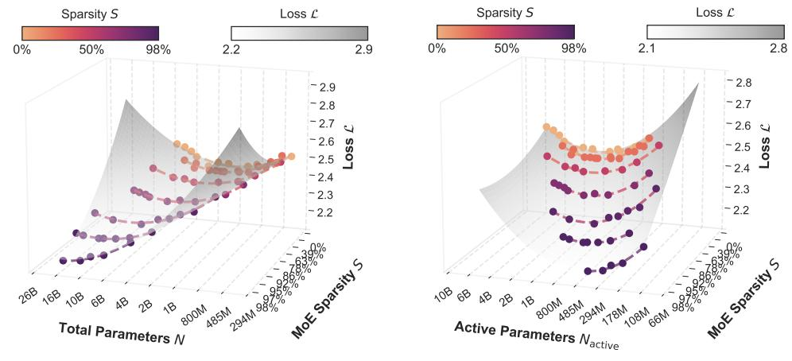
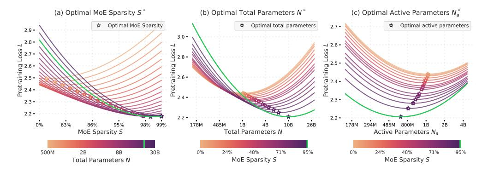

## Parameters vs FLOPs: Scaling Laws for Optimal Sparsity for Mixture-of-Experts Language Models

Samira Abnar∗ Apple Harshay Shah∗ MIT Dan Busbridge Apple Alaaeldin El-Nouby Apple

> Josh Susskind Apple

Vimal Thilak∗ Apple

#### Abstract

Scaling the capacity of language models has consistently proven to be a reliable approach for improving performance and unlocking new capabilities. Capacity can be primarily defined by two dimensions: the number of model parameters and the compute per example. While scaling typically involves increasing both, the precise interplay between these factors and their combined contribution to overall capacity remains not fully understood. We explore this relationship in the context of sparse Mixture-of-Experts (MoEs), which allow scaling the number of parameters without proportionally increasing the FLOPs per example. We investigate how varying the sparsity level, i.e., the fraction of inactive parameters, impacts model's performance during pretraining and downstream few-shot evaluation. We find that under different constraints (e.g., parameter size and total training compute), there is an optimal level of sparsity that improves both training efficiency and model performance. These results provide a better understanding of the impact of sparsity in scaling laws for MoEs and complement existing works in this area, offering insights for designing more efficient architectures.

## 1 Introduction

Empirical scaling laws for language model pretraining [\(Kaplan et al.,](#page-13-0) [2020;](#page-13-0) [Hoffmann et al.,](#page-13-0) [2022;](#page-13-0) [OpenAI,](#page-14-0) [2023,](#page-14-0) [2024;](#page-14-0) [Gemini Team et al.,](#page-13-0) [2024;](#page-13-0) [Henighan et al.,](#page-13-0) [2020;](#page-13-0) [Clark et al.,](#page-12-0) [2022;](#page-12-0) [Yun et al.,](#page-15-0) [2024;](#page-15-0) [Ludziejewski et al.,](#page-14-0) [2024\)](#page-14-0) have demonstrated that proportionally increasing model capacity, along with data and total compute budget, consistently decreases pretraining loss (i.e., perplexity), improves downstream task performance [\(Devlin et al.,](#page-12-0) [2019;](#page-12-0) [Brown et al.,](#page-12-0) [2020;](#page-12-0) [BIG-bench authors,](#page-12-0) [2023\)](#page-12-0) and unlocks emergent capabilities [\(Wei et al.,](#page-14-0) [2022a\)](#page-14-0).

A recurring notion in these studies is that model capacity is well quantified by the total number of model parameters. However, the number of parameters is not the only means to increase model capacity. Compute per example (i.e., a fixed-sized input), measured in FLoating OPerations (FLOPs), also plays a significant role [\(Clark et al.,](#page-12-0) [2022\)](#page-12-0). In fact, several mechanisms [\(Shazeer et al.,](#page-14-0) [2017;](#page-14-0) [Dehghani et al.,](#page-12-0) [2019;](#page-12-0) [Wei et al.,](#page-15-0) [2022b;](#page-15-0) [Goyal et al.,](#page-13-0) [2024;](#page-13-0) [Csord'as et al.,](#page-12-0) [2024\)](#page-12-0) allow for independent variation of the number of parameters or FLOPs per example within a model. For instance, Sparse Mixture-of-Experts (MoE) models [\(Shazeer et al.,](#page-14-0) [2017\)](#page-14-0) introduce "FLOP-free parameters" by leveraging sparsity, where only a subset of expert modules is activated for each input.

When studying scaling laws for specific classes of models, e.g., vanilla transformers, the total number of parameters can serve as a reasonable relative estimator of FLOPs per example. Therefore,

∗Core contributors

(a) IsoFLOP surface over sparsity and total parameters

(b) IsoFLOP surface over sparsity and active parameters

Figure 1: IsoFLOP surface over observed pretraining loss L, model size (in terms of total N and active parameters  $N_a$ ), and sparsity S. We fit a polynomial function mapping N (or  $N_a$ ), S, and their interaction to L, using empirical data. For both fits the MSE loss for predicting loss on a held out set is 0.0001. These results indicate that for a fixed compute budget, increasing model sparsity leads to a reduction in pretraining loss. When considering optimal model size, we observe opposite trends for total parameters (N) (Figure a) versus active parameters ( $N_a$ ) (Figure b). (See Figure 8 in Appendix D.1 for results with different total compute budgets C.)

using the number of parameters as a measure of model capacity in scaling law studies is appropriate. In scenarios or for architectures where the number of parameters and FLOPs per example are not directly linked, it is essential to jointly consider the effects of these variables on scaling model capacity (Clark et al., 2022). We therefore ask

"Can we draw scaling laws for the optimal trade-off between parameter count and FLOPs per example?"

To address this question, we study sparse Mixture-of-Expert Transformers (MoEs) (Shazeer et al., 2017; Lepikhin et al., 2021; Fedus et al., 2022; Zoph et al., 2022; Muennighoff et al., 2024) in the context of language modeling. Existing scaling law studies for MoEs, investigate the role of variables like number and granularity (Ludziejewski et al., 2024) of experts, underlying dense model size and inference compute in predicting the performance of the models under different conditions such as training or inference compute optimality (Du et al., 2021; Clark et al., 2022; Yun et al., 2024; Ludziejewski et al., 2024). In this paper, we focus on the interaction between FLOPs per example and total parameter count, and their impact on model performance in MoEs, through a large-scale empirical study.

We define sparsity as the ratio of inactive experts to the total number of experts, which controls the ratio of the total number of parameters to FLOPs per example in MoEs. We evaluate loss and downstream metrics for different sparsities, model sizes, and compute budgets. Through qualitative and quantitative analysis to derive scaling laws which disentangle total parameters vs FLOPs per example in MoEs, we can estimate the optimal sparsity level under the setting where both total training FLOPs and total number of parameters are given and fixed. Generally, we find that:

• During pretraining, increasing a model's capacity by adding more parameters yields greater benefits than increasing FLOPs per example. We observe that the size of compute-optimal models increases as we increase the training budget (measured in terms of total FLOPs) while the active number of parameters, hence FLOPs per example, decrease for compute-optimal models.

• During inference, FLOPs per example seem to play a more important role2. For many tasks, upstream performance is a good predictor of downstream performance and the relationship between upstream and downstream performance is not impacted by the sparsity level. However, on downstream tasks that presumably require more "reasoning", we observe that for models with the same perplexity on the pretraining data distribution, sparser models, i.e., models with fewer active parameters, perform worse.

Our results, in line with findings from previous relevant studies (Ludziejewski et al., 2024; He, 2024) on scaling laws for MoEs, show increasing sparsity level leads to better performance and efficiency during pretraining. Considering the various methods to increase compute per example during inference adaptively conditioned on task or example complexity, we conclude that approaches like MoEs, which reduce the unit compute cost (i.e., FLOPs per token) by increasing the sparsity level, hold significant promise given their potential to enhance efficiency in both pretraining and inference.

Figure 2: **IsoFLOP slices along Sparsity and Model Size** (C=1e20). We use fitted isoFLOP surfaces (Section 2) to analyze how sparsity  $\bf S$  and model size  $\bf N$  impact the loss  $\bf L$  for a fixed compute budget. We identify optimal points by (a) fixing  $\bf N$  and varying  $\bf S$ , (b) fixing  $\bf S$  and varying  $\bf N$  and (c) fixing  $\bf S$  and varying active parameters  $\bf N_a$ . Observe that (a) the optimal sparsity S increases with increasing model size N and converges to 1 while (b) and (c) show that the optimal model size N and active parameter count  $N_a$  increase and decrease respectively with increasing sparsity levels. (see Figure 9 in Appendix D.1 for other total training compute budgets.)

