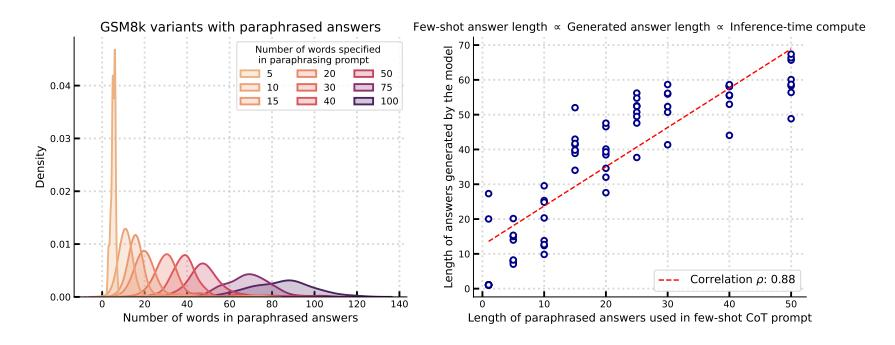
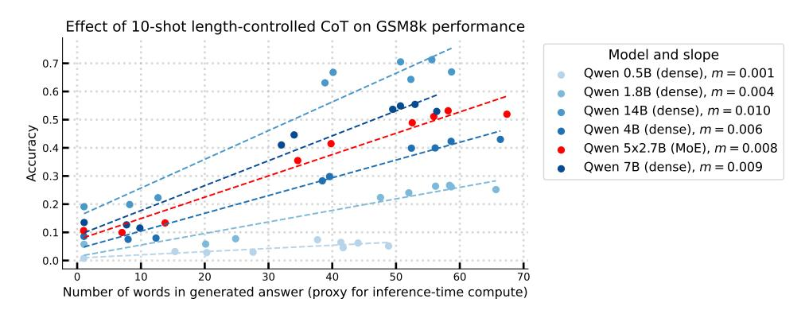
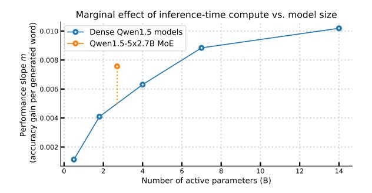

# E Does Chain-of-Thought prompting benefit sparse MoEs more than dense models?

In Section 4, we observed that dense models fare marginally better than sparse MoEs on reading comprehension tasks, potentially due to the higher inference-time compute of a dense model than a perplexity-matched sparse MoE. Then, in Section 6, we hypothesized that alternative strategies to increase inference-time compute may reduce the gap between sparse MoEs and dense models on such tasks. In this section, we test this hypothesis by leveraging a "length-controlled" variant of few-shot Chain-of-Thought (CoT) prompting to indirectly control inference-time compute. We then use this to study the effect of inference-time compute on downstream task performance of dense and MoE models.

**Experiment setup.** We evaluate Qwen1.5 models (Bai et al., 2023) on the GSM8k dataset (Cobbe et al., 2021) to study the effect of few-shot CoT prompting (Wei et al., 2022b) on downstream task performance. We look at the effect of increasing inference-time compute (via CoT prompting) on GSM8k performance of dense models with sizes ranging from 0.5B to 14B and a 5x2.7B sparse MoE. We also use 10 fixed examples from the GSM8k train split as few-shot examples for all runs.

Length-controlled CoT prompting enables control over inference-time compute. Given an instruction-tuned model and a problem from the GSM8k dataset, we control the inference-time compute of the model by controlling the number of tokens generated to output the final answer to the given problem. To do so, we observe that providing instructions via system prompts (with few-shot CoT prompting) does not effectively control the number of generated tokens and, as a result, inference-time compute. We also observe that the average number of tokens in the few-shot GSM8k answers (provided in-context) strongly influences the number of tokens generated by the model to solve the given GSM8k question. Therefore, similar to work on designing GSM8k variants to analyze language modeling phenomena (Mirzadeh et al., 2024; Li et al., 2024; Zhang et al., 2024), we prompt an instruction-tuned model—Llama-3.1-70b (Dubey et al., 2024) in our experiment—to rewrite GSM8k answers in approximately  $k \in \{5, \ldots, 100\}$  words. Then, we use the paraphrased GSM8k examples as few-shot examples to indirectly control the number of generated tokens. As shown in Figure 13(a), this approach enables systematic control over the length of paraphrased answers. The strong correlation ( $\rho = 0.88$ ) between few-shot and generated answer lengths in Figure 13(b) validates that our approach effectively modulates inference-time compute.

Figure 13: Varying inference-time compute via length-controlled Chain-of-Thought prompting. We can control inference-time compute (number of generated tokens) via Chain-of-Thought prompting in two steps: (a) generating paraphrased GSM8k answers of varying lengths (5-100 words) and (b) using paraphrased answers as few-shot examples in CoT prompts to influence the length of generated answers determine the model's output length ( $\rho=0.88$  correlation). The systematic shift in answer length distributions in subplot (a) and the linear relationship between few-shot answer length and generated answer lenth ( $\rho=0.88$  correlation) in (b) validate that our prompting approach effectively modulates inference-time compute, enabling controlled studies of its impact on model performance.

Effect of length-controlled CoT on downstream task performance. We investigate how inference-time compute affects GSM8k performance across Qwen1.5 models using 10-shot length-controlled CoT prompting, varying target answer lengths k from 1 to roughly 70 words on average. As shown in Figure 14, when we increase inference-time compute indirectly through longer generated answers (x-axis), we observe a roughly linear improvement in GSM8k performance (y-axis) across all model sizes. The linear fits for each model also indicate a pattern through their slopes m: larger dense models benefit more from additional inference-time compute. This effect is particularly striking when comparing models at the extremes (i.e., Qwen1.5-0.5B versus Qwen1.5-14B).

To analyze whether inference-time compute affects dense and sparse MoE models differently, we examine how the "performance" slope m (i.e., accuracy gain per generated word) varies with model size. While the Qwen1.5-5x2.7B MoE cannot be directly compared to dense models due to different active parameter counts, we can account for this by plotting m against the number of active parameters for both architectures. As shown in Figure 15, when controlling for active parameter count, the MoE model exhibits a higher slope than would be expected from interpolating between dense models. This suggests that MoE models benefit more from dynamically increased inference-time compute compared to dense models with equivalent active parameters.

Figure 14: Effect of length-controlled CoT prompting on GSM8k performance across model scales. We evaluate the relationship between inference-time compute (controlled via answer length) and GSM8k accuracy for dense Qwen1.5 models (0.5B-14B parameters) and a 5x2.7B sparse MoE. For all models, increased inference-time compute improves accuracy roughly linearly, with slopes m indicating the marginal effect. Larger dense models show steeper slopes, demonstrating they benefit more from additional inference-time compute—for example, the 14B model's performance improves from 20% to 70% as answer length increases, while the 0.5B model improves only from 1% to 5%.

Figure 15: **Sparse MoEs benefit more from increased inference-time compute than dense models.** We plot the marginal effect of inference-time compute (accuracy gain per generated word) against model size for dense Qwen1.5 models and a 5x2.7B sparse Qwen1.5 MoE. When controlling for the number of active parameters, the MoE model (orange) shows a higher performance slope than would be expected from interpolating between dense models (blue), suggesting that sparse MoEs benefit more from dynamically increased inference-time compute via strategies like CoT prompting.

## F Incorporating Sparsity into Scaling Laws

Table 2 shows the parameters used to initialize L-BFGS used to fit the proposed parametric scaling law given in Equation [6.](#page-7-0) Table 3 shows the estimated parameters for the parameteric model. We use a held out dataset that consists of data points for models with sparsity value S = 0.98 to validate the performance of the estimated model coefficients. The mean squared error and the Huber loss error on the dataset used to fit the model is 0.00056 and 0.0036 respectively and 0.0058 and 0.0011 respectively on the out-of-sample validation set. The quality of the fit measured via the R2 metric is 99% on fitting data and 68% on the held out validation dataset.

Table 2: Initial values used to estimate coefficients in Equation [6.](#page-7-0)

| Coefficients                   | Initial Values                |
|--------------------------------|-------------------------------|
| log(a), log(b), log(c), log(d) | [0, 10, 20]                   |
| α, β, γ                        | [0, 0.25, 0.5, 0.75, 1, 1.25] |
| λ, δ                           | [−1, −0.5, 0, 0.5, 1]         |
| log(e)                         | 1.5                           |

Table 3: Estimated values for coefficients in Equation [6.](#page-7-0)

| Coefficient | Estimate |
|-------------|----------|
| α           | 0.5962   |
| β           | 0.3954   |
| λ           | -0.1666  |
| δ           | 0.1603   |
| γ           | 0.1595   |
| a           | 16612.50 |
| b           | 5455.67  |
| c           | 0.4598   |
| d           | 17.26    |
| e           | 0.94     |