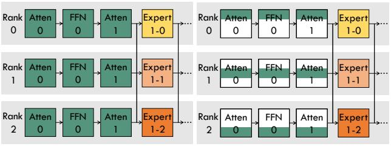
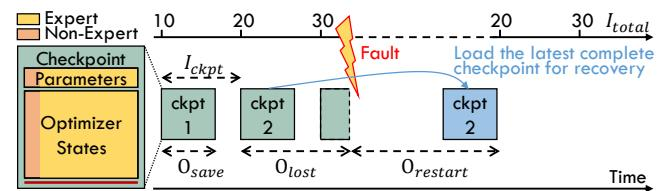

# 2 Background & Related Work

#### 2.1 Sparse Mixture-of-Experts (MoE) Models

The sparse Mixture-of-Experts (MoE) layer [58], consists of multiple feed-forward networks (FFNs), termed "experts", and a trainable gating network for selectively activating a subset of these experts. Formally, with N expert networks  $\{E_i\}_{1}^{N}$ , gating network G, and input x, the MoE layer's output can be formulated as:

$$MoE(x) = \sum_{i=1}^{N} G(x)_i E_i(x)$$
 (1)

The common practices in existing MoE research use the noisy top-k softmax gating network to select the top-ranked experts for the computation, formulated as

$$G(x) = TopK(Softmax(f(x) + \epsilon))$$
 (2)

(a) Model Parameters

(b) Optimizer States

**Figure 1.** An illustration of the model states, including model parameters (a) and optimizer states (b), across three ranks in distributed training. The training utilizes the hybrid parallel strategy of ZeRO-2 DP + EP, configured with the parallel degree of DP = 3 and EP = 3. The non-expert parts are depicted in green, while the expert parts are depicted in yellow, with varying shades denoting different experts within the same MoE layer. The combination of white and green in the non-expert modules in (b) illustrates the partitioning of states across ranks through ZeRO-2 DP. "Atten0" and "FFN0" represent Attention and FFN sublayers in the 0th transformer layer, while "Atten1" and the MoE layer, including "Expert(1-0, 1-1, 1-2)", are in the 1th transformer layer.

where  $f(\cdot)$  denotes the gating linear transformation and  $\epsilon$  is the Gaussian noise. Leveraging the sparse activations yielded by G(x), this approach facilitates a substantial augmentation of model parameters without causing a proportional increase in computational cost. Employing the MoE layer to substitute the selected FFN layer in Transformer-based LLMs engenders a significant rise in checkpoint data volume due to the multiplicity of FFN experts, thereby presenting challenges to efficient checkpointing for fault tolerance.

#### 2.2 Distributed Training of MoE Models

The adoption of MoE in LLMs introduces new challenges to existing training and inference systems, due to its inherently sparse and dynamic computational workload. GShard [31] pioneers the parallel strategy of Expert Parallelism (EP) by facilitating parallel gating and expert computation. Specifically, EP assigns distinct experts to each distributed computing device such as GPU and TPU, and passes input tokens to the corresponding experts via All-to-All communication. Following this, EP has ascended as a pivotal strategy, enabling the efficient scaling of MoE model training [18, 23, 51, 61].

As depicted in Figure 1(a), EP can be viewed as an augmentation of Data Parallelism (DP) [52, 53, 55], where each expert within an MoE layer is allocated to a distinct DP rank (e.g., "Expert1-0" on "Rank0" and "Expert1-1" on "Rank1"), while all non-expert layers (e.g., "Atten0", "FFN0", and "Atten1") are replicated across DP ranks. Moreover, the synergy of EP with other parallel strategies, such as Tensor Parallelism (TP) [45, 60, 62], Pipeline Parallelism (PP) [22, 44, 49], has been explored to enhance the scalability and efficiency of MoE model training in expansive distributed settings

**Figure 2.** An illustration of fault tolerance in model training through checkpoint mechanism. The checkpointing interval  $I_{ckpt}$  is set to 10 iterations. A fault arises following the 30th iteration, before the completion of the third checkpoint. Therefore, the most recent completed checkpoint (ckpt2) is loaded to recover the training progress. The composition of a checkpoint is depicted on the left, with the size of each component reflecting its data volume, using the GPT-350M-16E model as an example.

[18, 21, 23, 61, 76, 81]. From the checkpoint perspective, a notable distinction between EP and other parallelism is EP's flexibility in distributing diverse parameters across DP ranks. In contrast, TP and PP maintain parameters replicated across all DP ranks, limiting their adaptability within each DP rank.

In this work, we primarily focus on distributed training with the hybrid parallel strategy of ZeRO-2 DP + EP (notably, ZeRO-1 is analogous to ZeRO-2 from the view of checkpointing [52]), which has emerged as the predominant approach for training MoE models [51, 66, 76]. This approach is highlighted for its accessibility and efficiency, supported by Megatron-DeepSpeed [40, 62], an acclaimed open-source distributed training framework. Moreover, extensive practical experience with large-scale distributed systems has demonstrated its superior performance, minimizing communication overhead while remaining memory-efficient [7, 12, 51, 52]. Additionally, our proposed checkpointing techniques can be seamlessly extended to other hybrid parallel strategies, encompassing TP and PP, as they can be viewed as the modularity of each DP rank.

