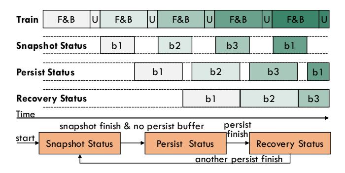
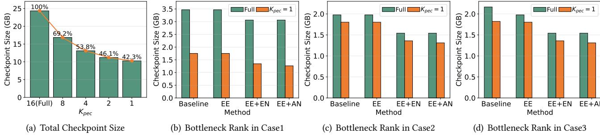
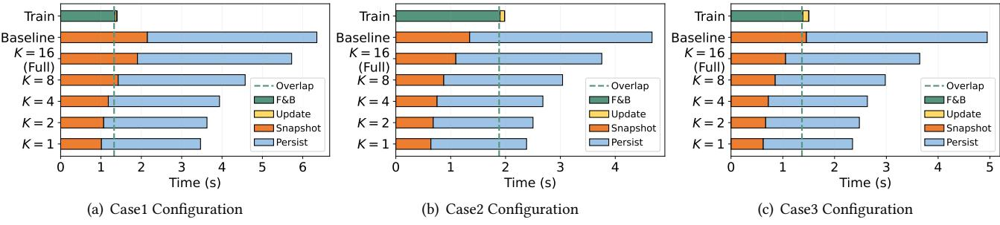
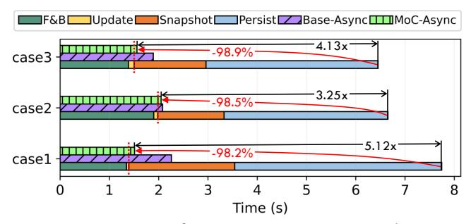
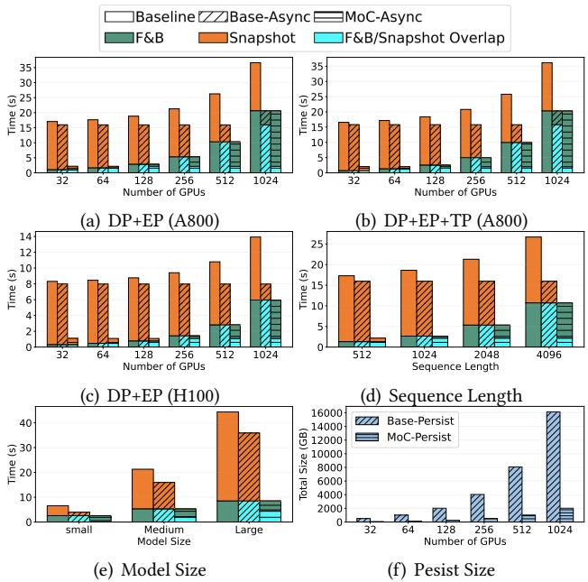

# 5 Two-Level Checkpointing Management

To maximize the benefits of hierarchical storage, we propose a two-level checkpointing management into our MoC system, comprising (1) in-memory snapshot and (2) persist, coupled with a suite of optimization techniques.

#### 5.1 Two-level PEC Saving and Recovery

As depicted in Figure 8, we implement the saving and recovery processes across CPU memory and storage, which takes advantage of the superior GPU-to-CPU bandwidth and distributed storage's persistence.

**Saving.** We introduce the snapshot-PEC and persist-PEC processes, designed to alleviate data transmission burdens during their respective levels. Furthermore, we refine the hyperparameter  $K_{pec}$  in PEC into two variables:  $K_{snapshot}$  and  $K_{persist}$ . This distinction allows snapshot-PEC to select  $K_{snapshot}$  out of N experts for transfer from GPU to CPU memory. Concurrently, persist-PEC is tasked with selecting  $K_{persist}$  out of the  $K_{snapshot}$  experts for subsequent storage

**Figure 8.** Illustrations of the saving process during normal training (left half) and the recovery process after a fault occurrence (right half), as implemented in our two-level checkpointing management. Orange "E(0-3)" denote distributed expert parts, while green "NE" denotes the non-expert part, and "NE(0-3)" denote the "NE" shards. The data transfer for expert and non-expert parts is represented by arrows in matching colors. The diagonal filled "E(0-3)" indicates not involved at the latest checkpoint.

**Figure 9.** The timeline of the asynchronous checkpointing process with triple-buffer. The orange part illustrates the status transition among the three buffers ("b1", "b2", "b3"). The time span of each buffer in a snapshot or persist status can reflect the time cost of the snapshot or persist process.

persistence. As exemplified in Figure 8, snapshot-PEC saves only E(0,1) to CPU memory, followed by persist-PEC, which saves only E0 to storage. To streamline the management of all checkpointed model modules, we utilize key-value pairs for efficient retrieval from both memory and distributed storage.

**Recovery.** In the event of a fault, while the fault nodes may lose their data, other normal nodes can recover from the in-memory snapshots, thus not only reducing the overhead of loading data from persistent storage but also mitigating the PLT attributable to persist-PEC. Take Figure 8 as an example, the restarted Node-0 needs to load NE and E(0,1) from persistent storage, while Node-1 only needs to load NE(0,1). Furthermore, Node-1 benefits from recovering E(2,3) directly from memory, which contains more recent states than those available in storage, thereby reducing the PLT.

#### 5.2 Asynchronous Checkpointing & Triple Buffering

To minimize the overhead of states saving  $O_{save}$ , we implement an asynchronous checkpointing mechanism that allows checkpointing to overlap with the normal training processes. Specifically, we develop an agent at each node to

facilitate the two-level checkpointing management through a triple-buffer mechanism. As illustrated in Figure 9, the triple buffering comprises snapshot, persist, and recovery buffers, each meticulously designed to ensure data integrity during the saving process and data consistency during recovery. Initially, all of these buffers are in the snapshot status. Each snapshot process, initiated by the asynchronous thread within each training process, involves the transfer and serialization of data from the GPU into one of these snapshot buffers. Upon the completion of a snapshot process—and in the absence of an ongoing persist buffer—the corresponding buffer transitions to the persist status, starting the transfer of data to persistent storage. Following the completion of the persist process, the buffer then becomes a recovery buffer, reflecting the latest checkpoint available for recovery, until another persist buffer transitions.

#### 5.3 Adaptive Configuration for Two-Level PEC

Existing studies minimize  $O_{lost}$  by reducing the checkpointing interval  $I_{ckpt}$  [17, 42, 73]. This approach may increase  $O_{save} \frac{I_{total}}{I_{ckpt}}$ , necessitating a considered trade-off between the two metrics. In addition to  $I_{ckpt}$ , we introduce two new adjustable hyperparameters,  $K_{snapshot}$  and  $K_{persist}$ , aimed at reducing the durations of snapshot and persist, respectively, presenting a new trade-off between efficiency and PLT.

To navigate these trade-offs across various software and hardware scenarios, we propose an adaptive configuration scheme for two-level PEC. Our primary strategy involves optimizing the value of  $K_{snapshot}$  for snapshot-PEC to ensure it can be completely overlapped by the next F&B, thereby minimizing  $O_{save}$  while achieving a low PLT. Even though the persist process can be fully overlapped with the subsequent training, its duration determines the lower bound for  $I_{ckpt}$ . As our two-level recovery method significantly reduces the PLT caused by persist-PEC,  $K_{persist}$  can be set to a relatively small value, which in turn, achieves the lowest  $I_{ckpt}$ .

Additionally, as discussed in Section 4.3, PEC may lead to workload imbalances across distributed ranks. In some

**Figure 10.** Experimental results of checkpoint size. (a) shows the impact of PEC on total checkpoint size. (b-d) illustrate the checkpointing workload of the bottleneck rank across various distributed configurations. "EE" indicates equal sharding for the expert part, while "EN" and "AN" represent equal sharding and adaptive sharding for the non-expert part, respectively.

cases, an increased  $K_{pec}$  value may leverage spare capacity, reducing the PLT while maintaining the same total overhead.

**Dynamic-K for Fault Accumulation.** In practical scenarios, large-scale distributed training may encounter numerous faults, potentially leading to an augmented PLT. To mitigate this issue, we propose the Dynamic-K strategy, which adjusts the  $K_{pec}$  parameter in reaction to the accumulation of faults, aiming to keep PLT below a 3.75% threshold. This method recalibrates the  $K_{pec}$  value subsequent to each fault recovery incident, based on the aggregated PLT incurred by the system. If the aggregated PLT attributable to a specific  $K_{pec}$  surpasses its limit,  $K_{pec}$  will be doubled, and this process is reiterated until checkpointing all experts.

**Table 1.** Hyperparameters for experimental MoE models.

| Parameter          | GPT-125M-8E | GPT-350M-16E | SwinV2-MoE     |
|--------------------|-------------|--------------|----------------|
| Num. layers        | 12          | 24           | [2, 2, 18, 2]  |
| Hidden size        | 768         | 1024         | 96             |
| Num. atten. heads  | 12          | 16           | [3, 6, 12, 24] |
| Num. MoE layers    | 6           | 12           | 10             |
| Num. experts/layer | 8           | 16           | 8              |
| Num. parameters    | 323M        | 1.7G         | 173M           |

**Table 2.** Configurations for GPT-350M-16E model training.

| Configuration | Node | GPU | DP | TP | PP | EP | Experts/GPU |
|---------------|------|-----|----|----|----|----|-------------|
| Case1         | 1    | 8   | 8  | 1  | 1  | 8  | 2           |
| Case2         | 2    | 16  | 16 | 1  | 1  | 16 | 1           |
| Case3         | 2    | 16  | 16 | 1  | 1  | 8  | 2           |

### 6 Evaluation

### 6.1 Experimental Setup

We implement our proposed MoC-System and conduct extensive experiments upon the Megatron-DeepSpeed [40, 51, 62], which is an acclaimed open-source framework supporting the distributed training of MoE models. As shown in Table 1, we experiment with both language and vision models. The experimental language models (GPT-125M-8E and GPT-350M-16E) are extensions of GPT-3 like NLG model [5], provided by DeepSpeed-MoE [51]. The GPT-125M-8E

model is pre-trained on the Wikitext-2 dataset [39] for the correlation analysis between PLT and final trained accuracy, as illustrated in Figure 5. The GPT-350M-16E model is pre-trained on a 1B token subset of the SlimPajama-627B dataset [63]. Moreover, the distributed training of the GPT-350M-16E model is experimented with the three different configurations, as shown in Table 2. Using the hybrid parallel strategy of ZeRO-2 DP [52] and EP, the training is deployed on a cluster that comprises a total of 60 nodes with 8×A800-SXM4-80GB GPUs each. The vision model, SwinV2-MoE [23, 36], is trained on the ImageNet-1K dataset [14].

#### 6.2 Improvements in Checkpointing Efficiency

**6.2.1 Checkpoint Size.** We evaluate the effectiveness of PEC in reducing checkpoint size through experiments on the GPT-350M-16E model training. Unless otherwise specified in subsequent experiments, PEC employs the sequential selection strategy, and the baseline refers to the method provided by the Megatron-DeepSpeed framework [40]. As illustrated in Figure 10(a), the total checkpoint size for each process decreases as  $K_{pec}$  decreases, reaching 42.3% of the full model checkpoint size when  $K_{pec}$  is set to 1.

However, merely reducing the total checkpoint size is insufficient for optimizing efficiency in distributed training. As the checkpointing workload is distributed across various training ranks, the duration of the blocking checkpointing process is primarily determined by the bottleneck rank, which has the heaviest workload and longest processing time. Therefore, we further assess the checkpointing workload of the bottleneck rank using different sharding strategies, as illustrated in Figure 10(b)-10(d).

The results indicate that our fully sharded checkpointing strategy, which applies equal sharding to both non-expert and expert parts, significantly reduces the workload of bottleneck rank in both full saving (12% to 28%) and PEC scenarios (22% to 29%). Notably, equal sharding of the expert part is only effective in scenarios with multiple EP groups (Case 3). With  $K_{pec}=1$ , adaptive sharding of the non-expert part can further reduce the workload by 3.7% to 6.1%.

**Figure 11.** Duration of each process in a training iteration with checkpointing. Different values of "K" represent experiments where both  $K_{snapshot}$  and  $K_{persit}$  of two-level checkpointing ("Snapshot" and "Persist") are set to "K". The green "Overlap" line marks the duration that can be overlapped by the forward and backward passes ("F&B"). "Update" denotes the weight update.

**6.2.2 Checkpointing time.** Our optimizations effectively reduce checkpoint size and balance the workload across distributed ranks, resulting in a corresponding decrease in checkpointing duration by up to about 50%. In the experiments depicted in Figure 11, our methods all employ the fully sharded checkpointing strategy, enabling even the full savings (K = 16) to outperform the baseline.

As discussed in Section 2.3.1, the snapshot process must be completely covered by the forward and backward passes in the subsequent iteration; otherwise, the weight update will be blocked. Figure 11 indicates that the baseline snapshot duration exceeds the forward and backward time in Case1 and Case3. To address this problem, Case1 needs to employ a fully sharded checkpointing strategy, while Case3 requires saving fewer than four experts with PEC.

Moreover, the training process in Case3 is 0.5 seconds faster than in Case2, highlighting why the prevailing hybrid strategy confines EP within a node—limiting All-to-All communication to intra-node operations is more efficient than inter-node communication. These experiments demonstrate the broad applicability of our methods in practical scenarios.

**6.2.3 Asynchronous Checkpointing.** Given that our approaches have been validated to reduce the duration of the checkpointing process, we further assess the end-to-end optimization efficacy of our MoC-System, which implements an asynchronous checkpointing process. As illustrated in Figure 12, the fully optimized asynchronous process in our MoC-System ("MoC-Async") can decrease the overhead of each checkpointing process ( $O_{save}$ ) by 98.2% to 98.9% and accelerate each training iteration by 3.25 to 5.12 times in the three experimental cases, compared to the baseline using blocking checkpointing.  $O_{save}$  refers to the additional time that surpasses the normal training processes, including "F&B" and "Update," as indicated by the duration beyond the red dotted line in Figure 12.

When our asynchronous checkpointing is applied without optimization by PEC and fully sharded techniques ("Base-Async"), it can overlap 97.9% of the checkpointing time in Case 2, as the snapshot duration is sufficiently short to

**Figure 12.** Duration of a training iteration across three configurations, utilizing three checkpointing methods: (1) baseline, (2) "Base-Async," which uses basic asynchronous checkpointing without our PEC and fully sharded checkpointing techniques, and (3) "MoC-Async," representing the fully optimized asynchronous process within our MoC-System. "MoC-Async" can reduce checkpointing overhead by more than 98% compared to the baseline.

achieve complete overlap. However, this method can only overlap 86.3% and 92.1% in Case 1 and Case 3, respectively, because their durations are too long to be fully overlapped. Employing all optimizations, "MoC-Async" can achieve 1.4% to 33.2% improvements over "Base-Async" in the three cases.

In addition to reducing  $O_{save}$ , our "MoC-Async" achieves half the  $I_{ckpt}$  compared to the "Base-Async" method, as it takes only half the time to complete the snapshot and persist process. For instance, it reduces  $I_{ckpt}$  from 2.3 to 1.2 in Case 2. Consequently, our "MoC-Async" can minimize the overall checkpoint overhead  $O_{ckpt}$ .

**6.2.4 Scaling and Generalizing.** To demonstrate the scalability and generalizability of our proposed MoC-System, we conduct simulations to assess its efficacy across various configurations of training factors, including the number of GPUs, parallelism, hardware capability, sequence length, and model size. Our simulations utilize the ASTRA-SIM simulator [54] to model the computation and communication time costs for each iteration of distributed MoE model training across various scenarios with differing computing power and communication bandwidth. Aligned with our actual measured

**Figure 13.** Scaling and generalizing results across various training factors. (a) Scaling the number of A800 GPUs using DP+EP parallelism, with each GPU assigned a unique expert for each MoE layer. (b) Scaling the number of A800 GPUs using DP+EP+TP parallelism, incorporating a 4-degree TP into the existing DP+EP configuration. (c) Scaling the number of H100 GPUs using DP+EP parallelism. (d) Generalizing different training sequence lengths. (e) Generalizing different model sizes. (f) The file size of the persist process across the DP+EP configurations with varying numbers of A800 GPUs.

performance, we configure the A800 GPU simulations with 312 TFLOPS at a 20% utilization rate and a GPU-to-CPU snapshot bandwidth of 1 GB/s. Similarly, the H100 GPU simulations are set with 989 TFLOPS at a 20% utilization rate and a GPU-to-CPU snapshot bandwidth of 2 GB/s.

To reflect current large-scale training practices, we simulate the training of large LLaMA-like MoE models, which are commonly used in real-world applications [25, 34]. In our simulations, depicted in Figure 13, we configure the MoE models with a hidden size of 2048, 16 attention heads, a head dimension of 128, an expert intermediate size of four times the hidden size, and 24 layers. Consistent with the three configurations used in Figure 12, Figure 13 illustrates the duration of a training iteration of three checkpointing methods: "Baseline," "Base-Async," and "MoC-Async." Furthermore, Figure 13 breaks down the timing of the two asynchronous checkpointing methods to demonstrate the overlap duration of "F&B" and "Snapshot", termed "F&B/Snapshot Overlap."

**Number of GPUs.** To demonstrate the scalability of the MoC-System for large-scale training, we scale the model training across varying numbers of GPUs. Specifically, we employ Data Parallelism (ZeRO-2) and Expert Parallelism by

assigning each expert of an MoE layer to a distinct GPU, scaling both the system and the model size. Figure 13(a) shows that the "F&B," which can be used to overlap the snapshot overhead, significantly increases as the number of GPUs increases. Compared to the baseline, the two asynchronous checkpointing methods effectively facilitate overlap, thereby reducing time costs. When the number of GPUs is less than 1024, the snapshot duration of "Base-Async" is too long to be fully overlapped, resulting in lower efficiency compared to "MoC-Async." In contrast, "MoC-Async," configured to save only 1/8 of the experts per checkpoint, reduces the required snapshot time, making "F&B" the bottleneck of the total time when exceeding 64 GPUs. Additionally, "MoC-Async" can achieve substantial optimization even when "F&B" is considerably less than "Snapshot," a benefit that "Base-Async" is unable to provide.

In this setup, an equal number of distinct expert parameters is allocated to each GPU, resulting in the data volume for each GPU-to-CPU snapshot remaining similar. However, as the number of GPUs increases, the data volume for CPU-to-storage persist on the cluster filesystem grows significantly, as illustrated in Figure 13(f). Our "MoC-Persist" method significantly reduces the persist file size and the time required for the persist process, enabling shorter checkpoint intervals and consequently minimizing the lost time due to faults.

**Parallelism.** To generalize the efficacy of the MoC-System across various parallelism configurations, we further investigate training using the DP+EP+TP parallelism to train models with the same number of experts as in the DP+EP scenario, as depicted in Figure 13(b). Although different parallelism strategies impact the iteration time of "F&B," the behavior observed during checkpointing is similar to that seen with the DP+EP configuration (Figure 13(a)). Consistently, "MoC-Async" maintains optimal efficiency across all tested GPU configurations, particularly when the number of GPUs is fewer than 1024, where the snapshot duration of "Base-Async" cannot be fully overlapped.

Hardware Capability. To generalize the efficacy of the MoC-System across different hardware platforms, we conduct training simulations with the A800 GPU (Figure 13(a)) and the H100 GPU (Figure 13(c)) configurations. Due to variations in capabilities such as GPU computing power, GPU memory bandwidth, NVLink bandwidth, and GPU-to-CPU PCIe bandwidth, the durations of both "F&B" and "Snapshot" differ in the H100 scenario, resulting in varying overlap performance. Specifically, "MoC-Async" demonstrates significantly greater efficiency than other methods across all tested H100 configurations, as the snapshot of "Base-Async" cannot be fully overlapped even with 1024 GPUs. It is anticipated that the computation and communication capabilities associated with "F&B" will advance more rapidly than the GPU-to-CPU data transmission capabilities in future hardware platforms. Therefore, reducing the data volume of

checkpointing through "MoC-Async" will remain valuable for larger-scale distributed training in the future.

**Sequence Length.** Sequence length is a critical factor influencing the "F&B" duration. To investigate its impact, we conduct simulations with varying sequence lengths using the DP+EP configuration on 256 A800 GPUs. While longer sequences significantly increase the "F&B" time, variations in sequence length do not impact the checkpointing process, as shown in Figure 13(d). This is because the checkpointed data pertains to the constant model parameters rather than the dynamic activations. Consequently, "MoC-Async" can achieve higher efficiency across all evaluated sequence lengths.

Model Size. As larger model sizes lead to increased iteration times and larger data volumes for checkpointing, we conduct simulations using models of three different sizes: a hidden size of 1024 ("Small"), 2048 ("Medium"), and 3072 ("Large"), as illustrated in Figure 13(e). These simulations are carried out using the DP+EP parallelism with 256 A800 GPUs. The results show that "MoC-Async" not only improves efficiency across various model sizes but provides more pronounced efficacy in scenarios involving larger-scale models. This is because model size impacts both the "F&B" and "Snapshot." Due to the disparity in capabilities between computation and GPU-to-CPU data transmission, the duration of snapshots increases more significantly with the growth of the model size.

**6.2.5 Modeling and Analysis.** Based on the scaling and generalizing simulations detailed in Section 6.2.4, we conclude that the identified factors influence the efficiency of the checkpointing system in two ways: (1) by affecting the duration of each iteration ( $T_{F\&B}$ ), and (2) by affecting the time required for the snapshot ( $T_{Snapshot}$ ). Specifically, sequence length affects only  $T_{F\&B}$ , whereas the number of GPUs, parallelism, hardware capability, and model size influence both  $T_{F\&B}$  and  $T_{Snapshot}$ . Together, these factors determine the checkpoint saving overhead ( $O_{save}$ ), ideally expressed as:

$$O_{save} = \begin{cases} T_{Snapshot} - T_{F\&B}, & \text{if } T_{Snapshot} > T_{F\&B} \\ 0. & \text{if } T_{Snapshot} \le T_{F\&B} \end{cases}$$
(10)

Based on Equation 4 in Section 2.3 and assuming a constant failure rate denotes as  $\lambda$ , the number of faults can be

$$N_{fault} \approx \lambda I_{total}.$$
 (11)

The total overhead associated with the existing full checkpointing method, which saves all model states and is denoted as  $O_{ckpt}^{Full}$ , as well as our proposed MoC method, denoted as  $O_{ckpt}^{MoC}$ , can be expressed as follows:

$$O_{ckpt}^{Full} \approx O_{save}^{Full} \frac{I_{total}}{I_{ckpt}^{Full}} + \lambda I_{total} \left( O_{restart} + \frac{I_{ckpt}^{Full}}{2} \right),$$
 (12)

$$O_{ckpt}^{MoC} \approx O_{save}^{MoC} \frac{I_{total}}{I_{ckpt}^{MoC}} + \lambda I_{total} \left( O_{restart} + \frac{I_{ckpt}^{MoC}}{2} \right). \tag{13}$$

**Figure 14.** Loss curve of the GPT-350M-16E model pretraining (a) and test accuracy of the SwinV2-MoE model pre-training (b). In (a), faults occur every 2k iterations, indicated by red points. "W" and "O" denote the use of PEC ( $K_{snapshot} = 4$  and  $K_{persist} = 1$ ) on weights and optimizer states, respectively. "-2L" refers to the use of two-level recovery, while methods without "-2L" recover solely from the persistent checkpoint stored in storage. In (b), faults are introduced at epochs(0, 10, 50, 80), with test accuracy reported at the conclusion of each epoch.

 $O_{save}^{Full}$  and  $O_{save}^{MoC}$  represent the overhead associated with saving model states for two respective methods, while  $I_{ckpt}^{Full}$  and  $I_{ckpt}^{MoC}$  denote the checkpointing intervals configured for each method. To ensure that the overhead of the MoC method is less than that of the full checkpointing method, the following conditions must be met:

$$O_{ckpt}^{MoC} < O_{ckpt}^{Full}, \tag{14}$$

$$I^{MoC} \setminus O_{ckpt}^{Full} \setminus I^{Full} \setminus I^{Full} \setminus I^{Full} \setminus I^{Full} \setminus I^{Full} \setminus I^{Full} \setminus I^{Full} \setminus I^{Full} \setminus I^{Full} \setminus I^{Full} \setminus I^{Full} \setminus I^{Full} \setminus I^{Full} \setminus I^{Full} \setminus I^{Full} \setminus I^{Full} \setminus I^{Full} \setminus I^{Full} \setminus I^{Full} \setminus I^{Full} \setminus I^{Full} \setminus I^{Full} \setminus I^{Full} \setminus I^{Full} \setminus I^{Full} \setminus I^{Full} \setminus I^{Full} \setminus I^{Full} \setminus I^{Full} \setminus I^{Full} \setminus I^{Full} \setminus I^{Full} \setminus I^{Full} \setminus I^{Full} \setminus I^{Full} \setminus I^{Full} \setminus I^{Full} \setminus I^{Full} \setminus I^{Full} \setminus I^{Full} \setminus I^{Full} \setminus I^{Full} \setminus I^{Full} \setminus I^{Full} \setminus I^{Full} \setminus I^{Full} \setminus I^{Full} \setminus I^{Full} \setminus I^{Full} \setminus I^{Full} \setminus I^{Full} \setminus I^{Full} \setminus I^{Full} \setminus I^{Full} \setminus I^{Full} \setminus I^{Full} \setminus I^{Full} \setminus I^{Full} \setminus I^{Full} \setminus I^{Full} \setminus I^{Full} \setminus I^{Full} \setminus I^{Full} \setminus I^{Full} \setminus I^{Full} \setminus I^{Full} \setminus I^{Full} \setminus I^{Full} \setminus I^{Full} \setminus I^{Full} \setminus I^{Full} \setminus I^{Full} \setminus I^{Full} \setminus I^{Full} \setminus I^{Full} \setminus I^{Full} \setminus I^{Full} \setminus I^{Full} \setminus I^{Full} \setminus I^{Full} \setminus I^{Full} \setminus I^{Full} \setminus I^{Full} \setminus I^{Full} \setminus I^{Full} \setminus I^{Full} \setminus I^{Full} \setminus I^{Full} \setminus I^{Full} \setminus I^{Full} \setminus I^{Full} \setminus I^{Full} \setminus I^{Full} \setminus I^{Full} \setminus I^{Full} \setminus I^{Full} \setminus I^{Full} \setminus I^{Full} \setminus I^{Full} \setminus I^{Full} \setminus I^{Full} \setminus I^{Full} \setminus I^{Full} \setminus I^{Full} \setminus I^{Full} \setminus I^{Full} \setminus I^{Full} \setminus I^{Full} \setminus I^{Full} \setminus I^{Full} \setminus I^{Full} \setminus I^{Full} \setminus I^{Full} \setminus I^{Full} \setminus I^{Full} \setminus I^{Full} \setminus I^{Full} \setminus I^{Full} \setminus I^{Full} \setminus I^{Full} \setminus I^{Full} \setminus I^{Full} \setminus I^{Full} \setminus I^{Full} \setminus I^{Full} \setminus I^{Full} \setminus I^{Full} \setminus I^{Full} \setminus I^{Full} \setminus I^{Full} \setminus I^{Full} \setminus I^{Full} \setminus I^{Full} \setminus I^{Full} \setminus I^{Full} \setminus I^{Full} \setminus I^{Full} \setminus I^{Full} \setminus I^{Full} \setminus I^{Full} \setminus I^{Full} \setminus I^{Full} \setminus I^{Full} \setminus I^{Full} \setminus I^{Full} \setminus I^{Full} \setminus I^{Full} \setminus I^{Full} \setminus I^{Full} \setminus I^{Full} \setminus I^{Full} \setminus I^{Full} \setminus I^{Full} \setminus I^{Full} \setminus I^{Full} \setminus I^{Full} \setminus I^{Full} \setminus I^{Full} \setminus I^{Full} \setminus I^{Full} \setminus I^{Full} \setminus I^{Full} \setminus I^{Full} \setminus I^{Full} \setminus I^{Full} \setminus I^{Full} \setminus I^{Full} \setminus I^{Full} \setminus I^{Full} \setminus I^{Full} \setminus I^{Full} \setminus I^{Full} \setminus I^{Full} \setminus I^{Full} \setminus I^{Full} \setminus I^{Full} \setminus I^{Full} \setminus I^{Full} \setminus I^{Full} \setminus I^{Fu$$

$$\frac{O_{save}^{MoC}}{I_{ckpt}^{MoC}} + \lambda \left( O_{restart} + \frac{I_{ckpt}^{MoC}}{2} \right) < \frac{O_{save}^{Full}}{I_{ckpt}^{Full}} + \lambda \left( O_{restart} + \frac{I_{ckpt}^{Full}}{2} \right), \tag{15}$$

$$\frac{O_{save}^{MoC}}{I_{ckpt}^{MoC}} + \lambda \frac{I_{ckpt}^{MoC}}{2} < \frac{O_{save}^{Full}}{I_{ckpt}^{Full}} + \lambda \frac{I_{ckpt}^{Full}}{2}.$$
 (16)

Based on the condition outlined in Equation 16, we can identify two strategies to leverage the advantages of our proposed MoC design: (1) By maintaining the same checkpoint interval as the full checkpointing method, MoC can reduce overhead because it has a smaller saving overhead for each checkpointing. (2) By decreasing the checkpoint interval (more frequent checkpointing) to equalize the ratio of  $O_{save}$  to  $I_{ckpt}$  between MoC and the full method, MoC can still reduce the total overhead. This reduction is achieved by minimizing the lost time caused by faults, as the lost time is directly proportional to the checkpoint interval.

