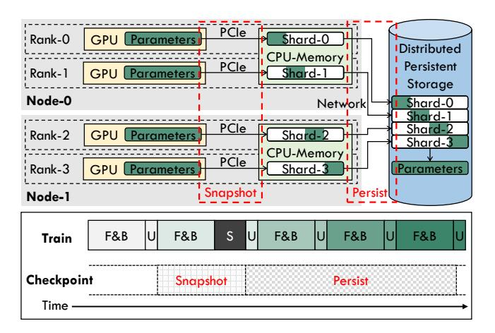
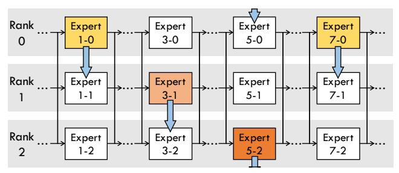
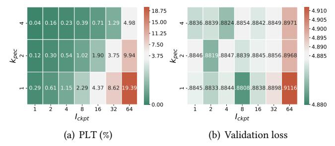

# 2.3 Fault-tolerant Checkpointing for Distributed Training System

Checkpoint serves as a critical mechanism for augmenting fault tolerance in distributed training systems by facilitating the periodic preservation and recovery of model states during training [26, 27, 30, 42, 77]. As illustrated in Figure 2, the saved model states at each checkpoint comprise learnable model parameters for the expert part (12% of the total volume) and that for the non-expert part (2%), optimizer states for the expert part (74%) and that for the non-expert part (12%), along with other crucial states (less than 1%), such as epoch/iteration numbers and Random Number Generator states. The checkpoint ensures that training progress is not lost in unexpected faults and can be recovered after a restart.

However, the checkpointing process incurs significant data transfer and storage overhead, alongside additional overhead in the event of a fault. The total overhead introduced by

**Figure 3.** The top half part illustrates the two-phase check-pointing workflow (GPU-to-CPU snapshot + CPU-to-Storage persist) during a distributed training. The training employs 4-degree DP across two nodes, each equipped with two GPUs. Data-parallel sharding is utilized to minimize the volume of data saved per DP rank. The bottom half part presents a timeline for asynchronous checkpointing, where "F&B" denotes the forward and backward passes of an iteration, "U" denotes a weight update, "S" denotes a checkpoint stall.

fault tolerance with checkpoint during the entire model training, denoted as  $O_{ckpt}$ , can be quantified by aggregating the overhead of a checkpointing process (saving model states)  $O_{save}$  during normal training, the overhead of system/task restart  $O_{restart}$  and lost training progress  $O_{lost}$  when a fault occurs, as illustrated in Figure 2. It is formulated as:

$$O_{ckpt} = O_{save} \frac{I_{total}}{I_{ckpt}} + \sum_{i=1}^{N_{fault}} (O_{restart}^{i} + O_{lost}^{i})$$
 (3)

where  $I_{total}$  represents the total number of iterations in training and  $I_{ckpt}$  denotes the iteration interval of checkpointing. Each fault occurrence, totaling  $N_{fault}$ , contributes to the overhead, with  $O_{lost}$  being contingent on  $I_{ckpt}$  and averaging  $\frac{I_{ckpt}}{2}$ , and  $O_{restart}$  remaining relatively constant. Therefore, the overhead of fault tolerance be represented roughly as the following formulation:

$$O_{ckpt} \approx O_{save} \frac{I_{total}}{I_{ckpt}} + \sum_{i=1}^{N_{fault}} (O_{restart} + \frac{I_{ckpt}}{2})$$
 (4)

It is obvious that  $I_{ckpt}$ ,  $O_{save}$ , and  $O_{restart}$  are the key factors determining the total overhead  $O_{ckpt}$ . In pursuit of optimizing fault tolerance efficiency, existing research has explored various methods to diminish the above factors.

**2.3.1 Two-phase Asynchronous Checkpointing.** As demonstrated in Figure 3, checkpointing model states from GPU memory to distributed persistent storage involves two phases: transferring from GPU memory to CPU memory (GPU-to-CPU snapshot) and from CPU memory to distributed

persistent storage (CPU-to-Storage persist). The CPU-to-Storage persist phase involves serializing the model states and writing them to a distributed filesystem via the network, while the GPU-to-CPU snapshot phase copies tensors through PCIe. Given that both phases can significantly hinder training progress if executed in a blocking manner, asynchronously processing and overlapping them with ongoing training has emerged as a critical method to enhance checkpointing efficiency [8, 26, 38, 42, 68, 70, 72].

The timeline illustrated in Figure 3 indicates that the asynchronous GPU-to-CPU snapshot can proceed concurrently with the forward and backward passes (denoted as "F&B") of the subsequent iteration, although it must finish before the weight update phase. If the snapshot duration exceeds the "F&B" period, it will trigger a checkpoint stall ("S"), thereby stopping the training process until the snapshot completion. Unlike the GPU-to-CPU snapshot, the CPU-to-Storage persist phase is not subjected to this limitation, as the snapshots residing in CPU memory can remain unaffected by the ongoing training process.

However, existing asynchronous checkpointing systems face the new challenges posed by MoE models: (1) MoE models extend the checkpointing duration without a corresponding increase in "F&B" time, resulting in incomplete overlap of the GPU-to-CPU snapshot and potential checkpoint stalls; (2) prolonged CPU-to-Storage persist leads to an enlarged  $I_{ckpt}$ . In contrast, our methodologies effectively manage the volumes of data transferred during both the snapshot and persist phases, thereby addressing these issues.

**2.3.2 Data-Parallel Sharding.** Considering that data volume determines the duration of communication and storage, eliminating redundancies and reducing checkpoint size through data-parallel sharding [33, 47, 68, 72] is an effective optimization. Since the original DP replicates model states across all the DP ranks, each rank can store a distinct sharding of the states, collectively forming the complete model states through the aggregation of all ranks' shards, as depicted in Figure 3.

With the evolution of DP techniques, model states may already be uniformly partitioned across each DP rank. For instance, ZeRO-1 and ZeRO-2 DP [52] partition the optimizer states, whereas ZeRO-3 DP and Fully Sharded Data Parallel (FSDP) [82] partition both the model parameters and optimizer states. As discussed in Section 2.2, our focus is on the ZeRO-2 DP + EP scenario, where model parameters are replicated across each DP rank, as illustrated in Figure 1.

However, existing distributed training frameworks lack an efficient data-parallel sharding strategy for MoE model training. For instance, the Megatron-DeepSpeed framework [40] confines the checkpointing of expert model states to the first EP group, as illustrated by Figure 7(a), neglecting the potential of distributed sharding across all EP groups. In contrast, we implement fully sharded checkpointing for

**Figure 4.** An illustration of our proposed partial experts checkpointing (PEC) with sequential selection. At the current checkpointing, "Expert(1-0, 3-1, 5-2, 7-0)" are saved, while those not saved are marked in white. Blue arrows indicate the iterative pattern of the sequential selection, which will save "Expert(1-1, 3-2, 5-0, 7-1)" at the next checkpointing.

MoE model training and further introduce an adaptive sharding strategy with our PEC mechanism, outperforming the commonly used equal sharding strategy.

**2.3.3 In-memory Checkpointing.** Due to the superior bandwidth of GPU-to-CPU copy and compute network data transfers compared to CPU-to-Storage persist, several studies minimize  $O_{save}$  by opting to store model states in the CPU memory of other nodes instead of persistent storage [72, 73]. This approach significantly reduces the duration of checkpointing, thereby allowing for lower  $I_{ckpt}$  and  $O_{ckpt}$ .

However, the in-memory checkpointing solution encounters reliability problems within real-world large-scale GPU clusters [68]. In such environments, multiple nodes within the same backup group may experience simultaneous failures, resulting in severe data loss. In contrast, we introduce a two-level checkpoint management strategy that benefits from the efficiency of in-memory checkpointing while ensuring fault tolerance across a wide range of scenarios.

2.3.4 Partial Checkpointing and Recovery. Previous research [50] has demonstrated that the iterative-convergent nature of machine learning (ML) training is capable of compensating for the inconsistencies introduced by partial checkpointing and recovery to some extent on Parameter Server (PS) distributed training scenarios. Given that the model parameters are distributed across multiple PS nodes, a partial failure of these nodes is likely to result in only a partial loss of the updates to the model parameters. Compared to the process of saving and reloading the entire model states, partial checkpointing and recovery strategies can significantly decrease the data volume required for checkpoints. This approach has subsequently proven to be effective in the training of the Deep Learning Recommendation Model (DLRM) [17, 37, 46], which only accesses and updates a small segment of the model in each iteration.

However, large-scale distributed training systems and their distributed parallel strategies employed by Transformerbased LLMs differ significantly from PS and DLRM scenarios.

**Figure 5.** Correlation analysis between (a) the Proportion of Lost Tokens (PLT) and (b) the final validation loss. In (a), the PLT centers on 3.75% observed in a PEC configuration of  $K_{pec} = 2$  and  $I_{ckpt} = 32$ , which slightly degrades the model accuracy compared to the non-fault case. The validation losses are presented in (b), where the non-fault case's loss of 4.8851 is taken as the center value to highlight the accuracy deviations under various PEC configurations.

Consequently, no work has yet explored the integration of partial methods into the fault tolerance of LLMs. Our work pioneers in identifying the synergy between the inherent sparsity of MoE LLMs and partial strategies, leading to the development of a more efficient fault tolerance method without harming the final model quality.

