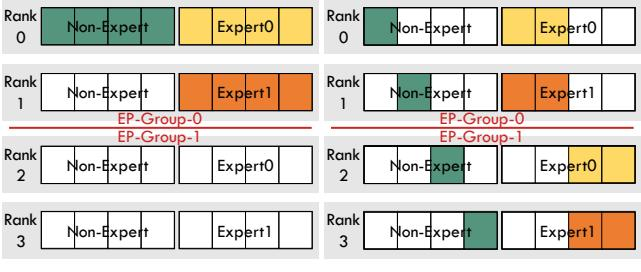

# 4.3 Adaptive Sharding for Non-Expert Part

PEC may lead to an imbalanced checkpointing workload for the expert part if the following conditions are met:

$$(K_{pec} \cdot N_{moe}) \mod D_{ep} \neq 0$$
 or  $\frac{K_{pec} \cdot N_{moe}}{D_{ep}} \mod \frac{D_{dp}}{D_{ep}} \neq 0.$ 

Using Figure 4 as an example, "Rank0" is responsible for saving two experts, whereas the other ranks save one expert each, resulting in an imbalanced workload.

To leverage the spare capacity across ranks, we introduce an adaptive sharding strategy, which adaptively allocates

(a) Baseline

(b) Our Fully Sharded Checkpointing

**Figure 7.** An illustration of two distinct checkpointing methods employed for training the MoE model, configured with DP = 4 and EP = 2. (a) illustrates the baseline method provided by the Megatron-DeepSpeed framework. (b) presents our proposed fully sharded checkpointing with equal sharding. For simplification, the model states are divided into two segments: the non-expert and the expert parts. The horizontal segments within each part represent various layers.

non-expert parts based on the selection pattern of PEC. Furthermore, it incorporates a greedy algorithm for shard allocation, prioritizing the assignment of larger modules to ranks exhibiting the least accumulated workload. Additionally, the initially established sharding pattern can also be consistently applied throughout the training process, without the need for further synchronization or dynamic adjustments at runtime, due to the consistency of the PEC sequential selection.

In our implementation, sharding strategies are exclusively utilized to partition model parameters, tailored to our specific scenario of ZeRO-2 DP + EP, where optimizer states are already partitioned, as depicted in Figure 6. Nevertheless, our methodologies are applicable to the partitioning of both model parameters and optimizer states in scenarios that do not incorporate ZeRO sharding [52].

